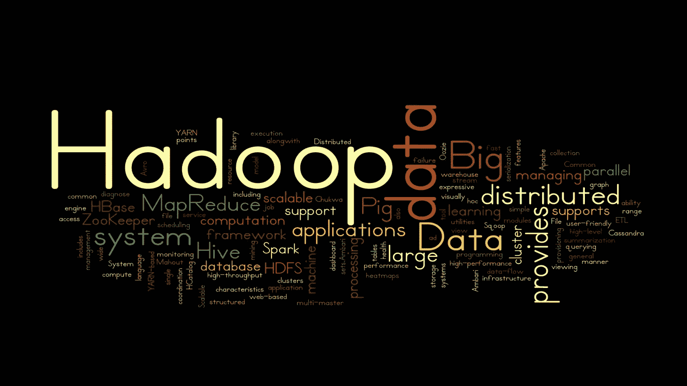
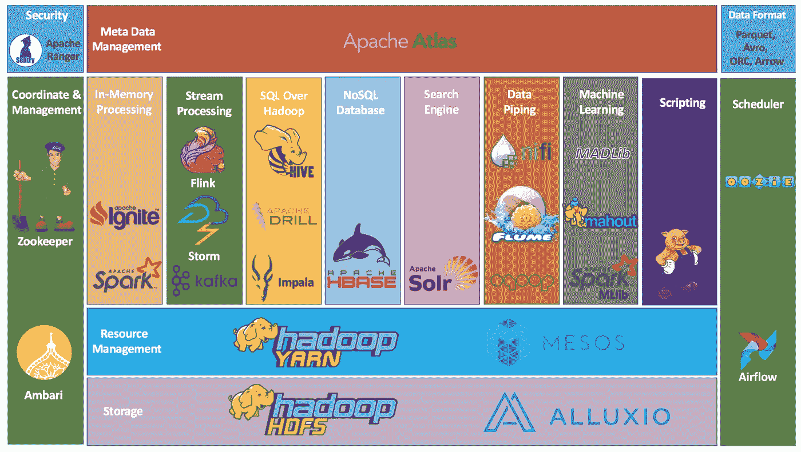
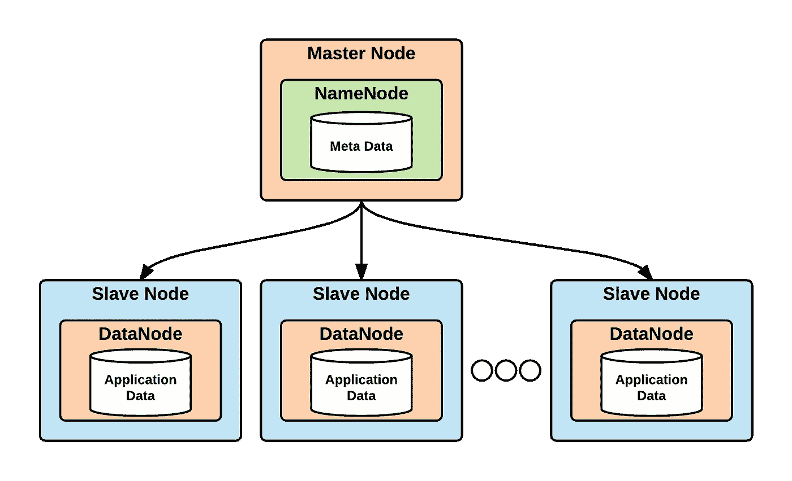
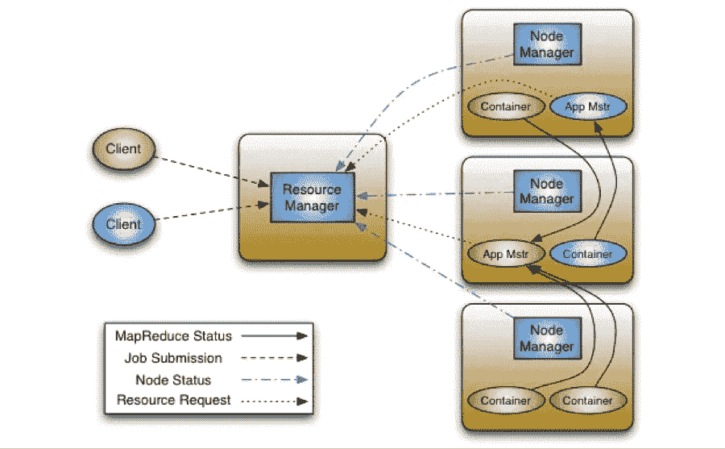
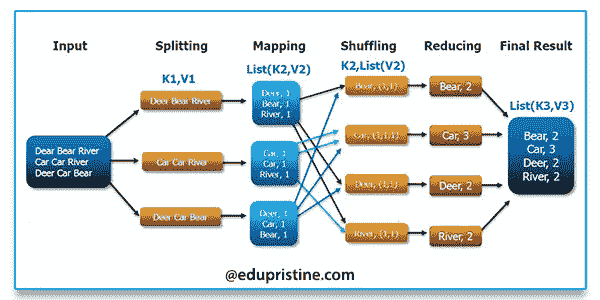

# Hadoop 的世界

> 原文：<https://towardsdatascience.com/the-world-of-hadoop-d1e5f5eb98d?source=collection_archive---------39----------------------->

## 互联 Hadoop 生态系统的不同部分

[图像来源](https://www.townscript.com/e/inovi-technologies-143140)

当学习 Hadoop 时，我遇到的最大挑战之一是将 Hadoop 生态系统的不同组件放在一起，并创建一个更大的画面。这是一个庞大的系统，由不同的部分组成，这些部分既可以相互对比，也可以相互补充。对于任何愿意在生产级大数据应用中利用基于 Hadoop 的技术的人来说，了解这些不同组件是如何互连的是一项必备知识。Hadoop 生态系统在大数据技术堆栈中占有重要地位，是数据工程师的必备技能。因此，让我们更深入地挖掘 Hadoop 的世界，并尝试解开这个世界的组成部分。

从 Hadoop 的正式定义开始可以帮助我们了解 Hadoop 生态系统的总体意图:

> Hadoop 是一个开源软件平台，用于在计算机集群上对超大型数据集进行分布式存储和分布式处理

正如定义所示，Hadoop 的核心是其以分布式方式处理数据存储和处理的能力。为了实现这一点，Hadoop 及其分布式文件系统的整体架构受到了 Google 文件系统(GFS)和 Google MapReduce 的启发。Hadoop 架构的分布式特性使其适用于非常大的数据，特别是通过消除处理这些大量数据时的单点故障。

现在，让我们尝试了解 Hadoop 生态系统的不同构建模块，并理解这些模块是如何相互连接的。

Hadoop 生态系统:[图片来源](https://dzone.com/articles/example-of-etl-application-using-apache-spark-and)

我试图将整个 Hadoop 生态系统分为三类。

1.  Hadoop 核心堆栈
2.  Hadoop 数据操作堆栈
3.  Hadoop 协调堆栈

**Hadoop 核心堆栈**

1.  ***【HDFS(Hadoop 分布式文件系统)*** *:* 顾名思义 HDFS 是一个分布式文件系统，充当整个 Hadoop 生态系统的心脏。它允许以分布式方式将数据存储在集群的不同节点中，但对外呈现为一个大型文件系统。它是建立在商用硬件之上的，据说是高度容错的。HDFS 能够通过产生数百个节点的集群来处理巨大的数据集。按照体系结构，它遵循主/从方法，其中每个集群由一个名称节点(主节点)和多个数据节点(从节点)组成。名称节点管理文件系统命名空间、元数据和客户端对文件的访问。数据节点存储实际的文件块。更多关于 HDFS 的细节可以在这里找到:[https://hadoop.apache.org/docs/r1.2.1/hdfs_design.html](https://hadoop.apache.org/docs/r1.2.1/hdfs_design.html)

HDFS 主/从架构:[图片来源](https://www.oreilly.com/library/view/data-lake-for/9781787281349/5983829d-2c2c-4649-a92f-9e72f7a67f15.xhtml)

2. ***YARN(又一个资源协商者)*** : YARN 是仲裁所有可用集群资源的资源管理器。它也遵循主/从方法。YARN 的每个集群有一个资源管理器(主),每个节点有一个节点管理器(从)。资源管理器是在集群中的所有节点之间协调资源的权威。它保存了关于哪些作业在哪个节点上运行的元数据，并管理消耗了多少内存和 CPU，因此对整个集群的总 CPU 和 RAM 消耗有一个整体的了解。节点管理器是每台机器的代理，负责监控它们的资源使用情况(cpu、内存、磁盘、网络)并向资源管理器报告。ApplicationMaster 是特定于框架的库的实例，它允许不同的应用程序协商对资源的请求。容器是为请求分配的资源的抽象。关于 YARN 的更多细节可以在这里找到:[https://Hadoop . Apache . org/docs/current/Hadoop-YARN/Hadoop-YARN-site/YARN . html](https://hadoop.apache.org/docs/current/hadoop-yarn/hadoop-yarn-site/YARN.html)

纱线主/从结构:[图像源](https://blog.cloudera.com/apache-hadoop-yarn-concepts-and-applications/)

3.***MapReduce***:Hadoop 中并行的整个编程模型都是基于名为 MapReduce 的软件框架。该模型允许在商用硬件集群上并行处理大型数据集。MapReduce 作业首先将数据分割成一组独立的块，称为地图任务，可以并行执行/处理。然后，映射任务的排序输出被输入到 reduce 任务中，该任务将产生聚合结果。Hadoop 的并行编程模型就是基于这个概念。更多关于 Hadoop MapReduce 的细节可以在这里找到:【https://hadoop.apache.org/docs/r1.2.1/mapred_tutorial.html T5

MapReduce 示例:[图像源](https://www.edureka.co/blog/mapreduce-tutorial/)

**Hadoop 数据操作栈**

除了 HDFS、YARN 和 MapReduce，还有各种数据查询、处理和摄取技术，可用于构建现实世界中的大数据应用。现在让我们来看看这些技术。这些技术旨在为各种目的服务，但也可以集成到一个大型应用程序中。

*   ***Apache Pig*** :这是一个高级脚本框架，允许在分布式数据上编写类似 SQL 的脚本。开发人员不需要了解 java 或 python 来使用 Apache Pig。该平台适合分析大型数据集，因为它支持并行化。Pig 的基础设施层基于 MapReduce。更多关于阿帕奇猪的细节可以在这里找到:[https://pig.apache.org/](https://pig.apache.org/)
*   ***Apache HBase*** :这是一个非 sql 的列型数据库，允许对大数据进行实时读/写访问。HBase 具有非 sql 数据库的所有优点，它提供了托管大型数据库的能力，并具有分布式特性和可伸缩性。关于 Apache HBase 的更多细节可以在这里找到:[https://hbase.apache.org/](https://hbase.apache.org/)
*   ***Apache Hive*** :这是一个数据仓库框架，支持读取、写入和管理驻留在 HDFS 和 HBase 等其他存储中的数据。这就产生了一种类似 SQL 的查询语言来对数据执行 ETL 任务，从而允许对不同格式的数据强加一种结构。阿帕奇钻和黑斑羚是这方面的两个选择。关于阿帕奇蜂房的更多细节可以在这里找到:[https://hive.apache.org/](https://hive.apache.org/)
*   ***Apache Spark*** :这是一个分析引擎，可以运行在 Hadoop 以及许多其他平台上，如 Kubernetes 和 Apache Mesos。有了 Apache Spark，也可以使用 Java、python、Scala、R 和 SQL 编写应用程序。Spark 通过其最新的设计提供了高性能，该设计包括 DAG 调度器、查询优化器和物理执行引擎。Spark 为机器学习、图形、数据帧和流提供了各种库，这些库可以结合起来构建高质量的大数据系统。更多关于 Apache Spark 的细节可以在这里找到:【https://spark.apache.org/ 
*   ***Apache Storm*** :这是一个实时流数据处理系统，它是 Hadoop eco 系统的一个补充，可以将其批处理能力增强到实时处理。据说 Apache Storm 可以在几分之一秒内在一个节点上处理超过一百万个作业。Kafka、Flink 和 Spark stream processing 是 Storm 的替代产品。更多关于阿帕奇风暴的细节可以在这里找到:[https://storm.apache.org/](https://storm.apache.org/)
*   ***Apache Solr*** :这是一个可以在 Hadoop 之上使用的搜索平台。它为企业搜索功能提供了分布式索引。Apache Solr 附带了一系列特性，比如全文搜索、点击高亮显示、实时索引等等。关于 Apache Solr 的更多细节可以在这里找到:[https://lucene.apache.org/solr/](https://lucene.apache.org/solr/)
*   ***Apache Sqoop*** :这是一个可以用来将数据摄取或抽取到 HDFS 的工具。由于 Hadoop 主要处理大数据，将数 Pb 的数据注入 HDFS 将是一个挑战，特别是因为数据来自不同的来源和不同的格式。Sqoop 是一个工具，主要用于将关系数据库中的结构化数据导入 HDFS。Flume 是 Sqoop 的替代产品，它也支持非结构化数据。关于 Sqoop 和 Flume 的更多细节可以在这里找到:[https://www . dezyre . com/article/Sqoop-vs-Flume-battle-of-the-Hadoop-ETL-tools-/176](https://www.dezyre.com/article/sqoop-vs-flume-battle-of-the-hadoop-etl-tools-/176)

上述技术是 Hadoop 数据操作层的主要组成部分。使用什么技术必须根据业务需求和它们提供的功能来决定。上述技术可以单独使用，也可以相互结合使用，在 Hadoop 及其分布式文件系统之上工作。

**Hadoop 协调堆栈**

在 Hadoop 核心及其相关的数据驱动技术堆栈之上，应该有一个管理和协调事物的机制，特别是由于 Hadoop 的分布式本质。为此也提供了不同的平台。

*   ***Apache ZooKeeper*** :这是一个协调服务，Hadoop 可以使用它来管理和协调集群，通过使用不同的同步机制提供机制来共享数据而不会出现不一致。这提供了不同的服务，例如节点命名、同步、锁定和配置管理等。阿帕奇·安巴里是动物园管理员的替代品。关于阿帕奇动物园管理员的更多细节可以在这里找到:[https://zookeeper.apache.org/](https://zookeeper.apache.org/)
*   ***Apache Oozie*** :这是一个可以管理 Hadoop 作业的调度系统。如您所见，有大量技术可以在 Hadoop 上运行，它们服务于不同的目的。任何利用上述技术的真实世界大数据应用程序都可能需要将使用上述技术创建的作业安排到特定的管道或订单中。Oozie 集成了 Hadoop 堆栈中的不同作业，包括 Hive、Pig、Sqoop、Java MapReduce 等。气流是一种替代方法。关于 Apache Oozie 的更多细节可以在这里找到:[https://oozie.apache.org/](https://oozie.apache.org/)
*   ***Apache Atlas*** :这是一个平台，允许使用 Hadoop 的企业确保其数据符合治理法规。随着数据使用的法律问题日益增多，大数据治理可能成为任何现实应用程序的关键问题。特别是，这提供了管理元数据的机制，将数据分类为个人身份信息(PII)和敏感数据等类别。关于 Apache Atlas 的更多细节可以在这里找到:[https://atlas.apache.org/#/](https://atlas.apache.org/#/)

我在这篇文章中的主要尝试是根据技术及其预期目的来总结和构建 Hadoop 的生态系统。当我还是学生的时候，我发现抓住一个概括的观点有点困难，因为 Hadoop 生态系统是巨大而多样的。在这里，我将整个 Hadoop 生态系统组织成特定的部分，这种方式对我个人来说很容易掌握。我相信对其他人也会有帮助。因此，如果您有兴趣深入研究大数据工程，那么这可能是一个起点。