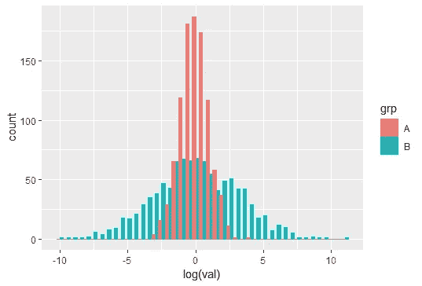

# 统计学中最糟糕的误解

> 原文：<https://towardsdatascience.com/the-worst-misconception-in-statistics-488cf73d734e?source=collection_archive---------12----------------------->

## 在许多统计学入门课程中教授！

我喜欢在网上帮助陌生人解决他们的应用统计学问题。这就是我如何知道[似然比测试](/the-most-important-statistical-test-dee01f4d50cf)解决了*很多*问题。我也意识到这个普遍的误解:

> t 检验假设数据呈正态分布。

不严谨的统计学入门课程传播了这种错误信息。更糟糕的是，许多网站附和了这种错误的说法(尽管有些人说 t 检验对非正态性是稳健的)。

t 检验的重要性和广泛使用几乎是神圣的，所以这种误解是频率和严重性的双重打击。人们认为他们不能使用 t 检验，而实际上他们可以。这就像教孩子“勺子只能用来舀液体。”

这体现在诸如“我的数据没有通过正态性检验，所以我不能使用 t 检验”这样的问题中。我应该进行对数转换吗？或者我应该使用非参数检验？”当他们有 100，000+的观察值时。(“我的老师说我不应该用勺子吃冰淇淋，因为它是固体食物。我应该融化冰淇淋让它变成液体吗？还是应该用叉子？”)

如果你在谷歌上搜索“测试假设”，除了维基百科之外，第一页上的每个结果都是虚假的。(一些人嘲笑维基百科是不可信的来源。哦，讽刺的是。)[维基](https://en.wikipedia.org/wiki/Student%27s_t-test#Assumptions)说:

> 被比较的两个总体的平均值应遵循[正态分布](https://en.wikipedia.org/wiki/Normal_distributions)。在弱假设下，这遵循来自[中心极限定理](https://en.wikipedia.org/wiki/Central_limit_theorem)的大样本，即使每组中的观察值分布是非正态的。

感谢你成为理智的代言人！**是指**，不是数据！

# 为什么重要？

我们经常测试两组是否具有相同的均值:


在 frequentist 框架中，我们设置问题，使得检验统计量在零假设下遵循已知分布。如果**检验统计量**遵循 t 分布(方差未知的正态分布)，那么我们可以进行 t 检验。

**测试统计**。不是数据。我们的检验统计量是 t，由样本均值的差异计算得出。

对于非常小的样本量，只有当数据条件正态时，这一要求才成立，因此产生了误解。对于 n>30…

在 n>30 公路上开个玩笑。

但说真的，一些入门课程走了相反的极端，建议 t 检验在 n>30 或 n>40 时总是有效？我们会看到为什么这也是不正确的。

在样本量足够大的情况下，由于[中心极限定理](https://en.m.wikipedia.org/wiki/Central_limit_theorem)，样本均值的分布变得近似正态。所需的样本大小取决于总体分布:更多的偏斜/更重的尾部，更多的样本。如果你的两个样本均值都是正态分布的，那么线性组合(比如均值的差异)也是正态的，所以 t 检验可以发挥它的魔力。

此外，样本方差应该是χ分布的，但我们将在本文中忽略这一点。

# 中心极限定理

考虑这种指数分布，这显然是不正常的:


如果我们从这个分布中取样，那么随着 n 变大，数据将类似于指数分布。

(在 CLT 最糟糕的误解中，有人问:“我调查了 30 个人，分布是不正态的。我做错了什么？数据不是应该是正态分布的吗？”)

但如果我们记录下随机样本的平均值，并多次重复这个过程，那么只要 n 很大，我们就大致得到了正态分布。

```
n <- 5
iter <- 10000
x <- matrix(
  rexp(n * iter, rate = 2),
  ncol = iter
)
hist(colMeans(x))
```


你看看那个。在我看来，**样本均值**的分布几乎呈钟形。原来我们不需要我们的数据正态分布来执行 t 检验！

# 拔靴带

如果你不确定你的 n 是否大到足以让中心极限定理生效，你可以[自举](https://en.wikipedia.org/wiki/Bootstrapping_(statistics))。接下来是一个简短的教程。

假设我们从这两个分布中抽取样本，并想要检验均值的相等性:


这两种分布都不是正态分布。这里，我将从红色组中抽取 n=10 个样本，从蓝色组中抽取 n=20 个样本:


我们从数据中的每组中用替换的对**进行采样，保持 n(红色为 10，蓝色为 20)，并记录平均值的差异。重采样的样本大小应与原始数据中的样本大小一致。**

通过我们观察到的均值差异来改变这种分布；我们假设在零假设下，两个总体保持它们的形状，但具有相等的均值。这是天真的，特别是对于非负随机变量(它们喜欢根据均值改变形状)，但它足够体面地工作。我们将此视为零分布。

使用一些代码可能会更容易理解:

```
iter <- 10000
n_x <- 10
n_y <- 20set.seed(1)
x <- rbeta(n_x, 6, 2)
y <- actuar::rpareto2(n_y, 0.5, 2)
test_statistic <- mean(y) - mean(x)resamp_x <- matrix(
  sample(x, size = n_x * iter, replace = TRUE),
  ncol = iter
)
resamp_y <- matrix(
  sample(y, size = n_y * iter, replace = TRUE),
  ncol = iter
)
null_dist <- colMeans(resamp_y) - colMeans(resamp_x) - (mean(y) - mean(x))
mean(abs(null_dist) >= abs(test_statistic))
```

如果这个零分布是一个很好的钟形曲线，那么 t 检验是合适的。否则，将 p 值计算为等于或大于我们观察到的差异的模拟值的百分比，换句话说，位于红色条之外的模拟值的比例(此处 p = 0.0601):


由于过程中固有的随机性，自举 p 值可能会有所不同。迭代次数越多，p 值越接近。有了更大的 n，我们就能明白为什么 t 检验甚至对这种非正态数据也有效了。在这里，我为两组设置 n = 50:


在我看来，它几乎是钟形的，即使 n 低至 50。微小的倾斜会使 t 检验稍微偏离。Bootstrap 得出 p = 0.0019，而 t 检验得出 p = 0.0012。

当 n = 100，000 时，即使数据不是正态分布，t 检验也很少不适用。

# 不要变换你的数据！

一些网站建议转换您的数据，使其看起来大致正常。我…我甚至不知道从哪里开始。这是如何作为“好建议”传播的？(我记得当我刚接触统计学时，我相信这一点，并把它传递给了别人。哦，真丢人。)

当你转换数据时，假设*会改变*。你不再测试手段的差异。例如，如果你使用对数变换，你测试的是 [*的差异，几何*的意思是](https://en.m.wikipedia.org/wiki/Geometric_mean)。

考虑这两个对数正态分布 LN(0，1)和 LN(-4，3):


尽管他们看起来有多么不同，但他们有相同的人口平均值 1.65！

这里，我们从每组中抽取 1000 个样本:

```
set.seed(1)
x <- rlnorm(1000, 0, 1)
y <- rlnorm(1000, -4, 3)
```


因为差异很大，很难看出什么。让我们放大一点:


所以分布的形状是不同的。如果我们对整个样本进行 t 检验，我们得到 p = 0.6578，并且我们正确地拒绝了零假设。

我们样品的自然对数:


如果我们对*这个*进行 t 检验，我们得到的 p 值接近于 0，我们错误地拒绝了均值相等的零假设。这两个分布有相同的算术平均值，但有不同的几何平均值。

在这种情况下，对原始观察值进行 t-test 是不合适的(参见下面的自举),但我们还是得到了正确的结论。对经过对数变换的观察值进行 t-test 满足“t-test 假设”(两组都是正常的)，但它给了我们一个错误的结论——它回答了*一个*问题，但没有回答*我们的*问题。

错误可能会向相反的方向发展。两个总体可能具有不同的平均值，但具有相同的几何平均值，例如算术平均值分别为 1.65 和 90.02 的 LN(0，1)和 LN(0，3):


它们的平均值相差很远，但是数值的对数具有相同的平均值:



同样，我不知道为什么一些资源建议在通过 t-test 之前对数据进行对数转换。这极具误导性。

# 当 CLT 还没有爆发的时候

让我们回到最初的对数正态分布 LN(0，1)和 LN(-4，3)。如果你想小心，你可以自举:


这给了我们 p=0.6516，类似于最初的 t 检验。

还记得我说过所需的样本大小取决于偏斜度吗？在前面的指数分布示例中，n=30 就足够了。这里，n=1000 还是不够！对数正态分布有如此极端的偏斜和厚尾，以至于我们通常需要*批*样本来检验均值。

当你的数据真的，真的没有足够的样本时，非参数检验比 bootstrapping 更好。问题是当人们因为一点点偏差而盲目地使用非参数检验时。它们没有参数测试强大。当你因为收集数据困难/昂贵而受困于小规模到中等规模的样本时，当你*可以*使用 t 检验时，使用非参数检验将导致更多的假阴性。

非参数检验有自己的一套假设，并且检验完全不同的假设。例如，流行的[U-检验](https://en.wikipedia.org/wiki/Mann–Whitney_U_test)只能被解释为测试中位数是否相等，如果两个分布具有相同的形状，这使得它在许多情况下甚至比 t-检验更具限制性。

最后，当你的 n 足够大时，t 检验当然可以用于非正态数据。如果有疑问，你可以自举。让我们一起结束这些错误观念和不良做法。