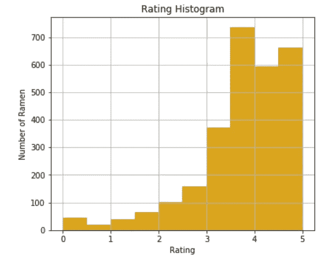
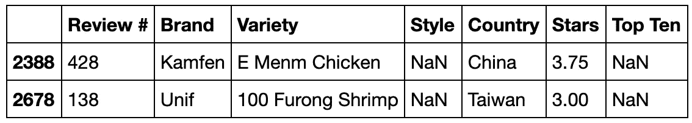
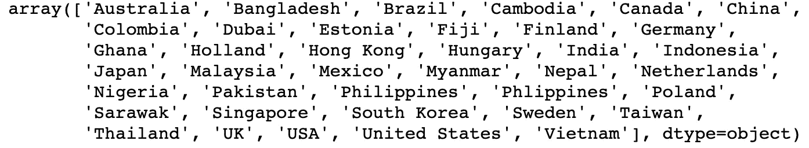
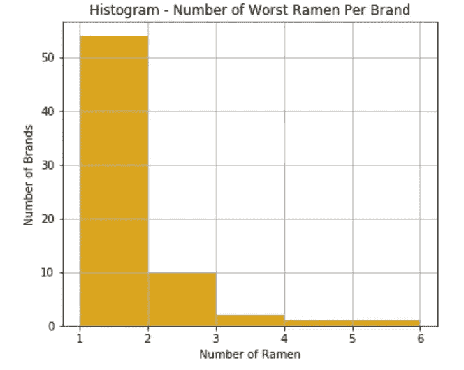

# 世界上最糟糕的拉面——用拉面评级在 Python 中学习 EDA

> 原文：<https://towardsdatascience.com/the-worst-ramen-in-the-world-learn-eda-in-python-with-ramen-rating-3cf3b608252a?source=collection_archive---------30----------------------->

我曾经是一个巨大的拉面消费者。不出所料，我在大学期间达到了消费高峰。谁不喜欢在暴风雪的日子里吃一碗拉面，吃大学食堂的难吃的食物呢？


就像我们每天吃的其他食物一样，拉面有好有坏。在这篇文章中，我想通过**探索性数据分析(EDA)** 来谈谈世界上最糟糕的拉面。

本文分为五个部分:

1.  **数据:**对数据集的简要介绍以及从哪里获得它
2.  **数据结构**
3.  **数字变量:**深入了解为什么评级列不是数字列，以及如何将其转换为数字列
4.  **分类变量:**深入查看一些分类列，以及如何填写缺失值
5.  **世界上最难吃的拉面:**深入了解哪些国家和品牌有这些拉面
6.  **最意想不到的拉面**

# 1.数据

现在你可能会感到惊讶:

> “拉面上有数据集？”

是的，我也是！这是一个数据集，上面有来自 [Hans Lienesch](https://www.theramenrater.com/about-2-2/about-2/) 的拉面评分员对每一种拉面的评分。他从小就喜欢吃方便面，他决定为全世界的拉面制作一个关于他的评论的网站。

Hans 也发表了我在本文中使用的评分数据集:

 [## 大名单-拉面评分员

### 单击列标题对评级进行排序。要下载 PDF 副本，请单击此处。您也可以下载一个 CSV 文件，它可以…

www.theramenrater.com](https://www.theramenrater.com/resources-2/the-list/) 

在我们深入研究数据之前，有一些事情需要记住:

*   因为汉斯是唯一的评分者，所以我认为评分偏向他的偏好。对于一个有趣的 EDA，没有任何机器学习应用程序，这是一个有趣的数据集
*   完整的列表包含 2816 个观察值。去年我第一次看的时候是 2943 年——我想汉斯一定把它清理了一下。
*   汉斯列出了一些十大名单:https://www.theramenrater.com/top-ten-lists/和 T21。这个数据集中的列`Top Ten`可能会也可能不会反映它们

# 2.数据结构

```
df = pd.read_csv("../data/TheRamenRater_TheBigList.csv")df.shape
```

该数据集中有 2816 行和 7 列。

```
df.info()
```

来自`df.info()`的信息显示`Style`和`Top Ten`列是缺少值的两列。

`Star`是包含每个拉面评分的列，这让我预计它应该是一个数字列。和我预想的相反，这个栏目是一个`object`类型。这意味着这个列中有`string`值，我们将在后面进一步研究。

```
<class 'pandas.core.frame.DataFrame'>
RangeIndex: 2816 entries, 0 to 2815
Data columns (total 7 columns):
Review #    2816 non-null int64
Brand       2816 non-null object
Variety     2816 non-null object
Style       2814 non-null object
Country     2816 non-null object
Stars       2816 non-null object
Top Ten     41 non-null object
dtypes: int64(1), object(6)
memory usage: 154.1+ KB
```

# 3.数字变量

为了进一步分析，我想将`Stars`列转换成数字列。在做这个变换之前，让我们先弄清楚为什么它是一个`object`。

```
df['Stars'].unique()
```

我看到除了从 1 到 5 的连续评分，我们还有`Unrated`、`NR`或混合数字评分，如`5/2.5`或`3.5/2.5`。

我试图四处搜索，以了解`NR`代表什么，以及为什么会有`Unrated`或混合评级拉面，但找不到线索。因为在 1% 的数据中有**具有这些值，所以我将删除它们，并将该列转换为数字列，以便进一步分析。**

```
fig, ax = plt.subplots(figsize=(6, 5))
ax = df['Stars'].hist()
plt.xlabel('Rating')
plt.ylabel('Number of Ramen')
_ = plt.title('Rating Histogram')
```



```
df['Stars'].mean()
df['Stars'].median()
```

平均而言，汉斯对一份拉面的评分约为 3.7 分。这和分布显示，汉斯普遍评价拉面 3 星以上。

# 4.分类变量

```
df[['Brand', 'Variety', 'Style', 'Country', 'Top Ten']].nunique()
```

该数据集中有 5 个分类变量。它们是:

*   品牌:388 独特价值观
*   种类:2631 种独特的数值
*   风格:8 种独特的价值观
*   国家:39 个值
*   前十名:28 个值

让我们一起来看看`Style`和`Top Ten`。

## `4.1 Style`

拉面有不同的风格:包，杯，碗，托盘，盒子，餐厅，罐，酒吧。

来自`df.info()`的信息表明该列中有 2 个值缺失。

```
df[df['Style'].isnull()]
```



就是这两个没有风格值的拉面。我做了一点搜索，他们看起来像是一个`Pack`，所以我将用`Pack`来填充这里的空白。

*   Kamfen E Menm 鸡肉:[https://www . theramenrater . com/2011/06/17/428-kam fen-E-men-面条-人工-鸡汤-风味/](https://www.theramenrater.com/2011/06/17/428-kamfen-e-men-noodles-artificial-chicken-soup-flavor/)
*   Unif 100 芙蓉虾:[https://www . theramenrater . com/2010/09/14/unif-100-方便面-芙蓉虾-风味/](https://www.theramenrater.com/2010/09/14/unif-100-instant-noodles-furong-shrimp-flavor/)

```
df['Style'] = np.where(df['Style'].isnull(), 'Pack', df['Style'])
```

上面是一段非常懒惰的代码，用来给缺失的行赋值。在这种情况下，它是可行的，但不是最佳解决方案。为什么？

*   它在这里有效，因为我的两个缺失值都可以用`Pack`填充
*   如果我们不得不为每一个填充不同的值，这将是行不通的

## 4.2 `Country`

你知道拉面不仅仅来自亚洲，而是来自世界各国吗？这是数据集中的国家列表。

```
df['Country'].sort_values().unique()
```



## 4.3 前十名

很显然，这个栏目只有 2012 年到 2016 年，每年排名前十的拉面。而且还不包括我上面提到的前十名(【https://www.theramenrater.com/top-ten-lists/】T2)

```
df['Top Ten'].unique()
df['Top Ten'].str.split("#", expand=True)[0].sort_values().unique()
```

# 5.世界上最糟糕的拉面

如上所述，大多数汉斯的评分都在 3 分以上，这让我对那些评分低于 3 分的人非常好奇，尤其是那些最低的人——我实际上想试试那些人，看看他们是否真的值得低评分。

在弄清楚这些拉面之前，不得不说汉斯有一套有趣的评分系统，带小数。我相信这背后是有原因的。但是为了简化我的分析，我将把评级分为以下几组:

*   0–1
*   1–2
*   2–3
*   3–4
*   4–5

我选择最差的拉面是那些评级从 0 到 1 星的拉面。让我们深入这个列表。

```
worst_ramen = df_copy[df_copy['RatingGroups'] == '0-1']
```

## 5.1 拉面最差的品牌

```
worst_ramen.groupby('Brand')['Variety'].count().sort_values(ascending=False).head(3)
```

最糟糕的拉面数量最多的品牌是:

*   白家:6 拉面
*   Acecook: 4 份拉面
*   Maruchan: 3 份拉面



尽管他们不一定是最差的品牌，因为每个品牌下最差的拉面的总数并没有太大的区别。

## 5.2 拉面最差的国家

以下是最糟糕的拉面数量最多的前 5 个国家。我很惊讶日本在那里！

*   日本:13 拉面
*   美国:12 拉面
*   中国:12 拉面
*   台湾:10 拉面
*   加拿大:10 拉面

我的假设是日本生产很多拉面(或者汉斯可能尝试过很多日本拉面)，所以就比例而言，可能不会太糟糕。

最差拉面排行榜里全日本拉面只有 3%。但是为了确定它实际上是坏还是坏，我们需要将这个百分比与其他国家的百分比进行比较。我会把这个留到下次。

# 6.最意想不到的拉面

除了最差的拉面名单，一些非常意外的*拉面*真的让我大开眼界！你有没有尝过*凤尾鱼味番石榴米粉*、*品客日清顶级拉面鸡肉味薯片*或者更好的*Komforte chock lates 香喷喷的拉面*？


嗯，这拉面巧克力真的结束了这篇文章。也许在下一篇文章中，我会对这种美味的拉面的味道做一些评论😜

这里是完整的教程，有详细的代码和更多的 EDA 技巧。

[](https://github.com/hadinh1306/blog-posts/blob/master/tutorials/WorstRamen.ipynb) [## hadin 1306/博客帖子

### 此时您不能执行该操作。您已使用另一个标签页或窗口登录。您已在另一个选项卡中注销，或者…

github.com](https://github.com/hadinh1306/blog-posts/blob/master/tutorials/WorstRamen.ipynb)