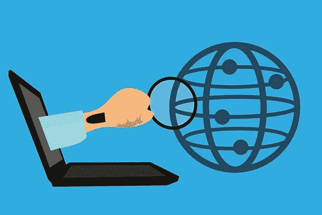

# Zoom 数据科学家访谈

> 原文：<https://towardsdatascience.com/the-zoom-data-scientist-interview-261fdfbe18cd?source=collection_archive---------56----------------------->

图片来自[**pix abay**](https://pixabay.com/illustrations/video-conference-online-home-office-5167472/)

Zoom Video Communications，Inc .是一家美国通信技术公司，成立于 2011 年，总部位于加利福尼亚州圣何塞。该公司通过基于云的软件平台提供视频会议和在线聊天服务，有助于转变实时协作体验。与其他竞争对手不同，Zoom 通过由高清视频会议、移动性和网络会议组成的三合一平台提供统一的会议体验。

在 Zoom，数据在理解和改善用户体验方面发挥着不可或缺的作用，数据科学团队是公司成功的基础。最近，Zoom 宣布了一项“智能会议”功能，为其视频会议服务提供自动转录，为用户节省了记录和共享会议笔记的时间。

为了实现这一壮举，Zoom 采用了语音到文本转录:一种基于语音的人工智能技术，利用先进的机器学习技术，可以识别会议中每个人的个人语音模式。正如这项新功能所证明的那样，Zoom 一直在做开创性的工作，为新的甚至是经验丰富的数据科学家提供一个成长平台。

# Zoom 的数据科学家角色

图片来自[pix abay](https://pixabay.com/illustrations/computer-magnifying-glass-laptop-3710284/)

Zoom 是一家快速发展的公司，主要依靠数据科学来做出影响增长、推动创新和改善客户体验的决策。数据科学家以及数据工程师、数据架构师、数据分析师和数据库工程师在维护这一标准中扮演着不可或缺的角色。

Zoom 的数据科学家利用数据和数据技术来识别和了解业务趋势和机会，以提高新产品和现有产品以及最终用户的满意度。尽管该公司有一个中央数据科学团队，但个人角色和职能可能略有不同，可以根据团队和分配的产品/项目进行定制。因此，必要的资格可以从**标准数据分析和可视化知识到机器和深度学习重技能。**

# 所需技能

虽然 Zoom 为新数据科学家的成长提供了一个大型平台和生态系统，但它也是高技能和经验丰富的数据科学家寻求加入已经在世界范围内产生影响的专业人士行列的原因。平均而言，Zoom 雇佣至少有四年(高级别 6 年以上)数据处理行业经验的专家来帮助决策。

其他相关要求包括:

*   经典机器学习、深度学习、强化学习/控制系统、概率论、统计学、因果推理、时间序列预测、优化和动态编程的实践经验。
*   **计算机科学、统计学、经济学、数学、物理、运筹学或其他定量领域的学士/硕士/博士**。
*   很强的编程语言技能，尤其是 Python，Scala 和 Java。
*   对分析和可视化工具(如 Tableau)有丰富的经验。
*   具有 SQL、Python 库和 R 的经验，能够执行复杂的模型。
*   具有构建数据管道、高效 ETL 设计、实施和维护的经验。

# Zoom 的数据科学家团队

Zoom 的术语“数据科学”涵盖了广泛的领域专业知识，包括数据科学家、数据工程师和数据架构师。虽然有一个专属的数据科学团队，但数据科学家也可以被分配到其他内部团队，或跨职能合作以实现预期目标。团队在整个组织中不断扩大，尽管一般角色有时可能会重叠，但主要职责在很大程度上依赖于所分配的团队。

以下是 Zoom 的一些数据科学团队及其一般职责。

*   **数据科学团队:**分析当前的数据设计，以优化和提供结构改进来应对业务增长，并提供见解和新的数据流程来帮助预测建模。其他角色还包括在关键项目上与产品经理、数据工程师、系统架构师和销售/营销团队进行跨职能协作。
*   **信任和安全工程:**利用数据识别趋势，进行根本原因分析，并发现潜在的改进机会。设置、监控和维护关键指标，以评估安全计划的服务和有效性。编写复杂的 SQL 查询、R 或 Python 代码来构建数据模型，为分析框架和仪表板提供支持。利用先进的机器学习、计算机视觉和数据挖掘技术来开发高度可扩展的工具、模型和预测增长的算法。作为这个团队的一员，你还可以在关键项目上与内部团队进行跨职能合作，包括产品工程师、产品经理、数据工程师、运营、法律、合规和营销经理。
*   **销售分析:**编写 Python 或 R 代码和 SQL 查询来构建模型，以维持分析框架和仪表盘。提供数据卫生和完整性，并基于产品使用和计费数据构建预测模型。角色还包括构建和维护数据可视化，以便在多级组织之间有效地交流关键销售指标和 KPI。
*   **数据科学(机器学习)**:研究、设计和开发新的机器学习解决方案和算法，以开发新功能和改进现有产品。广泛研究数据聚类、分割、过滤、评估、自动化和预测建模，以释放新的增长机会。与工程师、数据分析师和产品经理合作，开发和改进增长模型。

> 如果你正在寻找更多关于数据科学相邻领域的信息，一定要查看我们关于研究科学家及其在技术中的作用的新[文章](https://www.interviewquery.com/blog-research-scientist-breakdown/)！

# 面试过程

图片来自[pix abay](https://pixabay.com/illustrations/interview-job-icon-job-interview-1018333/)

面试过程遵循标准的技术招聘流程。首先是在 Zoom 会议上与人力资源部门进行初次面试，然后会给你邮寄一份后续的带回家的挑战。如果您通过了带回家的挑战，您将被邀请到现场与业务主管、人力资源主管和数据科学团队领导进行一系列面试。

# 初始屏幕

这是一次标准的探索性讨论，由人力资源负责。在整个面试过程中，面试官会告诉你更多关于工作角色、团队和整个公司的信息。你也可以讨论你的技能和你过去参与的项目。

示例问题:

*   给我介绍一个你过去做过的机器学习项目。
*   如果和队友有矛盾你会怎么做？
*   你从现在的职位中学到了什么？

# 在线数据挑战

在最初的 Zoom 会议之后，你会收到一份带回家的数据挑战，主要由机器学习、数据挖掘和数据结构问题组成。将有多达 15 个问题，分配一个半小时完成。

# 现场面试

现场面试是面试过程的最后一个阶段。它包括与业务负责人、人力资源负责人和数据科学团队负责人的三轮连续面试。Zoom 的数据科学现场面试是行为和技术面试的混合，旨在测试候选人在数据科学的长度和宽度方面的知识，以及产品感知知识。

问题通常是基于数据集的案例研究，类似于现实生活中的缩放案例，跨越基本的统计概念、机器学习和设计。(使用这些技巧[在这里](https://www.interviewquery.com/blog-data-science-case-study-interview/)练习您的案例研究。)

试试[面试查询上的一个模拟面试问题。](https://www.interviewquery.com/questions/encoding-categorical-features)

# 缩放数据科学家面试问题

浏览以下步骤并导入所需的 Python 库——不要担心，如果您忘记了一个，可以稍后导入。

2)从 csv 文件加载数据

3)执行基本命令来理解数据

4) Bin 具有以下特性:

a)“当前项目”分为[0 至 11]、[11 及更多]

b)进入[0 至 14.99]、[14.99 至 500]、[500 至 5K]、[5K 及更多]的“mrr_entry”

c)“帐户 _ 年龄”分为[0 至 90]、[90 至 180]、[180 至 360]、[360 及更多]

d)将“期限内剩余天数”分为[0 至 30]、[30 至 360]、[360 及更多]

5)将“churn_next_90”设置为您的目标列

6)将“zoom_account_no”设置为 ID 列，这不应该是一个功能

7)将“ahs_date”设置为日期列，这不应该是一个功能

8)将来自步骤(4)的入库特征和以下特征视为分类特征:

a)'销售组'，

b)'员工人数'，

c)“核心产品”

9)使用您喜欢的方法和 ML 算法进行特征选择。选择 10 个特征并继续步骤(10)。

10)将新数据帧(具有 10 个特征)分成测试和训练子集

11)使用与第(9)部分不同的算法，并为参数调整执行交叉验证方法。打印出结果。

12)基于来自(11)的结果，在训练子集上拟合你的模型

13)使用测试子集测试您的拟合模型

14)打印来自步骤(13)的特征重要性、准确性得分(roc_auc_score)和混淆矩阵(crosstab)

15)使用 pickle 保存训练好的模型

# 最终注释和提示

Zoom 数据科学家面试遵循标准的技术面试流程。问题是标准的和定制的——特定于个人角色的要求。面试问题混合了统计学、案例研究、编码、行为和产品意识。

最后，理解视频会议空间并不是必须的，但它有助于了解 B2B 工作空间公司在做什么。这也意味着在微软、Slack 或其他类似公司的背景有助于通过面试。

# 感谢阅读！

*   *如果您想练习更多标准缩放数据科学家面试问题，请查看* [***面试查询***](https://www.interviewquery.com/) ***！***
*   *查看我的* [***Youtube 频道***](https://www.youtube.com/channel/UCcQx1UnmorvmSEZef4X7-6g) *获取更多面试指南，以及解决问题的技巧&。*
*   *在面试查询博客上找到更多面试指南，如* [***罗宾汉数据科学家面试***](https://www.interviewquery.com/blog-robinhood-data-scientist-interview)**和**[***字节跳动数据科学家面试***](https://www.interviewquery.com/blog-bytedance-data-scientist-interview)**。****

***原载于 2020 年 10 月 19 日 https://www.interviewquery.com***。****