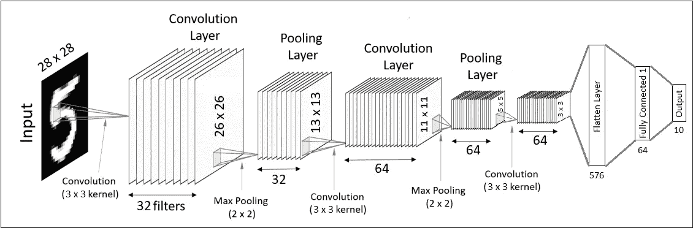
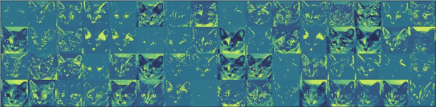
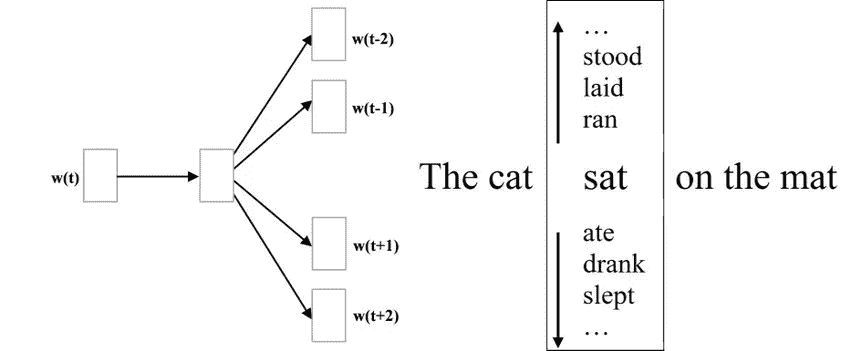
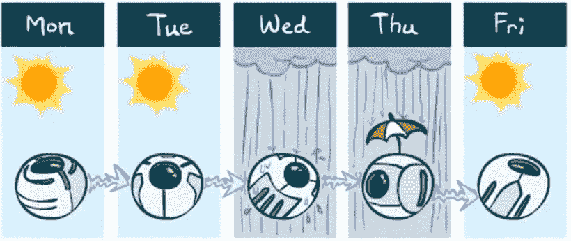
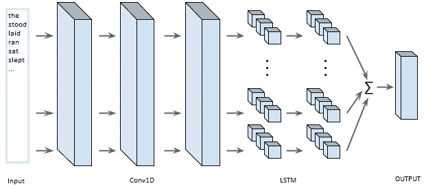

# 深度学习的理论和实践方面，10 个笔记本/项目，适合初学者

> 原文：<https://towardsdatascience.com/theoretical-and-practical-aspects-of-deep-learning-with-10-notebooks-projects-for-beginners-e0b282eefdbc?source=collection_archive---------62----------------------->

图片来自 [TechTalks](https://bdtechtalks.com/2018/12/03/jeremy-howard-ai-deep-learning-myths/) 的[本·迪克森](https://bdtechtalks.com/author/bendee983/)

# 动机

如今，各个工作领域的人都在谈论大数据。但是，它们是什么样的数据呢？它是否只针对一个分类问题处理数百万个数据？还是以无人监管的方式对它们进行聚类？为了理解这一点，让我们看一个简单的例子。谷歌有数十亿用户使用他们的各种服务，手机，应用程序，网络服务等等。谷歌必须分析他们的兴趣和位置，向他们展示合适的广告。通过图像处理将用户的照片和视频聚集在应用程序中，并听取用户的声音以提供更好的虚拟助手，这只是我们在这里可以计数的一些过程。你能想象谷歌一天之内从数十亿用户那里收集数据吗？更有趣的是，谷歌在这一领域并不孤独，其他公司也存在于这一领域，如亚马逊，这是当今最大的电子商务网站。因此，他们应该更频繁地更新服务，因为用户的兴趣和行为每天都在变化。为了处理海量数据，他们需要更强大、更高效的算法。

深度学习允许我们处理各种数据类型，如图像、文本、音频剪辑、视频等。目前，许多应用程序依赖深度学习的能力进行面部识别、对象检测、虚拟助理，甚至音乐创作。如果你知道机器学习，你应该记得一些分类的基本最大似然算法，如逻辑回归(LR)，随机森林(RF)，或支持向量机(SVM)。同样，线性回归、套索和岭作为回归变量。他们都是伟大的算法，他们救了我们很多次。然而，一些缺点使得它们不如神经网络有效。例如，逻辑回归使用单个 sigmoid 输出函数进行二元分类，当我们有许多参数要处理时，这使得提取更多信息的能力下降。另一方面，SVM 可以使用你的 CPU 中的一个内核，这对于拥有多个内核的 CPU 来说是没有意义的。此外，当出现相对大量的数据时，需要花费很多时间甚至数周来完成训练过程。但是，如果我告诉你有可能通过深度学习创建更高效、更强大的模型，会怎么样呢？由于神经网络，我们可以在几分钟内快速构建许多层和多个单元来评估我们的数据集，而常规的 ML 算法需要几天时间。因此，神经网络加快了游戏的步伐，我们不仅生成了强大而且更有效的模型来处理我们想要处理的几种数据类型。

# 介绍

在学习过程中，项目覆盖了一个重要的地方，以保持我们的理论知识新鲜，并将我们的理解推向更深的阶段。出于这个原因，实践将与学习各种机器学习模型和技术的理论方面一样重要。在本文中，我想分享一些应用的深度学习项目及其理论方面，我的评估和解释，供初学者和希望在这一领域进行更多实践的人使用。

项目由深度学习领域不同主题的四个知识库组成，包括从密集连接层到 1D 卷积网络的十个笔记本/项目。在本文的最后，我将推荐两个很好的来源，以学习深度学习技术的不同观点以及它们背后到底发生了什么开始。如果你是一个初学者，我强烈建议你在开始纠结这些项目之前先完成两个共享的资源。但是，请耐心阅读这篇文章的结尾，因为当你完成共享资源和本文的项目时，项目的描述可能会让你对你将学到的东西有更好的直觉。

# 存储库和笔记本

与存储库类似，我想将笔记本放入本文的四个部分中，在每个部分下，笔记本和相应的描述将被共享。先说第一个；

> [第 1 部分:分类和回归分析](https://github.com/HuzeyfeAyaz/Classification-and-Regression-Analysis-with-Deep-Learning)

图片来自[维基百科](https://en.wikipedia.org/wiki/MNIST_database)

计算机能理解手写的字母或数字吗？为了回答这个问题，我们从美国国家标准与技术研究所(NIST)的数据库中收集了 MNIST 数据集。MNIST 是这个时代最著名的数据集之一。数据集包含灰度 60000 训练和 10000 测试手写数字图像。加载 MNIST 数据集是本笔记本的第一部分。然后，观察图像的阵列表示，以便更好地直观了解模型如何处理图像。在这本笔记本中，数据集已经用一个简单的密集连接的顺序模型进行了评估。然而，就在创建顺序模型之前，通过将每个像素除以 255 对图像进行预处理，然后，创建顺序模型和评估结果的步骤紧随其后。

> [波士顿住房数据集的回归分析](https://github.com/HuzeyfeAyaz/Classification-and-Regression-Analysis-with-Deep-Learning/blob/master/BostonHousingDataset.ipynb)

照片由[奥斯曼·拉纳](https://unsplash.com/@osmanrana?utm_source=unsplash&utm_medium=referral&utm_content=creditCopyText)在 [Unsplash，](https://unsplash.com/s/photos/boston?utm_source=unsplash&utm_medium=referral&utm_content=creditCopyText)编辑。

我们无法总是找到足够大的数据来训练我们的模型，波士顿住房数据集可能是其中之一。在这个数据集中，我们有 506 个住宅样本，其中包括 404 个训练和 102 个测试部分。拥有这样一个有限的数据集为获得小的错误率带来了挑战。在此笔记本中，波士顿房屋的价格已在加载和规范化数据集后通过回归模型进行了预测。在编译模型时，均方误差(MSE)、平均绝对误差(MAE)和均方根误差(RMSE)已作为评估矩阵和损失函数涵盖。由于 Keras 使用随机初始权重和一些其他参数创建模型，这导致每次训练得到不同的结果。为了得到准确的分数，数据被分成 10 部分，并且对于每个步骤，其中的 9 部分被用作训练数据，而 1 部分被用作测试部分。这个过程也被称为 K 倍交叉验证。

> [第二部分:情感分析](https://github.com/HuzeyfeAyaz/Sentiment-Analysis-with-Deep-Learning)

> [IMDB 数据集](https://github.com/HuzeyfeAyaz/Sentiment-Analysis-with-Deep-Learning/blob/master/ImdbDataset.ipynb)

照片由[杰瑞米·叶](https://unsplash.com/@jeremyyappy?utm_source=unsplash&utm_medium=referral&utm_content=creditCopyText)在 [Unsplash](https://unsplash.com/s/photos/cinema?utm_source=unsplash&utm_medium=referral&utm_content=creditCopyText) 上拍摄

事实上，在一部电影上映后，我们会直接寻找关于它的书面命令，以回答它是否真的值得我们花费时间？因此，IMDb 分数和用户命令在电影上映与否中扮演着决定性的角色。作为一个人，不可能阅读和评估每个命令。然而，使用情感分析有助于我们利用计算机的能力来评估所有的命令。对于情感分析的根本解释，它在句子中寻找最常用的词，并在这种情况下确定它是好还是坏。在这本笔记本中，预处理数据的情感分析技术，和惩罚模型与 L2 正则化和辍学，已经涵盖。

> [路透社新闻数据集](https://github.com/HuzeyfeAyaz/Sentiment-Analysis-with-Deep-Learning/blob/master/ReutersDataset.ipynb)

Matthew Guay 在 [Unsplash](https://unsplash.com/s/photos/news?utm_source=unsplash&utm_medium=referral&utm_content=creditCopyText) 上拍摄的照片

现在随着科技的发展，我们都在手机或者平板上看新闻。虽然像谷歌新闻一样，每个资源中有各种新闻类别，但只有基于我们兴趣的特定主题才会显示给我们。为了主要了解谷歌如何对新闻进行分类并向我们展示，我们将在本笔记本中使用路透社的新闻数据集。路透社新闻数据集包含 46 个不同主题的简短新闻专线，如技术、经济等。它由路透社于 1986 年出版。在这本笔记本中，新闻专线已经使用情感分析技术进行了分类，具有密集连接的层和辍学。

> [第 3 部分:探索卷积神经网络](https://github.com/HuzeyfeAyaz/Exploring-Convolutional-Neural-Networks)

对于人类来说，即使在很小的时候，也很容易区分物体并进行分类。然而，从计算机的角度来看，这个过程并不容易。为了赋予机器这种能力，我们使用 NxN 矩阵作为过滤器，在卷积神经网络中从图像中捕捉不同的模式。因此，计算机可以根据物体的形状和颜色来区分它们。此外，当在卷积层中使用更多的滤波器时，由 ConvNets 发现的模式数量增加。

> [带 ConvNets 的 MNIST 数据集](https://github.com/HuzeyfeAyaz/Exploring-Convolutional-Neural-Networks/blob/master/MnistWithCNN.ipynb)

之前，MNIST 数据集仅使用密集连接的图层进行评估。在基于卷积的结构中，模型只比较数字，并试图找到它们之间的统计意义。然而，使用 ConvNet 性能很好，因为它以可视化的方式处理图像，以提取更多的模式。在本笔记本中，卷积层和池层将用于捕捉 digit 的图像模式，以获得更好的准确性。

> [猫狗分类](https://github.com/HuzeyfeAyaz/Exploring-Convolutional-Neural-Networks/blob/master/CatAndDogClassification.ipynb)

由[纪尧姆·德·日耳曼](https://unsplash.com/@guillaumedegermain?utm_source=unsplash&utm_medium=referral&utm_content=creditCopyText)在 [Unsplash](https://unsplash.com/s/photos/cat-and-dog?utm_source=unsplash&utm_medium=referral&utm_content=creditCopyText) 拍摄的照片

狗对猫，以及他们的战斗…在这本笔记本中，我们将从图像中对猫和狗进行分类。原始的狗与猫数据集包含 25000 个带标签的猫和狗图像，在 Kaggle 中每类 12.500 个。⁴:但是，我们将只用其中的 4000 台。放心吧！Keras 有很多内置的函数和类，让我们的生活变得更加轻松。ImageDataGenerator 是其中之一，可以简单地从具有给定形状的目录中加载数据集。此外，当我们没有足够的数据来训练我们的模型时，它还应用数据扩充。此外，您可以从 Keras 加载并使用预训练的模型进行迁移学习。在本笔记本中，涵盖了数据扩充、从预训练模型中提取特征以及微调主题。

> [可视化网络](https://github.com/HuzeyfeAyaz/Exploring-Convolutional-Neural-Networks/blob/master/VisualizingConvnets.ipynb)

通常，人们认为没有办法将 ConvNets 可视化。但是，如果我告诉你，有可能看到卷积网络是如何观察我们的世界。从 ConvNets 的激活功能中提取模式有助于我们检查它们如何从图像中学习。此外，我们还可以检测他们在看哪里，以预测图像的目标。在这本笔记本中，这些图案被提取出来作为视觉效果。

> [第四部分:探索序列模型](https://github.com/HuzeyfeAyaz/Exploring-Sequence-Models)

> [词语嵌入](https://github.com/HuzeyfeAyaz/Exploring-Sequence-Models/blob/master/WordEmbeddings.ipynb) ⁵

在情感分析中，模型只是在句子中寻找单词的出现。由于这个原因，我们可以很容易地通过写单词的同义词来愚弄他们，因为他们倾向于偏向某些单词。还有，他们对“不好”、“不坏”等词的连接不敏感。为了防止这种情况，今天研究者和从业者大多使用单词嵌入技术。因为单词嵌入可以让我们通过为每一个单词设置多维权重向量来赋予单词意义，使它们像男人→国王，女人→女王一样接近。在这个笔记本中，预训练的“手套”字嵌入用于嵌入层。⁶然后，用它来评估 IMDb 数据集。

> [气温预报](https://github.com/HuzeyfeAyaz/Exploring-Sequence-Models/blob/master/TempratureForecasting.ipynb) ⁷

图片来自[伯克利 CS188:人工智能简介](https://inst.eecs.berkeley.edu/~cs188/fa20/)

在本笔记本中，我们将看到一个在您的设备上使用温度预测应用程序的示例。我们将了解他们实际上是如何预测未来温度的，以及我们应该对这些类型的序列数据集应用何种预处理技术。为了这个问题，从 2009 年到 2016 年，Jena Climate 每 10 分钟收集一次数据集。每个样本有 14 个参数，如空气温度、压力、湿度等 11 个参数。在本笔记本中，已经创建了生成器功能来准备具有相应目标的训练、验证和测试数据。此外，门控递归单元(GRU),⁸，这是最常见的 RNN 算法之一)也包括在内。

> [1D·康文内特](https://github.com/HuzeyfeAyaz/Exploring-Sequence-Models/blob/master/1DConvNets.ipynb)

虽然最常见的 RNN 算法，如长短期记忆(LSTM)和门控递归单元(GRU)在记忆 sequences,⁹方面做得很好，但在长序列中训练它们在计算上是昂贵的。由于这个原因，1DConvNets 用于从序列中捕获一些模式，并通过减少像 2DConvNets 这样的 RNN 层的输入参数来带来更高的计算效率。因此，1DConvNets 和 LSTM 在 Keras 中的实现已经包含在本笔记本中。

# 建议和结论

在结束本文之前，我想提一下两个很好的资源。其中一个是 Andrew Ng 的“深度学习专业化”，其中包含 5 个非常棒的课程，通过⁰的 homeworks 提供深度学习技术的理论方面，另一个是 Francois chollet(keras 的创作者)的“用 Python 进行深度学习”，这是一本非常好的书，我主要用来准备笔记本和撰写本文。

简而言之，在这个故事中，我们看到了深度学习的各种观点，从简单的分类问题到未来预测。在当今由大数据管理的世界中，深度学习是处理几种数据类型的重要时代。如今，我们不仅使用数据来对一些东西进行分类，我们还使用它们通过生成网络来生成图像、视频剪辑和人声。对于深度学习的未来，最近已经采取了在医学中使用它的步骤，例如从乳腺组织病理学图像中诊断乳腺癌或从 X 射线图像中检测肺癌。但还是有更多的东西等着你去发现。此外，我们可能会在空间科学领域看到更多。由于 Space-X 的猎鹰 9 号项目具有可重复使用的两级火箭设计，现在，从火箭起飞到分离模块自动着陆，都可以使用机器学习能力。

## 参考资料:

1.[https://keras.io/api/datasets/mnist/](https://keras.io/api/datasets/mnist/)

2.【https://keras.io/api/datasets/reuters/ 号

3.泽勒医学博士和弗格斯研究中心(2014 年 9 月)。可视化和理解卷积网络。在*欧洲计算机视觉会议*(第 818-833 页)。斯普林格，查姆。

4.[https://www.kaggle.com/c/dogs-vs-cats](https://www.kaggle.com/c/dogs-vs-cats)

5.Mikolov，Chen，k .，Corrado，g .，& Dean，J. (2013 年)。向量空间中单词表示的有效估计。 *arXiv 预印本 arXiv:1301.3781* 。

6.Pennington、r . Socher 和 c . d . Manning(2014 年 10 月)。Glove:单词表示的全局向量。在*2014 年自然语言处理经验方法会议论文集*(第 1532-1543 页)。

7.[https://S3 . Amazon AWS . com/keras-datasets/jena _ climate _ 2009 _ 2016 . CSV . zip](https://s3.amazonaws.com/keras-datasets/jena_climate_2009_2016.csv.zip)

8.Chung，j .，Gulcehre，c .，Cho，k .，和 Bengio，Y. (2014 年)。门控递归神经网络在序列建模中的经验评估。 *arXiv 预印本 arXiv:1412.3555* 。

9.Hochreiter，s .，& Schmidhuber，J. (1997 年)。长短期记忆。*神经计算*， *9* (8)，1735–1780。

10.[https://www.coursera.org/specializations/deep-learning](https://www.coursera.org/specializations/deep-learning)

11.[https://www.manning.com/books/deep-learning-with-python](https://www.manning.com/books/deep-learning-with-python)