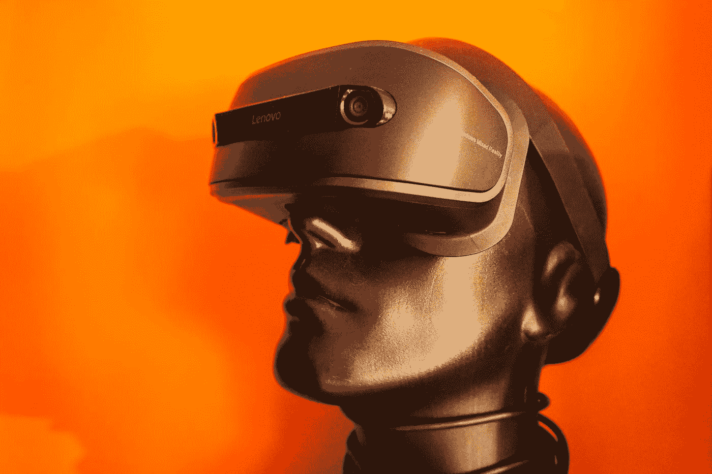

# 心智理论和人工智能

> 原文：<https://towardsdatascience.com/theory-of-mind-and-artificial-intelligence-231927fabe01?source=collection_archive---------23----------------------->

## AI 能理解人类甚至自身的行为吗？

Liam Charmer 的照片

我们的大脑是一个复杂且尚未被完全理解的系统。只要有书面证据可以证明，哲学家们就一直在努力弄清楚我们的大脑是如何运作的。在这种情况下，可能出现的一些最有趣的问题与发现他人(甚至自己)头脑中正在发生的事情的可能性有关。给定足够多的可观察变量，人类行为是可预测的吗？

这种思考刺激心理学家发展出所谓的“心理理论”(ToM)，正如 AI Goldman 所描述的[1]:

> “心理理论”是指将心理状态归因于自我和他人的认知能力。同样能力的其他名称包括“常识心理学”、“天真心理学”、“民间心理学”、“读心术”和“心理化”。[……]他们[人]或他们的认知系统，是如何对他人的精神状态，即无法直接观察到的状态，形成信念或判断的？

提出了不同的经验测试(例如[2]，[3])，以检查可观察的输入是否可以导致精神状态预测，以及了解精神状态是否允许预测未来的行动(行为)。虽然心理学家仍在争论理解人类的心理状态是否可能，但汤姆已经吸引了人工智能研究人员的注意。

## 心智理论和人工智能

Jr Korpa 拍摄的照片

人工智能在过去十年中发展迅速，利用了增加的计算能力，特别是深度神经模型取得的突破。虽然这种结果很强大，但在特定的环境中是可以实现的，而且所获得的模型只能在它们被设计为擅长的任务中表现良好。下一步将是设计一个能够处理各种不同问题的人工智能，并在与不同实体互动的同时进行学习，正如机器人领域 10 大公开挑战中的 2 个所强调的那样[4]:

> **(vi)机器人学人工智能(AI)的基本方面**，包括学习如何学习，结合高级模式识别和基于模型的推理，用常识开发智能。
> 
> **(八)社会互动**了解人类社会动态和道德规范，能够真正融入我们的社会生活，表现出同理心和自然的社会行为。

将 ToM 的概念和思想与合成智能系统相结合已被证明是解决这些问题的可行选择，并且在考虑多智能体 AI 系统和人机交互问题时变得尤其相关。在这个前提的基础上，已经建立了不同的工作，例如，在[5]中使用贝叶斯 ToM 框架，甚至在[6]中使用逆向强化学习来“逆向工程”可观察的行为。下面我对 DeepMind 和谷歌大脑的研究人员提出的一种不同的方法进行评论。

## ToMnet

在[7]中，作者描述了被称为心理机器理论的东西。其思想是将 ToM 视为一个元学习问题(即学会如何学习)，以实现一个人工系统，该人工系统具有关于它以前从未见过的代理将如何行为的先验知识，并收集关于该代理如何与环境交互的数据，以创建包含特定代理行为的特殊性的个体模型。

与其他方法不同，目标是使用有限的数据自主学习，而不是断言一个生成模型，观察代理的行为，并对其算法进行逆向工程。实验包括 ToMnet 与 gridworld 中遵循不同策略的代理交互，在 grid world 中，每一步都可能有一组离散的可能动作。首先，代理遵循一个随机的策略，然后代理被训练有对环境的完全可观测性，最后代理被训练有不同种类的部分可观测性。

结果表明，ToMnet 实现了它的目标:当观察新的代理时，学习适用于平均行为和特定模型的通用模型。不幸的是，在更具挑战性的情况下，代理之间需要相当大的通信信道来实现这样的结果。随着模型和方法的进一步改进，预计在处理更复杂的环境和代理之间没有直接通信的情况下，将获得同样令人印象深刻的结果。

这项工作和其他作者结合心智和人工智能理论概述的可能性令人着迷。毕竟，能够理解复杂人工系统的行为可能是理解我们大脑的重要一步。

## 参考

[1] Goldman，Alvin I .《心理理论》《牛津认知科学哲学手册》 1 (2012)。

[2]拜伦-科恩、西蒙、艾伦·m·莱斯利和乌塔·弗里斯。"自闭症儿童有“心理理论”吗？"*认知*21.1(1985):37–46。

[3]维默、海因茨和约瑟夫·佩纳。"关于信念的信念:错误信念在幼儿理解欺骗中的表征和约束作用."*认知*13.1(1983):103–128。

[4]杨，光忠，等.“科学机器人学的重大挑战”*科学机器人* 3.14 (2018): eaar7650。

[5]贝克、克里斯、丽贝卡·萨克斯和约书亚·特南鲍姆。"贝叶斯心理理论:联合信念-愿望归因建模."*认知科学学会年会论文集*。第 33 卷。№33.2011.

[6] Ng、Andrew Y 和 Stuart J. Russell。"逆向强化学习的算法." *Icml* 。第一卷。2000.

[7] Rabinowitz，Neil C .等人，《机器心理理论》 *arXiv 预印本 arXiv:1802.07740* (2018)。