# 主成分分析理论及其在 Python 上的实现

> 原文：<https://towardsdatascience.com/theory-of-principal-component-analysis-pca-and-implementation-on-python-5d4839f9ae89?source=collection_archive---------52----------------------->


来源: [summitlife](https://summitlife.org/sense-of-direction-summit-life-today/)

## 主成分分析背后的原理和数学以及在 Python 上的实现

当处理一个包含大量数据的复杂科学项目时，其中每个例子都由许多特征描述，您可能想要**可视化数据**。事实上，在 1D、2D 或 3D 中可视化很容易，但如果你想可视化由 100 个特征组成的数据，你在 100D 中看不到任何东西。所以你必须**降低维度**，把你的数据放在一个维度等于或者小于 3D 的空间里。这可以使用主成分分析(PCA)来完成。PCA 的另一个非常好的用途是**加速你的机器学习算法的训练过程**。你的特征越多，你的机器学习算法就越复杂，它需要学习的参数就越多。因此，计算时间将越长。现在，很明显，如果你减少数据的大小，学习算法所需的时间将会大大减少。但是，您可能会想，如果我们减少变量的数量，那么我们将会丢失数据中的大量信息，结果也将完全不准确。这是 PCA 算法的主要挑战，我们将在本文中看到如何确保良好的准确性。

为了说明这种情况，我将使用 **MNIST 数据库**是一个手写数字的大型数据库。

在本文中，我将向您展示 PCA 背后的理论以及如何在 Python 上实现它。我也会给你一些何时使用这种方法的提示。

# 主成分分析背后的数学

在主成分分析算法中，目标是找到投影数据的 k 个向量，以便最小化投影误差。**这 k 个矢量将是投影数据的 k 个方向**。这里，k 对应于你的最终维度:如果你想在一个 2D 维度空间中查看你的数据，那么 k 将等于 2。

> ***我们如何找到这些 k 向量？***

让我们称**为** **描述我们的数据**的矩阵。PCA 涉及将相互依赖的变量(在统计学中称为“相关的”)转换成彼此不相关的新变量。这些变量被称为主成分，将描述数据所传达的信息。我们需要查看协方差矩阵，因为**协方差**是两个[随机变量](https://en.wikipedia.org/wiki/Random_variable)的联合可变性的度量。但是为什么要协方差呢？让我们想想如何从数据中学习。你看着均值，变量是如何远离或接近均值的。这本质上是协方差:与平均值的偏差。因此，在主成分分析中，我们必须计算数据矩阵的协方差，并寻找收集最多信息的**方向或向量**，以便我们可以保留 PI 并去除其余的。但事情并没有那么简单，我们将一步一步来看，看看我们是如何做到的。

## 1.数据的标准化

该步骤的目的是**标准化连续初始变量**的范围，以便它们中的每一个对分析的贡献相等。

更具体地说，在 PCA 之前进行标准化是至关重要的，因为后者对初始变量的方差非常敏感。也就是说，如果初始变量的范围之间存在较大差异，则范围较大的变量将优于范围较小的变量(例如，范围在 0 和 100 之间的变量将优于范围在 0 和 1 之间的变量)，这将导致有偏差的结果。因此，将数据转换为可比尺度可以防止这个问题。

数学上，这可以通过减去每个变量的每个值的平均值并除以标准偏差来完成。回想一下，Ais 是描述我们的数据的矩阵，因此每行是一个例子，每列是一个特征。让我们设定 **n 等于特征的数量** et **m 等于示例的数量**。因此矩阵 A 是一个矩阵 **mxn。**

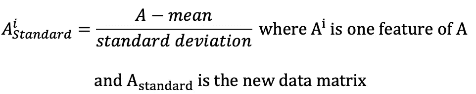

## 2.协方差矩阵和对角化

协方差矩阵由以下公式给出:

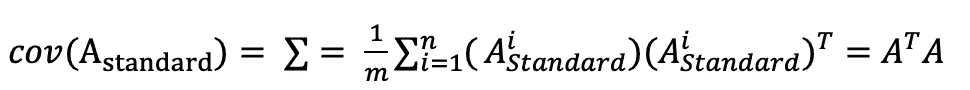

然后，我们需要对角化协方差矩阵。我们称 S 为对角矩阵。u 和 V 将是变换矩阵。因此，我们有:

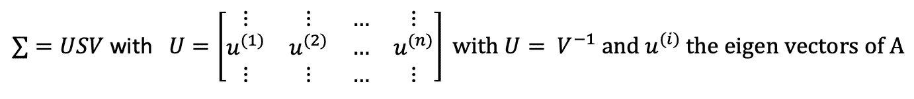

如果你听说过 PCA，你可能听说过 [SVD](https://en.wikipedia.org/wiki/Singular_value_decomposition) 。SVD 用于奇异值分解，这就是我们在 A 上应用的内容。SVD 理论表明，矩阵 A 存在以下分解:

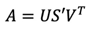

其中 *U* 和 *V* 是分别从 aa***【ᵀ】***和 a***【ᵀa】***中选择的具有标准正交**特征向量**的**正交矩阵。***s’***是对角矩阵，其中 *r* 元素等于 XX *ᵀ* 或 X *ᵀ X.* 对角元素由奇异值组成。**

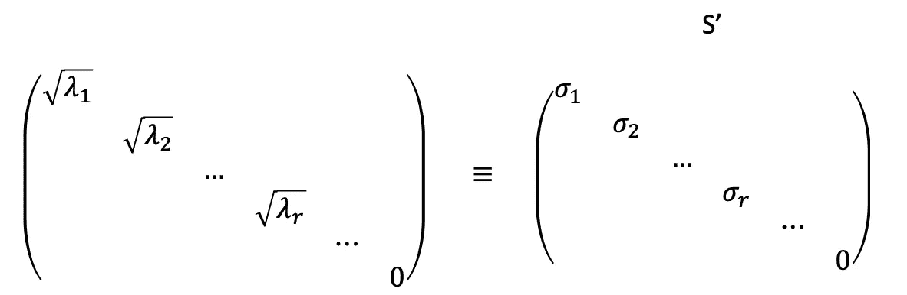

并且我们有 ***S' = S.*** 下一步是重组特征向量以产生 U 和 V. 为了标准化解决方案，我们对特征向量进行排序，使得具有较高特征值的向量出现在具有较小值的向量之前。


与特征分解相比，奇异值分解适用于非方阵。 *U* 和 *V* 对于 SVD 中的任何矩阵都是可逆的。

## 3.降维

降维的思想是保留 k 个最能描述数据的特征向量。因此，我们有:

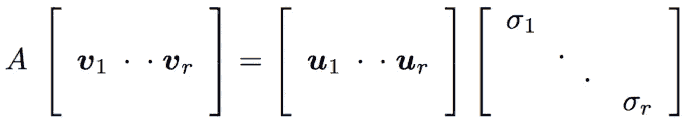

然后我们添加零空间，它已经与第一个 r v 和 u 正交，从简化 SVD 到完全 SVD。

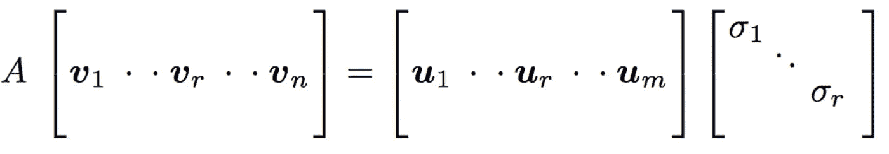

## 4.如何选择 k 个特征向量

我们需要应用一个公式来保持总方差的某个百分比。假设我们希望保持方差的 99%，那么我们有如下结果:

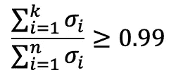

现在我们已经看到了 PCA 背后的数学原理，我们将在 Python 上实现它。

# Python 上的实现

我们将使用的数据集在这里可访问[。因此，首先我们导入数据和我们需要的不同库。](https://www.kaggle.com/c/digit-recognizer/data?select=train.csv)

```
import numpy as np
import pandas as pd
import seaborn as sns
import matplotlib.pylab as plt# import the data
data = pd.read_csv("train.csv")# some pre-processing on the data
labels = data['label'].head(1500) # we only keep the first 1500 *#* Drop the label feature and store the pixel data in A and we keep 
# only the first 1500
A = data.drop("label",axis=1).head(1500)
```

## 1.数据的标准化

```
from sklearn.preprocessing import StandardScalerstandardized_data = StandardScaler().fit_transform(A)
```

## 2.协方差矩阵和对角化

首先，我们计算 a 的**协方差矩阵**

```
covar_matrix = np.matmul(standardized_data.T , standardized_data)
```

然后，我们计算特征值和相应的特征向量。但是这里我们只计算最高的两个。

```
*# the parameter 'eigvals' is defined (low value to heigh value)* 
*# eigh function will return the eigen values in ascending order*

values, vectors = eigh(covar_matrix, eigvals=(782,783))
```

然后，我们将原始数据样本投影到由我们刚刚计算的两个主特征向量形成的平面上。

```
new_coordinates = np.matmul(vectors.T, sample_data.T)
```

然后，我们将标签附加到 2d 投影数据，并创建一个数据帧，然后使用 seaborn 并绘制带标签的点:

```
new_coordinates = np.vstack((new_coordinates, labels)).T

*# creating a new data frame for plotting the labeled points.*
dataframe = pd.DataFrame(data=new_coordinates, columns=("1st_principal", "2nd_principal", "label"))# plot
sn.FacetGrid(dataframe, hue="label", size=6).map(plt.scatter, '1st_principal', '2nd_principal').add_legend()
plt.show()
```


类别之间有很多重叠，这意味着 PCA 不太适合高维数据集。很少几个阶层可以分开，但大多数都是混合的。 **PCA 主要用于降维**，**不用于可视化**。为了可视化高维数据，我们通常使用 T-SNE。

我们也可以使用 Python 中的 PCA 模块来实现:

```
*# initializing the pca*
**from** **sklearn** **import** decomposition
pca = decomposition.PCA()*# configuring the parameteres*
*# the number of components = 2*
pca.n_components = 2
pca_data = pca.fit_transform(standardized_data) pca_data = np.vstack((pca_data.T, labels)).T

*# creating a new data frame which help us in plotting the result data*
pca_df = pd.DataFrame(data=pca_data, columns=("1st_principal", "2nd_principal", "label"))# plot the data
sns.FacetGrid(pca_df, hue="label", size=6).map(plt.scatter, '1st_principal', '2nd_principal').add_legend()
plt.show()
```

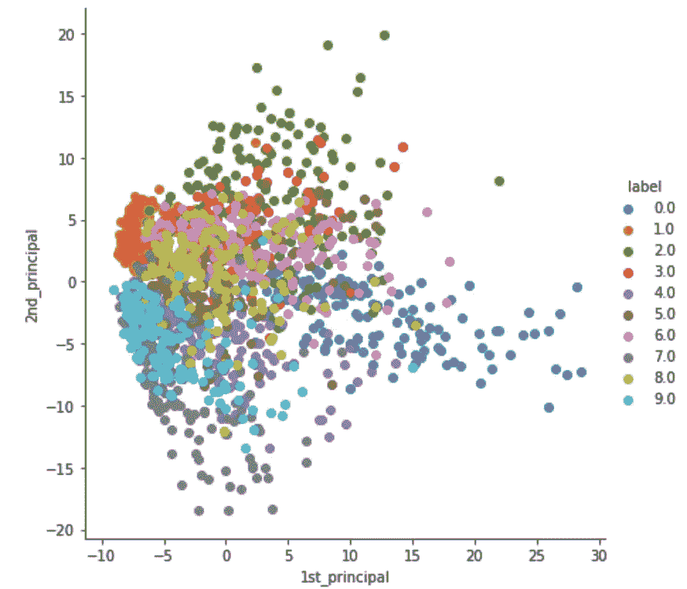

## 3.降维

在这一节中，我们想找到描述我们的数据所需的特征向量的数量。因此，我们需要计算每个特征值的**显著性**，然后计算累积方差。我将特征值的重要性定义为:

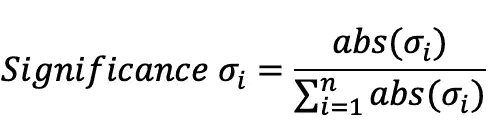

```
**# initializing the pca**
from sklearn import decomposition
pca = decomposition.PCA()
**# PCA for dimensionality reduction (non-visualization)**pca.n_components = 784
pca_data = pca.fit_transform(standardized_data)# then we calculate the significance but the absolute value is not necessary as the eigen values are already positive
significance = pca.explained_variance_/ np.sum(pca.explained_variance_)cum_var_explained = np.cumsum(significance) *# Plot the PCA spectrum*
plt.figure(1, figsize=(6, 4))

plt.clf()
plt.plot(cum_var_explained, linewidth=2)
plt.axis('tight')
plt.grid()
plt.xlabel('n_components')
plt.ylabel('Cumulative_explained_variance')
plt.show()
```

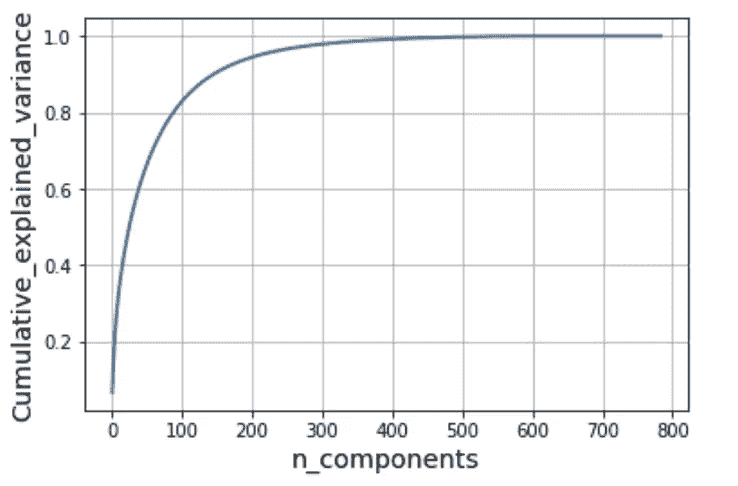

## 4.如何选择 k 个特征向量

让我们回顾一下我们在第一部分看到的内容:

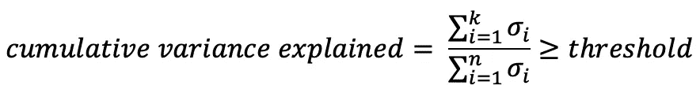

因此，我们绘制了该分量方差的累积和。这里 300 个成分解释了几乎 90%的差异。所以我们可以根据要求的方差来降维。

# 主成分分析法的优点和用途

PCA 是一种**降维**的方法，但是可以要求成分独立:[独立成分分析](https://en.wikipedia.org/wiki/Independent_component_analysis) ( **ICA** )。
PCA 是一种**无监督线性方法**，大多数无监督技术并非如此。
由于 PCA 是一种降维方法，它允许将数据投影到 1D、2D 或 3D 中，从而**将数据可视化**。这对**加速训练过程**也非常有用，因为它大大减少了特征的数量，从而减少了参数的数量。

我希望你已经找到了你在这篇文章中寻找的东西，并祝你未来的项目好运！

如果你喜欢阅读这样的故事，并想支持我成为一名作家，考虑注册成为一名灵媒成员。每月 5 美元，你可以无限制地阅读媒体上的故事。如果你注册使用[我的链接](https://medium.com/@jonathan_leban/membership)，我会赚一小笔佣金，你仍然要支付 5 美元。谢谢大家！！

[](https://medium.com/@jonathan_leban/membership) [## 通过我的推荐链接加入媒体-乔纳森·莱班

### 阅读乔纳森·莱班的每一个故事(以及媒体上成千上万的其他作家)。您的会员费直接支持…

medium.com](https://medium.com/@jonathan_leban/membership) 

*PS:我目前是伯克利的工程硕士学生，如果你想讨论这个话题，请随时联系我。* [*这里的*](http://jonathan_leban@berkeley.edu/) *是我的邮箱。*