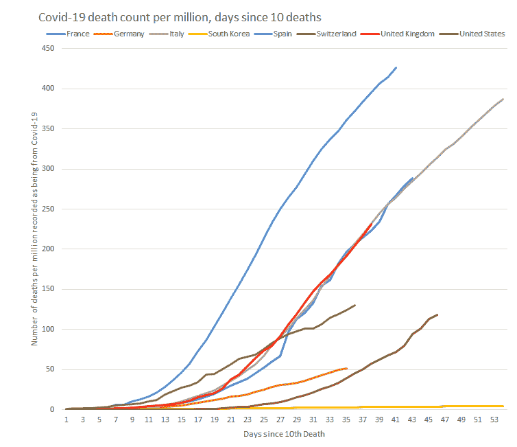

# 没有事实，只有解释

> 原文：<https://towardsdatascience.com/there-are-no-facts-only-interpretations-abc70a48014b?source=collection_archive---------31----------------------->

## 冠状病毒危机说明了了解您的数据的重要性

弗里德里希·尼采，数据专家(图片版权 Adobe)

“没有事实，只有解释”，不管怎么说，这是尼采的观点。这可能看起来很奇怪:数据，以其明显的精确性、结构性和清晰性，可能看起来就是客观确定性的定义，但那是一种错觉。现实是，数据总是收集数据的人如何看待世界的主观和不完美的表达。

冠状病毒的爆发就是一个很好的例子。一方面，这是一场极其明显的危机。病例和死亡人数每天都在公布，开源数据集可供任何人分析和建模。然而，尽管如此，即使是最基本的问题也很难找到好的答案。

在这篇文章中，我将概述我在思考数据时使用的一些问题，然后将它们应用于开源冠状病毒数据集，以了解它们如何影响我们回答一些常见问题的能力:病毒有多危险，政府在管理危机方面做得如何？

# 关于数据的问题

如果你不监管你的数据，没人会监管。马特·波波维奇在 [Unsplash](https://unsplash.com?utm_source=medium&utm_medium=referral) 上的照片

## 为什么要收集这些数据？

在收集数据时，必须做出许多决定，包括收集什么，遗漏什么，以及如何解释各种情况。理解*为什么要收集*数据，对于帮助你理解导致这些数据出现在你面前的决策是至关重要的，并且应该支配你对这些数据的思考方式。由试图向你推销某种东西的人建立的数据集应该与由更中立的人建立的数据集有所不同。为关键流程或基础设施提供数据的数据集不同于在服务器上放置了一两年而无人查看的数据集。

而且，不知道为什么，你会一直问自己“等等，他们为什么要这么做？!"当你在数据中发现各种各样的小精灵和奇怪的东西时。

## 数据有多完整？

没有真正“完整”的数据集，因为数据创建过程必然涉及决定不收集关于某些实体或这些实体的属性的信息。总是有更多的事情可以衡量，所以思考数据中你没有看到的和你看到的是至关重要的。

通常，您将处理抽样数据，因为收集整个人口的数据要么不可行，要么成本太高。在这种情况下，理解如何以及为什么以这种方式对数据进行采样，以及所选择的采样方法的一致性是至关重要的。通常，为用途 A 选择的采样方法使其对用途 B、C 和 D 无效，我们将在稍后考虑冠状病毒死亡率时看到这一点。

## 数据收集过程有多准确？

数据准确性会受到任何因素的影响，包括测试准确性、生成数据的系统的稳定性，或者人工数据收集者的知识和动机。请记住，仅仅因为数据都在同一个表中，就不能保证它们都同样准确；一些可能维护得很好，很精确，而另一些却一团糟。

## 人为错误或偏见是如何进来的？

有时候，收集数据的人知识渊博、细心、资源丰富，并且有足够的时间做好他们的工作。其他时候那是…事实并非如此。类似地，在有强烈动机看到某些结果的地方，许多人很难完全抵制将数据推向那个方向的冲动。然后总是有好的老式欺诈…

## 数据收集是否一致？

以上几点都不一定随着时间、地点或数据收集者而一致。数据收集团队的新领导或利益相关者可能意味着数据收集政策的改变。不断发展的技术或更广泛的背景可能会改变数据收集的方法或规模。它也可能只是一个简单的错误，在 6 个月内发现，修复不能追溯。

# 冠状病毒数据

“我们的数据世界”网站有很多优秀的图表，这些图表每天都来自于“T2”欧洲疾病预防和控制中心。还有其他网站，但它们都有相似的来源:按国家收集的报告病例和死亡病例。

## 为什么要收集这些数据？

在这种情况下，数据主要由每个国家的卫生当局收集，以告知相关国家政府病毒是如何传播的，以及对其卫生服务造成的压力。

这意味着数据往往侧重于影响卫生系统的病例，更适合每个国家政府的需要，而不是着眼于全球一致性。这并不是说没有调整实践的努力，但国家政府的需求将是第一位的。

## 数据有多完整？

众所周知，在许多国家，检测的可获得性有限，因此数据远不具有代表性。顺便提一句，这一点在确定国家处于感染曲线的哪个位置时至关重要:它们达到峰值了吗，还是已经超出了它们的检测能力？

测试通常不是随机进行的。相反，只有出现症状的病例(有时只有非常严重的症状)才会接受检测。这使得任何关于死亡率的推论都非常可疑。

同样，在死亡统计上，不同的国家对冠状病毒死亡的统计也不同。一些人只统计了住院死亡人数，其他人则包括护理院和其他非住院死亡人数，这可能会对总数产生非常大的影响。

## 数据收集过程有多准确？

没有一种病毒测试是完全准确的，冠状病毒测试和其他任何测试一样都有假阳性和假阴性率。有许多可用的测试，其中一些似乎比另一些更不准确，所以我们需要小心的比较使用不同测试的人群。

另请注意，此数据中的日期粒度是根据报告日期确定的，这可能会给出一个奇怪的工作日/周末周期，因为并非所有来源都在周末报告(不，病毒不会在周末休息)。

## 人为错误或偏见是如何进来的？

疫情是一场巨大、可怕的全球性危机，在这场危机中，本已捉襟见肘的卫生基础设施正在迅速适应巨大的问题。错误是意料之中的。

一些国家的报告做法可能也不完全透明。例如，淡化数字的指责指向了[中国](https://www.theguardian.com/world/2020/apr/17/china-denies-cover-up-as-wuhan-coronavirus-deaths-revised-up-50)和[俄国](https://www.businessinsider.com/coronavirus-russia-doctors-say-government-is-covering-up-cases-2020-3)。

## 数据收集是否一致？

不同国家(或州)的数据收集并不一致:不同的测试策略、不同的测试和不同的死亡测量方法都意味着我们通常不会进行比较。这并不是说，努力保持指标一致的国家之间的指标永远不具有可比性，但我们应该假设情况并非如此，直到出现其他情况。

我们还预计，随着更多(更好)测试的出现，以及政府调整其指标以更好地反映他们对危机的理解，一个国家内的指标会随着时间的推移而变化(例如，在报告的总数中包括养老院死亡人数)。

总之，这是一组非常粗略的数据，我们需要非常小心地从中得出结论。让我们来看几个问题，看看这对我们得出结论的能力有什么影响。

# 冠状病毒有多危险？

在我们深入研究之前，值得注意的是，这种病毒的感染率和死亡率与你在疫情的个人风险不同。如果你足够幸运躲过了病毒，但却遭遇了一场车祸，通常需要 5 分钟才能到达的救护车花了 50 分钟才到达，你很可能成为疫情的受害者，如果不是病毒的话。这些“附带”死亡并非微不足道，早期分析表明它们可能是许多国家报告死亡人数的两倍或更多(尽管其中一些将是上文提到的未报告的病毒死亡)。

此外，这个问题隐含地假设有一种病毒株有一个死亡率，而可能有[多种病毒株有不同的死亡率](https://www.scmp.com/news/china/science/article/3080771/coronavirus-mutations-affect-deadliness-strains-chinese-study)。

尽管如此，还是让我们把注意力放在病毒本身的死亡率上。快速浏览一下 4 月 21 日的数据报告中的*世界，我们看到 169859 例死亡和 243 万例病例；这给了我们 7.0%的死亡率。*

正如我们已经提到的，事情并没有那么简单。由于政府如何管理检测，使用何种检测，以及如何记录死亡人数，病例和死亡人数都严重失真。理清这些扭曲对全球数据集的影响将非常棘手，如果不是不可能的话。

当然，我们会及时回答这个问题，研究已经在进行中(谢天谢地，[死亡率比 7%](https://www.thelancet.com/journals/laninf/article/PIIS1473-3099(20)30243-7/fulltext) 低得多)。我的观点是，即使我们手边有大量每日更新的全球数据，我们仍然会得到可能相差一个数量级的答案。相反，对于这个特殊的问题，我们需要精心制作一个定制的数据集，一个随机抽样和一致跟踪的数据集。

让我们试试另一个问题，看看我们的进展是否更好。

# 政府应对危机的能力如何？

如上所述，重点通常是直接由冠状病毒导致的死亡，所以如果一些反病毒措施无意中导致其他地方的死亡，我们需要一段时间才能知道。不过，现在让我们先把这个问题放在一边，再次关注病毒死亡率。此外，关于我们是否应该比较绝对数字或每百万死亡/病例数，也有一些争论。鉴于我对比较瑞士(人口 900 万)和美国(人口 3.28 亿)很感兴趣，我将从人均水平来看:

数据来自:[https://ourworldindata.org/coronavirus](https://ourworldindata.org/coronavirus)(快照拍摄于 2020 年 4 月 19 日)

正如广泛报道的那样，西班牙显然正处于艰难时期。英国、法国和意大利的曲线几乎完全相同。美国还没有达到西班牙、意大利或英国的梯度。瑞士看起来像德国，但更糟，韩国仍然是积极的局外人。

那么，对于这些国家之间不同的战略和能力，我们能得出什么结论呢？除了告诉每个人要像韩国那样(提前做好充分准备)，很难对他们措施的有效性做出有信心的判断，锁定“实力”和死亡人数之间没有明显的模式。如前所述，我们不知道不同的数据收集做法如何加剧或隐藏这些国家之间的差异。

此外，为了正确回答这个问题，我们需要大量的额外数据，以了解人口密度、病毒变异、[人口统计数据](https://edition.cnn.com/2020/03/16/opinions/south-korea-italy-coronavirus-survivability-sepkowitz/index.html)、吸烟率、气候等因素在多大程度上影响了传播和死亡率，以及那些可归因于政府政策的因素，如检测、口罩、封锁和社会距离。只有当我们控制了这些因素后，我们才能指出具体的决策和政策，看看它们真正产生了什么样的影响。

这里的要点是不要让无能的政府逃脱责任；一些政府似乎确实在方向盘上睡着了。更确切地说，关键是尽管我们手边有大量的数据，但我们发现自己需要更多的背景和不同的数据来正确回答这个问题。

# 所有的装备，不知道

我们越来越幸运地拥有大量的数据和很酷的工具。虽然这是一件很棒的事情，但它肯定会让我们更容易陷入分析和数据科学的最糟糕的习惯:跳入我们并不真正理解的数据，并快速制作一堆很酷的图表和指标来展示给所有人。

虽然不是特别性感，但花几个小时(是的，几个小时)真正理解你正在处理的数据，以及它与你试图解决的问题的关系，是伟大的分析和，嗯，看起来闪闪发光的垃圾之间的区别。您会惊讶地发现，您开始处理的数据实际上根本不是您需要的。

数据科学就像烹饪，神奇之处在于配料。照片由[西德·瓦克斯](https://unsplash.com/@videmusart?utm_source=medium&utm_medium=referral)在 [Unsplash](https://unsplash.com?utm_source=medium&utm_medium=referral) 上拍摄

我希望这篇文章中列出的问题有助于你完成这个过程。毫无疑问，它们并不详尽，您可能有自己喜欢使用的。底线是:不要将数据视为客观事实，而更像是创建数据的人认为在当时记录重要且可行的东西的反映。换句话说，分析和数据科学就像烹饪，你可以让几乎任何东西在锅里冒泡，但如果你没有正确选择配料，你可能不想吃结果。