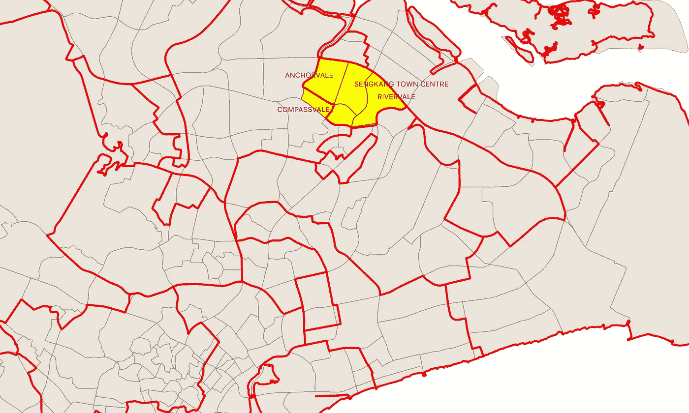
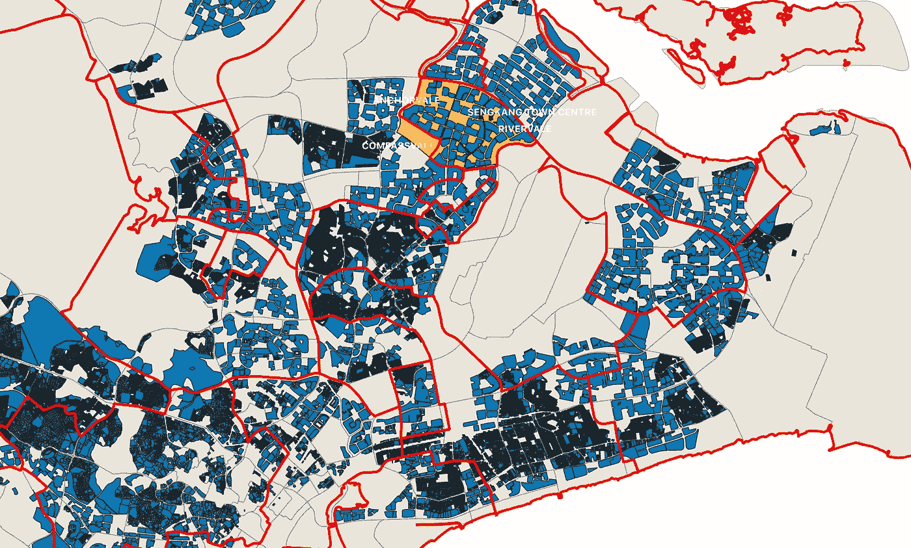
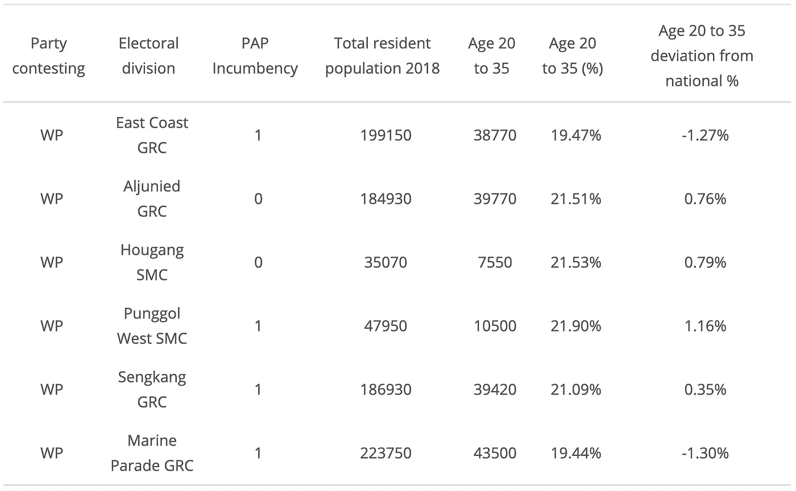
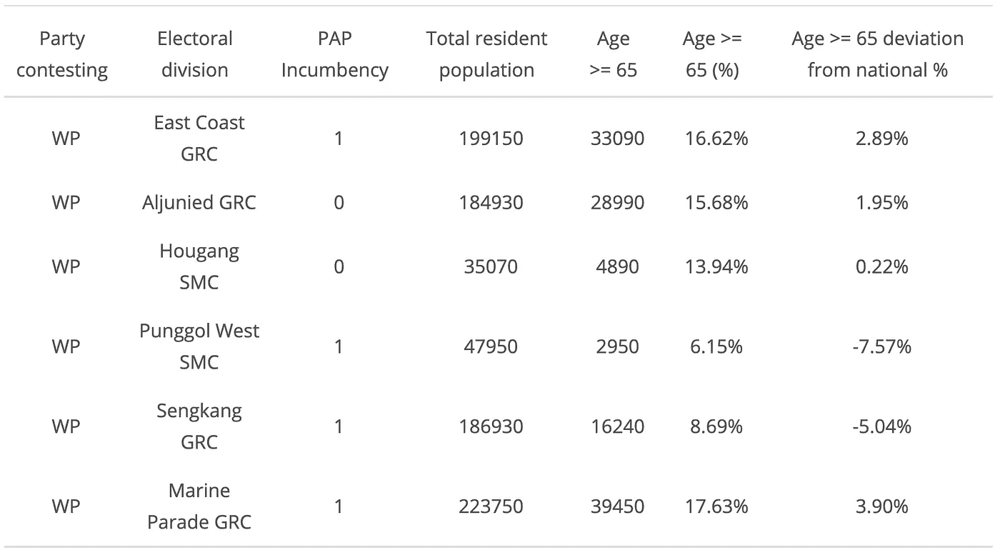
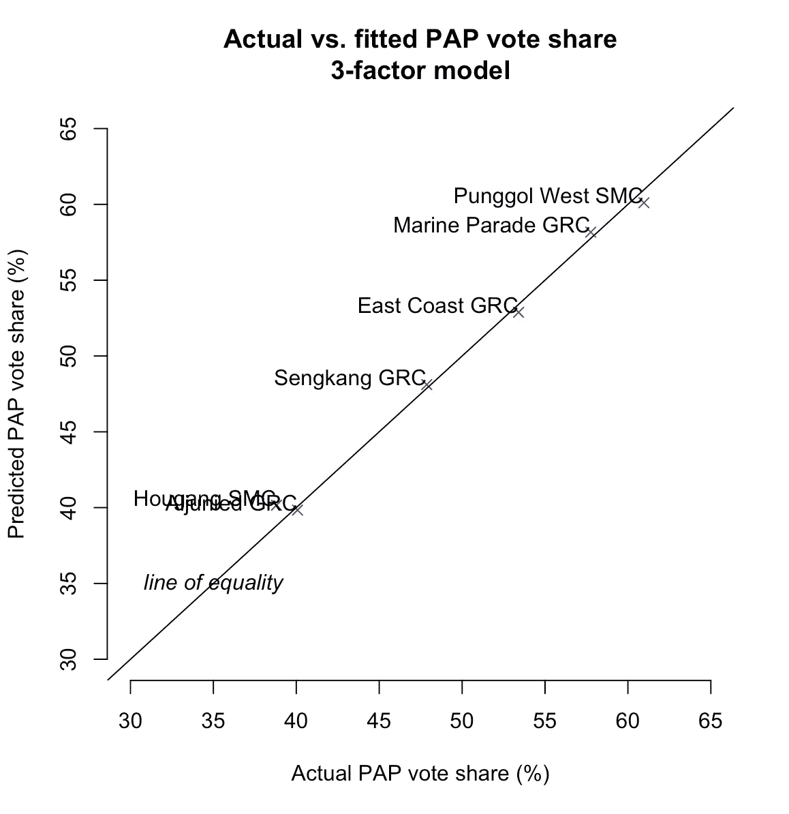

# 在桑港，年轻选民并不过剩

> 原文：<https://towardsdatascience.com/there-is-no-surplus-of-younger-voters-in-sengkang-8c3056b236a7?source=collection_archive---------45----------------------->

## 获胜的工人党团队缺乏特殊的人口优势——这对他们来说是个好兆头

许多[最近](https://www.facebook.com/kbinderjit/posts/3642108662482507) [关于 2020 年新加坡大选结果的评论](https://www.academia.sg/academic-views/ge2020-challenge-of-a-generation/)都集中在新加坡国会选区的结果上，由相对年轻的候选人组成的反对党工人党(WP)团队出人意料地获得了一个新的 4 人团体代表选区(GRC ),这被预示为与有争议的选区有[有益的人口结构匹配](https://www.todayonline.com/singapore/ge2020-sengkang-residents-give-reasons-why-they-plumped-wp-including-better-connection-candidates)。该团队年龄最大的候选人 Jamus Lim(44 岁)和最年轻的 Raeesah Khan(26 岁)在某种程度上代表了更大的竞选轨迹本身，jam us 在竞选开始时的电视辩论中真诚的理想主义赢得了广泛的赞誉，而 Raeesah 在竞选结束时的社交媒体帖子中关于种族和宗教偏见的指控可能适得其反，反而暴露了更大的系统性歧视问题。 [言论管制的不公平](https://sudhirtv.com/2020/06/24/truth-or-dare-a-video-about-online-falsehoods-and-singapores-pofma-law/)和其他[权力失衡](https://www.straitstimes.com/politics/envision-a-spore-that-embraces-other-views)在新加坡政治中，这些问题被认为对年轻选民有着特殊的共鸣。 但是，事实上，年轻的选民在全国范围内从执政的人民行动党(PAP)中脱颖而出，并在选举结果中证明了对 Sengkang 的决定性作用，因为他们在那个选区应该占主导地位？

## 将选区映射到人口统计数据

确定新加坡选区的人口构成有点棘手，因为选区的界限会随着每次选举而变化，政府机构公布的数据也不符合这些选区。但是，可以执行粗略的映射。统计部门每年公布新加坡常住人口的人口统计数据，这些数据被划分为由新加坡城市规划机构——新加坡城市再发展局(URA)划定的所谓的**规划区**。每个规划区可以进一步细分为**子区**。使用地理空间软件，当选举边界与这些分区的边界重叠时(两者都是[公开](https://data.gov.sg/dataset/electoral-boundary_2020) [可用](https://data.gov.sg/dataset/master-plan-2019-subzone-boundary-no-sea)，人们发现选举分区大体上可以被表征为分区的**集合。在下面的例子中，我们可以看到，僧康镇 GRC 实际上由 Anchorvale、Compassvale、Rivervale 和僧康镇中心的规划分区组成。**

由 Sengkang GRC 界定的分区(黄色)。红色代表选区边界，灰色代表分区边界

这种映射绝不是精确的——人们发现分区边界经常渗透到其他选区。然而，这些不一致很少是致命的。我们可以使用一个简单的经验法则——如果分区的至少大部分可以在选举区内划定，并且分区的划定区域居住有住宅物业(如 [URA 总体规划](https://data.gov.sg/dataset/master-plan-2014-land-use)覆盖图所确定的),则分区被包括在内。因此，Compassvale 分区包含在 Sengkang GRC 内，尽管其部分区域延伸至邻近的 Ang Mo Kio 选区，因为这些区域不包含住宅物业。

由 Sengkang GRC 界定的分区(黄色)。蓝色多边形表示 Plan 2014 年土地利用总体规划划定的居住区

*(为了透明和可再现性，我已经* [*发布了我的映射*](https://docs.google.com/spreadsheets/d/1DAjR03QWOiC4OICoOUnuo978nsMn_fZT0XW0eRo6obw/edit?usp=sharing) *，如果有任何争议，您可以在评论中联系我。)*

由于统计局按分区公布人口数据，一旦绘制地图(一个相当繁琐的手工过程)完成，通过汇总过程确定每个选区的人口构成就变得相当简单(只要有所需的人口特征)。这样，我们就可以计算出一个选区中属于每个主要年龄组的居民的比例。我使用了以下简单的三方约定:

*   **年轻选民:**20 *至 35 岁(含)的常住人口
*   **老年选民:**65 岁及以上常住人口
*   **中年选民:**35 岁至 65 岁的常住人口

## 年轻居民，而不是年轻选民

根据 2018 年公布的统计数据[，我们发现，作为该选区总常住人口的一部分，**与 WP 竞争的其他选区相比，甚至在全国范围内**:](https://data.gov.sg/dataset/singapore-residents-by-subzone-and-type-of-dwelling-2011-2019)

WP 竞选选区中 20-35 岁居民的比例

20 岁至 35 岁的居民占参康选区的 21.1%，与 WP 竞争的其他选区相似，与全国 20.7%的比例没有太大差别。有人可能会说，我对年轻选民的定义是限制性的，我们还应该包括 35-40 岁，甚至 40-45 岁的年龄段:

WP 竞选选区中 20-45 岁居民的比例

我们在这里开始看到一些分离，与全国 35.9%的年龄在 20 到 45 岁之间的居民相比，在僧康有 39.7%的居民。但是，所有这些选民真的够“年轻”吗？更确切地说，桑岗作为一个年轻城镇的普通形象最明显的表现是，它还没有达到投票年龄的年轻居民的比例高于平均水平

WP 竞选选区中 20 岁以下居民的比例

与全国 20.5% 的 20 岁以下人口相比，在圣康集居地，20 岁以下人口仅占四分之一多一点( **25.3%** )。此外，僧康的老年居民比例较低:

65 岁及以上居民在 WP 竞选选区的比例

与全国 13.7%的比例**相比，僧康镇只有 8.7%的 65 岁及以上居民。**

## **别忘了丰戈尔西**

**显而易见的是，在僧康选区并不存在年轻选民过剩的情况，相反，有年幼子女的家庭过剩。基于这些数据，如果没有庞大而负债的老年人选票作为选举缓冲，重新描述由*这一特殊人口群体推动的僧康起义可能会很有吸引力。人们甚至可以讲一个半可信的故事，讲述沉浸在社交媒体方式中并投资于进步事业的在校青年如何以某种方式影响他们的父母投票给工人党！但这是为了逃避一个不方便的数据点，即**丰郭尔西 SMC** 是 WP (61.0%的人民行动党)争夺的唯一*表现最好的*人民行动党选区，20 岁以下居民的比例甚至更高(30.3%比全国 20.5%)，老年居民的比例更低(6.2%比全国 13.7%)。不可能出现这样的情况，在与竞争的反对党选择相同的 WP 的情况下，有年幼孩子的父母的人口统计*和这个人口统计*在一个选区决定性地转向反对执政党，而在另一个选区团结向他们。***

## **愚蠢的模特**

**事实上，一个简单的关于人民行动党在 WP 竞争选区的投票份额的广义线性模型显示，20 岁以下的年轻居民比例较高的影响实际上是非常积极的:**

****

**WP 竞选选区 PAP 选票份额的广义线性模型。“挑战者”表示人民行动党是否是选区中的挑战者(相对于现任者)。为了获得变量效应的比值比，取估计值的指数，例如 PAP 成为挑战者的效应是 exp(-0.299) = 0.74 或比值减少 26%。**

**在这里，选区中 20 岁以下的**居民的比例每超过全国比例**1 个百分点**就会导致 **22%的比例增加**(估计优势比为 1.22)，使得人民行动党赢得该选区的几率从大约 50-50 增加到 54-46。有趣的是，选区中 65 岁及以上的居民比例*****每比全国比例****增加 1 个百分点**就会导致优势增加 22%**(估计优势比为 1.22)——相反，这意味着低于平均水平的老年居民比例会降低优势。因此，在丰国西部和胜康之间，一个简单的人口统计模型显示了选区中高于平均水平的年轻居民比例和低于平均水平的老年居民比例之间的拉锯战，丰国西部年轻居民比例高得多，大大抵消了老年居民比例低的优势，为人民行动党提供了健康的获胜优势。该模型预测的人民行动党投票份额实际上非常接近实际结果:***********

**********

*****WP 竞争选区的实际与拟合 PAP 投票份额，使用 PAP 挑战者地位、20 岁以下居民人口比例和 65 岁及以上居民人口比例的 3 因素模型*****

## *****奥卡姆剃刀*****

*****我真的相信，正如这个模型所暗示的那样，有年幼子女的家庭在 WP 争夺的选区里不顾传统智慧，向人民行动党靠拢？一点也不。首先，该模型只适合 6 个数据点(6 个 WP 竞争选区)，容易过度拟合。这次演习的目的是证明，确定一个特定的人口优势来解释 WP 在 Sengkang 的胜利是具有挑战性的，因为人们必须考虑到相邻的 Punggol West 的人口过剩的相反趋势。这一结论已经在关于执政党对选举结果进行更深入分析的公开声明中得到暗示。*****

*****相反，更简洁的解释是国家层面的战略投票。所有的人口群体，不仅仅是年轻选民或年轻家庭的选民，都果断地离开了 T2 的执政党，但仅仅是在桑港。无论选举中出现了什么突出的问题——对议会中声音多样性的渴望，对高压政治策略的拒绝，甚至是 Jamus Lim 的个人声望——僧康的居民集体承担起了国家责任，并确保这些观点得到代表，但在丰郭尔西和其他地方，类似的选民做出了不同的决定。*****

*****这对工人党和新加坡来说是个好兆头。基于年龄的政治两极分化的建议，年轻选民无可挽回地远离执政党，而老年人仍然是人民行动党的坚实的压舱石，可能还为时过早。相反，即使是同一个反对党参与竞选，同样的人口也会根据选区的不同而投出不同的票。来自桑港工人党的新议员不应该把自己视为派系人口利益的承担者，而应该把自己视为集体民族意愿的承担者——一种寻求替代但可信的政治代表、对执政党的制衡以及拒绝政府中的专制冲动的意愿。新加坡的选民，不仅仅是胜港的选民，而是全体选民，都发出了自己的声音。*****

*******虽然新加坡法定投票年龄为 21 岁，但为了简化计算，年轻选民的定义包括 20 岁的居民。******