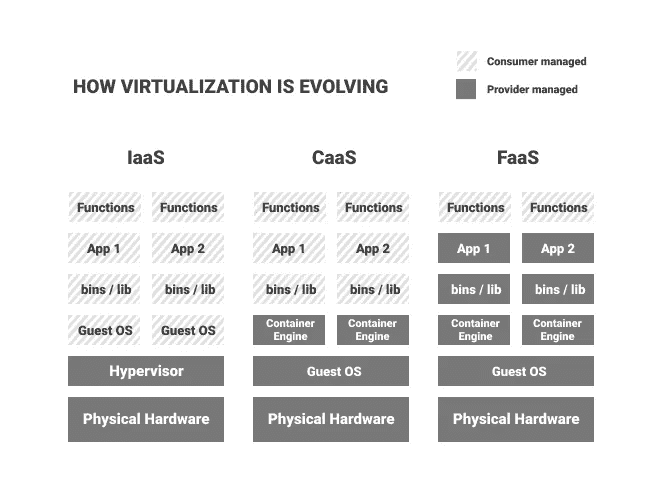

# 容器和无服务器计算之间正在进行一场战争

> 原文：<https://towardsdatascience.com/theres-an-ongoing-war-between-containers-and-serverless-computing-f2ba5379ae26?source=collection_archive---------37----------------------->

## 但是最好的选择可能是同时使用两者

归根结底，容器和无服务器技术都是在服务器上运行的。但是用户体验却大不相同。克里斯蒂娜@ wocintechchat.com 在 [Unsplash](https://unsplash.com/s/photos/server?utm_source=unsplash&utm_medium=referral&utm_content=creditCopyText) 上的照片

  W 开发人员的工作是什么？当然是写软件。但情况并非总是如此。

过去，每个应用程序都有自己的服务器。由于每台服务器的资源有限，开发人员不得不经常考虑不要让服务器的容量超载。如果一个应用程序需要在不同的服务器上运行，整个过程都必须重新设置。

企业很快意识到这相当低效:一方面，开发人员不高兴，因为他们不得不担心代码以外的其他事情。另一方面，每当一个应用程序没有占用 100%的服务器容量时，就会有大量计算资源闲置。

快进到今天:你上一次担心服务器架构是什么时候？可能有一段时间了。

这并不意味着我们摆脱了所有关于内存、RAM、存储等等的考虑。尽管开发人员越来越多地摆脱了这些问题，但这个过程还远远没有结束。

到目前为止，我们还没有走到虚拟化之路的尽头，再也不用担心服务器了。目前还不清楚哪种技术将会胜出。会是虚拟机吗？集装箱？还是无服务器计算？这是一个正在进行的辩论，也是一个值得详细研究的问题。

 [## 无服务器是 Kubernetes 的末日吗？

### 对两种技术进行比较，以结束孰优孰劣的争论。

towardsdatascience.com](/kubernetes-serverless-differences-84699f370609) 

# 虚拟机的出现

进入 20 世纪 60 年代，那时虚拟机(VM)第一次被发明出来。人们不再一次为一个应用程序使用裸机服务器，而是开始考虑在一台服务器上运行多个操作系统(OS)。这将允许多个应用程序分别运行，每个应用程序都有自己的操作系统。

在 IBM 和其他公司，他们实现了[仅仅是](https://www.ibm.com/cloud/learn/virtual-machines):他们模拟物理服务器，也就是说，他们对它进行虚拟表示。所谓的虚拟机管理程序负责为虚拟机分配计算资源，并确保虚拟机不会相互干扰。

这样不仅可以更有效地利用一台服务器的计算资源。您还可以在许多不同的服务器上运行应用程序，而不必每次都重新配置它。如果服务器没有安装正确操作系统的虚拟机，您可以克隆另一个虚拟机。

除此之外，虚拟机可以使服务器更加安全，因为您可以扫描它们以查找恶意软件。如果你发现了一些，你可以在一个更早的版本中恢复虚拟机，这基本上消除了恶意软件。

考虑到这些优势，虚拟机主宰这个领域也就不足为奇了，裸机应用程序非常罕见。Linux 和 Ubuntu 是许多虚拟机中常见的客户。Java 和 Python 运行在精简版的虚拟机上，这使得开发人员可以在任何机器上执行他们的代码。

如果没有虚拟机，Python 和 Java 将无法在任何地方部署。在 [Unsplash](https://unsplash.com/s/photos/server?utm_source=unsplash&utm_medium=referral&utm_content=creditCopyText) 上[科普高清](https://unsplash.com/@scienceinhd?utm_source=unsplash&utm_medium=referral&utm_content=creditCopyText)照片

# 战场 1:虚拟机对容器

虚拟机模拟它所运行的硬件。相比之下，[容器](https://www.ibm.com/cloud/learn/virtual-machines)只是模拟一个操作系统，通常是 Linux。这就是为什么它不包含运行它的硬件的虚拟副本。

像虚拟机一样，容器离不开操作系统、应用程序及其库和依赖项。但是放弃硬件仿真的结果是容器更加轻量级、快速和可移植。这就是为什么容器只需要几秒钟就能启动，而虚拟机通常需要几分钟。

另一方面，容器并不总是像虚拟机一样安全。如果恶意软件进入容器化的系统并进入操作系统，它就有可能劫持整台机器。

相比之下，虚拟机将不同的操作系统彼此分开。因此，即使恶意软件侵入了某个虚拟机的操作系统，该虚拟机上的所有其他虚拟机也不会受到攻击。这增加了额外的安全级别，例如在处理机密数据时，这可能是至关重要的。

与容器相比，虚拟机的另一个优势是可以使用不同的操作系统。当然，这需要做更多的工作，因为您可能需要在每个操作系统上分别实现错误修复。但是如果你有一个应用程序应该运行在除了 Linux 之外的任何系统上，容器就不是一个好的选择。

另一方面，容器非常适合任何具有微服务架构的东西，也就是说，单个应用程序由许多较小的服务组成，这些服务只是松散耦合的，可以独立执行。每个单独的服务都可以放在自己的容器中。然后，开发人员需要注意的唯一事情是容器之间的正确通信。

 [## 使用 Docker-Compose 将您的整个数据科学环境(或任何您想要的东西)容器化

### 用一个简单的文件和几个命令行从多个交互的容器中构建应用程序。

towardsdatascience.com](/containerize-your-whole-data-science-environment-or-anything-you-want-with-docker-compose-e962b8ce8ce5) 

# 战场 2: Docker 对 Kubernetes

有一种技术与集装箱引擎同义:[码头工人](https://www.docker.com)。但是在同一个句子中还有另一项经常被提及的技术: [Kubernetes](https://kubernetes.io) 。那么到底发生了什么 Docker 和 Kubernetes 是朋友还是敌人？

正如微软所说，比较 Docker 和 Kubernetes 有点像比较苹果和苹果派。Docker 是一种容器和开源技术的文件格式，可以在任何地方运行应用程序。Kubernetes 协调和调度许多容器，并确保它们相互之间正常通信。

Docker 有自己的容器编排服务 Docker Swarm。然而，赢家很明显:Kubernetes 比 Docker Swarm 更广泛。Kubernetes 可以在整个机器集群上运行，而 Docker Swarm 只能在单个节点上运行。

因此，除非您在单个节点上部署容器，或者不需要 Kubernetes 带来的复杂性，否则没有必要再考虑 Docker Swarm。如果你认为容器编排，想想 Kubernetes。

除了管理容器之外，Kubernetes 还允许您编排一个虚拟机集群(是的，虚拟机),并根据可用的计算资源和每个容器的要求，安排容器在选定的虚拟机上运行。

你没听错:VMs、Docker 和 Kubernetes 在一个工作流中。到目前为止，这听起来不像是一场战斗，更像是一部交响乐。但是等等，因为还有一个要来。

关于虚拟机、容器和无服务器的争论远未结束。克里斯蒂娜@ wocintechchat.com 在 [Unsplash](https://unsplash.com/?utm_source=unsplash&utm_medium=referral&utm_content=creditCopyText) 上的照片

# 战场 3:容器对无服务器

如果虚拟机将物理硬件从开发人员手中拿走，而容器消除了对操作系统的任何担忧(我说的是 Docker plus(可选的 Kubernetes)这样的容器)，那么无服务器将使这一旅程又向前迈进了一步。

您可以在下图中看到这一点:使用无服务器，开发人员甚至不必担心他们的应用程序何时以及如何执行，他们应该将它放在哪个容器中，或者它将消耗多少计算资源。当然，他们仍然需要编写应用程序，但在他们上传到 AWS Lambda、Aurora 或 CloudFront 服务后，他们就可以收工了。

他们的代码将会休眠，直到被执行。您只需为您真正使用的机器时间付费，这使得整个事情非常经济。相比之下，您需要为 Docker 支付月费，为 Kubernetes 支付每个集群每小时的费用，不管您使用了多少。

然而，这并不意味着无服务器为王。这是一项相当新的技术，目前无论你去哪里都有限制。

例如，目前很难在无服务器上完成 [A/B 测试](https://medium.com/buildit/a-b-testing-on-aws-cloudfront-with-lambda-edge-a22dd82e9d12)，或者让其他复杂的部署选项工作。另外，无服务器需要一些时间来初始化代码。所以如果你需要你的应用程序非常快，你应该使用容器。

此外，无服务器还带有计算资源方面的限制。所以如果你有一个占用大量内存或者运行很长时间的任务，你最好使用容器。

虚拟化是如何发展的。IaaS，“基础设施即服务”，是虚拟机的一个时髦词汇。CaaS 代表“容器即服务”，FaaS 代表“功能即服务”，也就是无服务器计算。图片由作者提供，参考 [DigitalCloud](https://digitalcloud.training/cloud-computing-basics-serverless/) 。

# 未来会怎样

所有这些对无服务器的限制都不是天生的，所以我们可以期待无服务器在未来几年赢得更多容器市场。它也越来越受欢迎，因为它比容器编排对初学者更友好，非常容易扩展，并且在工作负载方面非常灵活和经济。

因此，无怪乎无服务器架构市场预计将在未来几年内增长两倍，到 2025 年总收入将超过 210 亿美元。但这并不意味着虚拟机和容器会消亡。

在十年左右的时间里，我们不太可能看到无服务器技术。看看虚拟机就知道了，它已经存在了半个世纪，现在仍在大量使用。相反，我们很可能会看到更多的容器与无服务器的共生，就像容器和虚拟机一起工作一样。像 [AWS Fargate](https://blog.thundra.io/the-best-of-both-worlds-with-aws-fargate) 这样的服务已经可以让你将容器和无服务器无缝地结合起来。

所有这些解决方案——虚拟机、容器和无服务器——都是好的解决方案，都有其特定的优势和劣势。尽管它们有时会在重叠的空间上竞争，但好消息是你可以混合搭配它们来满足你的需求。

大型科技公司的虚拟化之旅还远未结束。除了提高开发者效率，我们甚至不知道目的地会是什么样子。但是所有的迹象都表明，这是一条有趣、迷人且相当有利可图的未来之路。

据我们所知，无服务器可能不是最后一步。谁知道，真的，将来我们会玩什么技术？