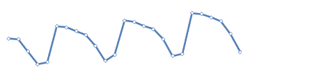
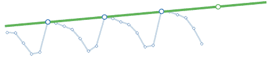
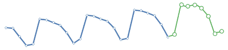

# 商业没有水晶球

> 原文：<https://towardsdatascience.com/theres-no-crystal-ball-for-business-f0b93df92ab9?source=collection_archive---------57----------------------->

## 新的思维模式是预测未来的关键吗？

*照片由* [*标注 Boss*](https://unsplash.com/@vork?utm_source=unsplash&utm_medium=referral&utm_content=creditCopyText) *上* [*下*](https://unsplash.com/s/photos/predict-future?utm_source=unsplash&utm_medium=referral&utm_content=creditCopyText)

预测未来很难。我很确定这一点，因为我从来没有赢过强力球，你也没有。

尽管如此，作为商业领袖，我们需要了解市场和我们的客户是如何变化的，以便做出有效的决策。获得市场和行为洞察最常见的方法是通过数据，但大多数人使用历史数据的简单模型来预测未来的行为。无论我们是处于“典型的”市场时期，还是像现在这样剧烈动荡的时期，这都是不够的。你需要创造性地思考你的数据和你的预测来选择智能模型，以便你的预测尽可能有用。

有许多技术和工具可以用来为你的业务创建有用的预测，我将介绍一些常见预测的例子，以及如何实现它们。具体来说，我们将涵盖:

1.  当数据非常嘈杂时，如何预测收入等指标
2.  如何预测客户行为，如流失

# 预测收入

*照片由*[*Robynne Hu*](https://unsplash.com/@robynnexy?utm_source=unsplash&utm_medium=referral&utm_content=creditCopyText)*[*拍下*](https://unsplash.com/s/photos/future?utm_source=unsplash&utm_medium=referral&utm_content=creditCopyText)*

*让我先提出一个警告。 [*预测未来*](https://hbr.org/2018/11/predicting-the-future)*【1】不是一门精确的科学。它永远不会百分之百准确。即便如此，预测提供了有价值的指导，并且随着你使用它的时间越长，它还会继续改进。应用更好的建模方法可以极大地改善任何业务的总体结果。**

**预测建模很困难，因为**真实世界数据**很复杂。例如，给定一个每日收入数据(其中每个点是一天)，尝试预测下一周每天的收入(参见图 1)。**

****

***图一。嘈杂的收入数据***

**像大多数真实世界的数据一样，这些数据中隐藏着模式和趋势，这使得外推变得困难。**

**像线性回归这样的基本技术可以绘制出一个总体趋势线，但不能预测下周的每一天。我们可以使用像双指数平滑这样的高级技术，但是它们很难实现。**

**幸运的是，有一种更简单的方法来模拟我们对下周的预测。**

****重复周期**意味着我们可以独立地关注一周中的每一天，而不是试图从整体上理解数据。例如，仅使用星期一向我们展示了星期一的趋势和模式实际上是一条直线(参见图 2)。**

****

***图二。仅周一的独立线性外推***

**通过为一周中的每一天创建单独的趋势线，我们可以以相当高的准确度为下周的每一天构建一个收入模型(参见图 3)。**

****

***图三。由一周中每一天的单独预测组成的完全构建的预测***

**如果你像大多数企业一样，你不需要每天预测收入。那很好。该模型处理遵循共同周期的周、月或季度数据。**

**但是，你可能有一个非典型周期的业务或季节性业务，如旅游业。那也很好。如果你的业务数据没有明确的周期或趋势，你可以使用**趋势线**或更高级的建模技术**退回到**一般预测**。****

# ****预测销售额****

**了解销售渠道是企业面临的最常见挑战之一。为了预测收入，了解销售漏斗非常重要。但是，我们如何预测通过漏斗顶部进入的销售线索量呢？实现这一点的一种方法是实施销售线索评分。**

****销售线索评分**是对销售线索进行排序的过程，从“最热”到“最冷”这使您可以将资源分配给“热门”销售线索，同时在销售漏斗中移动较冷门的销售线索时，保持与它们的不同接触程度。**

**使用销售线索评分来预测未来收入始于数据收集。相关数据可以包括关于潜在公司或个人的人口统计信息、对购买数据的洞察和行为指标。**

**例如，有用的公司级人口统计数据可能包括公司的行业或规模。个人人口统计信息可以是一个人在公司的职位和角色、他们的预算或权力级别。行为指标可以包括一个人打开你的电子邮件或参加网上研讨会的次数。**

**使用这些数据，您可以为每个销售线索分配点数。你甚至可以给“冷淡”的行为减分，比如退订邮件列表。**

**虽然传统的**评分机制**很有帮助，但它并不能预测销售线索是否会转化。然而，有一些**机器学习**技术可以帮助你。更基本的方法之一是所谓的逻辑回归。逻辑回归类似于线性回归，只是您试图预测的变量是一个二元结果，在这种情况下，客户是否会转换，而不是一个连续值。**

**无论是哪种技术，它们都将依赖于**高质量的历史数据**，这些数据用于训练你的预测模型——越多越好！当您对销售线索进行评分并处理结果时，您会希望不断地重新评估您正在收集的数据的属性，以及您如何对您的评分进行加权，以查看您是否能够更好地预测未来的结果。**

**所以，如果我们不想失去客户，我们应该让他们都高兴，对不对？**

**当然，但是这比听起来要难。没有一种产品能让所有人都同样开心，而且总有新的竞争对手伺机而动，试图抢走我们的客户。如果有办法知道哪些顾客最危险，那就太好了，这样我们就可以专注于让他们更开心。**

**幸运的是有，它被称为流失预测。**

**流失预测的工作方式很像销售线索评分，但它不是估计销售线索转化为客户的可能性，而是估计客户流失的可能性。同样的公司/个人人口统计数据(*例如*，公司规模)在这里也是合适的。然而,**行为数据**需要更新，以包含关于客户如何参与您的产品的信息。**

**● **产品使用:**客户登录了多少次？他们与你的产品互动的节奏是怎样的？客户中有多少用户在使用你的产品？客户是否改变了他们的服务级别(升级或降级)？你与客户的关系持续多久？**

**● **支持:**客户提交了多少张支持票？每张罚单的严重程度如何？门票的基调是什么？罚单解决得有多快？**

**● **社交:**客户在社交媒体上提到过你吗？客户是否向您推荐过其他公司？你被允许在你的网站上使用客户的标志吗？客户是否愿意为您提供案例研究进行宣传？**

**有了所有这些定义的属性和收集的数据，你就能够对你的所有客户进行评分，并很好地判断哪些客户可能会留下来，哪些会流失。**

**正如预测中的一切一样，没有水晶球会完美地告诉你未来会发生什么。目标是找到你的企业最可靠的领先指标，让你有足够的时间调整你的战略计划，以免为时过晚。**

**[1] A. Wieckowski，[预测未来](https://hbr.org/2018/11/predicting-the-future) (2018)，哈佛商业评论**