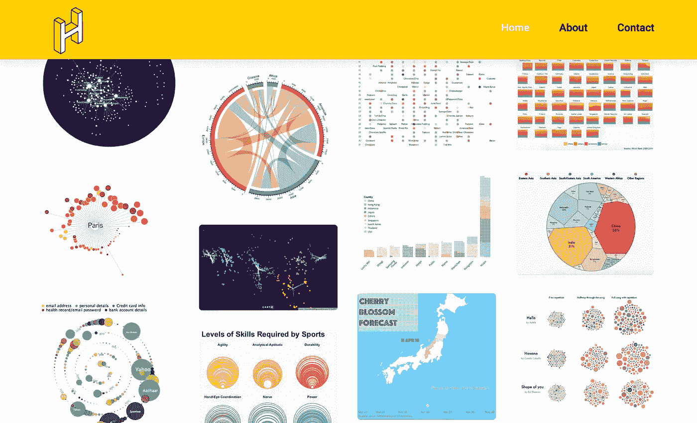
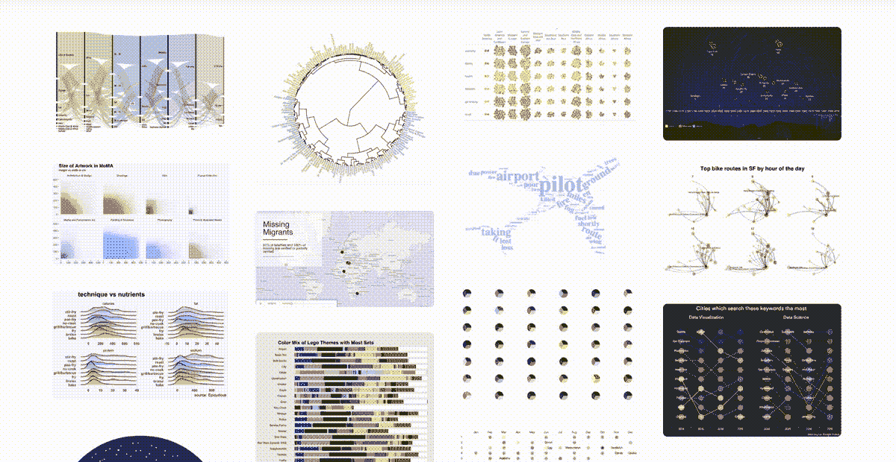
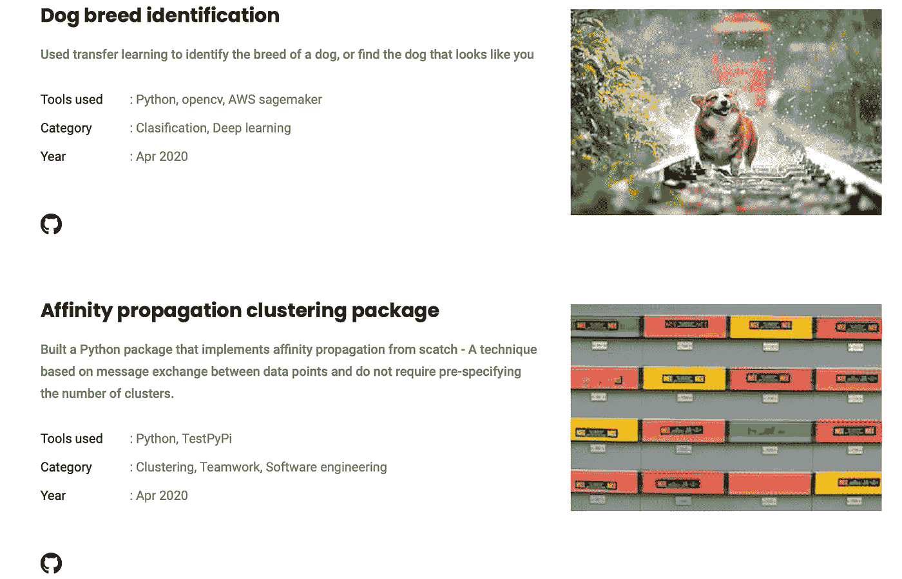
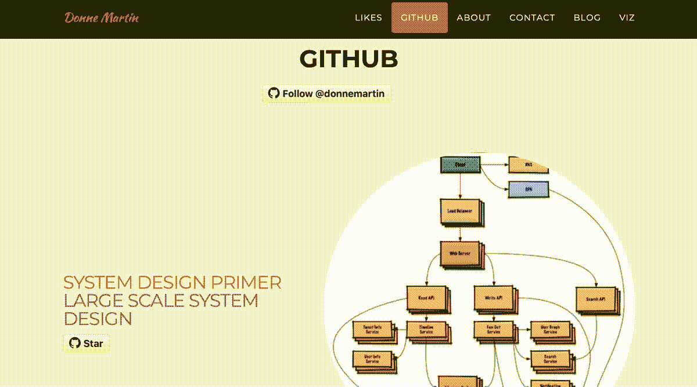
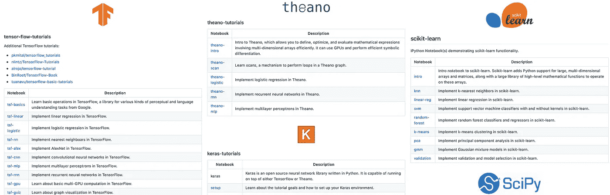
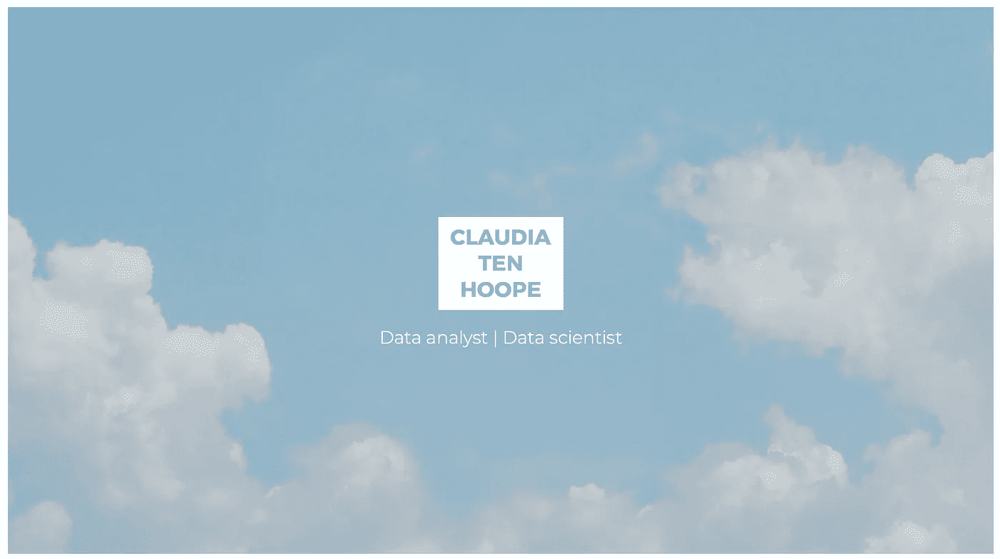
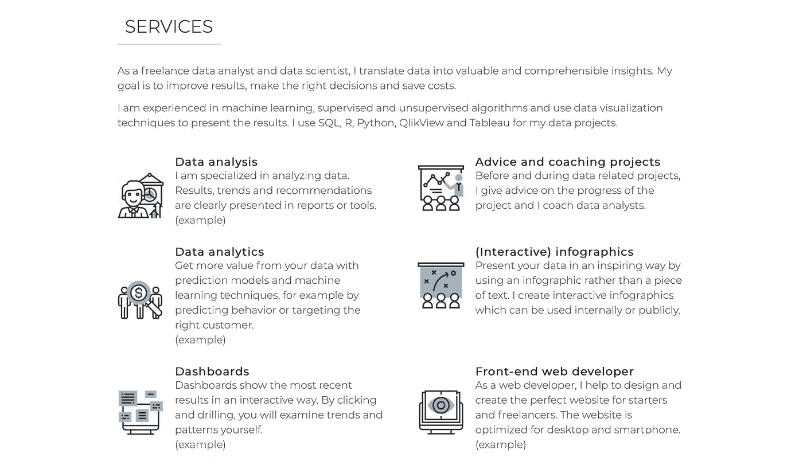
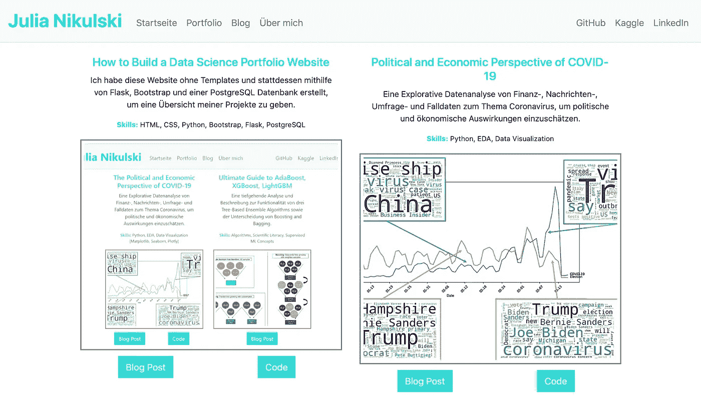

# 这些数据科学产品组合将让您惊叹不已并深受启发(2020 年中期版)

> 原文：<https://towardsdatascience.com/these-data-science-portfolios-will-awe-and-inspire-you-mid-2020-edition-728e1021f60?source=collection_archive---------1----------------------->

## 使用这些来改进您自己的数据科学产品组合，学习新技能或发现新的有趣项目。

查尔斯·德鲁维奥在 [Unsplash](https://unsplash.com/?utm_source=unsplash&utm_medium=referral&utm_content=creditCopyText) 上拍摄的照片

## 为什么是投资组合？

数据科学是一个艰难的领域。它结合了数学和统计学，计算机科学和黑魔法。截至 2020 年年中，这也是一个蓬勃发展的领域，每一个招聘广告都有无数的申请者蜂拥而至。此外，正如我提到的——*现在是 2020 年年中*，肆虐的疫情把一切都拖得更低了。

建立一份课程完成证书的清单也不会让你走得很远，除非你有一些真正的学术证书(硕士/博士)。像 m 课程和 d 课程这样的 MOOC 证书很不错，但是我还没有听到太多这样的例子。le 也不再是过去的样子了。它的自由竞争已经成为无用的过度拟合模型的墓地，真正的竞争由难以与之竞争的团队主导，无论如何对个人投资组合的用途有限。

那么，如何在网上建立个人档案呢？我个人的想法是，就像一个著名的乐队曾经说过的那样，你可以走自己的路。

不要试图去做别人做过的事情，做你感兴趣的项目，而是建立一个你工作的文件夹，并把它放在那里让全世界看到你做了什么，以及你能做什么。

由 [Ricardo Gomez Angel](https://unsplash.com/@ripato?utm_source=unsplash&utm_medium=referral&utm_content=creditCopyText) 在 [Unsplash](https://unsplash.com/s/photos/stand-out?utm_source=unsplash&utm_medium=referral&utm_content=creditCopyText) 上拍摄的原始照片

说了这么多，我很感激说起来容易做起来难。没有多少数据科学家也是设计师/前端开发人员，他们并不总是热衷于学习额外的技能，也不一定有时间去学习。

幸运的是，我们不必总是重新发明轮子。不像过去的文件夹是字面上的……*文件夹*满是光滑的纸页，或者简历只会出现在人力资源部的桌子上，许多令人惊讶的文件夹可以在网上找到。这些都是无价的资源，为什么不充分利用呢？

## 学习/灵感

除了将它们作为我们自己投资组合的参考，这些网站也是学习和想法的极其宝贵的资源。

这些作者的许多项目是实用的、有趣的和原创的。在我看来，它们也是很好的补充学习工具。例如，当我考虑在我的工作中或者为我的客户应用这个工具时，看到一个 ML 工具的实际应用提供了学习理论方面的背景。

我已经说得够多了——让我们深入了解这些令人惊叹的作品，看看它们到底是如何有用的。

> 这显然只是众多优秀投资组合中的一些随机选择。如果你同意/不同意我的想法，请在评论中告诉我你最喜欢的**和**！

# 大卫·文丘里

大卫·文丘里肯定会给这些狗打分([http://davidventuri.com/portfolio](http://davidventuri.com/portfolio))

几年前，我在研究数据科学课程时第一次遇到了大卫·文丘里。他写了一篇名为“ [*我辍学去创建我自己的数据科学硕士学位——这是我的课程表*](https://medium.com/@davidventuri/i-dropped-out-of-school-to-create-my-own-data-science-master-s-here-s-my-curriculum-1b400dcee412) ”的博文。

这个帖子来自 2016 年 4 月，它确实经受住了时间的考验，截至 2020 年 8 月，已经在媒体上获得了 8000 多次点击！

从那以后，他做了更多的事情。他为 DataCamp 创建了课程，包括一个 Scala 课程，Tableau 课程的一部分，以及一个使用 MLB(棒球)Statcast 数据的课程。

他甚至创建了一门名为“与卡戴珊上下:使用熊猫的 Python 项目”的课程。谁会想到单词 *Python* 会出现在单词 *Kardashians* 的旁边，而不是指最近的丑闻或对宠物的糟糕选择？

没错。这个人很有才华。

他的[作品集网站](http://davidventuri.com/portfolio)恰当地反映了这种广泛的才华，展示了他作品中内容类型的广度和题材的多样性。

大卫·文丘里的作品集([http://davidventuri.com/portfolio](http://davidventuri.com/portfolio))

文丘里网站上的标题按照终端客户的类型组织其内容。它们的范围很广，从为 DataCamp 或 Udacity 创建的课程、项目和内容，到一系列个人项目，包括 FreeCodeCamp 的文章、体育分析和少量网络应用。

然而，在看了一会儿这个网站之后，给我留下深刻印象的是，它清晰地展示了他能够产生的产出的确切类型。换句话说:

> 文丘里产品组合的每一部分都实现了一个*营销*目的。

MOOCs 很容易——毕竟，他是一位经验丰富的课程制作人。

但接下来的部分包括两个非常不同的视频，以突出他的制作技巧和在摄像机前的舒适感。一个是教学视频，一个是高制作…狗视频(巧妙的营销视频)。

他的个人项目是为了突出用明亮的链接表示的输出媒介。他的输出被分段，链接到“代码”、“演示”或“网站”中的一个。这允许查看者在项目的上下文中立即看到感兴趣的输出。

甚至他的书面作品也被明确归类为“报告”、“文章”或“帖子”，明确承认了预期的受众类型。有人读了这篇文章，很明显会得到一个相关的样本产品，而不是一堆按主题分类的“写作样本”。(这确实让我怀疑他是否对招聘信息进行了搜集或分析，从而得出了这一分类。)

点击这里查看他的作品集。

# 汉娜·韩嫣

汉娜·韩嫣的作品集网站(【https://www.hannahyan.com】T4)

作为一名数据可视化极客，这个网站立即让我充满了喜悦和羡慕。

她主页上展示的大部分项目都是可视化的(我可以补充说，非常精彩)。每个项目都由一个图像表示，鼠标悬停在图像上会显示关于它的更多详细信息，如下面的动画所示。

因此，在访问网站的几秒钟内，读者就有机会看到她制作的一系列可视化效果，以及她在使用从 R、D3.js 或 P5.js 到 Tableau 的各种工具方面的技术实力。

我个人也非常喜欢干净的布局和简单一致的界面。浏览它只是一种享受。

汉娜·韩嫣的视觉化作品集的一些例子([https://www.hannahyan.com](https://www.hannahyan.com))

点击每个项目，读者会看到一篇关于观想的文章。

她还有一个专门的数据科学作品集，放在一个单独的页面上。

韩的几个数据科学项目()——看那只狗！

显然，这种布局旨在传达比可视化页面更多的关于每个数据科学的信息。通过像她所做的那样将项目按类型分开，她能够为读者实现每一页的视觉一致性。这可能也表明，一般来说，读者(潜在客户)只对可视化或数据科学中的一个感兴趣，而不是两个都感兴趣。

点击查看她的作品集[。](https://www.hannahyan.com/index.html)

# 多恩·马丁

在进入下一个投资组合示例之前，坐下来，喝一杯，振作精神。

多恩·马丁的网站(【https://donnemartin.com/】T4)

多恩·马丁自称是脸书的一名软件工程师，但是看了他的网站和 GitHub 页面，我很确信他是一名时间旅行者或者是某种能够延长时间的巫师。稍后我会回到这一点，但现在，看看下面的动画，通过他的主网站滚动。

他的投资组合网站的方法与我们之前看到的完全不同。他采取的方法是让人群的声音(即 GitHub 明星)来说话，好家伙——他们是不是*大声*。

他随便标榜 20k+星的多个*个人*项目！

多恩·马丁的作品集页面([https://donnemartin.com/#portfolio](https://donnemartin.com/#portfolio))

他的 GitHub 页面本身就非常令人印象深刻。既然在讨论数据科学作品集，那就来看看他的[回购](https://github.com/donnemartin/data-science-ipython-notebooks)数据科学笔记本吧。

记得我说过我认为马丁可能是个巫师吗？每当我们回到焚烧女巫和男巫，这个数据科学笔记本回购将是我对马丁的主要证据提交。

我只是不明白他什么时候可能有时间创造所有这些，除非他有能力让时间变慢。这只是一个样本——实际上是一个非常小的样本，是他在这次回购中提供的笔记本。

多恩·马丁的笔记本回购([https://github . com/donne Martin/data-science-ipython-notebooks](https://github.com/donnemartin/data-science-ipython-notebooks))

这是一个密集的列表，但是按照使用的主要库来分组，它作为一个展示做得很好。甚至在打开他的任何一个笔记本或者阅读这些笔记本的摘要之前，这个列表就很容易地展示了他的职业道德、技能广度以及沟通和教学的能力。

你可以轻而易举地花上几天或几周时间浏览马丁的作品集——就我个人而言，我不认为这样做是个坏主意。点击查看[。](https://donnemartin.com/#portfolio)

# 克劳迪娅·滕·胡普

克劳迪娅·滕胡普的网站(【https://www.claudiatenhoope.com】T2

Hoope 的网站干净整洁，易于阅读。我想强调的这个投资组合网站的一个关键区别是，它明确地兼作招聘/咨询页面，有她的每日价格等。

她是一名自由职业者，所以她有必要向潜在客户详细说明她提供的具体服务。她在这里使用的语言也表明，它们是为那些不一定熟悉数据科学的人准备的。

这是一个很好的提醒，让我们思考我们发布的每条信息的目标受众是谁，并相应地调整内容。

克劳迪娅·滕胡普的服务页面(【https://www.claudiatenhoope.com】T4)

看看吧——她的页面是[这里](https://www.claudiatenhoope.com)。

# 朱莉娅·尼库尔斯基

朱莉娅·尼库尔斯基的作品集网站([http://julianikulski.com/portfolio](http://julianikulski.com/portfolio))

这是另一个优秀的作品集网站，这次是由朱莉娅·尼库尔斯基创建的。与其他人一样，她在这里列出了一些很棒的项目，每个项目都有一个英雄形象，并附有简短的描述和关键技能。

我不会写太多关于它的东西——因为主要的布局似乎和其他一些相似，而且我不懂德语！

一个非常有趣(非常元)的亮点是一篇题为“[如何建立一个数据科学组合网站](/how-to-build-a-data-science-portfolio-website-335b0f253822)”的帖子，如果你正在阅读这篇文章，你可能会发现相关内容！

感谢阅读——这只是我在网上找到的一小部分网站。如果你有自己喜欢的，或者对这篇文章有(建设性的)批评，请在评论中或者在推特上告诉我！

另外，如果你喜欢这个，比如说👋/继续关注，或点击此处获取更新。ICYMI:我还写了这篇比较 Plotly Dash 和 Streamlit 的文章:

 [## Plotly Dash 与 Streamlit——哪个是构建数据仪表板 web 应用程序的最佳库？

### 用于共享数据科学/可视化项目的两个顶级 Python 数据仪表板库的比较——

towardsdatascience.com](/plotly-dash-vs-streamlit-which-is-the-best-library-for-building-data-dashboard-web-apps-97d7c98b938c) 

这是关于可视化数据中隐藏的关系，以 NBA 的数据为例:

 [## 如何用 Python 可视化数据中的隐藏关系 NBA 助攻分析

### 使用交互式快照、气泡图和桑基图操纵和可视化数据，使用 Plotly(代码和数据…

towardsdatascience.com](/how-to-visualize-hidden-relationships-in-data-with-python-analysing-nba-assists-e480de59db50)