# 他们都有皇冠

> 原文：<https://towardsdatascience.com/they-all-got-crowns-fbe4c29641c8?source=collection_archive---------25----------------------->

亲教会媒体在 [Unsplash](https://unsplash.com?utm_source=medium&utm_medium=referral) 上拍摄的照片

## 揭露流行天后之间的竞争，并对他们的实力进行探索性的数据分析

如果你和我一样，是那种认真对待流行音乐的人，那么你很可能已经卷入了关于流行女歌手的激烈讨论。更多的时候，关于这个问题的争论最终导致女性之间的对立，并加深了音乐行业根深蒂固的厌女症。

参与这种试图寻找“最佳”流行女歌手的讨论可能不会有结果的原因之一是，就像其他人一样，他们都有自己的优势和劣势。用一个人的力量去比较所有其他人不仅没有抓住重点，而且没有给予他们足够的信任，因为他们经历了所有的事情，为我们这些粉丝带来了如此惊人的作品。

因此，我们不打算集中讨论这个问题。

我们不能否认音乐围绕着我们个人的喜好和经历。因此，你将在下面读到的不仅是对这些艺术家作品的一个证明，也是一个反思的时刻，它是如何引起你如此大的共鸣，以至于你愿意为捍卫它而战。

通过这样做，并真正开放和好奇，我们不仅对我们的音乐品味获得了更详细的知识，而且将这种错误的比较叙事改写为更尊重的比较叙事，同时提高和提升了所有这些令人惊叹的女性。

为了做到这一点，我们从 Spotify 和 Genius 收集了数据，我们将深入研究九位流行天后(碧昂斯、泰勒·斯威夫特、爱莉安娜·格兰德、蕾哈娜、Lady Gaga、麦当娜、玛丽亚·凯莉、布兰妮·斯皮尔斯和凯蒂·佩里)的完整唱片目录，使用十二个变量来分析他们的歌曲(*可跳舞性、歌曲时长、语速、能量、歌词情感、声音情感，等等*)。对此分析，我们只是认为这些艺术家的个人项目。

走吧。

# 玛丽亚·凯莉——轻柔的歌曲，努力的工作

自从 1990 年玛丽亚·凯莉(Mariah Carey)出道以来，MC 不仅拥有最大的歌曲和专辑目录，而且在所有被考虑的艺术家中，她歌曲的制作比例也是最大的。

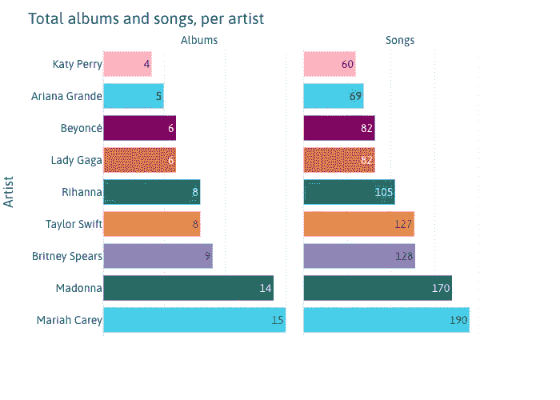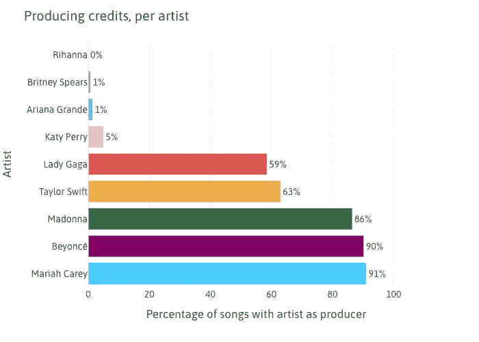

作者提供的图片

看看玛丽亚·凯莉的目录，很明显她一直比她的同龄人更擅长声学探测项目。随着她在*charm branch*的巅峰声学作品，像 *Through The Rain* 这样的歌曲证明没有必要忙于制作来让她的声音闪耀。

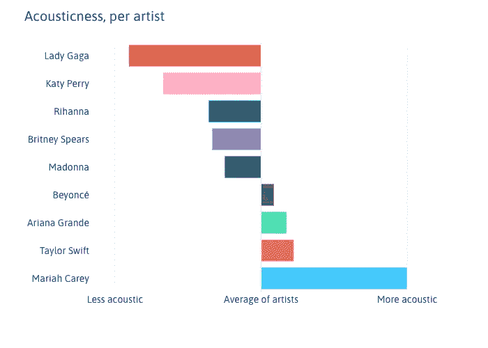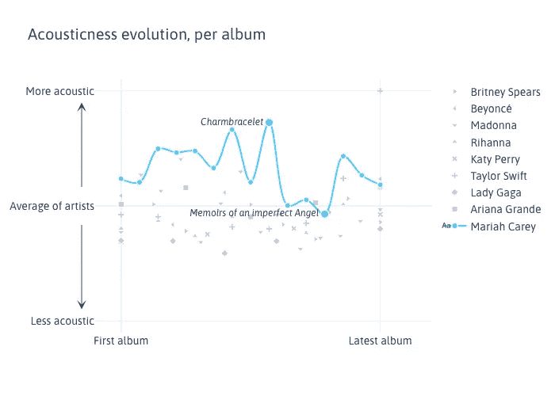

作者提供的图片

另一方面，玛丽亚可以很容易地过渡到更流行的流行音乐和 R&B 潮流，*不完美天使的回忆录*有她最热门的作品之一，*痴迷。*即使有更多的重磅制作，像*我想知道什么是爱*这样的歌曲表明，剥离下来的歌曲仍然非常适合她(即使是封面)。

## TL；英雄博士

在这里，当你感到希望破灭时，我们有 ***Hero* ，**来帮助你，这是一个完美的例子，说明由玛丽亚创作和制作的强大的原声歌曲如何能让人真正找到自己的力量。

# 碧昂斯——多才多艺

很难定义埃永西，正如人们所料，我们对女王 B 的发现也有多面性。

鉴于碧昂斯在当前流行乐坛对说唱、嘻哈和 R&B 的重要性，她在歌曲中使用大量词汇也就不足为奇了，正如我们在下面看到的。

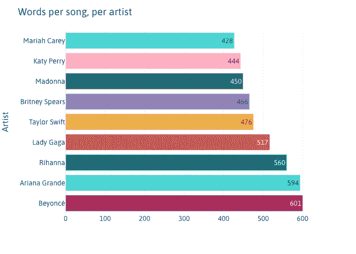

autor 提供的图像

在声学上，我们也可以从一个名为 *speechiness* 的变量中察觉到这一点，speechiness 是一种音乐特征，可以识别一个音轨中存在的口语词。

碧昂斯是迄今为止最健谈的流行女歌手，这一特征在她的专辑《B'day》中达到顶峰，在那里我们可以听到她的说唱技巧的完美例子。

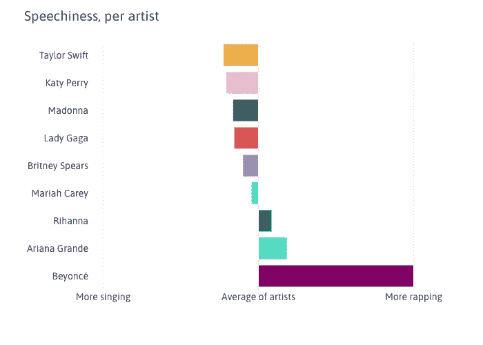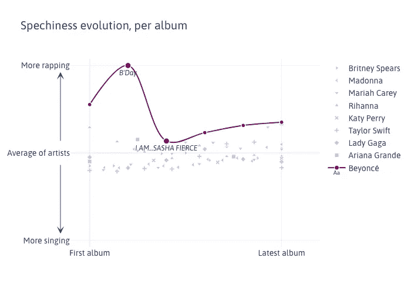

作者提供的图片

下面我们看到一个试图抓住艺术家多面性的尝试。为了做到这一点，我们找到艺术家的平均表现(关于所有变量)，然后检查每首音乐离这个表现有多远。对于一个更加多才多艺的艺术家来说，简单地平均其所有目录并不能做到公平，这种从歌曲到平均值的计算距离往往会更高——碧昂斯就是这种情况。

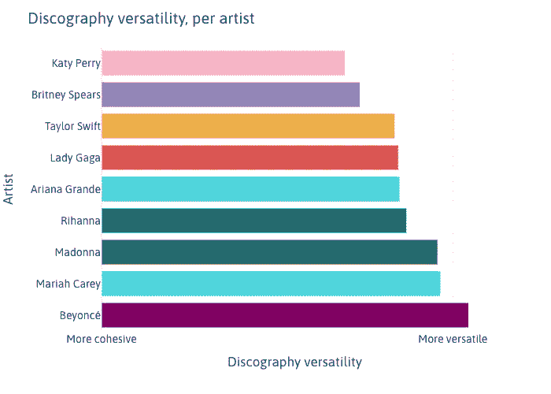

作者图片

作为这种声音和抒情广度的一个例子，我们可以看看，例如*柠檬水*。在里面，我们可以听到从乡村(*爸爸课程*)到摇滚*(不要伤害自己)*的一切，R & B、嘻哈、流行和民谣也混合在一起。

这种多才多艺当然不是一个小壮举，它肯定是一件很难单独实现的事情。证明这一点的是碧昂斯愿意与才华横溢的作家和制片人合作，以帮助实现她的愿景。当考虑到她创作和制作的所有歌曲时，几乎就好像她为每首新歌带来了至少一位新制作人和两位新作者。

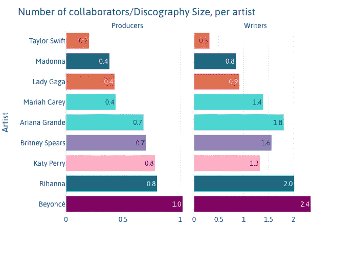

作者图片

最后，但同样重要的是，碧昂斯热爱爱情。她 74%的歌曲都使用这个词。

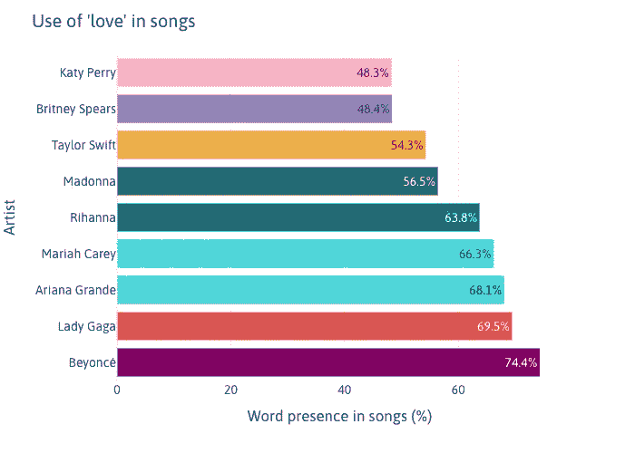

作者图片

## TL；博士-等一下

这首歌是与 15 个人合作创作的，是对真正多才多艺的描绘，因为它源于另一首流行经典歌曲的推文*(Yeah Yeahs 的地图)*、**、*、*、**是她最常用的 5 首歌曲之一，也是与“典型”碧昂斯声音最遥远的 10 首歌曲之一。另外，这是关于爱情的。或者至少，告诉他们他们不像我爱你一样爱你。

# 泰勒·斯威夫特——伟大的悲伤歌词

正如泰勒自己所知道的，正如《美国小姐》中所展示的，她的主要强项是歌词。正如人们所料，能够以如此个人和亲密的方式讲述故事，泰勒是少数几位从她的目录中写下一切的艺术家之一。

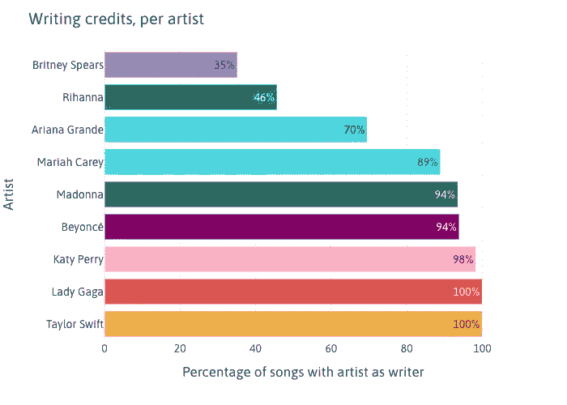

作者图片

除此之外，当你听到她的歌时，很明显这些通常不是快乐的歌。事实上，当我们分析她的歌词(*歌词情绪*)和她的声音(*效价*)上描绘的情感时，很明显泰勒的力量围绕着悲伤的歌词和悲伤的声音。

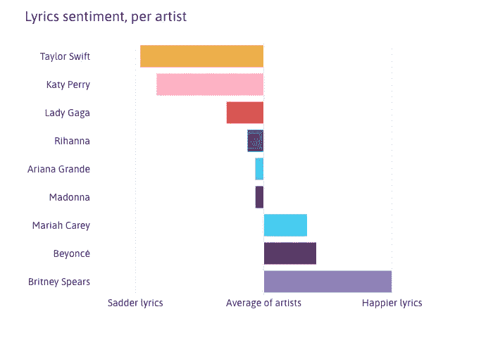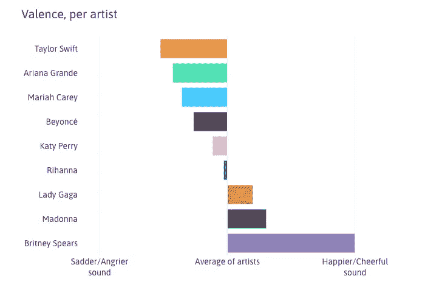

作者图片

下面，当我们分析这种情感之间的关系是如何在她的作品中演变的，我们可能会发现一些惊喜。

虽然这是她最黑暗的声音，但也是她正面歌词的巅峰。通过扮演她最没有歉意的坏婊子角色，像*我做了坏事*看到泰勒对自己变坏感觉良好这样的歌曲，都贯穿着肮脏和沉重的节奏。

她的其他项目通常会反其道而行之。虽然有一个比*名声*更轻的声音，但所有这一切听起来至少比一般的流行天后更悲伤一点。不过，就歌词而言，没有人像斯威夫特小姐那样写悲伤的波普作品。例如，1989 年的《T21》尽管有一部更倾向于流行音乐的作品，但歌词却很悲伤，比如《走出困境》和《你所要做的就是留下来》。值得注意的一件事是，即使是在风格转变的过程中，泰勒也发挥了她的抒情天赋，让它适合她要做的任何事情。

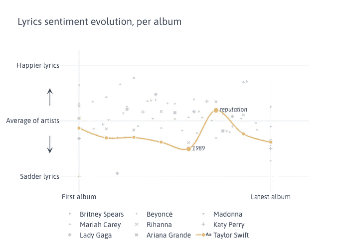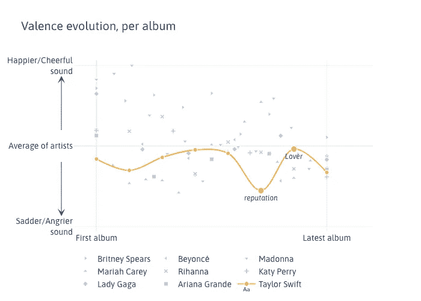

作者图片

## TL；放逐博士(专长。Bon Iver)

尽管泰勒已经给了我们很多启示，但她的写作天赋仍然让我们惊叹。为了证明这一点，我们在这里有*，这是她最新项目*民俗*中的一首歌，它位列泰勒最悲伤歌曲(歌词和声音)的前五名。*

# *蕾哈娜——变坏的好女孩*

*我们不需要数据就能相信蕾哈娜是最差的流行女孩，对吗？看在上帝的份上，她有一整张专辑可以证明这一点。此外，除了成为流行音乐中最露骨的女人之外，人们还能指望一个被铁链和鞭子打倒并兴奋不已的人做什么呢？*

**

*作者图片*

*这可能是流行音乐最有预兆的举动，蕾哈娜从扮演好女孩的三张专辑，成为所有流行天后中歌曲最露骨的专辑*(R 级)*，她随后的项目在露骨方面都保持在平均水平以上。*

*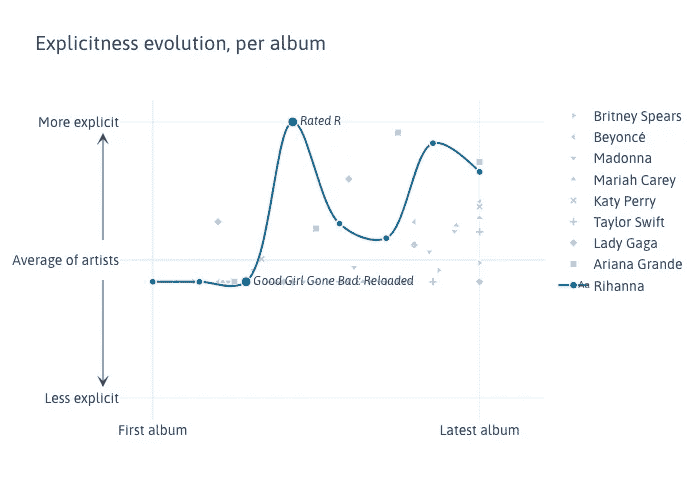*

*作者图片*

*那么，她是 f*单词的冠军就不足为奇了。*

*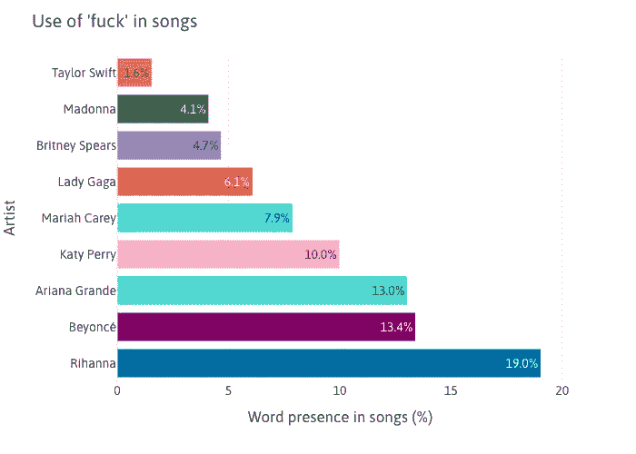*

*作者图片*

## *TL；博士——脑中的爱*

*毫无疑问，蕾哈娜向我们展示了她不害怕弄脏自己。 ***爱在脑中，*** 虽然 ***，*** 是她选择向我们展示她脆弱的一面的场合之一，即使如此，它仍然让我们如此美好。*

# *凯蒂·佩里——糖热潮*

*aty Perry 以她完美的流行歌曲而闻名。凯蒂·佩里(Katy Perry)的歌曲通常会让那些听它的人瞬间陷入闪电战，但最终却让我们感到乏味。她的秘密是什么？显然，节奏——衡量一首歌的节拍有多“快”的指标，用每分钟节拍数(bpm)来衡量。*

***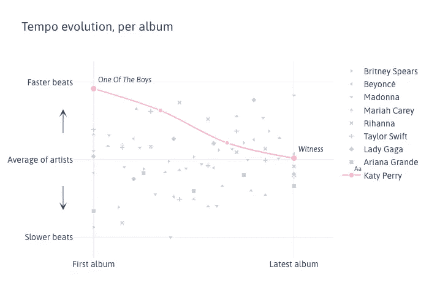*

*作者提供的图片*

*从上面的图表中可以看出，凯蒂·佩里倾向于使用更快的节拍，这种倾向是从她的第一个项目*一个男孩*开始建立的，此后逐渐衰退，在她的最新项目*见证*中达到最低点。*

*尽管节奏有所放缓，但在她的每个项目中都能找到高节奏的歌曲。举几个:*我吻了一个女孩，e . t .*咆哮*与魔鬼共舞。**

*事实证明，凯蒂知道我们都可以用高潮来度过低谷。当我们分析她的歌曲听起来像什么以及它们实际上说什么时，我们发现她是假快乐歌曲的女王:那些有快乐节拍的歌曲，但一旦你真正注意歌词，就会真正融入你的感情。*

*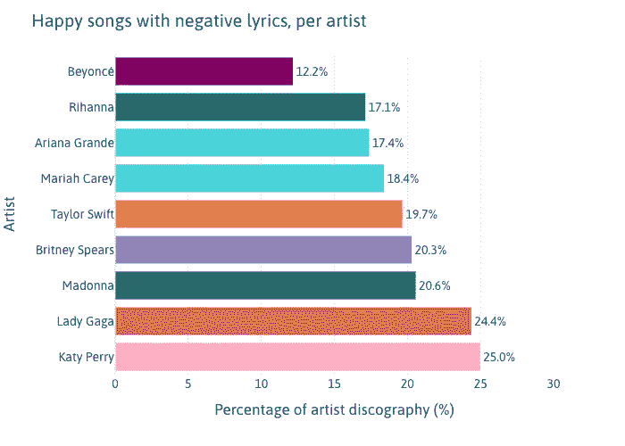*

*作者提供的图片*

*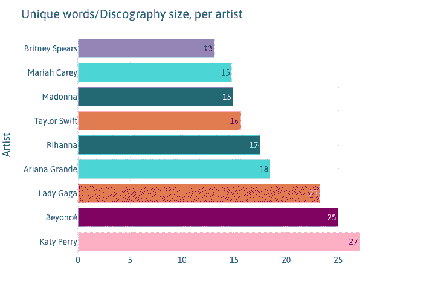*

*作者图片*

*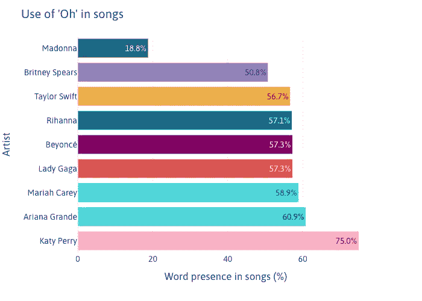*

*作者图片*

*凯蒂也是文字女王。虽然她的歌曲遵循相当传统的流行规则，但她将概念作为歌曲主要思想的吸引力(*孔雀、烟火、幽灵、海啸、钟摆、轮盘*都是这种例子)可能有助于解释为什么她是词汇最多样化的艺术家。*

*最后，但同样重要的是，如果没有一些好的歌曲跟着唱，流行热潮会是什么样的呢？*

*凯蒂肯定知道这一点，她没有让我们失望。她的歌曲中有 75%**有这个词在里面。哦耶！***

## ***TL；DR —热 N 冷***

***为了不隐晦地表现出来，我们可以在 ***热 N 冷*** 上找到佩里所有最大的优点。除了快乐和快速的节奏，各种反义词的使用及其优柔寡断的爱情的沮丧信息可能会给你带来你需要的苦乐参半的甜味。***

# ***Lady Gaga —高电压***

***当你听到 Lady Gaga 的歌时，你有什么感觉？通常这就像电击穿过你的身体，让你想起来做点什么，对吗？可变的*能量*是与这种音乐强度相关的，对于感觉快速、响亮和嘈杂的歌曲来说更高。***

***不足为奇的是，Lady Gaga 在这一类别中独占鳌头。***

***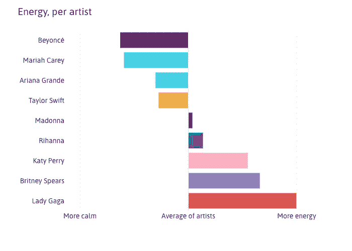******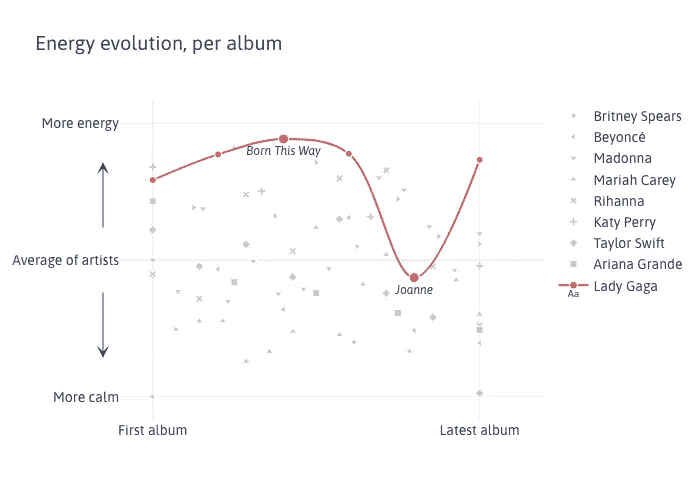***

***作者提供的图片***

***作为高能径赛的一个例子***

***考虑到她所有的工作，这位女士只给了我们更多一点平静，在她的更倾向于乡村的*乔安妮。在那之前和之后，只有一次又一次的震惊，在《生来如此》上达到了顶峰。*娶夜，ScheiBe，Judas* 和*天生如此*都是*能量*听起来是什么样子的绝佳例子。****

***但这并没有结束。尽管 Lady Gaga 的声音让我们感觉像触电一样，但她也很擅长让我们在第二次聆听时感到愤怒或悲伤。当考虑到抒情的内容时，很明显她想要的是什么:让我们同时跳舞和哭泣。***

***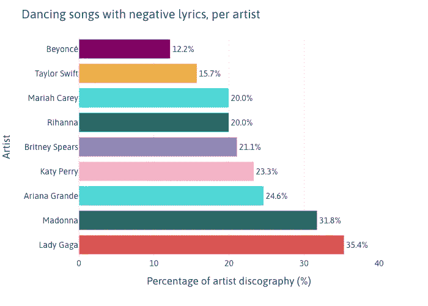***

***作者图片***

***正如她最新专辑中真正强调的那样，*色彩学，*歌曲像*爱丽丝*和*塑料娃娃*在舞池中打动了我们，但也谈到了脆弱的感情，感到被困，被利用和愤怒。所以，下次你跳舞的时候，试着注意歌词，这样至少你可以很好地利用它们。***

## ***TL；DR —电话***

***对于那些有点忙的人来说， ***电话*** 将帮助你了解 Lady Gaga 的一切:高电压歌曲，对讨厌的男孩极度鄙视。***

# ***布兰妮·斯皮尔斯——跳舞吧***

***如果你想跳舞，该找谁？是布兰妮，婊子。***

***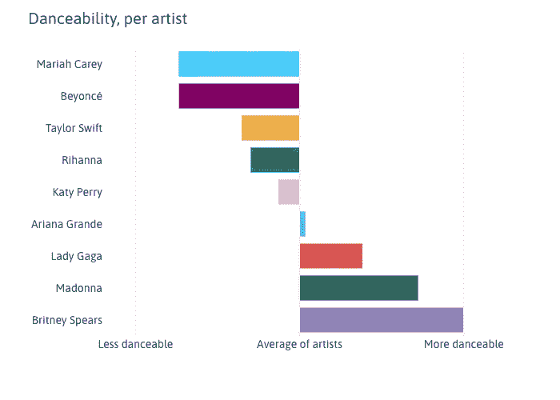******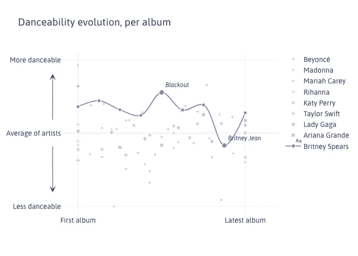***

***作者提供的图片***

***她是这群人中最适合跳舞的，她的大多数项目在可跳性方面都远高于平均水平。在*停电时达到她的舞蹈巅峰，*歌曲如*给我更多*和*我的一部分*展示了为什么当布兰妮的歌曲在任何地方播放时都很难保持安静。***

***即使是她不太适合跳舞的项目，布兰妮·琼，也仅仅是因为更多情感流行歌曲的出现，比如香水。伴随着这些更平静的流行歌曲，她最受欢迎的歌曲之一是:*工作母狗。****

***当我们考虑歌词背后的情感时，很明显布兰妮的专长是让我们随着积极的信息起舞，无论是性感的感觉还是绝望的爱。***

***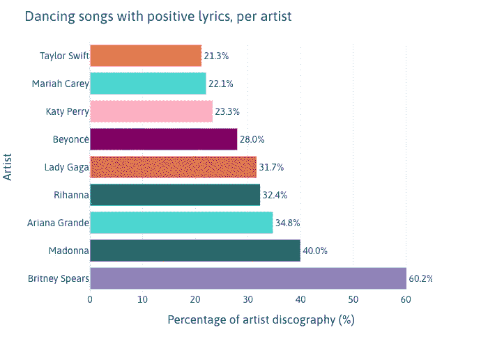***

***作者图片***

## ***TL；DR——有毒***

***作为一首歌，*绝对应该有一个警告:它每次都会让你跳舞，它是有史以来最伟大的流行歌曲之一，它会让你感到性感和活力。****

# ****爱莉安娜·格兰德——开槽，是的****

****E 尽管阿丽亚娜的审美散发出*喜欢惹麻烦的纹身女孩的氛围，但从声音上来说，她拥有天后中最华丽的节拍，倾向于慢节奏的歌曲。不过，不要难过，如果她的一首歌让你进入状态，就像生活中所有美好的事情一样，它会很快结束:她的歌曲往往比大多数歌曲结束得快，让我们想要更多。*****

************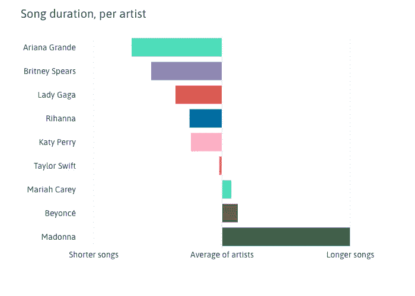****

****作者图片****

****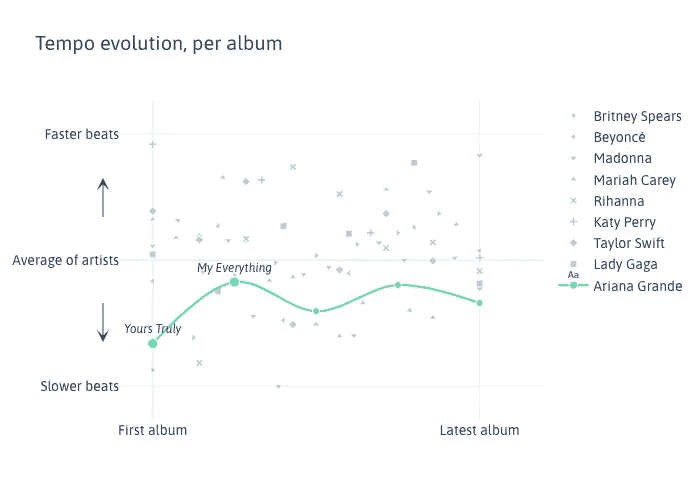****

****作者图片****

****尽管如此，正如我们在旁边的图表中所看到的，Ariana 继续倾向于较慢的节奏，我们看到，自从她的第一个项目*your Truly 以来，她已经变得有点快了。在里面，我们可以听到一些她最棒的歌曲。*****

****当你考虑她的演变时，*我的一切*走得更快，因为她在像 *Bang Bang* 和 *Break Free* 这样的歌曲中追求更流行和电子的声音。****

****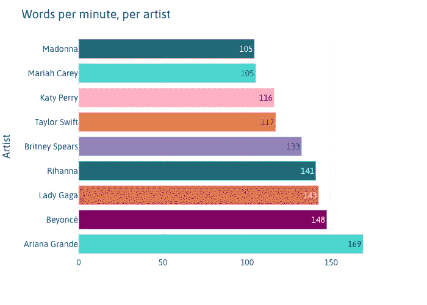********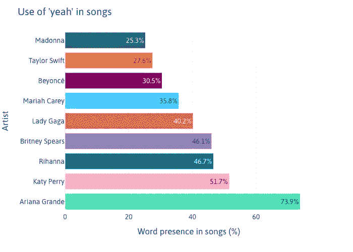****

****作者提供的图片****

****阿丽亚娜的另一个巨大优势是她的声音和演讲能力。领先于更多的说唱歌手，像*sweeter*和*daily*这样的歌曲展示了即使时间很短，她也能说很多。****

****还有一点:她喜欢“耶”好吧。她唱的 74 首歌让她(和我们)每次都兴奋不已。****

## ****TL；美国国家航空航天局****

****给你一些空间，并帮助把这一切绑起来: ***NASA*** 。在 Ariana 的前 5 名最慢的堵塞，结束很快，有一些“耶”的组合，它在交付速度上排名前 15，每分钟 220 个词。****

# ****麦当娜——创新****

****作为今天成为流行歌手的女性之一，麦当娜经历了她职业生涯的许多阶段也就不足为奇了，她的声音也是如此。当我们分析她的演变和每件作品从她过去的唱片到那时的差异时，我们可以看到，考虑到她的整个旅程，她是创新更多的艺术家。****

****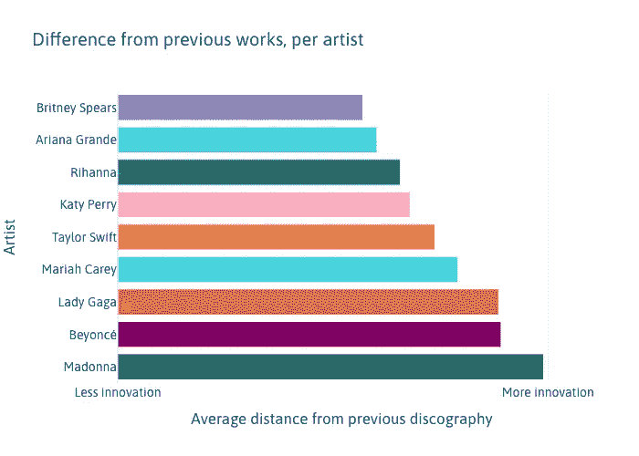****

****作者图片****

****查看以下每位艺术家的轨迹:****

****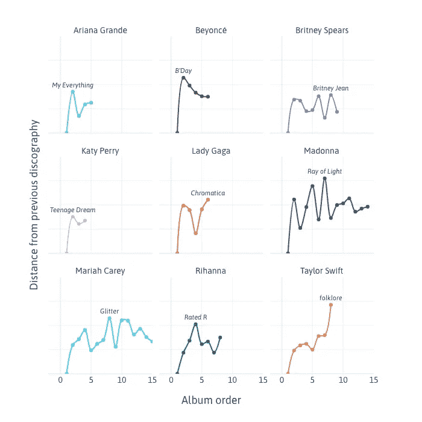****

****与过去的唱片目录/作者图片相比，最具创新性的专辑****

****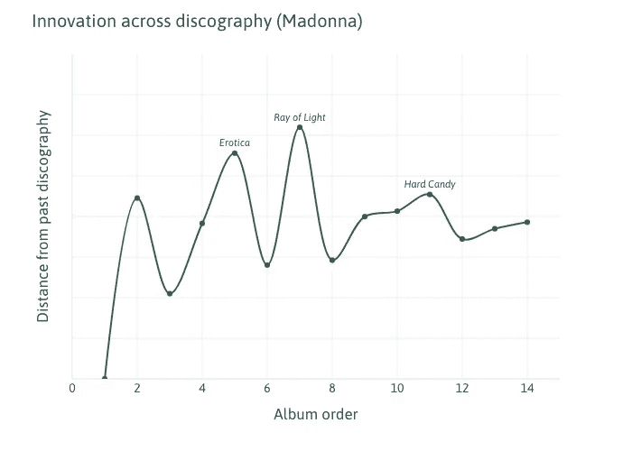****

****作者图片****

****在她的 14 张专辑*中，色情、光线和硬糖*是她唱片目录上的主要飞跃。这可以归因于与她以前作品的不同之处，包括在编曲中使用乐器，歌词中更积极的语气以及舞蹈性的增加。****

****即使你从这三个项目中的每一个项目中分析一首歌，你也能很容易理解为什么它们如此不同。以她的第一个项目*麦当娜*和一首标志性歌曲如*假日*为例。例如，合成器带来的感觉良好的天真氛围与*情色*更性感的舞蹈氛围非常不同。我们可以看到的另一个亮点是*硬糖的 4 分钟，*它沉重的节奏和明显的嘻哈影响。****

## ****TL；博士——挂断了****

****显然，麦当娜太难在一首歌中描述，但 ***挂了，*** 可能是我们能得到的最接近 ***。即使等待的人时间过得很慢，但如果你在等的是麦当娜，那也是值得的。她可以，也一定会再次创新。*******

****如果你更喜欢柔和、多变、伟大的歌词、诅咒、高能、流行音乐、慢歌、舞曲或创新的声音，那就是你的选择。每个艺术家都有值得喜爱的地方；因此，如果你不知道，就要明白这与他们无关。****

****绝对是关于你的。****