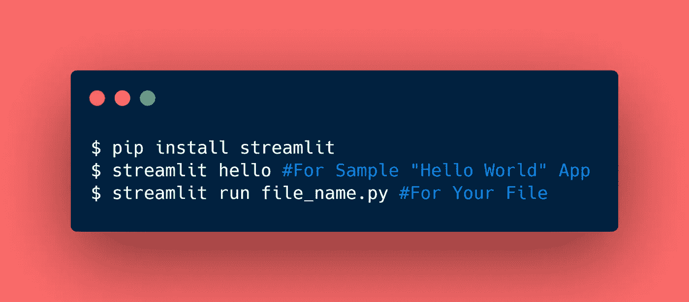
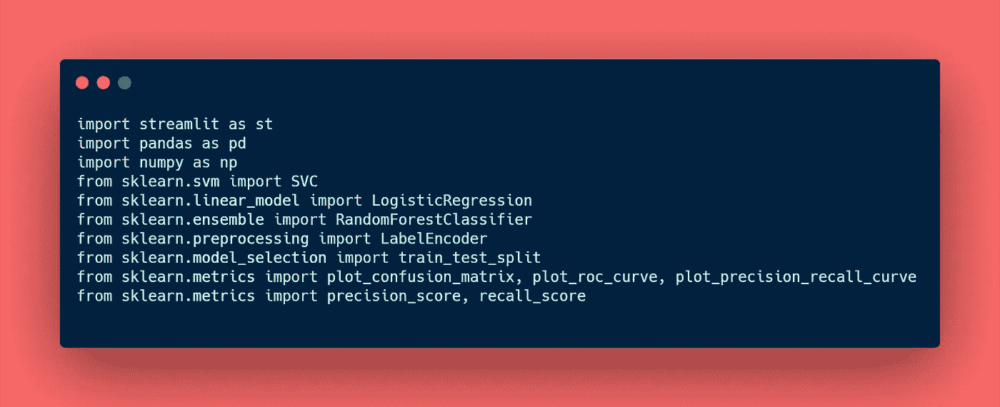
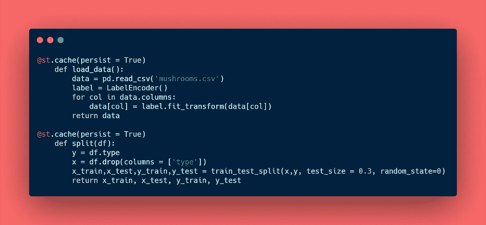
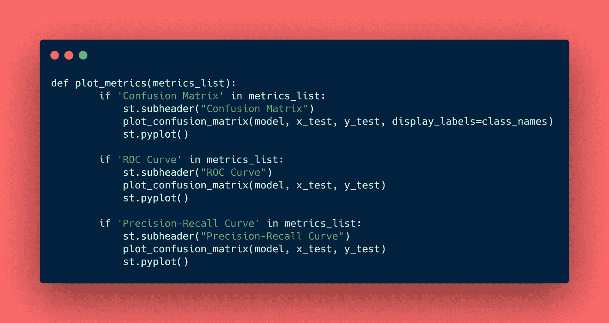
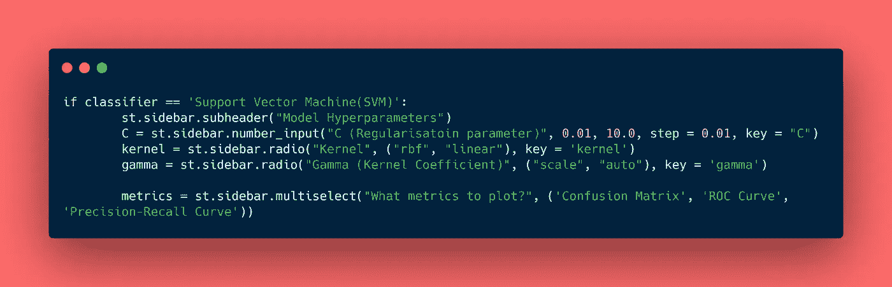
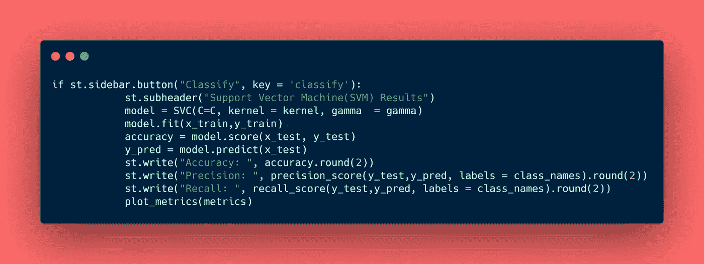
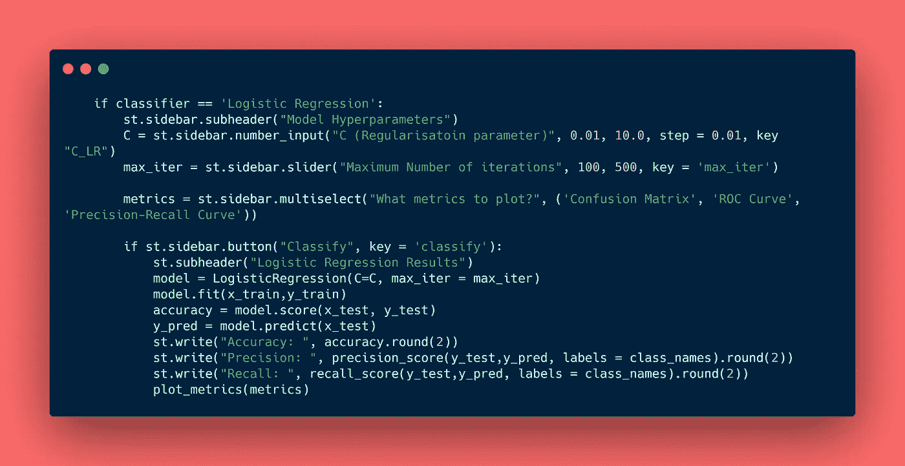
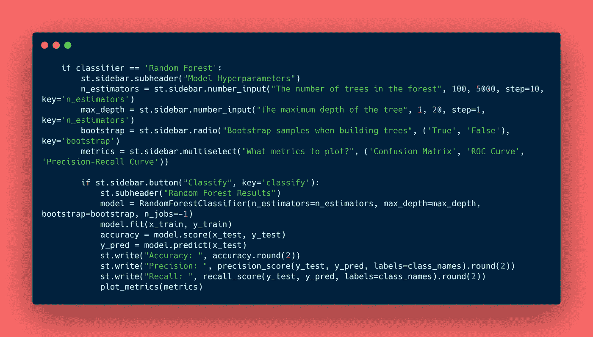
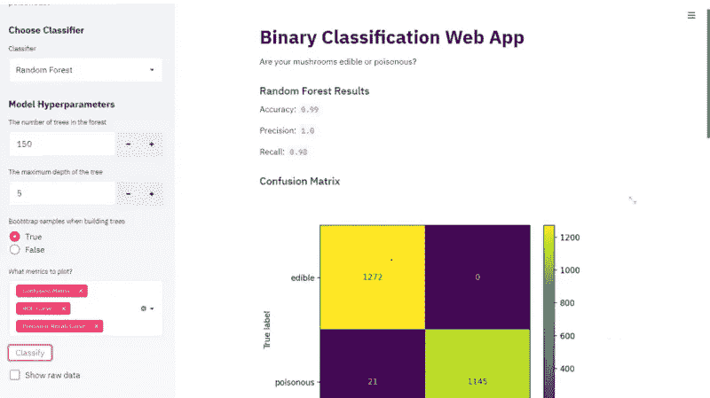

# 如何不用 REST API 搭建机器学习 Web App

> 原文：<https://towardsdatascience.com/things-i-wish-i-had-known-how-to-build-a-machine-learning-web-app-without-rest-api-f6ead0d058a6?source=collection_archive---------70----------------------->

(*图片作者*)

## 我希望我已经知道的事情:

## 使用 Streamlit

所以几周前，我的一个朋友正在做这个项目，使用 OpenCV 进行物体检测，她应该给它一个客户端。她在 GET/POST 请求之间挣扎了很久，最终放弃了这个项目。

我们都在某个时候遇到过这种情况，我们努力将我们的 ML 模型集成到我们的应用程序中。那一刻，我意识到许多数据科学/机器学习爱好者可能不知道这个行业的福利，称为 Streamlit！

# 那么…是什么？

> Streamlit 是一个开源应用框架，它可以帮助数据科学家和机器学习工程师在几个小时内创建漂亮、高性能的应用！全是纯 Python。全部免费。

# 我应该用它是因为？

这是一个**最小**框架，也是目前构建强大的数据/机器学习应用的最快**方式！**

支持机器学习爱好者使用 Flask、Django 或其他工具部署**而无需**。

我再也不用担心那些**回调**了！

我再也不用担心那些 **HTML 标签**了！

经过简化的**数据缓存**加速了计算流水线！

# 让我们立即开始吧！

Streamlit **搜索**每次保存的更改，并在您编码时即时更新应用程序。代码从上到下运行，总是从一个新的状态开始，绝对不需要回调。这是一个轻松而健壮的应用程序模型，让你以令人难以置信的速度构建丰富的 ui。

你只需要做以下事情:

该设置

还有**万岁！**几秒钟后，示例应用程序将在默认浏览器的新标签中打开。

另外，**确保**你已经安装了 [Python 3.6](https://www.python.org/downloads/) 或更高版本。你可以在这里找到文档。

> 因此，事不宜迟，让我们开始制作一个功能齐全的多分类器机器学习 Web 应用程序。

# 进口货

进口货

# 加载和分割我们的数据集

在这个工作站中，我们从`mushrooms.csv`文件中加载我们的蘑菇数据集，并将数据集分成通常的 7:3 (70%用于训练，30%用于测试)。这是一个关于蘑菇是否可食用或有毒的二元分类数据集。你可以在这里找到数据集[。](https://github.com/Digaari/Streamlit-ML-WebAPP)

在这里，`@st.cache()`是一种缓存机制，它允许我们的 web 应用程序即使在从 web 加载数据、操作大型数据集或执行昂贵的计算时也能保持响应。

装载弹药

所以每次你用`@st.cache`装饰器标记一个函数，它告诉 Streamlit，“嘿，你需要检查一些东西！”比如:

1.  函数的输入参数
2.  函数中使用的任何外部变量的值
3.  函数的主体和
4.  缓存函数中使用的任何函数的主体。

> Streamlit 通过**哈希**来记录这些组件的变化。可以把缓存想象成一个简单的内存中的键值存储，其中键是上述所有内容的散列，值是通过引用传递的实际输出对象。

# 情节

所以我们从 sklearn 库导入了两条简单的曲线和一个混淆矩阵。我们通过`metrics_list`到`plot_metrics`，这将是客户选择的一个或多个选项。每个评估指标各自的功能如下:

评估指标

# 多重分类器

很高兴你能坚持到这里！现在我们到了最激动人心的部分。我们会给我们的客户，选择多个分类器！

对于这个应用，我们将使用**支持向量机(SVM)** 、**逻辑回归**和**随机森林分类器。**

## 支持向量机(SVM)

在**支持向量机**中，我们总是旨在增加*的余量。*永远记住，**正则化参数(** C)的值越大，*余量越小。*

如果客户选择 SVM，他们将可以通过**内置小部件**如*单选按钮、多选*和*数字输入来定制超参数，如**正则化参数**(C)**内核**和**内核系数**。*

超参数

定制好超参数后，我们准备好通过点击侧边栏上的**分类**按钮来训练我们的 SVM。

训练和绘制结果

## 逻辑回归

**逻辑回归**是一种机器学习分类算法，用于预测分类因变量的概率。

如果客户选择逻辑回归，他们可以选择定制超参数，如**正则化参数**(C)**迭代次数**，通过**内置部件**，如*滑块*和*数字输入*

逻辑回归

## 随机森林分类器

**随机森林分类器**被认为是一种高度准确和稳健的方法，因为有大量决策树参与该过程。它在随机选择的数据样本上创建决策树，从每棵树上获得一个预测，并通过投票选择最佳解决方案。

如果客户端选择随机森林分类器，他们可以选择定制超参数，如森林中的**棵数**、**最大值。树的深度**和**通过**内置小部件**如*单选按钮*和*数字输入*构建树时的自举样本**

随机森林分类器

# 浏览器

您的浏览器上会有这样的内容:

浏览器

现在你可以看到 Streamlit 的真正力量了。因此，没有正式的机器学习或编码背景的人可以使用你的 web 应用程序，只需通过触摸和点击控件来训练模型，并观察不同分类器的表现。

> 在这个基础项目中，只有少数内置函数投入使用。您可以随时[探索更多](https://docs.streamlit.io/)并扩展您的机器学习 Web 应用程序的功能。

关于这个项目的完整代码，可以参考我的 [GitHub。](https://github.com/Digaari/Streamlit-ML-WebAPP)

保持安全直到下一次:3