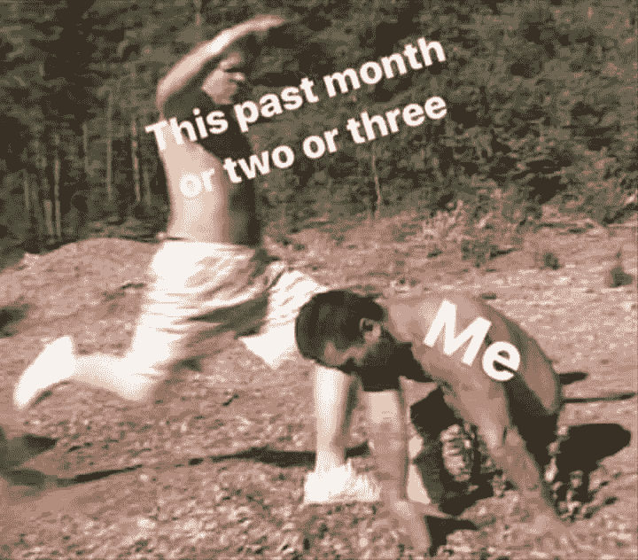
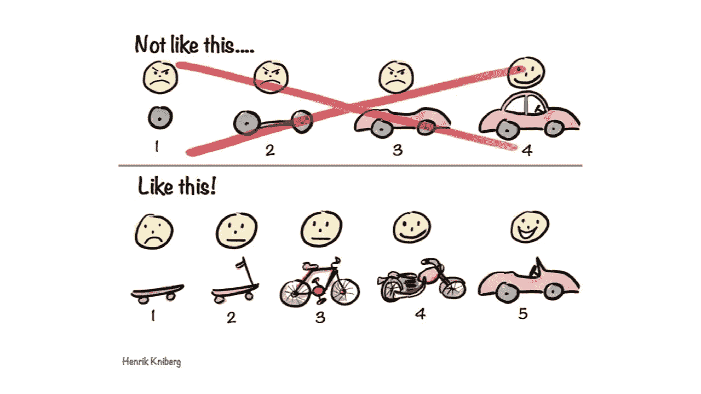
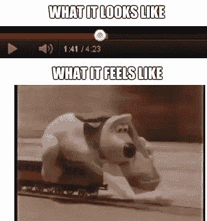

# 我希望在加入 Metis 新加坡数据科学训练营之前就知道的事情

> 原文：<https://towardsdatascience.com/things-i-wish-i-knew-before-joining-metis-singapore-data-science-bootcamp-8768b9e9fda2?source=collection_archive---------19----------------------->

## 作为一个没有编码或统计背景的人，我在新加坡 Metis 数据科学训练营的亲身经历。

这并不意味着是一篇短短的 5 分钟的阅读(如果你想深入了解自己的处境，也不应该是这样)。剧透:每一天都是一场艰苦的战斗。

实际上，我在梅蒂斯训练营，2019 年 10 月 7 日至 12 月 27 日，彩色。图片来自 [me.me](https://me.me/i/this-past-month-or-two-or-three-me-kick-me-67b79115ddbb45a5a6a99d6c20819c28)

# 训练营结构

Metis 新加坡数据科学训练营是一个为期 12 周的密集计划，重点是 Python 编程，通过完成 5 个项目，您可以了解探索性数据分析(EDA)、统计建模和大数据工具。

众所周知，这些训练营非常紧张——事实也的确如此。想象一下将 1-2 年的信息压缩到 3 个月内。

每一天，我都从结对编程练习开始，抓紧时间休息 5 分钟，然后立即去上课。我会停下来吃午饭，然后回来上更多的课，通常在下午 3-4 点左右结束。

虽然课程已经结束，但我的一天还没有结束。无论我有多少空闲时间，我都在努力跟上我前一天(甚至更早)学到的概念，同时，在两周的期限内从事自我启动的项目。整个周期重复了整整 3 个月。

虽然这非常困难，但我不能说我完全没有从中受益。在训练营之前，我是一个自学狂(Youtube，LeetCode，阅读数据科学文章),并认为自己进展顺利。直到我进入训练营，这严重挑战了我的观点。我很高兴我这么做了，因为我会被困在我的小泡泡里，以为一切都很好，而事实上并不是这样。训练营让我意识到在数据科学领域还有很多*要学，并让我具备了足够的知识来合法地*自己开始。**

# **不要低估训练营**

**这是 ***极其*** 的统计和数学密集型，这些是我希望在加入之前就知道的事情，也是我给你的建议，不是 ***好有*** 而是 ***必须有*** 才能加入一个。**

# **你必须拥有的东西**

****

**照片经由[Amazon.com](https://www.amazon.com/Funny-Calculus-Algebra-Mathematics-Coffee/dp/B01HTWQZA0)。差不多总结了你在营地必须要有的东西。购买并携带这个杯子参加训练营，获得额外积分**

## **1.你一定喜欢图表**

**惊喜惊喜。这是一个与数据相关的字段。显然，你的大部分发现，如果不是全部的话，将会以图表的形式出现。你必须喜欢看图表，使用它们，调整它们(条形图，折线图，散点图等)。)而且你一定要喜欢与他们分享你的发现。**

## **2.你怀疑一切**

**你质疑一切，想要验证呈现给你的事实/数字背后的真相。这一点很重要，因为你在一个数据相关的领域，你想知道你得到的数据是否有效。**

**如果这听起来像你，那就完美了，因为统计学作为一种工具，可以让你对数据集进行*理解、量化以及测试有效性*，这让你相信你的假设是正确的，你的模型是可行的。这就引出了我的下一个观点。**

## **3.你必须很好地掌握统计学**

**你还必须知道如何(或者至少欣赏)以一种**实用**的方式应用统计学。在训练营只有 3 个月的时间，每天超快的节奏不会等到你完全理解了一个概念，第二天你就会被另一个人扇耳光。这也引出了我的下一个观点。**

## **4.你必须有很好的数学技能**

**我说的是微积分，像 log，ln，微分方程等等。为了理解统计概念并理解如何使用它们，你需要对数学有很好的理解。如果你不这样做，你会开始意识到随着每一天的流逝，你会被遗忘在尘埃中。**

**如果你没有这些，我会说你会经历一段艰难的旅程。在加入之前，我甚至不知道什么是线性回归，如果你想让你的钱发挥最大作用并在训练营中生存下来，我建议你至少获得统计和数学的中级水平。**

**如果你认为你已经准备好了，而且前面提到的 4 点都很有趣，那就完美了！我们可以继续讨论如何应对接下来的 3 个月。**

# **跟上训练营的步伐**

## ****1。有疑问时询问****

**如果你不知道也不问，你只是在伤害自己，因为如果你不知道，你会一直一无所知。如果你不知道内容，这并不荒谬(我的意思是——这就是你报名参加训练营的原因，对吗？).只有当你知道自己有疑虑却不去澄清时才是荒谬的。**

## **2.你必须接受 ***不知道一切*****

**我的意思不是说你没有尽最大努力，当你有知识失误时可以松懈——而是要意识到，在你开始进入下一步之前试图抓住*的一切会导致你 ***太慢*** *和* ***会导致你最终什么都不做。******

**这甚至阻碍了我开始一个项目。在开始我的项目之前，我想知道每一点代码，首先学习线性回归，用一整套知识武装自己。结果，我只剩下很少的时间去做任何实际的工作 接近尾声 ***产生了不尽人意的结果*** 。**

**你永远不会在人生的每个阶段都知道所有的事情，也永远不会做好充分的准备。我从未想过我会如此老套地使用一句被滥用的名言，但正如耐克所说的那样，**

> **“照做就是了”**

**真的——去做吧。会有很多时候你什么都不知道，这没关系。这就是你在训练营的原因。如果有什么，你可以随时咨询谷歌。你将会使用新的代码，即使你把它输入到你的 Jupyter 笔记本里，你也完全不知道，这没关系。因为你 ***会*** 学会后你*会用*它。**

## **3.你必须有 ***的勇气*** 才能遵守纪律并坚持到底**

**你每天都必须前进。**

**最好的学习方法是通过一个 ***的迭代过程*** 。当你开始一个项目时，你会遇到许多障碍。尽管这很痛苦，但你不得不忍受不知道会发生什么——有时甚至不知道如何搜索答案，甚至不知道正确的问题。挺好的。坚持原则，坚持到底。如果你不知道，不要停留在原地。**

**试着问问题。试试谷歌搜索。尝试与人交谈，尝试咨询你的同学、你的讲师，甚至前一批学生([黑乌鸦(詹姆斯·吴)](https://medium.com/u/e105999c34d2?source=post_page-----8768b9e9fda2--------------------------------)和[爱德华·宾基](https://medium.com/u/af46618e5594?source=post_page-----8768b9e9fda2--------------------------------)帮了我大忙)。你会交到很多朋友，其中你最好的朋友是谷歌(说真的，谷歌是救命恩人。哦，还有 StackOverflow)。**

**在你解决了项目中的一个问题后，你会有一种巨大的成就感——然后立刻又陷入一个新的问题中(顺便说一下，这很正常)。这就引出了我的下一个观点...**

## **4.你必须热爱持续学习**

**这个领域的事物是不断运动、变化的。老实说，编码曾经是独角兽技能。现在几乎每个人都可以编码。你必须保持领先，要想领先，你必须不断学习。你 ***拥有*** 去热爱学习的过程。**

## **5.理解项目设计是一个迭代过程**

**苹果不是一天建成的，你在这个夏令营中着手的任何项目也不是。理解项目是一个持续的、建立在先前尝试基础上的过程。**

**你可以有一个令人印象深刻的最终目标，你想从你的项目中得到什么，并画出一个巨大的甘特图，你想如何去完成它，但现实是，会有很多障碍阻止你这样做(事情永远不会 100%按照计划进行)。**

**如果不能在第一次尝试中创造出令人惊奇的东西，不要如此犹豫。专注于 ***完成*** 先做简单的事情，做完之后再改进！**

****

**图片来自我自己的训练营课堂笔记**

**我认为上面的图像最好地呈现了项目设计的概念。制造汽车的想法从来都不是源于拥有汽车本身。它产生于对更好的交通选择的日益增长的需求和需要的总体想法。**

**同样，你的项目将遵循一个与此非常相似的过程。一个关于要实现什么的总体想法，在创建了第一个成品之后，你对它进行改进(甚至可能创建一个不同于你最初设想的产品)。**

# **唷，训练营听起来有很多工作要做。**

**是的，是很多。这就是为什么它被称为训练营。并且知道这将会很难——没关系。你并不孤单。如果你一定要知道，这段时间我受了很多苦。想想看，熬夜到凌晨 4 点，为你的演示排练和制作幻灯片，在醒来淋浴、梳洗和去 Metis 做演示之前，只睡两个小时。**

****但确实变好了**。因为随着每个项目的通过，你变得更加精通编码，更加熟悉 Python 及其语法，使用适当的统计软件包，并且在演示和交流方面变得更好(我必须说，这很棒，因为我喜欢和人说话)。这个过程是痛苦的，但当你回顾过去时，你会为你所取得的成就感到骄傲——熬过了那个疯狂而紧张的时间表，并且 ***拥有 5 个数据科学项目*** 。**

**就像我怎么强调项目设计是一个迭代的过程，你的学习也是。这里有一些提示，你可以在做项目时记住，同时跟上快节奏的教学大纲。**

## **秘诀 1:早点开始，提前学习**

**保持领先于教学大纲。即使你还没有在课堂上讲述统计概念(使用哪种模型)或项目中要使用的编程语法，请继续阅读，并在课程计划的同时完成项目。**

****

**红色条=课程进度。灰色条=井..最理想的是你。图片来自 geeksaresexy.net**

**你是铺设铁轨的阿高，火车是课程。事情是这样的。完成你的项目，直到你在课堂上了解到你的新统计模型的那一刻，你准备好在课程结束时把它放进你的项目中。**

## **技巧 2:多任务**

**时间管理将是一个巨大的问题，因为这个营地的最后期限很紧。然而，这些截止日期并不一定会成为你的败笔。**

**你的项目总是以一个 ***演示*** 和一个 ***博文*** 结束(不像这个，傻瓜。像我的[其他关于我的项目的博客文章](https://medium.com/@xianjinseow92/creating-a-flask-app-to-classify-consumer-complaints-using-natural-language-processing-6c8778c9eb48)。不要等到你写完所有的代码和分析之后才开始写。**

**当你的模型训练的时候，或者当你运行一个很长的网页抓取器的时候，同时做你的幻灯片和写你的博客文章。发挥你的创造力，把零碎的工作放进去！**

## **提示 3:甚至在夏令营开始前就决定项目想法**

**训练营的毕业要求是完成教学大纲中的所有 5 个项目，其中 4 个是自我发起和自我领导的项目，每个项目都有一个总体的统计概念，希望你在学会这些概念后展示出来(请遵循**提示 1:早点开始，提前学习**)。**

**项目二:线性回归
项目三:监督学习
项目四:自然语言处理
项目五:激情项目(随便你)**

**我建议在进入训练营之前，想出一些你想做的事情的想法，因为你的大部分时间将会花在学习训练营的材料上，而不是花在为项目做些什么的头脑风暴上。**

**它不需要非常具体，因为你可以在训练营进行的过程中完善这些想法(你也可以和你的教练和同学一起讨论这些想法)。但是，如果你不想为做什么而大惊小怪，同时又要跟上训练营中技术含量很高的材料，你至少要知道自己想做什么。**

## **好的，谢谢，但是这仍然没有给我一个具体的想法，我应该做什么项目**

**记住你为什么在这个营地。你这样做是希望就业吗？你这样做只是为了提高技能吗？或许引用技术带头人的一句话可以对此有所启发。**

> **“我不擅长编码，但我最起码的代码是有商业价值的。”**

**好的，这实际上并不是一字不差的，但很大程度上是从他的视频[中推断出来的。你的代码/项目给世界带来了什么价值？一个好的编码者不是一个记忆存储器(一个记住编码语言中所有语法的人)，而是一个知道他的产品能给世界带来什么价值的人。同样，你的项目应该是人们可以从中看到价值的项目。问自己这些问题:](https://www.youtube.com/watch?v=xqgH9j3x2OE)**

*   **雇主希望看到什么？**
*   **我想提供什么商业价值？**
*   **我对这个世界有什么迫切的问题，答案是什么？其他人能从这些知识中受益吗？**

**思路可以参考[这个](https://archive.ics.uci.edu/ml/index.php)。如果没有，也非常欢迎你来[探索我写的关于我在夏令营期间完成的项目的博客](/catching-a-welcher-classifying-a-credit-card-defaulter-f4b21547a618?source=your_stories_page---------------------------)！**

**如果你对我到目前为止所说的一切没有一丝一毫的担心，那太好了！在野营之前去度假，因为那 3 个月将会是一次非常棒的旅行。如果没有，忘记这个假期，投入你的时间尽你所能为它做好准备，因为…那 3 个月将会是一段非常棒的旅程。**

# **个人外卖**

**我还想补充一点，在我个人看来，只有当你已经决定要从事数据科学职业时，你才应该参加数据科学训练营。如果这是你的职业，当你还在 ***探索*** 的时候就不会了。否则，在训练营的每一天都将是折磨。已经有学生退学了(我不是想吓唬你，只是告诉你实际发生了什么)。**

## **从实践中学习，而不是通过阅读**

**如果训练营的时间密集型结构教会了我什么的话，那就是你**通过做来学习，而不是通过阅读。****

***如果你不能用这些知识做任何有价值的事情，那么积累所有的 Coursera 或 Udemy 认证就毫无意义。向世界展示你能做的*。正如 [JomaTech](https://www.youtube.com/channel/UCV0qA-eDDICsRR9rPcnG7tw) 所说，****

> ***“如果你做了一个有趣的分析，但没有人阅读你的分析…你真的做了分析吗？”
> - JomaTech 关于[获得数据科学工作的 5 个技巧](https://www.youtube.com/watch?v=MfP-P8EHGBo&t=12m12s)***

***非常明智。***

***我个人打算通过从事侧重于现实世界应用的项目来丰富我的学习。在这个过程中，我相信我会遇到很多我不知道的东西，我会学到解决问题的东西，而不是学到很多没用的东西。***

## ***有时候你真的需要冷静下来***

***我知道我说了很多关于集训营紧张，多任务，勤奋和有纪律的学习，以及领先于教学大纲的事情。但事实是:没有人能连续三个月每天工作 18 小时。*倦怠在训练营中很常见*。有时候你得吃点镇静剂。***

**每个项目结束后，给自己一个奖励。休息一天来恢复精神，和你的同学一起喝点东西，随便什么。只要断开你自己与物质的联系，然后在你完成充电后再回来。**

# *****最后谢谢*****

**我真的想说，我非常幸运，周围都是了不起的同学(他们远远超出了我的技能水平)，当我在课程中遇到任何困难时，他们都非常有帮助地指导我。**

**我们也打了很多比赛(我们喝了很多酒),这有助于抵消训练营的压力。**

**感谢你的阅读，如果你想联系我，你可以通过我的 Linkedin 或者 xianjinseow92@gmail.com 联系我。**

**干杯！**