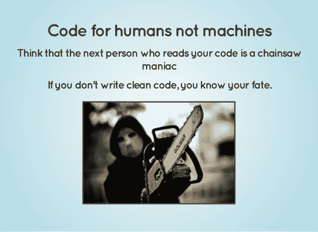
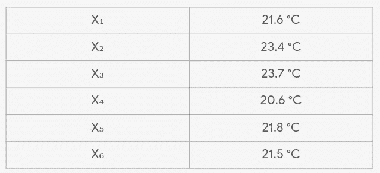
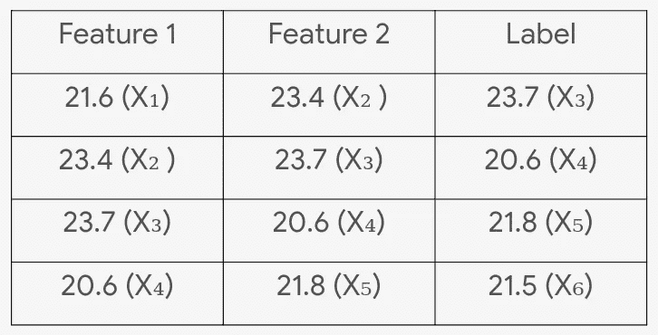
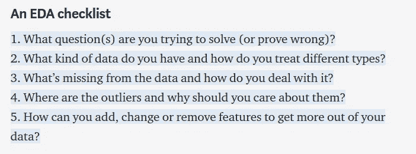
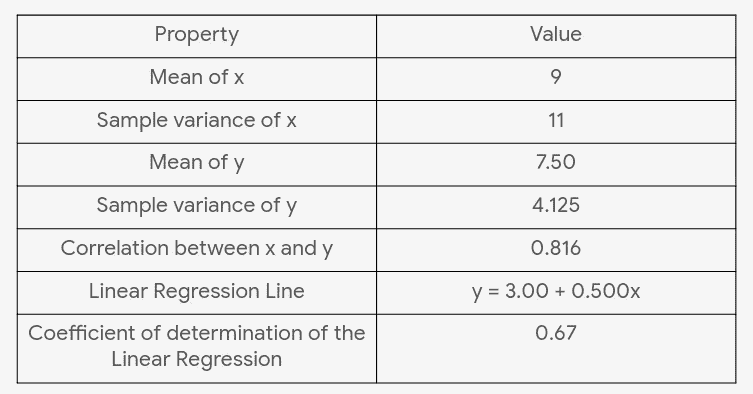
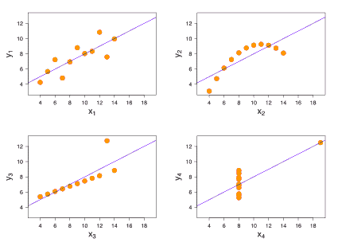
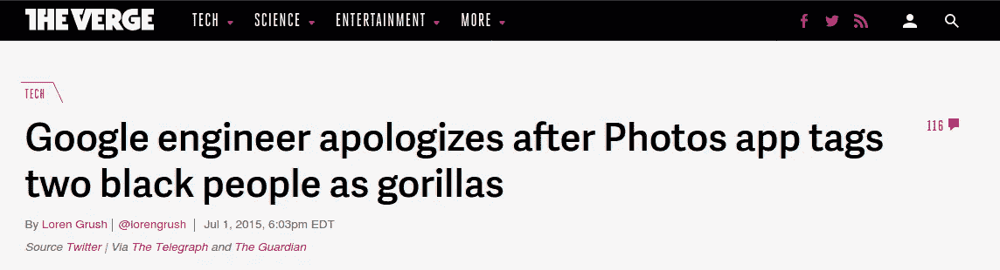
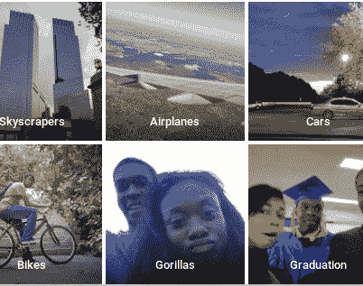

# 制作第一个 ML 模型之前需要知道的事情

> 原文：<https://towardsdatascience.com/things-to-know-before-you-make-your-1st-ml-model-5ce48c9657f?source=collection_archive---------42----------------------->

## 一系列重要但通常被遗忘的细节。

如果你已经完成了你的第一个关于机器学习的 MOOC(在 Coursera 上也叫做[吴恩达),并且想在这个领域探索更多的机会，或者你是一个一直在观察数据科学和 ML 的人，并且想看看这个领域是否适合你，你就在正确的地方(实际上)学习了一些配方的成分，这些成分将帮助你在 ML 上大放异彩。](https://www.coursera.org/learn/machine-learning#about)

把 ML 分成几个部分，你现在应该关心的三个部分是-

*   数据，因为这是“数据”科学，
*   模型背后的数学，
*   编程。

在本文中，最大的关注点将放在数据上，所以我们先讨论另外两个。

# **模型背后的数学原理**

在第一次运行 model.fit()和 model.predict()之前，没有必要知道算法是如何工作的，但是为了利用算法的实际能力，您需要了解它是如何工作的。逻辑回归是一种广义线性模型，因此输出连续数据的线性回归模型可以很容易地修改为给出类别作为结果。精度测量或参数值，一切都是某种形式的数学函数。

图模特合体()和模特预测()([图片来源](https://en.wikipedia.org/wiki/Scikit-learn))的火炬手

所以下一个问题是，“要知道多少数学知识？”这个问题的答案多少取决于你的目标是什么。如果你想成为一名研究人员，改善目前最先进的模型，你显然需要知道进入你的机器学习模型的每一点数学知识，因为这是你如何改善现有的，通过找到新的数学函数，对数据进行处理以产生更好的结果。如果你只是想在你的模型上得到足够好的符合你目标的预测，知道足够多的数学知识来完成这个项目就足够了。

# **编程**

在你已经弄清楚你想要解决的问题和它的类型(分类、回归、聚类、排序等等)之后，ML 模型的编程就开始了。)，做了必要的预处理，决定了从哪个算法开始。获得一个好的起点是很重要的——阅读任何相关的前期工作并编写代码；一旦你获得了一个基线精度，尝试不同的算法或建立在相同的基础上。这有助于理解正在发生的事情，以及下一步你需要做什么来实现你的目标。

[图像来源](https://image.slidesharecdn.com/7rulesofsimpleandmaintainablecode-150924051108-lva1-app6891/95/7-rules-of-simple-and-maintainable-code-3-638.jpg?cb=1443074482)

尽可能多地记录下来，因为 6 个月后你很可能会忘记工作流程背后的逻辑。无论是编码者还是阅读代码的人，遵循良好的编码实践总是有帮助的。

# **数据**

这是在很大程度上决定 ML 模型成功的部分，所以在这里花费最多的时间是最有意义的。

制作有用模型的先决条件是了解机器学习中使用的术语。

一个*标签*是我们预测的东西——简单线性回归中的 y 变量。

一个*特征*是一个输入变量——简单线性回归中的 x 变量。

一个*例子*是数据 x 的一个特殊实例。

这总是有助于更好地报告和记录模型，也有助于纠正错误。你可以通过谷歌查阅[机器学习词汇表](https://developers.google.com/machine-learning/glossary)。

现在你可以开始了，ML 项目工作流程中的第一件事就是问题陈述。专注于传统编程难以解决的问题。思考你试图解决的问题实际上是否需要机器学习，这是一个很好的实践。如果你是从一场卡格尔比赛开始，你已经有了目标。但是，如果你想在真实世界的数据集上工作，首先制作最基本的情节，尝试找出变量之间的模式和关系，并基于这些推理，为自己构建一个问题陈述。这就是统计项目通常被处理的方式。

有时，我们可以得到客户的要求，使用特定的算法来解决问题。比如说，手头的数据是一个城市在一定时期内的日平均气温的时间序列。这里的问题陈述是使用监督学习来预测或预报 6 天的平均温度。

抽样资料

在这里，给出的只是一系列需要以某种方式转换成特征和标签的值。某一天的温度与前几天的温度并不完全不同。如果今天的气温是 20 摄氏度，明天就不可能是 10 摄氏度或 15 摄氏度，除非在非常情况下，否则气温一定接近 20 摄氏度。这个想法可以用来做我们的工作。

使用滑动窗口方法，前两个温度可用作当前温度(标签)的特征。考虑的特征数量也可以增加，并且任何监督算法都可以应用于这个问题。

定义问题陈述基本上就是弄清楚你想做什么，以及你想怎么做。[这篇文章](https://developers.google.com/machine-learning/problem-framing/big-questions)提供了更多关于这方面的信息。

既然需要解决的问题已经清楚了，解决问题的第一步就是探索性数据分析或 EDA。简单地说，EDA 正在了解数据集，寻找差异、缺失值、趋势和模式，如果有的话；一般理解，这样您就可以回答关于数据集的任何描述性问题，而不必每次都进行查找。

[Daniel Bourke](https://medium.com/u/dbc019e228f5?source=post_page-----5ce48c9657f--------------------------------) 的文章提供了一份很好的 EDA 清单。

[来源](/a-gentle-introduction-to-exploratory-data-analysis-f11d843b8184)

在任何 ML 项目中，可视化都是关键。假设两个变量 x 和 y 具有以下属性，你能想到多少个差异巨大的数据集？？？

看哪，安斯康贝的四重奏！！！

[图像来源](https://en.wikipedia.org/wiki/Anscombe%27s_quartet)

虽然 4 个数据集共享相同的描述性度量，但它们彼此完全不同。给定的准确度为 67%的回归线将无法为第二或第四数据集提供良好的预测。

如果你觉得 EDA 只对表格数据集有帮助，你可以阅读 [Andrej Karpathy](https://en.wikipedia.org/wiki/Andrej_Karpathy) 关于[手动分类 CIFAR10 数据集的观察。](http://karpathy.github.io/2011/04/27/manually-classifying-cifar10/)

EDA 的另一个需要注意的方面是数据集中存在的要素的数据类型的重要性。如果您浏览任何网站，从必要的标签收集的数据有时是字符串格式的，这可能会被忽略，然后在训练模型时导致问题。同样，不是每种算法都适用于每种数据类型。因此，查看数据类型并选择适合 ML 模型的数据类型是一个很好的实践。

有时数据集不够大，因此可能不适合某些最大似然算法。除非明确指定，否则并不总是需要使用一种特定的算法；选择适合你的目标。对于简单的分类任务，使用决策树可以提供比 5 层神经网络更好的准确性，并且花费更少的时间。

ML 工作流中的一个主要组成部分是将数据集分成训练、测试和/或验证数据集。如果这些例子不是随机的或者是连续的，那么就需要仔细地进行划分，否则模型中就会出现偏差。你还需要确保分类任务中的职业平衡。

[来源](https://www.theverge.com/2015/7/1/8880363/google-apologizes-photos-app-tags-two-black-people-gorillas)

[图片来源](https://twitter.com/jackyalcine/status/615329515909156865?ref_src=twsrc%5Etfw%7Ctwcamp%5Etweetembed%7Ctwterm%5E615329515909156865&ref_url=https%3A%2F%2Fwww.theverge.com%2F2015%2F7%2F1%2F8880363%2Fgoogle-apologizes-photos-app-tags-two-black-people-gorillas)

2015 年，这一案件曝光，当时谷歌照片应用程序的对象识别功能将两名黑人标记为大猩猩。这是一个真实世界的场景，其中一个产品是失败的，因为它是在一个数据集上训练的，该数据集对于某些类来说具有相当高的不平衡性。作为一名开发人员，没有人希望处于这样的境地，因此，一点点额外的关心总是有帮助的。

最近，在构建更好的模型方面，研究人员和数据科学家非常关注的一个概念是特征工程。

> 特征工程是将原始数据转换为能够更好地向预测模型呈现潜在问题的特征的过程，从而提高对未知数据的模型准确性
> 
> -杰森·布朗利，在[探索功能工程，如何设计功能以及如何做好它](https://machinelearningmastery.com/discover-feature-engineering-how-to-engineer-features-and-how-to-get-good-at-it/)

2014 年，[在 DrivenData](https://www.drivendata.org/competitions/46/box-plots-for-education-reboot/) 举办的一场比赛中，参赛者需要构建一个机器学习算法，该算法可以自动将标签贴在不同的购买商品上，从而了解学校如何花钱来定制策略建议，以改善学生、教师和管理人员的成果。

如果你想到一个有潜力赢得比赛并成为最好的算法，你会想到哪些？胜出的模型是逻辑回归，它包含了许多精心创建的特性。这证明了特性工程的力量，也是你应该去看看的一个原因。你可以在这里了解更多关于这个挑战的信息[。](https://www.datacamp.com/courses/machine-learning-with-the-experts-school-budgets)

现在你有了一个问题陈述和一个干净的工程数据集，你可以开始你的第一个 ML 模型了。有一件事永远不会被说得太多，那就是这个领域为尝试新的和不同的想法提供了很大的空间。随着难以置信的数据量的产生，构建新的有用的应用程序或改进现有应用程序有着巨大的空间和机会。请记住，在数据科学中，没有解决问题的正确方法，只要符合您的目的并能为您带来期望的结果，帮助您以诚实的方式成长和学习，就是正确的方法。

页（page 的缩写）你可以在这里找到一个很好的资源来学习这个话题。