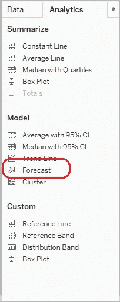
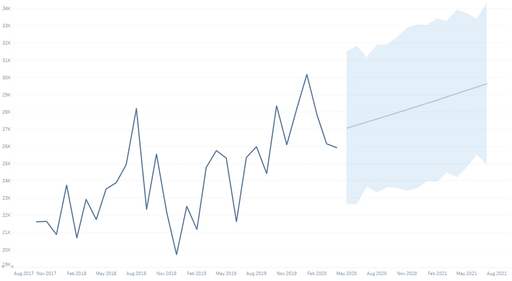

# 利用 Tableau 中的内置功能之前(和之后)的思考

> 原文：<https://towardsdatascience.com/think-before-and-after-you-drag-and-drop-tools-in-tableau-b19a28b9c5d6?source=collection_archive---------79----------------------->

演职员表:[https://unsplash.com/photos/46juD4zY1XA](https://unsplash.com/photos/46juD4zY1XA)

在最近一次与利益相关方的互动中，我的任务是收集相关数据，并报告我们的一个关键流程指标(KPI)的逐月变化。由此产生的分析将成为高级管理人员演示文稿的一部分，解释我们团队最近在数据收集和奖励流程方面的修改如何影响整体企业绩效。

我与团队的讨论主要围绕我们拥有的历史数据的“数据报告”方面。虽然我过去一直利用 Tableau 来准备临时报告，但我总是尝试添加客户没有明确要求的见解。如果可以的话，是“意想不到的，未说出口的洞察力”。

## 添加带有预测值的见解

我心想，逐月报告是我探索客户并为其增加价值的又一次机会。由于这是一个时间序列数据，我计划利用 [Tableau 的预测功能](https://help.tableau.com/v2020.2/public/desktop/en-us/forecast_how_it_works.htm)。

图 Tableau 分析窗格下的预测功能

图预测的月环比变化(浅蓝色)

Tableau 允许您进一步深入预测[描述](https://help.tableau.com/v2020.2/public/desktop/en-us/forecast_describe.htm)细节(右键单击预测行)。预测功能还为我们提供了预测线周围 95%的估计区域(上面的浅蓝色区域)(这可以手动配置为 90%、95%或 99%的置信区间)。

# 我们能在报告中包括预测吗？

由此产生的预测，乍一看，看起来像一个完美的预期结果，根据我们过去的表现，预测在未来几个月的得分增加。

## 我另有决定。原因如下

> 通常情况下，虽然预测预报或聚类算法等令人兴奋的功能可能看起来像是对我们报告的巨大补充，但**外部因素**如组织变革、高级管理层的决策、员工行为的变化或计算标准的变化，以及有时像新冠肺炎**这样前所未有的变化**可能会也可能不会影响我们未来几个月的指标。
> 
> 我知道未来几个月我们将要实施的一些变革。Tableau 作为一种工具，并不知道我们上面讨论的这些外部因素，因此主要只关注季节性因素来做出这些预测。因此，数据分析师有责任在将某个功能纳入报告之前权衡使用该功能的利弊。
> 
> ***一个特性不应该因为存在而被包含，应该在需要的时候被利用*** 。

如果你喜欢这篇文章，请添加“鼓掌”并在 Medium 和 [LinkedIn](https://www.linkedin.com/in/karanambasht/) 上关注我。