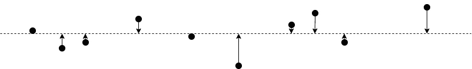
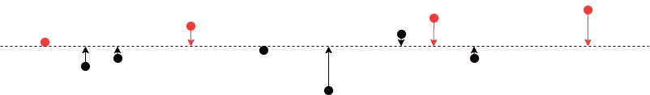

# 在监督学习任务中使用主成分分析之前，请三思

> 原文：<https://towardsdatascience.com/think-twice-before-you-use-principal-component-analysis-in-supervised-learning-tasks-70fbb68ebd0c?source=collection_archive---------13----------------------->

## 因为它通常弊大于利


布鲁斯·马斯在 [Unsplash](https://unsplash.com?utm_source=medium&utm_medium=referral) 上的照片

主成分分析(PCA)是最流行的机器学习技术之一。它降低了给定数据集的维度，使数据集更易于处理，计算成本更低，同时保留了大多数模式和趋势。这使得 PCA 成为探索性数据分析的优秀工具。然而，我们声称在监督学习任务中使用 PCA，特别是在流水线中，例如

```
*data* → *PCA* → *supervised learning algorithm*
```

通常弊大于利。我们将在本文中解释主要问题。

## PCA 不考虑标签

我们简单回顾一下 PCA 是如何工作的。粗略地说，主成分分析将数据集几何投影到更少的维度上，其中新的变量称为主成分。这是以这样的方式完成的，即主分量是正交的，并且具有最大可能的方差。下图显示了一个玩具示例，其中二维数据被投影到一维空间，



其中水平虚线对应于最大变化的方向。请注意，PCA 是一种不受监督的方法，这意味着它在计算中不使用任何标签。

让我们进一步假设上面的玩具例子属于二进制分类任务，并且两个类被着色为红色和黑色。



我们可以很容易地看到，纵坐标将是一个强大的特征，在分类红色类。不幸的是，如果我们应用 PCA，那么这样的特征将会消失。发生这种现象是因为标注可能与特征的方差不相关。即使真实世界数据集不会如此极端，PCA 仍然很容易丢弃强分类信号。

## 主成分通常是不可解释的

大多数监督学习算法，从逻辑回归、基于树的算法到神经网络，都能够评估输入特征的重要性。这些重要特性非常有价值，因为它们

1.  帮助用户发现漏洞和问题，如数据泄漏
2.  指出进一步探索和特征工程可能有益的领域
3.  指明哪种数据更值得获取

诸如此类。然而，这是基于功能是可解释的假设，允许用户采取相关的行动。

例如，假设我们知道卧室的数量是我们当前模型在预测房价时最重要的特征。然后我们可以尝试获得更多关于卧室大小、卧室窗户数量等数据。

另一方面，考虑我们的模型的输入特征是主成分的情况，主成分是原始特征的线性组合。即使我们知道最重要的特征是由

```
0.18 * number_of_bedroom + 0.15 * house_size + ......
```

我们很难决定后续行动。

## PCA 不是尺度不变的

基于树的算法，如随机森林和 XGBoost，可以说是最好的现成监督学习算法，部分原因是它们对特征的缩放不变。事实上，它们甚至对于特征的单调变换是不变的。当我们的数据集包含不同单位的要素时，这尤其有用。例如，我们可能在人口普查数据集中有年龄、身高、体重和工资。我们不需要担心我们应该使用千克还是磅作为重量，如何标准化工资，因为我们基于树的算法将简单地以相同的方式工作。

然而，如果我们有一个 PCA 管道，后面跟着一个监督学习算法，那么我们需要再次担心特征缩放和归一化。这是因为五氯苯甲醚对比例敏感。即使我们使用需要特征缩放和归一化的监督学习算法，也需要额外的小心。盲目标准化所有特征可能会扭曲数据，并由于噪声看起来很大而产生变化，扭曲主成分的计算。

## 常见问题

问:在监督学习任务中，应该使用什么来降低数据集的维度？

答:我们可以首先计算例如每个特征和标签之间的皮尔逊相关系数或斯皮尔曼相关系数。然后我们丢弃那些与标签不相关的特征。

我们也可以训练一个像 Lasso 这样的简单模型，只保留重要度高的特征。 [scikit-learn 文档](https://scikit-learn.org/stable/modules/feature_selection.html)有一个全面的特性选择方法列表。

问:在有监督的学习中，我们可以使用 PCA 吗？

答:PCA 对于探索和理解数据集非常有用。对于 PCA 之后是监督学习算法的管道，由于上面列出的原因，它们不适合模型迭代。然而，对于快速构建模型性能基准这样的任务，它们是很方便的。

## 进一步阅读

1.  [1]提供了五氯苯甲醚的简短总结。关于 PCA 局限性的数字很有启发性。
2.  [2]是 PCA 的综合教程。它包含数学细节以及对算法各方面的直观理解，并有许多很好的例子的帮助。

## 参考

1.  J.Lever，M. Krzywinski 和 N. Altman。[主成分分析](https://www.nature.com/articles/nmeth.4346) (2017)，自然方法 14 **，**641–642
2.  J.史伦斯。[主成分分析教程](https://arxiv.org/abs/1404.1100) (2014)，arXiv