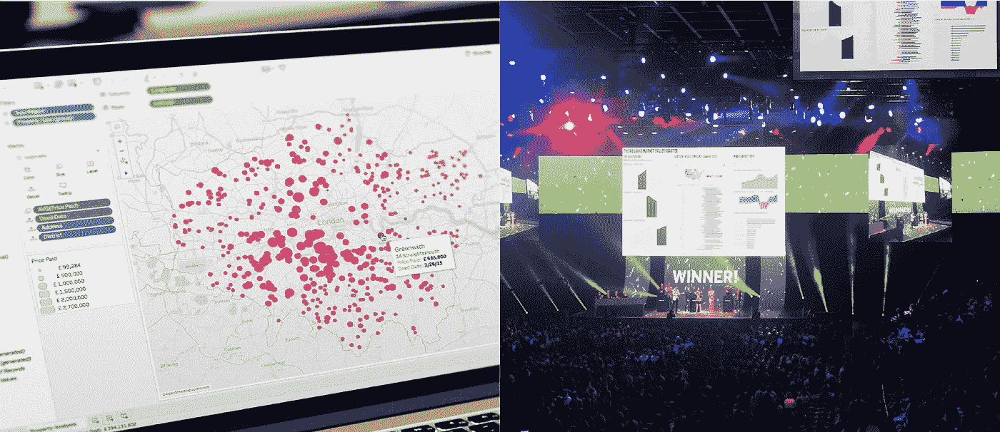
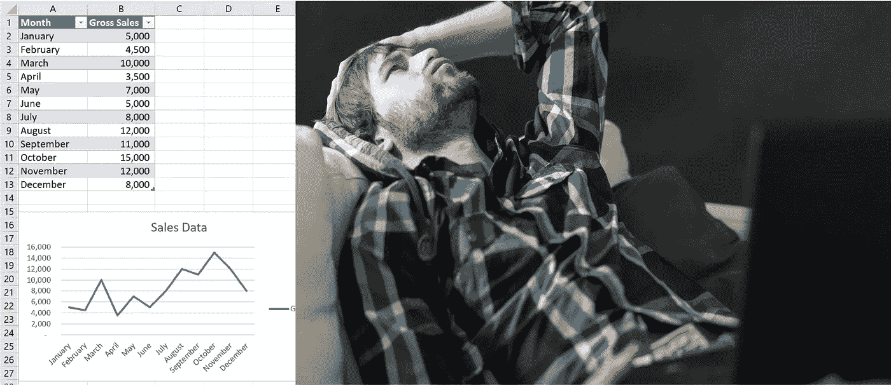
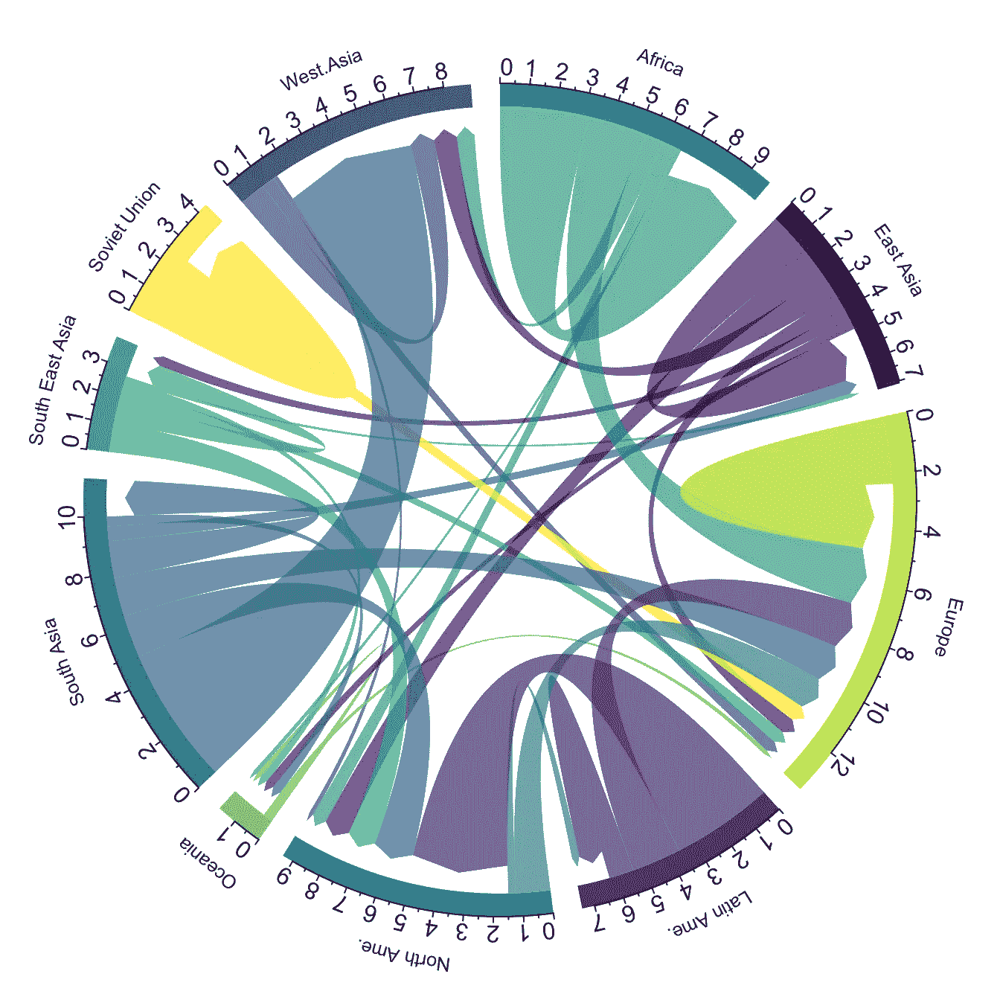
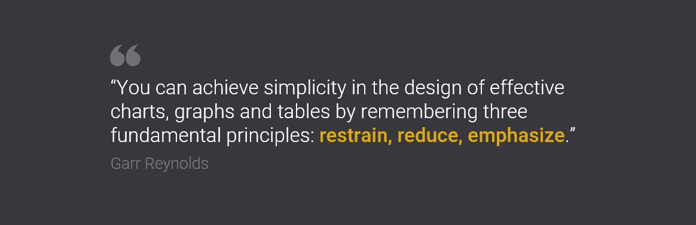

# 认为升级您的工具将使您的数据可视化更有效？再想想。

> 原文：<https://towardsdatascience.com/think-upgrading-your-tool-will-make-your-data-visualisation-more-effective-think-again-885266eca8c7?source=collection_archive---------35----------------------->

## 不是你用什么，而是你怎么用。

YanC 在 [iStockphoto](https://www.istockphoto.com/au/photo/huh-gm93196675-2511864) 拍摄的图像

随着 Tableau、PowerBI 和 Qlik 等强大的现代化数据可视化工具越来越多，很容易认为升级您的工具集将使您的仪表盘和图表更具吸引力和影响力。但是有效的数据呈现是关于你如何可视化它，而不是你用什么工具来构建视觉。

## 令人瘫痪的选择问题

让我先说我喜欢 Tableau。可笑的是。那是一见钟情。它不仅仅是易用性和冷静，最小化的用户界面和视觉效果。这是一个邪教般的社区，会议的能量和兴奋，对极客世界的公开庆祝和对数据的热爱。

图片由[的画面](https://www.tableau.com)

我上几个工作场所都没用 Tableau，就买了个人副本在家用！这并不像听起来那么疯狂，我有一个数据 viz side hustle——尽管我认为我会不顾一切地购买它！

相比之下，我对 Excel 作为可视化工具的热爱花了更长的时间，也许是几十年。这更像是一种爱恨交加的关系，只是因为我(被迫)花时间学习如何绕过它的限制，我才了解到它隐藏的潜力。

Katarzyna Bialasiewicz 在[上的照片](https://www.istockphoto.com/au/photo/depressed-man-sitting-on-the-couch-gm492456184-76307193)

## 强力 Excel

今天的 Excel 比过去的 Excel 更友好、更好，但就数据可视化而言，它的默认设置仍然不够好。在 Excel 中制作一个专业外观的图表是完全可能的，也不会太难，但确实需要额外的努力，有时甚至需要蛮力。

现代 BI 和数据可视化平台，如 Tableau、PowerBI 和 Qlik，使构建图表和仪表盘变得更加简单快捷。他们的图表默认值是按照最佳实践数据可视化来设计的，因此比以往任何时候都更容易制作出看起来非常专业的东西。

但是专业的视觉效果并不一定有效。

那么，如果不是工具，那么是什么让你的数据视觉有效呢？斯蒂芬·诺曾经说过:

> *“数据可视化是抽象信息的图形显示，有两个目的:理解和交流。”—斯蒂芬·诺*

呈现数据是为了向观众传达信息。正如斯蒂芬·诺什明智地指出的那样，要想有效，它必须:

1.  有意义，而且
2.  传达关键信息

这里的关键是，它需要有意义，并向你的观众(而不是你)传达信息。为了实现这一目标，您需要考虑您的受众对数据的熟悉程度以及他们的数据素养水平。如果观众不知道如何阅读，就没有必要展示一个巧妙的替代图表类型。以这张和弦图为例，它在视觉上和信息上都令人惊叹，但我怀疑我的经理或她的经理是否知道如何理解它。

图像由[数据到 Viz](https://www.data-to-viz.com/graph/chord.html)

## **讲道理还不够**

条形图是准确的，并且被所有人普遍理解，但这并不使它们成为传达所有类型信息的最佳图表类型。谷歌一下'[图表选择器](https://www.google.com/search?q=chart+chooser&tbm=isch)，你会找到 100 个好资源。更深入地看，它们都有一个共同点——它们根据需要传达的信息类型(比较、关系、分布等)对图表类型进行分组。).

聚集柱形图和条形图是条形图的自然延伸，也是性能仪表板的主要部分，例如，它们在传达差异方面并不特别有效！

哇，什么？！我的仪表板上全是簇状条形图和柱形图！是的，是时候重新考虑这个选择了。原因如下…

## 认知负荷

他们做了工作，但做得不好。认知负荷是这里的区别。条形图旨在有效地传达一个值或比较一系列值。然而，对于一系列成对的值，他们要求观众比较每一对的值，确定差异，记住它，然后继续下一对，再下一对。那是许多工作。相比之下，哑铃图直接关注每对数值之间的差异——工作量更少，效率更高！

查看我在 Excel 中创建哑铃图的[步骤](https://medium.com/@tessica.dall/need-to-emphasize-change-in-your-dashboard-forget-bar-charts-use-dumbbell-charts-instead-84b97c591f12)(超级简单！).

如果你的听众需要思考，如果兴趣的洞察力不是立即显而易见的，那么你的观想就没有它需要的那么有效。

图表选择并不是你减少认知负荷的唯一手段(尽管它是最有力的手段)。使用深思熟虑的风格选择，如:

*   清除杂物
*   标记值或使用轴，但不能两者都用
*   直接标记您的系列，而不是使用图例
*   故意使用颜色来强调兴趣点，淡化其他数据

帮助引导你的听众快速找到最重要的信息。加尔·雷诺兹说得好…

## 重要的不是你用什么，而是你如何使用它

当你改变你的工具时，数据可视化的基础不会改变。设计选择、合适的图表类型、减少认知负荷、考虑受众的知识和数据素养是关键的差异化因素。好的工具可以产生坏的图表，而“坏”的工具可以产生好的图表。

不是你用什么，而是你怎么用！