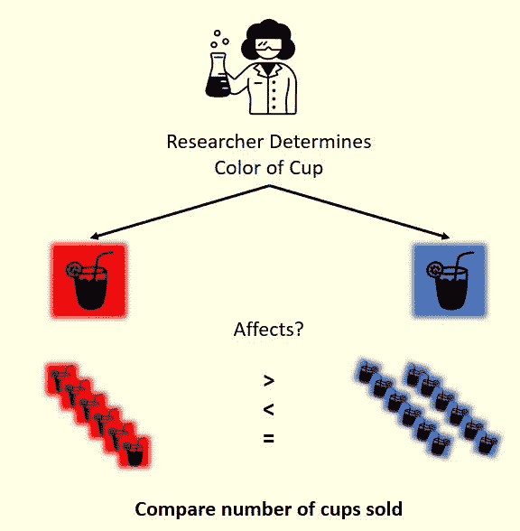

# 关于实验设计的思考

> 原文：<https://towardsdatascience.com/thinking-about-experimental-design-f7f3090c7b6d?source=collection_archive---------59----------------------->

## 不言而喻(但经常被遗忘)的实验基础

照片由 Pexels 上的 [Pixabay](https://www.pexels.com/@pixabay) 拍摄

最近，当我浏览我最喜欢的数据科学媒体和 LinkedIn 订阅源时，我发现越来越多的文章鼓励(重新)关注基本面:**概率、统计和假设检验**。在这个关于实验设计的简短系列中，我希望对实验设计过程给出一个直观的(数学精简版)概述，突出其细微差别，以及一些相关的统计主题，包括随机抽样、分布和测试统计。这个系列深受 LinkedIn 课程*和 Monka Wahi 的实验设计数据科学*的影响，既是为了给读者提供信息和娱乐，也是为了我自己的学习。尽情享受吧！

## **答:简介:**

作为一名有抱负的数据科学家，我发现自己经常深入研究详细介绍最新深度学习算法应用的文章。也许是机器学习算法的可访问性增加(适用于单行代码 *model.fit* )或人工智能承诺的有效性和生产率的雄心勃勃的飞跃，吸引了我和一代有抱负的数据科学家，并激励我们专注于复杂的设计。不幸的是(或者幸运的是)，许多现实世界的数据问题不需要使用这些算法；一些问题可能会避开这些算法的使用，而倾向于更多的资源轻量级、可解释的解决方案。

在这篇介绍中，我将尝试为*实验设计*奠定基础，这是统计学&科学交叉的一个基本元素，不涉及复杂的数学或算法。

## **B .实验设计的目标:**

在我的大学生涯中，我在一门关于调查统计的课程中接触到了实验和假设检验。在课堂上，我操纵预先确定的实验结果/问题的公式和数字，以展示对概念的理解。然而，作为一名现实世界的数据分析师/科学家，工作中必不可少的一部分是*识别*问题和*设计*实验，这是由学术界的教授和教科书完成的任务。因此，尽管直接研究 A/B 测试的统计数据或不同测试统计数据的分析会更有趣，但还是让我们回顾一下实验设计的基础。

重要的是要注意实验是耗时和资源密集型的；并不是所有的商业计划和/或决策都需要实验。事实上，实验应该主要用于调查变化、*增量、*变化的未知影响。听起来小得令人失望？当我们认识到一个实验的目标时，这并不奇怪:

> **实验的目标是比较不同条件对感兴趣的事件的影响，并提供对内在因果关系的洞察。**

为了合理地衡量各种条件之间的影响，条件之间的差异应该是可比较的、具体的，最重要的是，**由实验的研究者/所有者控制。**此外，如果实验是为了增加任何商业价值，条件应该代表具有不明显价值的权衡(如果更简单的分析和商业意识支持特定的方向，没有必要使实验统计过于复杂)。作为一个简单的、人为的例子，考虑一个柠檬水摊位的经理尝试他们的柠檬水应该使用的杯子的颜色以最大化销售。杯子的颜色代表*控制的* *条件*，对于消费者的价值是*非显而易见的*，最终销售代表利益事件*。*

测试杯子颜色对售出的柠檬水杯子的影响的简单实验。图片作者。图标:由 [Fernanda Giaccio](https://thenounproject.com/fegiaccio) &制作，由 [Iconathon](https://thenounproject.com/Iconathon1) 制作，我们在新项目上

实验的最后一个要素是它的**时间框架**。继续我们的柠檬水例子:如果销量是红杯子柠檬水销量的两倍，我们能说蓝杯子更好吗？然而，如果我告诉你，我们卖了两周蓝色杯子的柠檬水，而我们只卖了一周红色杯子的柠檬水，会怎么样？为了保持指标的可比性，应该在相似的时间内使用不同的条件。

在一项实验中:

**1。多种情况下有相似的结果**

**2。研究人员控制和/或分配参与者的条件**

**3。使用可比的时间框架很重要**

## **C .转化率指标&转化率:**

一个实验需要有一个定量的方法来比较不同条件下的结果——我称之为*转换度量*的感兴趣的度量。在我们的柠檬水示例中，，我们可以使用销售额或售出的杯子数作为我们的转换指标。然而，即使在这个简单的例子中，根据我们的业务目标，我们也可以考虑无数的额外转换指标:我们柠檬水摊位周围的客流量、售出的柠檬水数量、订单提前销售与面对面销售的数量(我们的弹出式摊位已经升级为包括电话和在线订单)，等等。

在任何情况下，在确定目标转换度量后，通常的最佳实践是将度量从计数转换为速率，并在设定的时间范围内固定该速率。转化率:

**1。提供相对于计数的长期稳定性**

**2。简化跨时间段和场景的性能比较。**

**3。通过将指标与运营战略联系起来，促进更清晰的目标**

确定我们的转换度量似乎很简单；然而，决定我们的转换指标的分母需要更多的关注和技巧。在决定分母时，有两件事要记住:它的大小和它的精度。

虽然*更大的分母*像附近的客流量一样，随着时间的推移会产生更低、更稳定的利率，但它可能无法准确代表符合条件的人群——并非所有路过的人都对柠檬水感兴趣。

这可以与*更小的分母*相比较，比如在我们商店停留的人数——聊天、拍照(我们的摊位非常 IG-friendly)或看菜单，这些人可能有更不稳定的比率，但可能更准确地反映了感兴趣的人群。

你应该数每个路过的人，还是只数那些在你的摊位前驻足的人？没有正确的答案，因为这取决于你试图衡量什么。照片由 [Abby Chung](https://www.pexels.com/@abby-chung-371167) 在 Pexels 上拍摄。

## D.结论

在这篇短文中，我只强调了实验的基本要求和让你开始思考实验设计的最初步骤。这些步骤中的每一步都包含了大量我没有提到的批判性思考和仔细的考虑。

在下一篇文章中，我们开始用实数分析这些概念:定义基线度量和探索/选择测试统计。

要了解更多关于指定和操作转化指标以及简单具体例子的信息，我强烈推荐观看旺卡·瓦希在 LinkedIn Learning 上的*实验设计的数据科学*。

[1]:莫妮卡·瓦希。(2020).*实验设计的数据科学。领英学习。*[https://www . LinkedIn . com/learning/the-data-science-of-experimental-design](https://www.linkedin.com/learning/the-data-science-of-experimental-design)

[2]: *图标&图片。pexels:*[https://www.pexels.com/](https://www.pexels.com/)|*名词项目:*[https://thenounproject.com/](https://thenounproject.com/)