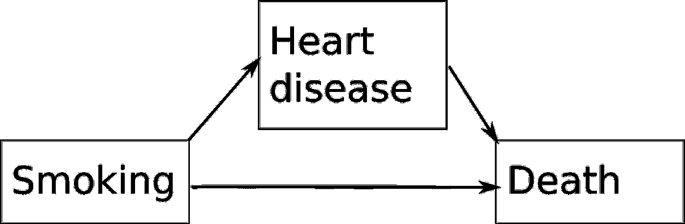

# 因果思维

> 原文：<https://towardsdatascience.com/thinking-causally-3727ec002d29?source=collection_archive---------54----------------------->

安德烈斯·西蒙在 [Unsplash](https://unsplash.com?utm_source=medium&utm_medium=referral) 上拍摄的照片

## 如何回答反事实问题——如果我们*改变*某些东西，会发生什么？

数据科学任务有三种类型:描述、预测和因果推理。我们工作的大部分重点放在预测上，这是正确的——这通常是赚钱的地方。然而，因果推理是重要的。对于我们这些从事研究的人来说尤其如此。然而，为了预测反事实，如果我们改变一些事情会发生什么，我们必须在我们的统计中变得更加正式。

# 混杂因素

首先，我们必须了解什么是*混杂因素*。混杂因素是影响我们的自变量和因变量的第三个变量，它不在自变量和因变量之间的因果路径上，从而产生*虚假关联*。因此，如果我们考虑三个变量，吸烟、心脏病和死亡，心脏病将位于吸烟和死亡之间的因果路径上，因此它是*而不是*一个混杂因素。

然而，如果我们考虑三个变量，吸烟，年龄和死亡，年龄会影响吸烟的概率，年龄也会影响死亡的概率。最后，吸烟不在吸烟和死亡之间的因果路径上(即，吸烟不会导致年龄，所以年龄不在中间)。所以，年龄是一个*混杂因素*。

这是什么意思？这意味着，如果年龄是我们唯一的混淆因素，并且我们不努力根据年龄调整，我们对吸烟导致死亡的因果影响的估计就会有偏差。

有两种主要的方法来处理混杂因素。第一个是在*设计*阶段。这里我们可以使用随机化。这意味着有 50%的机会(实际上不一定是 50%，但这通常更容易)开始吸烟，然后看看不吸烟和吸烟组之间的死亡差异。这就是我们的*因果*。这控制了已知和未知的混杂因素。然而，进行随机化并不总是实际的或道德的。

第二种方式是在*分析*阶段。在这里，我们可以通过将混杂因素添加到我们的回归模型中来调整混杂因素。这将允许我们把吸烟的系数解释为在混杂因素不变的情况下吸烟对死亡的因果影响。我们还可以使用更复杂的 [*倾向评分方法*](https://en.wikipedia.org/wiki/Propensity_score_matching) 。这仅控制已知混杂因素的*。*

但是，你不能把你认为与结果相关的每一个变量都放进去。如果你这样做，你可能会得到*碰撞器偏差*，我们稍后会看到。你只能而且必须调整与*暴露*和*结果*相关的变量，这些变量不在暴露和结果之间的因果路径上。

# 有向无环图

我们如何记录我们的因果假设？提前。在查看数据之前，我们必须指定我们认为的混杂因素，以避免数据窥探偏差。你可以通过观察其他人做了什么，并利用关于这个问题的常识来做到这一点。

有向无环图。(图片由作者提供)

然后我们可以画出一个*有向无环图* (DAG)。这是一个图，其中变量是我们的节点，两个顶点 *A → B* 之间的有向边意味着 *A* 导致 *B* 。

# 获得我们的因果估计

假设我们正确地指定了我们的因果 DAG，我们现在可以获得我们的因果估计。如果只是三个变量的情况，我们可以简单地将混杂因素添加到我们的回归模型中。在我们的例子中，吸烟的估计现在是吸烟对死亡的*因果*影响。然而，如果有 3 个以上的变量，我们就很难看出应该调整什么。特别是，我们可能会通过调整不正确的事情而引入*偏差。*

为了确定我们应该调整什么，我们可以应用 *d 分离*算法。这是一种算法，它寻找我们可以调整的最小变量集，这样，如果两者之间没有真正的关系，我们的暴露和结果将是有条件独立的。这是一个非常繁琐的手动应用算法。不过我们可以用一些软件比如 [DAGitty](http://www.dagitty.net/) 来做到这一点。

*来源:Polzer 等人，2012 年。*[*https://link.springer.com/article/10.1007/s00784-011-0625-9*](https://link.springer.com/article/10.1007/s00784-011-0625-9)

假设我们有一个非常复杂的 DAG。d 分离表明，我们必须调整年龄、酒精、糖尿病、肥胖、社会心理、性别、吸烟、运动，以获得牙齿缺失对死亡率的因果影响(当然假设 DAG 是正确的！).

# 结论

希望这给了你一点关于因果思考的洞察力。有一些优秀的书籍，比如朱迪亚·珀尔的《为什么》，如果你想读更多的话，她在这个领域做了惊人的工作。由此得出的关键点是，在没有随机化的情况下，*有可能获得因果估计。它需要用 DAG 仔细指定因果模型，并且需要您正确地指定您的模型。这超出了本文的范围，但是除了正确识别混杂因素之外，您还必须正确指定您的模型。这意味着对计数数据使用泊松回归模型，测试混杂因素之间是否存在相互作用，测试暴露/混杂因素对结果的影响是否是线性的，如果不包括多项式项。*

一旦你做了所有这些，你就有了因果估计。小心地用你所做的假设来陈述。只有你的假设是正确的，才能解释为因果，人们可能不同意你的假设。

当然，你要考虑是要进行因果推断，还是仅仅进行预测。如果你只是对预测感兴趣，你可能不需要这种形式。然而，如果你关心反事实，如果你改变了什么会发生什么，那么你应该关心这个。

同样，挑战你的因果假设也是值得的。如果你把你的 DAG 的结构改成另一个看似合理的 DAG，看看你的 *A* 对 *B* 的因果效应有多稳定。