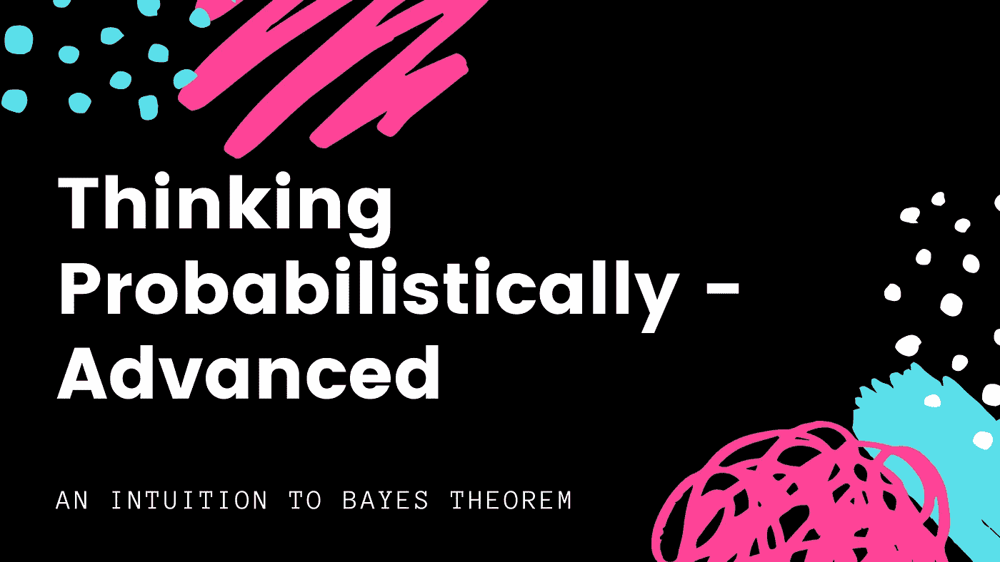
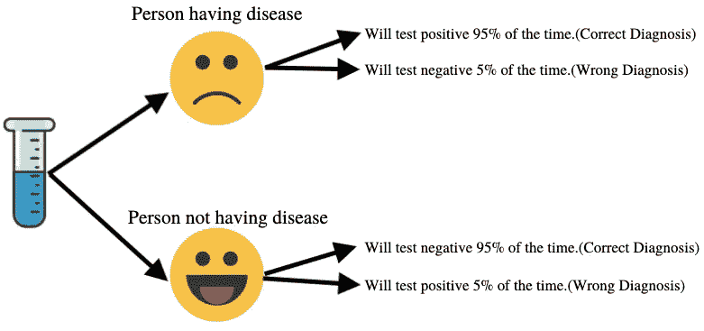
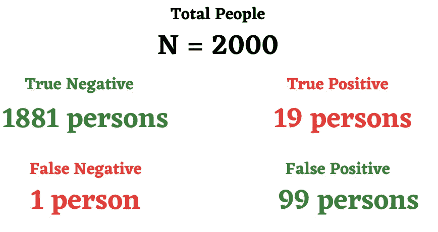
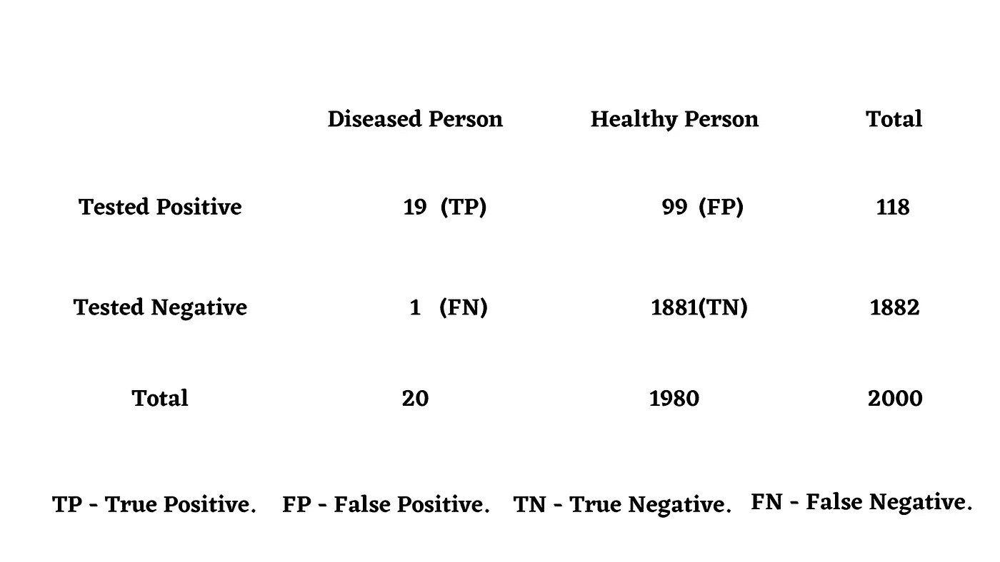

# 概率思维——高级

> 原文：<https://towardsdatascience.com/thinking-probabilistically-advanced-9ebf9b94c803?source=collection_archive---------71----------------------->

## 让我们试着理解条件概率和贝叶斯定理背后的直觉。

使用 Canva 创建

在我之前的[文章](/thinking-probabilistically-fundamentals-da956e5ca077)中，我讨论了概率背后的直觉和一些相关的基本术语。现在让我们试着理解一些概率中的高级概念。像往常一样，让我们用现实生活中的例子来试着理解这些概念。

# 条件概率

很久很久以前，在一个叫约翰的小镇上。约翰了解了影响那个村庄近 1%人口的致命的条件性病毒。忧心忡忡的约翰去医院做检查。不幸的是，约翰的条件病毒测试呈阳性。约翰怀疑测试是否有误，但医院告知测试准确率为 95%。这对约翰来说意味着什么？

请注意，测试可能有两种错误的方式。

**假阳性—** 一个人可能对某种疾病检测呈阳性，而他/她*却没有。*
**假阴性** —一个人可能对某种疾病检测呈阴性，他/她*确实有。*

测试正确的另外两种情况是-

**真阳性** —一个人检测呈阳性，而*确实患有*该疾病。
**真阴性** —一个人检测结果为阴性，且*没有*这种疾病。

该测试有 95%的准确率意味着…

树形图(使用 Canva 设计)

根据以上信息，你有多确定约翰得了这种病？
一)他几乎可以肯定有这种病。他可能得了这种病。一半对一半。他可能没有这种病。(选择一个答案，暂时记在心里。)

这里我们得到一些信息 I(测试 95%准确),基于这些信息，我们预测事件 E(约翰患病)的概率，可以用 **P (E|I)表示。**

现在，让我们想象这个测试是为那个村子里的每个人进行的。结果如下-

使用 Canva 创建

现在让我们看看消极的结果。只有一个受病毒影响的人测试呈阴性，这看起来很好。现在看看积极的结果。这里我们看到大量的人是虚惊一场。(假阳性= 99 意味着 99 个健康个体被检测为阳性，这非常糟糕)。

从上表我们可以看出，检测呈阳性的总人数是 118 人。在 118 人中，只有 19 人被真正感染，其余 99 人是被错误诊断为阳性的健康人。现在，如果你被检测为阳性，被感染的概率大约是 16%。(答案的证明后面会有。)
**选择了选项 D 的人给自己竖起大拇指吧！如果测试结果呈阳性，那么真的被感染的可能性非常小。**

现在，基于新的信息 I(整个村庄的测试统计)，事件 E(约翰患病)发生的概率 P(E|I)完全改变了。(我猜你们大多数人都没有想到这一点！)

> 一般来说，当我们面对新信息时，我们对不确定信息的信念会改变。

我们每天都会基于不确定性做出很多判断。例如，我们根据天气预报、外面的天气以及朋友的建议等信息来做出关于天气的决定。我们根据我们在报纸上读到的内容、我们对球队实力的了解以及与朋友的讨论来决定我们认为谁将赢得一场体育赛事。**条件概率**是一种简单的量化我们对给定信息下的不确定事件的信念的方法。对于两个事件 A 和 B

## 独立事件

如果一个事件的发生不影响另一个事件，则称这两个事件是独立的。例子-在第一次掷骰子时得到 6 与在第二次掷骰子时得到 1 是独立的。对于独立事件—
**P(A∩B) = P(A)⋅P(B)**

## 从属事件

如果一个事件的发生确实影响到另一个事件，那么这两个事件就被称为是相关的。示例-从袋子中取出弹珠。每次我们移除某个颜色的弹珠，移除相同颜色弹珠的概率都会发生变化。对于依赖事件—
**【p(a∩b)=p(a)⋅p(b|a】**

## 互斥事件

如果两个事件 A 和 B 互斥，那么它们不可能都发生，也就是说(A ∩ B)是不可能事件(而不可能事件的概率永远是 0)。示例-当我们掷出普通的六面骰子时，得到 5(事件 A)和 3(事件 B)。不可能同时得到 5 和 3。对于互斥事件—
**P(A∩B)=0**

现在，如果我们只想求 **P(T+)，一个随机选择的人得到正结果的概率呢？**当某人获得肯定结果时，有两种可能的情况:

1.  这个人感染了条件性病毒，并得到阳性结果。
2.  此人未感染条件性病毒，并得到阳性结果。

*在第一个场景*中，请注意发生了两个事件:此人感染了病毒，并被检测为阳性(病毒∩ T+)。

*在第二个场景*中，发生了两个事件:这个人没有携带病毒，并且被检测为阳性(没有病毒∩ T+)。

由于*只有*两种可能的场景，我们可以把事件 T+理解为事件(病毒∩ T+)和(无病毒∩ T+)的并集:

**T+=(病毒∩T+)∩(无病毒∩ T+)**

我们已经知道:P(A∪B)= P(A)+P(B)—P(A∪B)

事件(病毒∩ T+)和(无病毒和 T+)是**互斥的**(它们不能同时发生)，因为一个被检测为阳性的人不能同时携带和不携带病毒。这就意味着我们可以用:P(A∪B)=P(A)+P(B)
来计算它们并的概率(P(A∪B)= 0 表示互斥事件)。

**P(T+)=P(病毒∩ T+)+P(无病毒∩ T+)**

病毒和 T+是相关事件，因为测试结果取决于一个人是否携带病毒。因此 p(病毒∩ T+) = P(病毒)* p(t+|病毒)
(对于相关事件 P(A∩B)=P(A)⋅P(B|A))

**P(T+)=P(病毒)* P(T+|病毒)+ P(无病毒)* P(T+|无病毒)**

p(T+)= 0.01 * 0.95+0.99 * 0.05 = 0.059

我们看到 P(T+)——检测阳性的概率——只有*5.9%***。这主要是因为首先感染病毒的概率非常低。**

# **贝叶斯定理**

****

**使用 Canva 设计**

**在上图中，先验概率是指在接受检测前患病的概率。我们发现 P(E) ie。P(T+) = 0.059 以上。这个公式最难的部分是找出先验概率。在我们的案例中，正如我们在上面讨论的，1%的人口受到条件病毒的影响，我们可以认为先验概率为 0.01。
P(E|H) = P(T+ | H) = 19/20 = 0.95。**

**现在 P(H | E)=(0.95 * 0.01)/0.059 = 0.16 = 16%(这里是我上面提到的证明)。16%被称为**后验概率**。**

**Bayes 最初考虑了一个思维实验，他坐在桌子前，让他的助手在桌子上扔一个球。现在，这个球可以落在桌子上的任何地方，他想知道它在哪里。所以他让他的助手扔上另一个球，并告诉他下一个球是在第一个球的左边，右边，顶部还是底部，Bayes 会记下并要求越来越多的球扔在桌子上。贝叶斯意识到的是，通过这种方法，他能够更新他对第一个球在哪里的想法。当然，他永远无法确定球的准确位置，但随着每一个新的证据，他可以越来越准确，这就是我们如何看待世界。我们并不完全理解它，但是随着我们获得证据，我们提高了理解能力。**

**让我们考虑一个人，他在山洞里呆了半辈子，突然第二天看到了日出，觉得‘每天都这样吗？’随着时间的推移，这个人明白了世界就是这样运转的。因此，贝叶斯定理并不是一个只能使用一次的公式，而是可以多次使用的，每次都可以获得新的证据，更新某事为真的概率。**

**现在让我们回到约翰身上。让我们假设约翰去了另一家医院做测试，第二次测试结果也是阳性。现在概率发生了什么变化？我们将应用相同的公式，但改变一个变量。我们将使用后验概率而不是先验概率来计算新的概率。**

**P(H|E) = (0.95 * 0.16)/0.059 = 2.5，大于 100%，这意味着约翰肯定受到条件病毒的影响。**

# **结论**

**在本文中，我试图通过举例说明来讨论条件概率和贝叶斯定理背后的直觉。我希望你今天带了新东西回家！**

**如果你有什么建议，我很乐意听听。在我的下一篇文章中，我将解释广泛使用的假设检验概念。在那之前，呆在家里，保持安全，继续探索！**

**如果你想联系，请在 [**LinkedIn**](https://www.linkedin.com/in/saiteja-kura-49803b13b/) **上**联系我。******