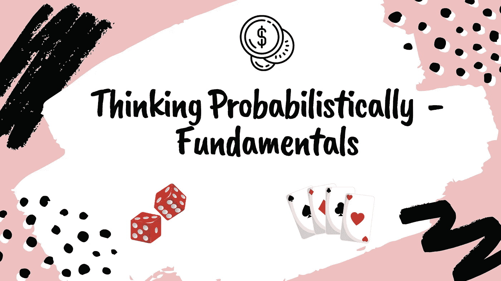
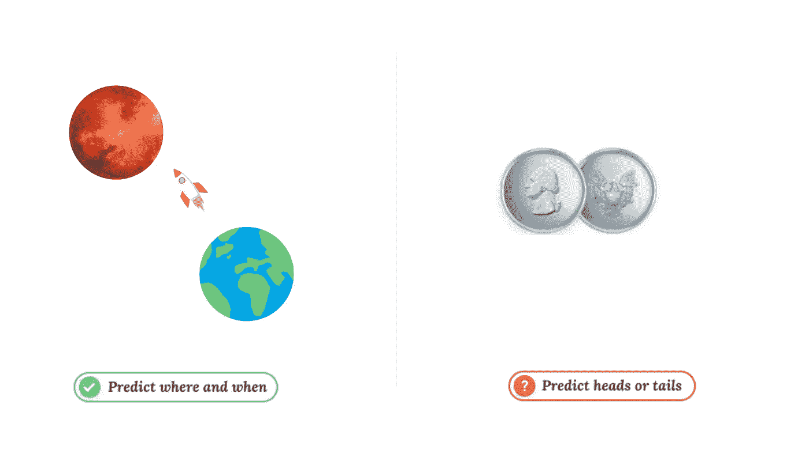
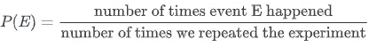
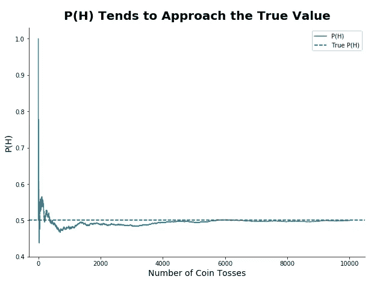
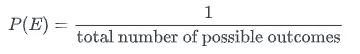
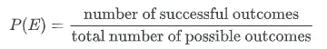
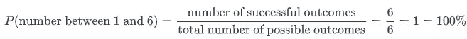
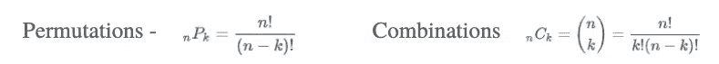
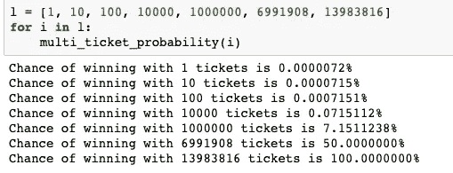

# 概率思维—基础

> 原文：<https://towardsdatascience.com/thinking-probabilistically-fundamentals-da956e5ca077?source=collection_archive---------84----------------------->

## 除了统计学，让我们通过理解相关术语和案例研究来学习概率语言。

使用 Canva 设计

在过去的几个世纪里，科学和工程取得了惊人的进步。我们现在能够从地球上发射宇宙飞船，并预测它将在某个时间和地点到达火星。然而，看起来并不是所有的事情都像宇宙飞船的轨迹一样容易预测。

以扔硬币为例——虽然听起来很荒谬，但我们无法肯定地预测硬币会正面朝上还是反面朝上。这是因为抛硬币是一种非常复杂的现象。结果取决于多种因素——投掷的力度和角度、落地角度、硬币落地的表面等。

使用 Canva 设计

尽管我们无法预先知道掷硬币的结果，但我们至少能够估计硬币正面或反面落地的**概率**(几率)。这听起来像是一种限制，在某种程度上确实如此，但是估计概率是一种非常强大的技术，它可以使我们构建重要的应用程序，包括:

*   图像识别系统(用于自动驾驶汽车、医疗诊断等。)
*   收件箱的垃圾邮件过滤器。
*   统计假设检验。

# 术语

每当我们不能确定地预测结果时，我们就在和一个**随机实验**打交道。

抛硬币是一种随机实验，就像抽彩票号码或掷骰子一样。术语“实验”可能会让你想到科学，但这个术语在这里有更广泛的含义——随机实验是任何我们无法确定预测结果的过程。

一个**结果**是随机实验可能终止的任何结果。例如，滚动六面骰子的所有可能结果是 1、2、3、4、5 和 6。

虽然我们不能预测随机实验的结果，但我们至少可以估计与结果相关的概率(机会)。抛硬币有两种可能的结果，我们可以估计硬币正面或反面落地的概率。

一般来说，对于任何事件 *E* (就像一枚硬币正面朝上落地)，我们可以通过下面的公式找到它的概率:

当我们通过执行一次或多次实验来计算事件的概率时，我们计算事件的**实验** —或**经验概率** —。

我们假设，我们把一枚硬币抛 300 次，发现 *P(H)* = 46%。然后，我们将一枚硬币抛 5000 次，发现 *P(H)* = 51%。但是如果不同的投掷次数给出不同的概率值，那么 *P(H)* 的真实值是多少？

为了回答这个问题，我们要做一个思维实验，假设我们已经知道 *P(H)* 的真实概率是 50%。我们还假设得到反面的机会是一样的，所以 *P(T)* = 50%

利用这些假设，我们将使用 Python 模拟一次抛硬币 10，000 次，并观察 *P(H)* 如何随着抛硬币次数的增加而演变。

上面我们看到，对于最初的 1000 次左右的投掷， *P(H)* 的值变化很大，最大值为 1.0，最小值约为 0.45。但是，随着投掷次数的增加， *P(H)* 的值趋于稳定。

有趣的是， *P(H)* 稳定在 *P(H)* 的真值附近，我们假设为 *P(H)* = 50% = 0.50。这表明投掷硬币的次数越多， *P(H)* 就越接近真实值。

现在我们明白，正确计算经验概率需要我们多次进行随机实验，这在实践中可能并不总是可行的。估计概率的一个更简单的方法是从假设随机实验的结果有相同的发生几率开始。这允许我们使用下面的公式来计算事件发生的概率 *E* :

当我们在假设结果发生的几率相等的情况下计算一个事件的概率时，我们说我们在计算一个事件的理论概率。

例如，掷硬币的可能结果有两种:正面或反面。设 *H* 是硬币正面落地的事件，而 *T* 是硬币反面落地的事件。我们可以用上面的公式求出 *P(H)* 和 *P(T)* :

P(H)=1/2=0.5

P(T)=1/2=0.5

理论上的概率更容易计算，但在实践中，假设随机实验的结果发生的几率相等并不总是有意义的。例如，在一场板球比赛中，我们可以看到双方获胜的概率。这并不总是 50-50，而是根据条件、历史等不断变化。

假设在掷出六面骰子时，我们将得到 1 到 6 之间的任何数字(包括 1 和 6)。结果是 1，2，3，4，5 和 6，所以我们有 100%的机会得到 1 到 6 之间的某个数字。然而，使用我们的公式，我们发现概率只有 16%:

p(1 到 6 之间的数字)=1/6=0.16=16%

要解决这个问题，我们需要将上面的公式更新为:

**排列组合**

在英语中，我们使用术语**组合**而不考虑顺序。例 1——我的水果沙拉是芒果、香蕉和苹果的组合。
例 2——我的保险箱密码组合是 472。

在例 1 中，顺序是不重要的。先放香蕉还是先放苹果，都是一样的水果沙拉。但是在示例 2 中，顺序非常重要。742 是我保险箱的错误密码。

当顺序很重要时，它就是排列。
当顺序无关紧要时，它就是组合。

当我们有一组 *n* 对象，但我们只取了 *k* 对象时，

# 案例研究——彩票成瘾手机应用

一家旨在预防和治疗赌博成瘾的医疗机构希望建立一个专用的移动应用程序，以帮助彩票成瘾者更好地估计他们的中奖机会。该研究所有一个工程师团队将构建应用程序，但他们需要我们创建应用程序的逻辑核心并计算概率。

对于该应用程序的第一个版本，他们希望我们专注于 [6/49 彩票](https://en.wikipedia.org/wiki/Lotto_6/49)(您将获得一张由 1-49 的 6 个数字组成的彩票，如果您彩票上的 6 个数字都与抽奖相符，您将获胜)并构建功能，使用户能够回答以下问题:

*   单票中大奖的概率有多大？
*   如果我们玩 40 张不同的彩票(或者其他任何数字而不是 40)，中大奖的概率是多少？

让我们定义两个贯穿始终的函数。

现在我们需要找出给定彩票中奖的概率。我们将编写一个函数`one_ticket_probability()`,它将接受一个包含 6 个数字的列表(每张彩票包含 6 个数字)作为输入，并将打印获胜的概率。

彩票迷通常在一张彩票上玩多张彩票，认为这可能会大大增加他们中奖的机会

现在让我们编写一个函数，允许用户计算任意数量的不同彩票的中奖几率(彩票总数为 13983816)。

上面选择的案例研究摘自 **dataquest.io.**

# 结论

我们讨论了概率背后的直觉，以及在不确定的情况下概率是如何有用的。我们还试图理解基本术语，并在彩票案例研究中应用我们所学的知识。在接下来的文章中，我们将讨论最常用的假设检验概念。希望你今天带了一些新概念回家！呆在家里，注意安全！