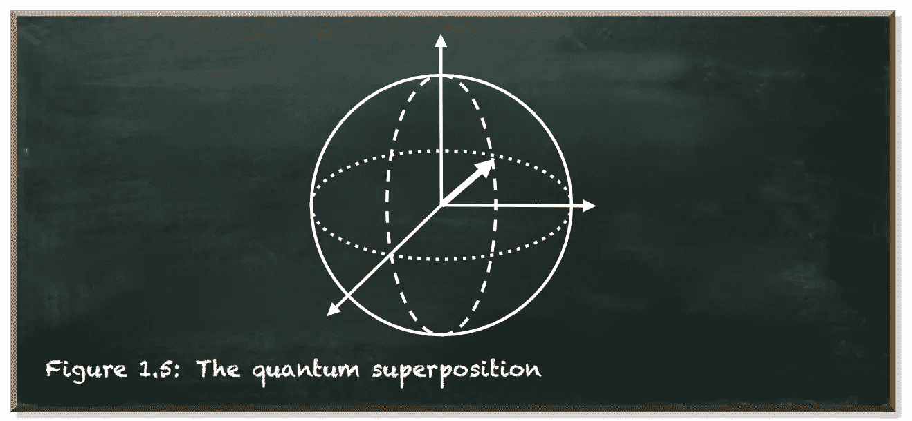
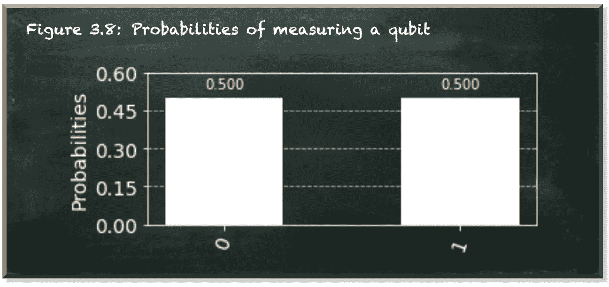
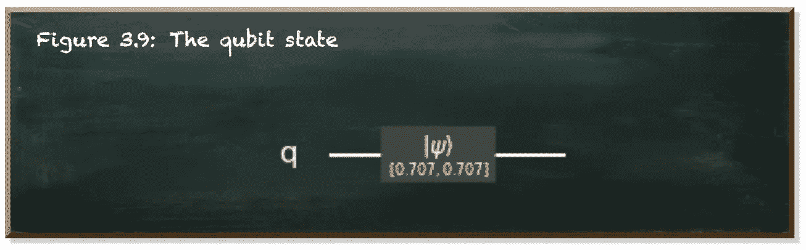
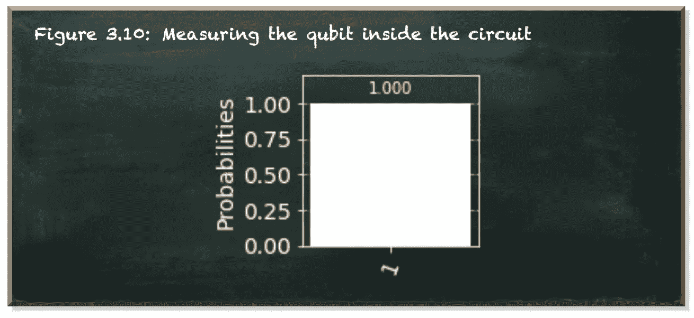
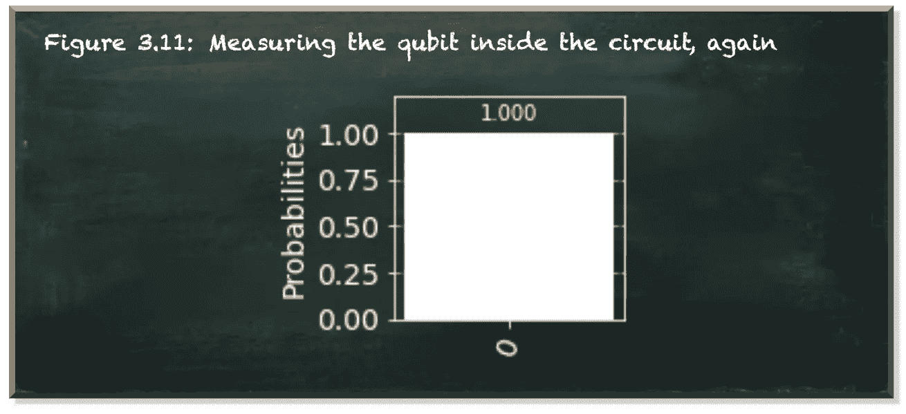
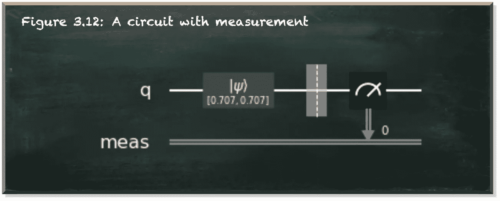
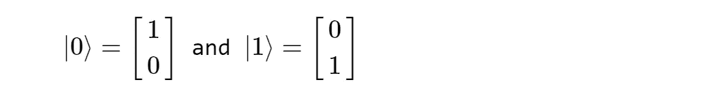
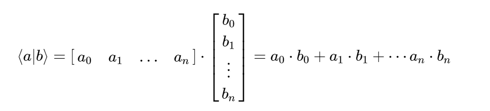
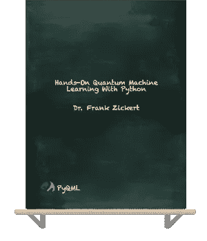

# 这改变了你“看待”量子计算的方式

> 原文：<https://towardsdatascience.com/this-changes-the-way-you-see-quantum-computing-53fcebcac479?source=collection_archive---------26----------------------->

## 探索量子观察者效应

本帖是本书的一部分: [**用 Python 动手操作量子机器学习**](https://www.pyqml.com/page?ref=medium_see&dest=/)

作者弗兰克·齐克特的图片

一个量子位是一个两能级的量子系统，除非你观察它，否则它是|0⟩和|1⟩量子态的叠加。([这里有更多关于量子位状态的内容](/hands-on-exploration-of-the-qubit-815bee3f30dd))。一旦你观察到它，测量`0`或`1`的概率是不同的。在物理学中，这被称为观察者效应。它说仅仅观察一个现象不可避免地会改变这个现象本身。例如，如果你在测量你房间的温度，你就带走了一点能量来加热温度计中的水银。这种能量的损失会使你房间的其余部分降温。在我们所经历的世界中，观察的影响通常可以忽略不计。

但是在量子力学的亚原子世界里，这些效应很重要。它们很重要。仅仅观察一个量子比特，它的状态就会从|0⟩态和|1⟩态的叠加变成任意一个值。因此，即使是观察也是我们在开发量子电路时需要考虑的对系统的操纵。

这是一个简单量子电路的代码。

加权初始状态

当您运行代码时，您将看到以下输出。

作者弗兰克·齐克特的图片

我们的电路由一个量子位组成(第 6 行)。它有初始状态`[1/sqrt(2), 1/sqrt(2)]`(第 9 行)，我们用它初始化量子电路(第 12 行)。

这是狄拉克和这种状态的向量符号:

我们添加一个模拟后端(第 15 行)，执行电路并获得结果(第 18 行)。`result`对象提供了`get_counts`函数，该函数提供了我们量子位的最终(观察到的)状态的概率。

让我们看看我们的电路。`QuantumCircuit`提供了渲染电路图图像的`draw`功能。提供`output=text`作为命名参数，以获得图像的 ASCII 艺术版本。

绘制电路

作者弗兰克·齐克特的图片

该图在左边显示输入，在右边显示输出，以及它们之间的操作。

这里看到的是我们的单个量子位(`q`)及其初始化值(1/sqrt(2)=0.707)。这些值既是我们电路的输入，也是输出。当我们执行这个电路时，我们的`result`-函数计算|0⟩和|1⟩.叠加态的量子比特因此，在任一状态下，我们都有 50:50 的机会捕捉量子位元。

让我们看看，如果我们把量子位作为电路的一部分来观察，会发生什么。

测量电路

作者弗兰克·齐克特的图片

*“哇哦？!"*

我们得到一个 100%概率的结果状态`1`。那不可能是真的。让我们重新运行代码...(我知道，做同样的事情却期待不同的结果是精神错乱的表现)

作者弗兰克·齐克特的图片

又来了。100%测量概率…等等…是状态`0`。

不管你多长时间运行一次这段代码，你都有 100%的概率得到`0`或者`1`。事实上，如果您多次重新运行代码并计算结果，您会看到 50:50 的分布。

听起来很可疑？是的，你说得对。让我们看看我们的电路。

作者弗兰克·齐克特的图片

我们的电路现在包含一个测量。这是一个观察。它将我们的量子位拉出叠加态，让它坍缩成`0` **或** `1`。当我们后来得到结果时，已经没有什么量子了。这是一个独特的价值。这是电路的输出(右边)。

我们是否观察到一个`0`或一个`1`现在是我们量子电路的一部分。

> 底部测量线的小数字并不能描述量子位的价值。这是测量的指标。它从 0 开始计数。下一次测量将会有数字 1、2 等。

有时候，我们称测量为量子位元状态的崩溃。这个概念强调测量的效果。与经典编程不同，在经典编程中，您可以随时检查、打印和显示位的值，而在量子编程中，它会对您的结果产生影响。

如果我们不断地测量我们的量子位来追踪它的值，我们会让它保持在一个明确的状态，不是`0`就是`1`。这样的量子比特和经典比特没有什么不同。我们的计算很容易被经典计算所取代。在量子计算中，我们必须允许量子位元探索更复杂的状态。因此，只有当我们需要提取输出时，才使用测量。这意味着我们经常把所有的测量放在量子电路的末端。

# 测量作为一种操作

但是测量如何改变状态呢？用数学术语来说，测量是一种操作。([这里有更多关于量子位操作的内容](/you-dont-need-to-be-a-mathematician-to-master-quantum-computing-161026af8878))

在量子电路中，我们称操纵算子为“门”。单量子比特门是将单个量子比特转换成另一个(可能是相同的)量子比特的线性操作器。门是在这些状态之间改变量子位的操作。

当我们测量一个量子位时，它会坍缩到`0`或`1`。让我们用数学术语更仔细地看看这个观察结果。

顾名思义，量子态矢量就是矢量。我们如何改变向量？对，通过乘法。

我们知道|0⟩说我们的量子比特在被观察时会产生值`0`。|1⟩说我们的量子位在被观察时会产生值`1`。我们知道这一点

是矢量。

量子态的量度是概率。概率是一个单一的数字，称为标量。向量相乘有不同的方法。但是矢量乘法的一种特殊方式会产生标量。这叫内积。它是由列向量|0⟩乘以行向量⟨0|.得到的

内积定义为:

向量的内积

在[之前的文章](/hands-on-exploration-of-the-qubit-815bee3f30dd)中，我们介绍了**狄拉克**符号和它的“ket”——表示向量的构造(/kɛt/) (|0⟩)。现在，我们介绍“胸罩”结构(/brɑː/) (⟨0|).胸罩是一个行向量。

那么，从|0⟩测量出`1`的概率有多大呢？让我们构建内积来找出答案:

而且测到`0`的概率有多大？

太好了！尽管这是非常数学化的，但它说明了我们如何从量子态中获得一个值。用状态向量乘以行向量。

# 结论

在这篇文章中，我们探索了量子观察者效应。我们知道了一个量子叠加系统是如何通过测量来改变的。虽然观察者效应也存在于我们所经历的世界中，但它通常可以忽略不计，我们也不需要在意。

但是在量子力学的亚原子世界里，这很重要。这对量子计算很重要。如果你在量子电路中一遍又一遍地测量你的量子位，你会把它保持在受控状态`0`或`1`。

为了利用量子计算机提供的可能性，你必须让你的量子位保持在叠加态，直到你的计算结束。你不能一直观察你的量子位

…尽管这个小东西做的事情很有趣…

本帖是本书的一部分: [**用 Python 动手做量子机器学习**](https://www.pyqml.com/page?ref=medium_see&dest=/) **。**

在这里免费获得前三章。