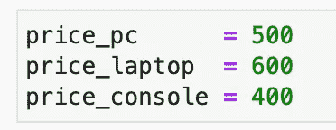
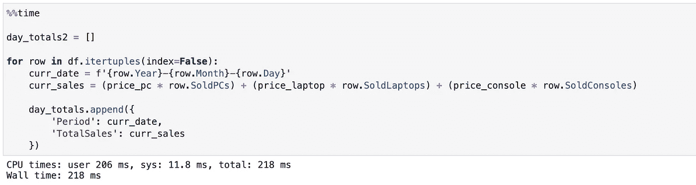

# 这个功能可以让你的熊猫编码明显更快

> 原文：<https://towardsdatascience.com/this-function-can-make-your-pandas-code-significantly-faster-d018fb5045a9?source=collection_archive---------16----------------------->

## 更准确地说是快了 35 倍

熊猫是一个很棒的图书馆，但它不是最快的。不过，有一些方法可以让它变得更快，那就是为正确的任务使用正确的工具。今天我们将探索这些工具中的一个，它将使日常任务显著加快。

照片由[阿德里安·匡威](https://unsplash.com/@lurm?utm_source=medium&utm_medium=referral)在 [Unsplash](https://unsplash.com?utm_source=medium&utm_medium=referral) 上拍摄

没有必要再写引言部分了，所以让我们快速浏览一下文章的结构，然后继续有趣的内容。这篇文章分成几个部分:

*   数据集和问题概述
*   不可行的解决方案
*   首选解决方案
*   结论

所以事不宜迟，让我们开始吧！

# 数据集和问题概述

为了演示，我们需要两个图书馆，那就是 *Numpy* 和 *Pandas* 。该数据集是完全虚构的，显示了特定日期 3 种产品的销售情况。日期被分成 3 列，只是为了让计算机更难处理。

不管怎样，这是数据集:

这里没有什么特别的，但是我们有相当多的数据— 100K 行。下面是前几行的样子:

我们知道某一天卖出了多少件商品，但不知道单价，所以让我们快速声明一下:

厉害！以下是我们的最终目标(针对每一行):

*   将`Year`、`Month`和`Day`组合成一个变量
*   用单价乘以销售量来计算每天的利润
*   将这两个变量作为键值对添加到一个列表中

我们也想尽快完成这项工作。有多种方法可以解决这个问题，但其中只有一种是最佳的。

在我们宣布这种类型任务的可行方法之前，让我们先探讨一下不要做什么。

# 不可行的解决方案

正如上一节所讨论的，我们有相当多的工作要做。这并不意味着计算机需要很长时间才能完成。你会惊讶于这一切完成得有多快。

但是首先，让我们探索两个选项中最糟糕的一个，那就是使用`iterrows`函数遍历数据帧行并执行计算。

代码如下:

因此，我们已经完成了前面几节中描述的所有任务，完成这些任务几乎用了 8 秒钟。

你可能会认为事情没那么糟，但是等着看我们下一步做什么吧。

# 首选解决方案

如果你觉得`iterrows`不错，那就等着见`itertuples`吧。这是一个类似的函数，用于遍历数据帧的行，但是它的速度要快得多。

我们将执行相同的任务并比较执行时间。`itertuples`处理元组，所以我们不能使用括号符号访问 DataFrame 值。这是唯一的区别。

总之，代码如下:

这只花了 0.218 秒就完成了！这是 35 倍的降幅，非常显著。在这个玩具示例中，可能没有那么多，因为 8 秒钟并不是很长的等待时间，但这很容易扩展到数百万或数千万行。

记住——在执行类似的任务时，请始终使用`itertuples`。

# 在你走之前

这是我第二次讨论这个主题，但这一次数据集和问题任务对于计算机和开发人员来说要繁重得多，所以我觉得值得分享。

不要认为这 35 倍的速度提升是有保证的，因为结果可能会有所不同，这取决于任务的类型和您的硬件。尽管如此，`iteruples`每次都应该比`iterrows`表现得更好。这才是最重要的。

## [**加入我的私人邮件列表，获取更多有用的见解。**](https://mailchi.mp/46a3d2989d9b/bdssubscribe)

*喜欢这篇文章吗？成为* [*中等会员*](https://medium.com/@radecicdario/membership) *继续无限制学习。如果你使用下面的链接，我会收到你的一部分会员费，不需要你额外付费。*

 [## 通过我的推荐链接加入 Medium-Dario rade ci

### 作为一个媒体会员，你的会员费的一部分会给你阅读的作家，你可以完全接触到每一个故事…

medium.com](https://medium.com/@radecicdario/membership)