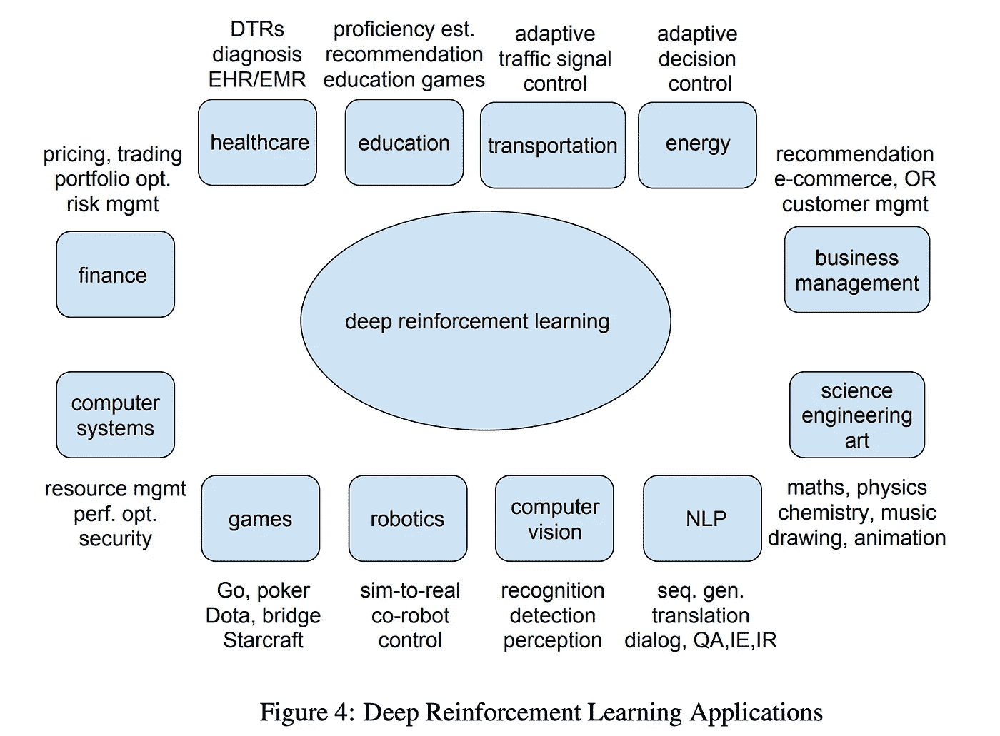
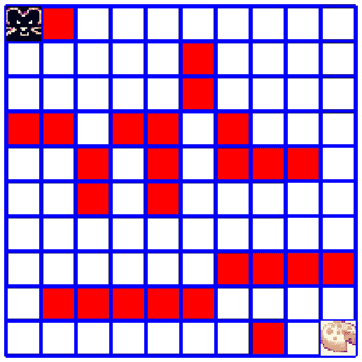
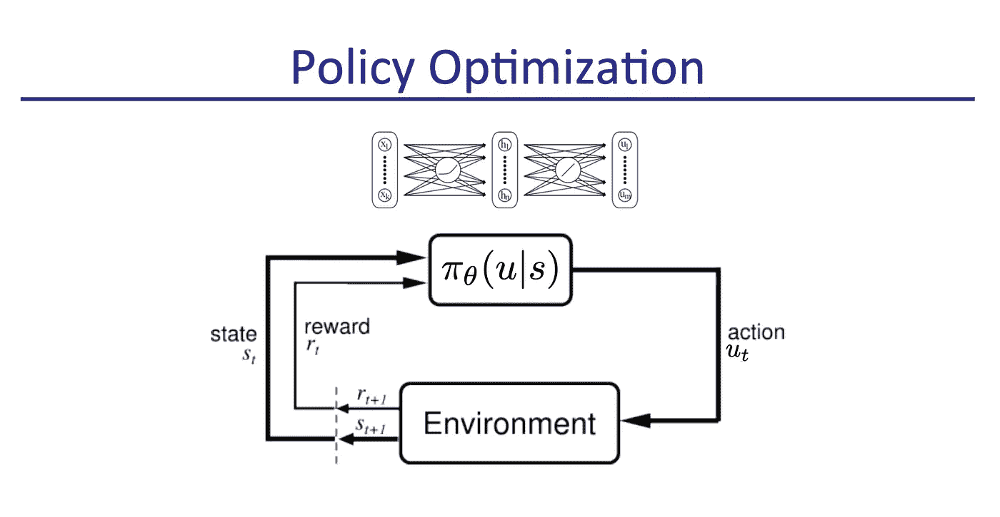
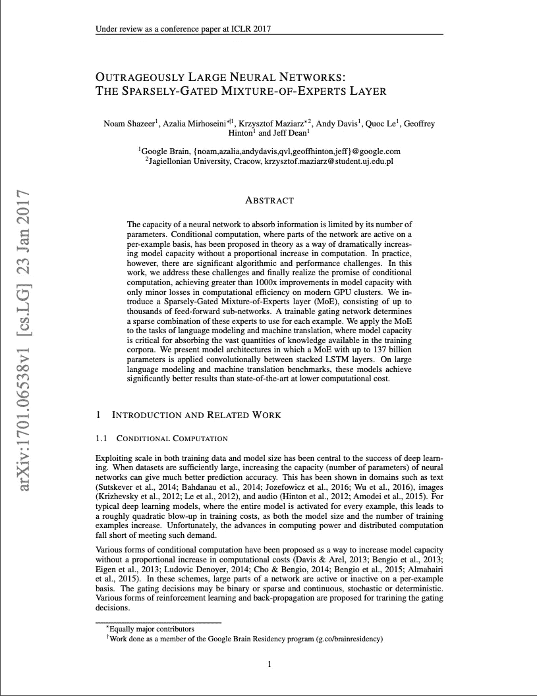
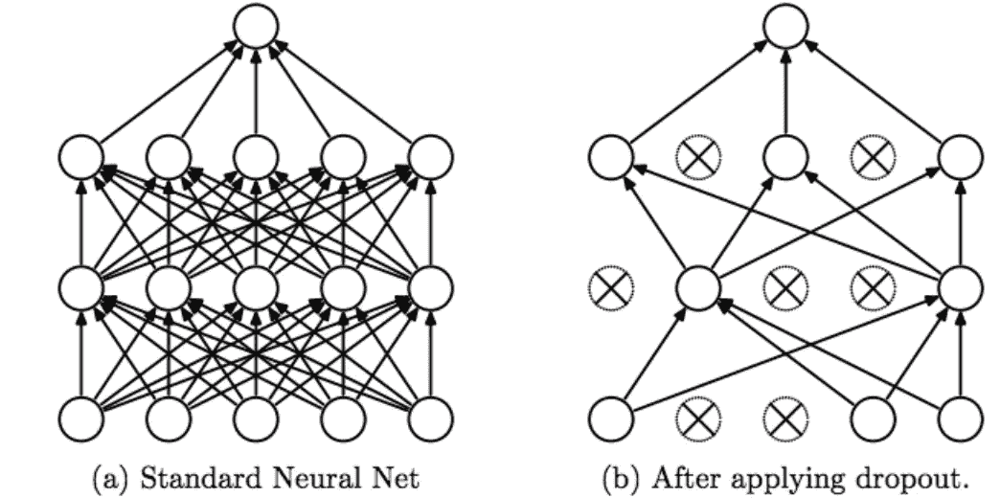

# 这位谷歌科学家教授人工智能以构建更好的人工智能

> 原文：<https://towardsdatascience.com/this-google-scientist-teaches-ai-to-build-better-ai-8a8fcf6ea6b8?source=collection_archive---------5----------------------->

## [独家 TDS 采访](https://towardsdatascience.com/tagged/tds-interview)

## TDS 就 AI visionary 在谷歌大脑的前沿研究、深度强化学习如何工作等问题采访了她。

**面试官:**[TowardsDataScience.com 项目负责人 Haebichan Jung](https://medium.com/@haebichan) 。

**受访者:** [Azalia Mirhoseini](https://www.technologyreview.com/lists/innovators-under-35/2019/visionary/azalia-mirhoseini/) ，博士，谷歌大脑的技术负责人和高级研究科学家。《麻省理工评论》评选的“35 名 35 岁以下的创新者/远见者”之一。

> *本次采访发生在 2019 年 11 月* [*多伦多机器学习峰会(TMLS)*](https://www.google.com/search?q=toronto+machine+learning+summit+2019&oq=toronto+machine+learning+summit&aqs=chrome.0.0j69i57j0l5j69i61.3274j0j7&sourceid=chrome&ie=UTF-8) *。*

欲了解更多仅限 TDS 的面试，请点击此处查看:

 [## 仅限 TDS 的面试

### 阅读《走向数据科学》中关于 Tds 采访的文章。分享概念、想法和代码。

towardsdatascience.com](https://towardsdatascience.com/tagged/tds-interview) 

## 你能告诉我们你的专业背景吗？

我在莱斯大学获得了电子和计算机工程的硕士和博士学位。我致力于大规模数据分析模型和机器学习的算法、硬件/软件代码设计。当我的博士论文快结束时，深度学习开始起步，我将我的注意力转向了深度学习。

后来，我看到了谷歌大脑驻留计划的传单。目标是让有深度/机器学习以外背景的人成为该领域的研究人员。我在那里已经 3 年半了。

顺便说一下，我注意到在机器学习社区中有一件非常普遍的事情，那就是很多人对计算机视觉、NLP、机器人、机器学习和游戏的研究非常感兴趣。

因此，我对为系统和计算机设计做 ML 感到非常兴奋，因为这些是机器学习的最大推动者。深度学习的许多成功都归功于我们现在拥有的更好的硬件和系统，这是 10 年前所没有的。

## 你能给我们举一些系统/芯片在人工智能进步中的作用的例子吗？

当然，这些就像 Tensorflow 和 Pytorch 一样强大，人们可以很容易地进入它们来训练自己的 DL 模型。其他重要的方面是芯片和硬件，如 GPU 和 TPU。

TPU 或张量处理单元也是非常强大的硬件，用于运行我们以前没有的 ML 算法。这些类型的系统使深度学习成为今天的样子。

 [## 云 TPU |谷歌云

### 以前所未有的速度训练和运行机器学习模型。机器学习产生了商业和研究…

cloud.google.com](https://cloud.google.com/tpu/) 

此外，如果你看看人工智能的趋势，我们会注意到，我们真的需要更好的计算机硬件才能跟上人工智能的计算需求。所以我认为的方式是使用机器学习本身来帮助人工智能，并设计下一代系统和芯片。

## 开发这些系统是你在谷歌大脑的主要职责吗？

2018 年，我和我的同事安娜·戈尔迪(Anna Goldie)在谷歌大脑(Google Brain)成立了系统机器学习团队。我们团队的主要重点是利用人工智能来设计和优化下一代系统和芯片。我们关注的研究类型主要是深度强化算法——使我们能够解决大规模优化问题的顺序决策优化方法。

## 你所说的顺序决策过程是什么意思？

举个例子，在机器人任务中，假设一个机器人想要到达一个目标。机器人位于二维网格上，想要四处移动。决策序列是关于机器人首先移动到哪里的决策(左、右、直行、障碍物等)。).

所以你要按顺序做出一系列决定。你采取一个行动，那就是向右走。然后你采取下一步行动。你的行动取决于你之前采取的行动。

你的最终目标是采取一系列行动，以最少的移动次数尽可能快地达到目标。顺序决策任务与你如何优化一系列决策有关，这样你就能以一种优化的方式达到你的目标回报函数(不管是什么)。

## 在这个过程中，优化是如何发生的？

我会在政策优化(强化学习)的背景下告诉你。你可以想象你有一个代表你的政策的神经网络模型。开始时:

1.  该模型用随机权重初始化。它对你的环境一无所知。但是渐渐地，
2.  该模型采用您的问题的当前状态，并输出您所采取的行动的概率分布。假设你有 4 个动作(上、下、左、右)。你采取这些行动，衡量你离目标有多近，就像一个奖励函数。
3.  你现在有了这个中间奖励函数，你一直采取下一个行动，直到你达到目标。
4.  中间奖励函数集合中的最终奖励函数可用作反馈，以返回并更新代表您的策略的神经网络的参数。

## 术语策略在这里是什么意思？

这里的策略是指强化学习模型。之所以称之为“策略”，是因为它需要一个输入状态和一组操作。它预测给定状态下的动作。所以才叫政策。

## 你能阐明在没有目标变量的情况下，仅仅依靠奖励函数，优化是如何发生的吗？

是的，这里没有标签，但是我们仍然有问题输入的状态，最后，我们想优化奖励函数。在许多这样的策略优化算法中，我们所做的是，我们训练一个策略来优化预期的奖励函数，给定它对给定状态预测的行为分布。

## 换个话题，你能告诉我们你另一个令人兴奋的深度学习研究吗:稀疏门控的专家混合层？

这是我和一群优秀的同事加入谷歌大脑时做的第一个项目。这一层背后的想法是，如果你研究深度学习模型(transformer，convolutions，LSTMs)，许多这些模型都相对密集。

密集意味着输入的例子要经过整个网络，从开始到结束。在所有输入示例中，我们用相同的计算量处理每个输入。

这项工作背后的想法是，我们可以有一个专家联盟，其中每个专家都由神经网络本身来表示，这些专家可以专门研究训练数据集中不同类型的数据。所以当你在整个模型中传递一个例子时，这个例子通过这个神经网络的某些路径，一直到最后，但不是通过所有的东西。

[https://arxiv.org/pdf/1701.06538.pdf](https://arxiv.org/pdf/1701.06538.pdf)

这种模式有很多优点。首先，我们可以拥有大量能够从海量数据中学习的模型。这意味着我们可以有很多参数。我们建立的一个模型有数十亿个参数，我们在上面训练了数十亿个数据点。

它的优点在于它的简单性，因为一个例子只能看到模型的一小部分。我们可以假设总共有 1，024 名专家，但该示例只涉及 4 或 8 名专家。所以我们有了这个大容量模型，但是应用于每个样本的计算能力仍然非常小。然而，这个大模型可以从我们拥有的大量数据和大量参数中集体学习，它可以用来对知识进行编码，并用于训练模型。

## 所以重复一遍，稀疏门控专家混合层是:

> 一个与全球模型集成的层，你有一大群专家(又名神经网络)在研究数据的不同部分。但是为什么你的方法被称为稀疏选通，是因为我们不是在看每一个专家，而是几个专家，但是你仍然能够像所有不同的专家一样得到相似的结果？

或者有更好的结果！它之所以被命名为稀疏门控，是因为我们和这些专家一起训练我们所谓的门控器。专家层的输入首先到达 Gater，Gater 决定哪些专家应该处理这个输入。这些专家中很少有人会收到任何对此门户网站的意见。把 Gater 想象成通过一些专家传递输入的例子。这就是为什么它被称为稀疏门。

是的，正如你所说，我们有这些专家层和 Gater，你可以将它嵌入到深度学习模型中，比如 LSTM。令人惊讶的是，我们不仅可以更快地获得结果或达到同样的精度，我们还可以获得更好的结果。一部分是因为我们可以处理更多的数据，另一部分是因为稀疏选通 MOE 的正则化效应，使模型更好地推广到看不见的测试数据。

## 能详细说说正规化吗？

退学就是做正规化的一个例子。你可以认为教育部在某种意义上类似于辍学。除了它是以一种更结构化的方式使用的，在这种方式中，我们也利用了稀疏性的好处来提高计算效率。

所以我们有所有这些模型，每次 Gater 查看它为一个例子得到的任何激活，并把它传递给少量的模型。而在密集层中，你可以看到所有的模型都通过它。在这里，我们通过设计空投了大量的专家。

## 这项研究令人兴奋的是，你们解决了条件计算试图解决但无法解决的问题。你能告诉我们更多关于这个的信息吗？

解释一下，这是一个条件计算的原因是，尽管大多数其他深度学习模型的输入都经过整个网络，但在这里，我们通过 Gater 模型与网络的其余部分联合调节输入。

我们通过 Gater 对其进行调节，将其限制在神经网络的某些路径上。这样，我们的专家或模块在训练数据的不同部分变得专业化，这有助于他们更好地处理和评估数据。

 [## 条件计算

### 条件计算指的是一类算法，其中每个输入样本使用模型的不同部分…

nervanasystems.github.io](https://nervanasystems.github.io/distiller/conditional_computation.html) 

## 你能告诉我们更多关于谷歌大脑的信息吗？团队是如何构成的，人们做什么样的工作？

这是一个伟大的团队，我们拥有大量优秀的研究人员和工程师，他们合作得非常好。我们专注于重要和真正困难的问题。和这个团队一起工作，解决我们所做的一类问题，是一件非常有趣的事情。

我想说我们有良好的学术文化。我们积极参与出版物和顶级会议。我们真的鼓励我们的研究人员发表和合作。

 [## 大脑团队-谷歌研究

### 关于团队研究自由谷歌大脑团队成员制定自己的研究议程，团队作为一个整体…

谷歌研究](https://research.google/teams/brain/) 

与此同时，许多激动人心的工作来自谷歌大脑。一个例子是谷歌翻译，这是基于 LSTM/序列-2-序列的方法，真的很神奇。他们彻底改变了 NLP 机器翻译的方式。

 [## 了解 RNN 和 LSTM

### 什么是神经网络？

towardsdatascience.com](/understanding-rnn-and-lstm-f7cdf6dfc14e) 

## 你能和杰弗里·辛顿一起工作吗？

事实上，我关于专家混合的论文是和杰弗里·辛顿一起写的。能够和他一起工作，我感到非常幸运。他是一个了不起的人，和他在一起是一种享受。同时也是最卑微的人。

## 来自 TDS 观众的最后一个问题:人工智能的未来是什么？AI 是工具还是 AI 是产品？未来更有可能的场景是什么？

我对 AI 非常肯定。相信 AI 会帮助到大家。当然，在工业界，他们可能有机会接触到其他人可能没有的计算和数据。与此同时，我觉得即使没有大量数据，也可以做很多工作和研究，因为这样你就可以围绕我们现有的限制进行创新。我们在学术界经常看到这种情况。

因此，我认为学术界和工业界有机会蓬勃发展，同时在这个人工智能时代，如果我们做一些伟大的事情，例如自动驾驶汽车，我个人认为这对每个人都很好，让他们有更多的时间去追求其他事情和在其他领域创新。

完整的采访，请点击查看视频:

 [## Haebichan Jung - Medium

### 阅读容格在媒介上的作品。“走向数据科学|芯片领域的数据科学家”项目负责人…

medium.com](https://medium.com/@haebichan) 