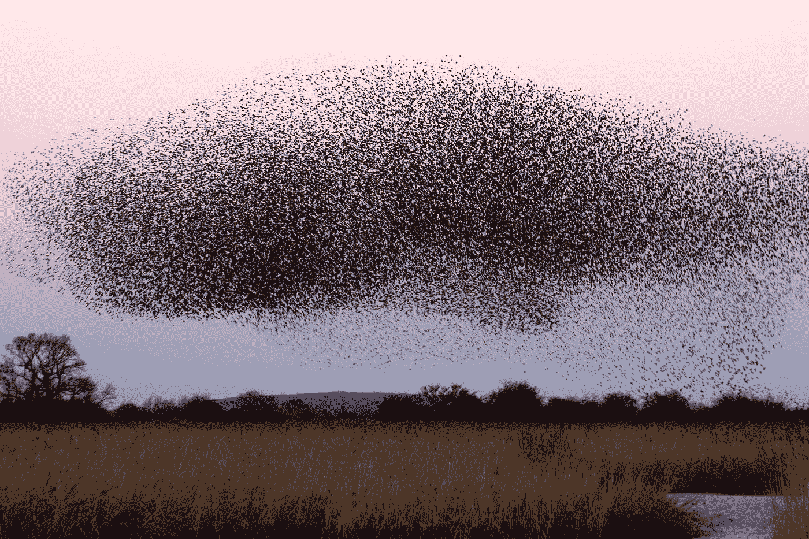

# 这是猪崽子。

> 原文：<https://towardsdatascience.com/this-is-hogwild-7cc80cd9b944?source=collection_archive---------18----------------------->

## 在 PyTorch 中加速您的神经网络训练

我目前正在攻读分布式机器学习领域的博士学位。我注意到并行过程在日常机器学习中并不常用。因此，我想谈谈 PyTorch 的多重处理。在这篇博文中，你将会了解到野猪！算法，用于以并行方式运行随机梯度下降(SGD)。由于列出的论文涵盖了所有必要的数学知识，我就不赘述了。相反，我将用 PyTorch 解释一般的想法并给出一个非常简单的例子。



在 [Unsplash](https://unsplash.com?utm_source=medium&utm_medium=referral) 上由 [James Wainscoat](https://unsplash.com/@tumbao1949?utm_source=medium&utm_medium=referral) 拍摄

# 为什么平行？

如果你曾经在你的机器上自己训练过神经网络，你可能已经注意到了这样做所消耗的时间和计算能力。尤其是在使用大数据集进行计算机视觉或其他高维训练数据时。麻省理工学院最近的一篇文章显示，训练一个人工智能算法可以产生大量的碳([链接到文章](https://www.technologyreview.com/s/613630/training-a-single-ai-model-can-emit-as-much-carbon-as-five-cars-in-their-lifetimes/))。这说明了 AI 模型训练所需要的必要力量。因此，如果花费的时间太长，应该使用减少总训练时间的并行过程。

# 猪猡！解释

一个可能的算法是 Hogwild！它利用计算机上的并行进程同时异步运行 SGD。异步对于减少不必要的空闲时间很重要，在空闲时间里没有计算，但是仍然消耗能量。

## 数据管理

利用猪八戒！并行训练会话中的每个参与过程负责数据的一个分区，例如，具有 8 个并行过程会将数据集分成 8 个相等的部分，而每个过程被分配给一个部分。此外，在共享内存或单独的服务器上，会创建一个可由所有进程访问的初始模型。

## 更新

一旦训练开始，每个进程从共享内存加载模型的当前状态，并开始读取它们的第一批数据分区。与标准 SGD 一样，每个过程都在计算该批次的梯度。梯度现在被直接写入共享模型，而不会阻塞其他过程。一旦写入，就加载新的模型参数并使用下一批参数。由于缺少分块，共享模型有时会接收到旧的梯度，人们可能会认为这是一个缺点。霍格维尔德的研究者们！然而，可以显示训练甚至受益于非阻塞方式。

# 分布式 Hogwild！

利用猪八戒！在分布式计算机上，集群具有巨大的通信开销，因为在每一批之后，梯度需要通过网络发送。因此，Hogwild++被开发出来，它通过将进程(即每台计算机)组织成一个环来减少开销。训练时，通过那个环发送一个令牌。令牌带有全局模型。每当一个令牌到达一个节点时，模型权重之间的差被计算并用于以非平凡的方式更新模型。欲了解更多详情，本文最后有链接。

# PyTorch 中的实现

这个代码例子是受[这个链接](https://pytorch.org/docs/stable/notes/multiprocessing.html)的启发，给出了一个如何实现标准 Hogwild 的例子！PyTorch 中的算法。

首先，我们用卷积层实现了一个简单的图像分类模型。该模型返回在训练期间使用 NLLLoss 时有用的 LogSoftmax。

```
**class** Model(nn.Module):
    **def** __init__(self):
        super().__init__()
        self.conv1 = nn.Conv2d(3, 10, kernel_size=5)
        self.conv2 = nn.Conv2d(10, 20, kernel_size=5)
        self.conv2_drop = nn.Dropout2d()
        self.fc1 = nn.Linear(500, 10)
        self.fc2 = nn.Linear(10, 10)

    **def** forward(self, x, **kwargs):
        batch_size = x.shape[0]
        x = F.relu(F.max_pool2d(self.conv1(x), 2))
        x = F.relu(F.max_pool2d(self.conv2_drop(self.conv2(x)), 2))
        x = x.view(batch_size, -1)
        x = F.relu(self.fc1(x))
        x = F.dropout(x, training=self.training)
        x = self.fc2(x)
        x = F.log_softmax(x, dim=1)
        **return** x
```

此外，我们定义了一个训练函数，它以一个模型和一个数据加载器作为输入参数。在这个函数中，使用了 Adam 优化器和前面提到的 NLLLoss。这个培训功能是 PyTorch 程序的标准实现。参与 Hogwild 的每个流程！会同时叫它。

```
**def** train(model, data_loader):
    optimizer = optim.Adam(model.parameters())
    criterion = nn.NLLLoss()

    **for** data, labels **in** tqdm.tqdm(data_loader):
        optimizer.zero_grad()
        loss = criterion(model(data), labels)
        loss.backward()        
        optimizer.step()
```

并行设置发生在下一个代码部分。在这里，我们定义了并行进程的数量，实例化了模型，并通过一个方法调用 *share_memory* 将其推送到共享内存中。使用的数据集是 CIFAR10 数据集，可在 torchvision 包中获得。

我们对流程进行循环，并为每个流程定义一个数据加载器。数据加载器拥有一个分布式采样器，它知道进程的等级并处理数据的分布。因此，每个进程都有自己的数据分区。多重处理包调用每个进程内的训练函数并等待，用*加入*命令，等待进程结束。

```
**import** torch.multiprocessing **as** mpnum_processes = 4
model = Model()
model.share_memory()

dataset = CIFAR10(
            **"data"**,
            train=**True**,
            download=**True**,
            transform=transforms.Compose([
                transforms.ToTensor(),
                transforms.Normalize(
                    mean=[0.485, 0.456, 0.406],
                    std=[0.229, 0.224, 0.225]
                )
            ])
        )processes = []
**for** rank **in** range(num_processes):
    data_loader = DataLoader(
        dataset=dataset,
        sampler=DistributedSampler(
            dataset=dataset,
            num_replicas=num_processes,
            rank=rank
        ),
        batch_size=32
    )
    p = mp.Process(target=train, args=(model, data_loader))
    p.start()
    processes.append(p)
**for** p **in** processes:
    p.join()
```

在训练期间，所有的进程都可以访问共享模型，但是只在它们自己的数据分区上训练。因此，我们将训练时间减少了大约 4，这是总训练过程的数量。

完整的代码可以在我的 [GitHub 库](https://github.com/wenig/hogwild)中找到。

# 结论

分配机器学习的训练变得更加重要。尤其是随着训练数据和数据复杂度的增加。总的来说，分布式训练节省了大量时间，并且还可以使用智能分配技术来减少消耗的能量。代码示例显示，使用 PyTorch 应用并行机器学习训练非常容易。

# 资源

猪猡！:[https://papers . nips . cc/paper/4390-hog wild-a-lock-free-approach-to-parallelism-random-gradient-descent . pdf](https://papers.nips.cc/paper/4390-hogwild-a-lock-free-approach-to-parallelizing-stochastic-gradient-descent.pdf)

http://www.stat.ucdavis.edu/~chohsieh/wildSGD.pdf