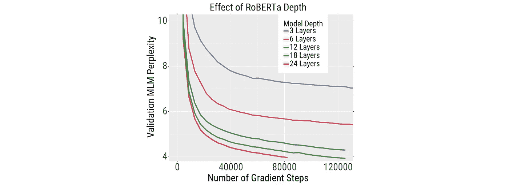
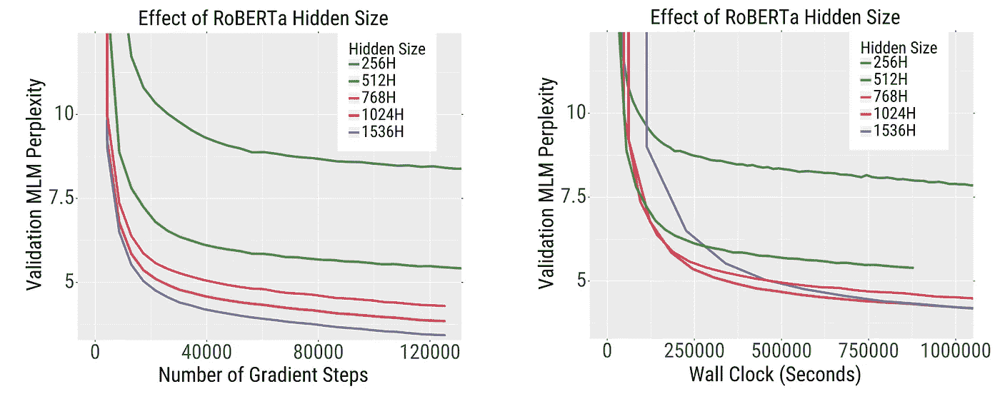
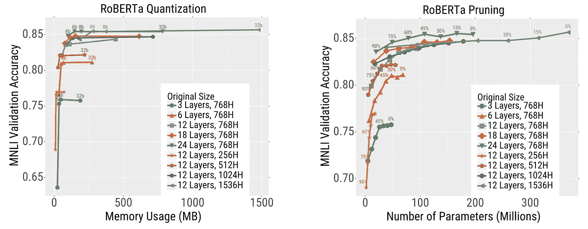

# 这就是如何训练更好的变形金刚模型

> 原文：<https://towardsdatascience.com/this-is-how-to-train-better-transformer-models-d54191299978?source=collection_archive---------11----------------------->

## 大规模训练，然后压缩

## 如何训练更快、更高性能的变压器

[Samule 孙](https://unsplash.com/@samule?utm_source=medium&utm_medium=referral)在 [Unsplash](https://unsplash.com?utm_source=medium&utm_medium=referral) 上的照片

F 两年多以来，在大型文本语料库上训练的 transformer 模型是所有自然语言处理中最先进的。研究人员和从业者继续通过发明更好的架构或在更多数据上训练更大的模型来拓展边界。事实上，在其他条件相同的情况下，很少有人会不同意在更多数据上训练更大的模型可以提高性能。但是如果时间或资源有限呢？

普遍的看法是接受精度的打击，训练更小的模型。更小的模型不仅训练和推理更快，而且更便宜，对吗？

伯克利人工智能研究所(BAIR)最近的研究表明情况并非如此。较大的模型训练速度更快，可以更有效地压缩，从而减少推理时间。因此，作者得出结论认为

> “资源受限训练的最佳策略是训练大型模型，然后大量压缩它们”

与通常的实践相反，在资源约束设置中，训练大型模型是最佳的[ [来源](https://arxiv.org/pdf/2002.11794.pdf)

# 体型越大，训练速度越快

作者用以下模型进行了实验:

*   用于自我监督语言建模的 RoBERTa 模型的版本；和
*   用于机器翻译的标准[变压器](https://arxiv.org/pdf/1706.03762.pdf)型号。

在每个实验中，作者根据模型的**深度**(2-24 层)和**宽度**(隐藏尺寸 128-2024)来改变模型的尺寸。

更深的模型更快实现更好的性能[ [来源](https://arxiv.org/pdf/2002.11794.pdf)

主要结果是较大的模型:

1 样本效率更高:在更少的梯度步骤后，它们获得了**更好的结果**(在语言建模任务上更低的复杂度，在翻译任务上更高的 BLEU 分数)**；**和

即使调整挂钟时间后，较大型号的**训练速度更快**。也就是说，训练时间的减少远远抵消了模型规模增加带来的计算开销的增加。

更宽的型号实现更好的性能更快[ [来源](https://arxiv.org/pdf/2002.11794.pdf)

# 较大的模型压缩得更好

更大的模型不仅训练更快，预测也更快。这是因为它们更具可压缩性，因此您可以将它们调整到与小模型相同的推理成本，同时实现更高的准确性。

为了得到这个结果，作者以两种方式压缩他们的模型:

*   **量化**:它们以不同的精度格式(低至 4 位)存储参数，以节省计算时间和内存空间；和
*   **修剪**:它们迭代地将 15%的最低幅度参数清零，然后再次微调，以减少操作次数和内存占用(因为权重矩阵现在很稀疏)。

作者发现:

1 对于这两种压缩方法，较大的型号提供了**更好的精度-效率权衡**:压缩时精度下降低于较小的型号；和

2 两种压缩方法都可以在**很少附加** **计算** **开销**的情况下进行。

较大的模型通常在任何压缩级别都能获得更好的精度[ [来源](https://arxiv.org/pdf/2002.11794.pdf)

# 我们何时以及为什么会取得这些成果？

虽然有大量的文献说明为什么更大的模型获得更高的测试精度，但很少有人研究它们是否以及为什么收敛得更快。作者对为什么会出现这种情况给出了一些解释:

1 **这些结果适用于大型数据集**(在这种情况下，过拟合问题不大)。根据经验，模型越大，减少训练误差的速度越快。由于对于大型数据集，泛化差距(训练和测试误差之间的差异)不是一个问题，因此较大的模型也可以更快地减少测试误差。作者指出

> “MLM 任务中的挑战不是*过度拟合*，而是*拟合*数据——即使 80 亿个参数模型也不会过度拟合大型预训练语料库”

当将训练数据集减少到其原始大小的 1%或 5%时，作者发现训练大模型的好处消失了。

2 **较大的型号使用计算的效率更高。**在训练大型模型完成掩蔽语言建模等任务时，瓶颈不是计算，而是内存&存储。因此，较大的模型更有效地利用可用的计算。

3 **较大的型号获得较小的压缩误差**。作者表明，对于大模型，量化&修剪产生的参数比小模型更接近原始(未修剪)模型的参数。

# 这有什么关系？

这篇论文构成了一个潜在的范式转变，在资源约束下如何训练模型。这具有明显的经济效益:花在训练模型上的时间和金钱更少，同时实现更高的性能。

应该注意的是，在上述所有实验中，作者除了选择模型深度和宽度之外，没有进行任何超参数优化。然而，在现实世界的设置中，好的超参数是未知的，因此花费了大量的时间和资源来寻找最佳设置。

这篇论文的发现之所以重要还有另一个原因。搜索好的超参数，或者只是简单地训练最终模型，可能需要许多 GPU 小时，因此可能会有大量的碳足迹。通过减少训练一定精度的模型所需的时间，减少排放是可能的。如果你有兴趣了解更多关于你的碳足迹的信息，请查看 Mila 实验室的 [ML CO₂计算器](https://mlco2.github.io/impact/#compute)工具。

[1]:李，Eric Wallace，，，Kurt Keutzer，Dan Klein 和 Joseph E. Gonzalez，[大规模训练，然后压缩:重新考虑模型大小以实现变形金刚的高效训练和推理](https://arxiv.org/abs/2002.11794) (2020)。

[2]: Alexandre Lacoste，Alexandra Luccioni，Victor Schmidt 和 Thomas Dandres，[量化机器学习的碳排放](https://arxiv.org/abs/1910.09700) (2019)，NeurIPS 2019 的[气候变化 AI 工作坊](https://www.climatechange.ai/NeurIPS2019_workshop.html)。