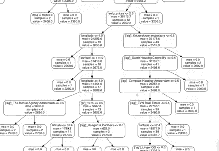
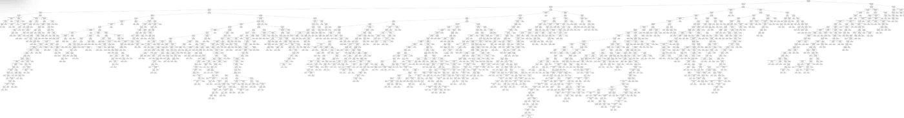
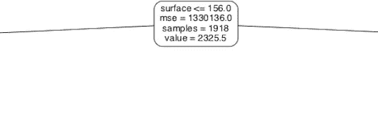
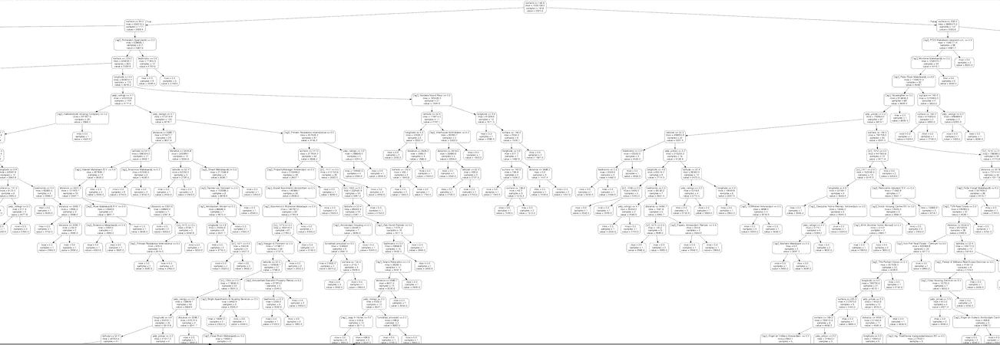
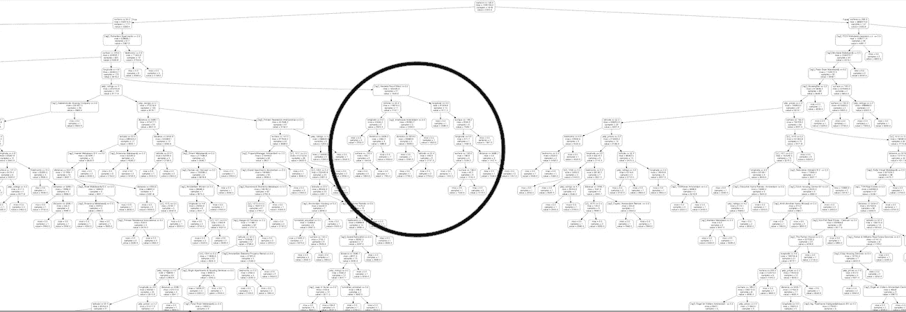
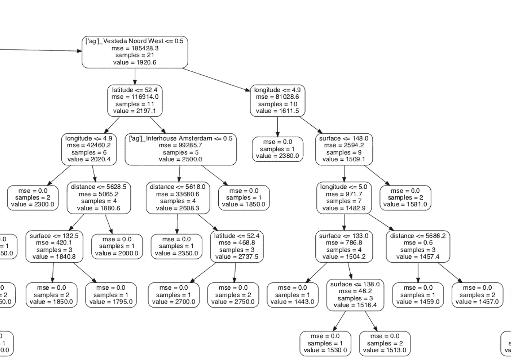

# 这就是机器学习模型的样子

> 原文：<https://towardsdatascience.com/this-is-what-a-machine-learning-model-looks-like-613f4ec89abf?source=collection_archive---------55----------------------->

## 可视化机器学习如何做出决策和预测。

机器学习算法如何理解变量之间的复杂关系，即使是领域专家有时也不能完全理解？在我的文章[机器学习和真实状态](/ai-and-real-state-renting-in-amsterdam-part-1-5fce18238dbc)中，我从阿姆斯特丹的真实状态列表中收集了数据，以了解在这个(非常昂贵的)城市租金价格是如何确定的。

在所有的转换之后，我的数据集最终达到了惊人的 327 列和将近 4000 行。对于一个人来说，查看所有这些数据并试图理解真实的国有市场正在发生什么几乎是不可能的。但是对于机器学习模型来说，它只需要三分钟来训练自己，测试它的假设，并告诉我它在 **10 倍于**的情况下做得有多好。

对于初学者来说，理解随机森林算法如何做出决策的细节是非常技术性的。它怎么知道增加一个 sq。一套特定街区的公寓，有一定数量的卧室，可以在你的月租金上增加 *x* 欧元？更令人印象深刻的是，它如何能以 98%的准确率估算出整个城市中各具特色的每套公寓的租金价格？所有这一切，在三分钟之内？？

为了更容易理解模型是如何工作的，我们可以将模型的决策树形象化:它对数据做出的决策的集合，基于它们在模型中的测试方式。这是我在最初的文章中包含的数字:

这只能说明我们的模型可能工作得非常努力。但是除此之外就没那么有用了。让我们更仔细地看看这个决策树:

如果我们走到树的绝对顶端，我们可以看到一切开始的地方。该模型在数据中随机选取了一个点，在这种情况下，公寓的面积小于或等于 156 平方米，这是它的第一次分割。缩小我们可以看到这是树的“*母亲*”分裂:

让我们仔细看看树的以下部分(分支):

在这里，我们开始分割公寓，如果它们被真实的国家机构 *Vesteda Noord West* 列出(因为它是一个二元变量，如果它小于 0.5，就意味着它是 0，大于 0.5，就意味着它是 1)。在右边部分，我们有**没有被该机构列为**的公寓，在左边部分，我们有那些**被列为**的公寓。如果你感到困惑，不要担心:把它想象成模型在问一个问题，如果答案是*是*数据点将会向右，如果答案是*否*数据点将会向左。在这里，我们提出了一个负面的问题:*这个公寓不是这个机构列出的吗？*

让我们看看那家中介列出的公寓(在左边)。如果公寓的纬度小于或大于 52.4，我们进一步分割公寓，如果它们不小于 52.4(左图)，我们按照它们小于 4.9 的经度分割，如果它们不小于 4.9(左图)，我们最终只有两个样本，估计误差为零，租金估计为每月 2300 英镑。

对于每一个其他的分裂，我们可以做同样的练习。终点(模型不会进一步分割自己的地方)包含公寓价格的模型估计，也称为模型的*叶*。

希望这有助于你理解机器学习的迷人力量。感谢您的阅读！