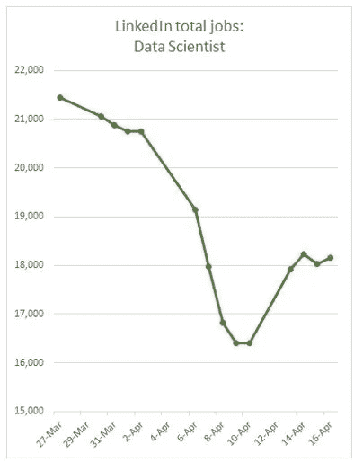
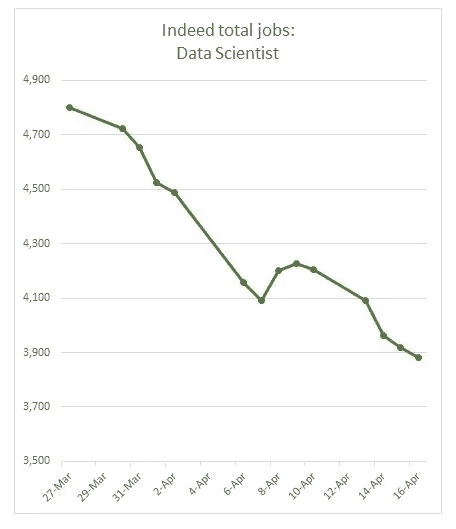
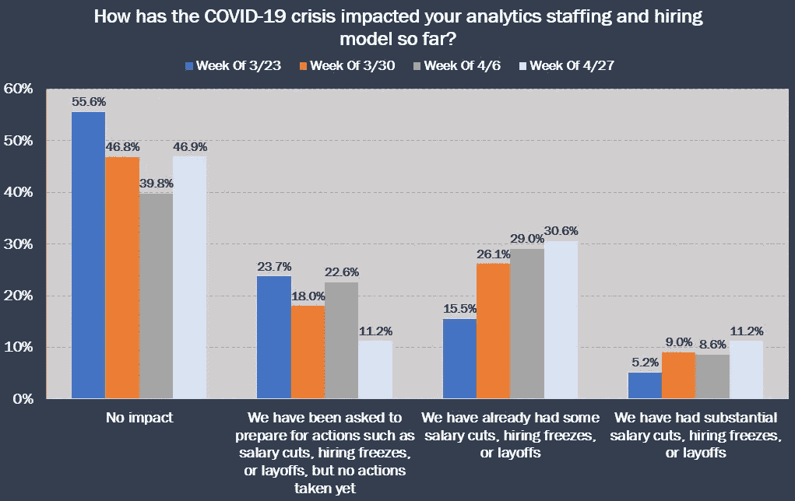
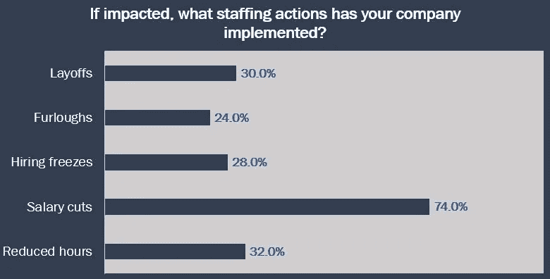
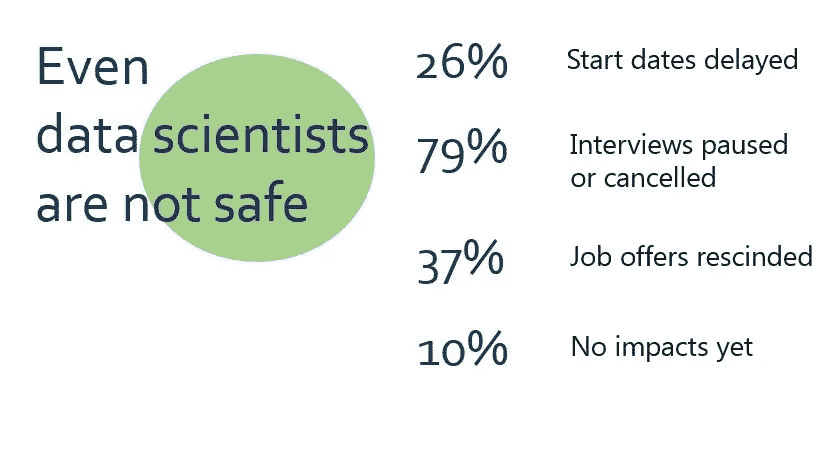
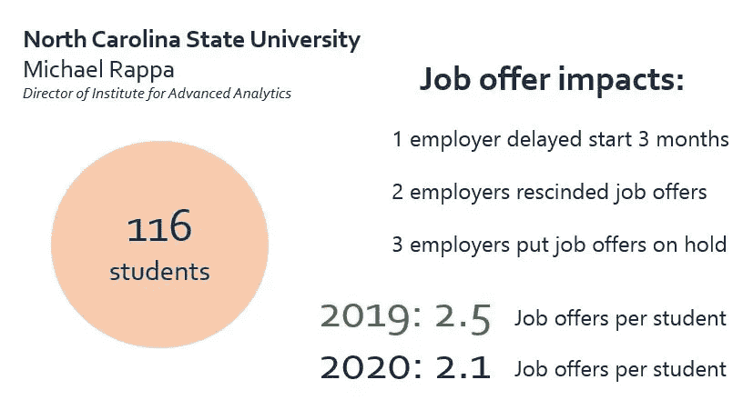
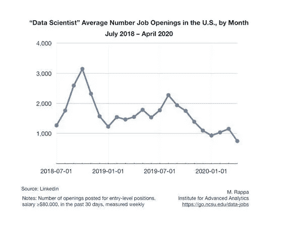

# 这是数据科学家在 2020 年经历的事情

> 原文：<https://towardsdatascience.com/this-is-what-data-scientists-are-undergoing-in-2020-cb137ddfc6dc?source=collection_archive---------74----------------------->

## 在当前情况下，对数据科学职位有什么期望。

卢卡斯·布拉塞克在 [Unsplash](https://unsplash.com?utm_source=medium&utm_medium=referral) 上的照片

根据《哈佛商业评论》, 2012 年，数据科学家的职位被认为是 21 世纪最性感的工作。此外，美国劳工统计局的一份报告显示，预计到 2026 年，数据科学需求的增长将创造约 1150 万个工作岗位。既然世界正在经历恐慌和不确定时期，在经济萎缩和市场混乱的情况下，检验这些预言的可靠性是值得的？

> 今天的数据科学家类似于 20 世纪 80 年代和 90 年代华尔街的定量分析师。

谈到人才招聘，我总是喜欢提到 LinkedIn，因为该平台最近见证了求职者和招聘者流量的迅速增长。请记住，LinkedIn 是最早将数据科学融入实践的企业之一。现在，让我们来谈谈数据，根据 LinkedIn 的数据，从 3 月 27 日开始，数据科学的招聘数量有所下降。这是一个标志着危机达到企业层面的时期。

资料来源:伯奇工厂

如下图所示，数据科学职位发布在其他平台上有所减少，如 indeed 以及。

资料来源:伯奇工厂

话虽如此，大数据和数据科学人才招聘机构 Burtch Works 与国际分析研究所(International Institute of Analytics)之间的一项合作调查显示，从 3 月到 4 月，一个月的时间框架内，企业是如何应对危机的。乍一看，我们可以看到新冠肺炎对人员配备和招聘的影响在短短一个月内增加了一倍多，这表明如果美国的封锁限制仍然不放松，将会产生长期影响。

资料来源:伯奇工厂

好消息是，大多数受影响的组织都实施了减薪政策。尽管裁员、休假、冻结招聘和减少工作时间仍然是受影响机构的选择，但数据科学家仍有可能至少享受他们的分析职位，与其他替代方案相比，这是最好的情况。

资料来源:伯奇工厂

此外，揭示当前危机对大学毕业生的影响也非常重要。Burtch Works 再次设法接触到即将开始数据科学职业生涯的美国大学教授和学生。不幸的是，这些数字相当令人震惊。

我们可以看到，新冠肺炎严重侵蚀了数据科学职位和应届毕业生的就业机会。绝大多数学生报告说受到了影响，从开始日期延迟到工作机会被取消，只有微不足道的 10%的学生没有受到影响。

资料来源:伯奇工厂

Burtch Works 的定量招聘专家琳达·伯奇(Linda Burtch)联系了北卡罗来纳州立大学(North Carolina State University)的高级分析主任迈克尔·拉帕(Michael Rappa)，后者是一个世界级的项目，他能够分享该项目关于新冠肺炎效应对其毕业生的一些数据。

数据中最引人注目的数字是，2019 年和 2020 年，每个学生的工作机会分别从 2.5 个缩减到 2.1 个。

再次，Cappa 能够在 LinkedIn 上分享 2018 年至 2020 年危机对入门级职位空缺的影响。我们可以看到，数据科学家的平均职位空缺下降到不到 1000 个，这对新数据科学家来说是一个相当大的威胁。我们还必须认识到，如果实际情况保持不变，这一趋势还会进一步下跌。

虽然冠状病毒对大多数行业来说是一场灾难，但一些可以远程工作的 IT 企业，如网飞、Steam(游戏业务)和 Zoom，随着人们越来越依赖他们的服务，他们的利润正在飙升。例如，根据 [Analytics Insights](https://www.analyticsinsight.net/top-data-science-salaries-may-2020/) 的数据，Zoom 的科学家吹嘘他们的平均年薪为 111，000 美元。这是数据科学家的一线希望，我认为在这个前所未有的时代，数据科学家应该投资的最佳实践是磨练他们的技能，为最轻微的职位空缺做好准备。