# 经过七周的数据科学学习，我的随机森林模型

> 原文：<https://towardsdatascience.com/this-is-what-seven-weeks-of-learning-data-science-looks-like-94c0c6666383?source=collection_archive---------38----------------------->

## 一步一步的演练我的改进二手车价格预测


[马特·霍华德](https://unsplash.com/@thematthoward?utm_source=unsplash&utm_medium=referral&utm_content=creditCopyText)在 [Unsplash](https://unsplash.com/s/photos/journey?utm_source=unsplash&utm_medium=referral&utm_content=creditCopyText) 上拍照

> "千里之行始于足下。"

在我记忆中的很长一段时间里，我想成为一名数据科学家，但从未付诸行动。七周前，**我迈出了第一步**，承诺在 52 周内每周学习和写关于数据科学的博客。在我的第一周，我建立了一个随机森林模型来预测二手车的价格(见[这里](https://www.kaggle.com/terenceshin/used-car-price-prediction-attempt-1))。这或多或少是我的准则…

```
import pandas as pd
from sklearn.ensemble import RandomForestRegressor
from sklearn.model_selection import train_test_split
from sklearn.metrics import mean_absolute_error
from sklearn import preprocessing
df1 = pd.read_csv("../input/craigslist-carstrucks-data/craigslistVehicles.csv")*### Clean/Prep Data ###* 
df1 = df1[df1['price'] < 99999.00]
df1 = df1[df1['price'] > 999.99]

*# 2\. Removing any rows where year is blank or <1900*
df1 = df1[df1['year'] > 1900]
df1 = df1.dropna(axis=0, subset=['year'])

*# 3\. Removing any rows where manufacturer is blank*
df1 = df1.dropna(axis=0, subset=['manufacturer'])

*# 4\. Removing any rows where odometer is blank or < 999,999*
df1 = df1.dropna(axis=0, subset=['odometer'])
df1 = df1[df1['odometer'] < 899999.00]

*# 5\. Removing any rows with blanks*
df1 = df1.dropna(axis=0)*### Data Modelling ###*
y = df1.price
used_car_features = ['year', 'odometer', 'manufacturer', 'make', 'transmission','lat','long','fuel']
X = df1[used_car_features]

le = preprocessing.LabelEncoder()
X = X.apply(le.fit_transform)

train_X, val_X, train_y, val_y = train_test_split(X, y, random_state=0)

used_car_model = RandomForestRegressor(random_state=1)
used_car_model.fit(train_X, train_y)
```

我的代码效率很低，我错过了很多步骤，而且它不是最好的模型——但它是一个开始！从那以后，我学习并撰写了各种数据科学主题，包括:

*   [数据科学基础统计学](/basic-statistics-you-need-to-know-for-data-science-1fdd290f59b5)
*   [探索性数据科学的逐步方法](/an-extensive-guide-to-exploratory-data-analysis-ddd99a03199e)
*   [利用线性回归预测预期寿命](https://medium.com/swlh/predicting-life-expectancy-w-regression-b794ca457cd4)
*   [所有基本机器学习模型背后的理论](/all-machine-learning-models-explained-in-6-minutes-9fe30ff6776a)
*   [微软数据科学面试问答](/microsoft-data-science-interview-questions-and-answers-69ccac16bd9b)

这个星期，我想重温 [Kaggle 的二手车数据集](https://www.kaggle.com/austinreese/craigslist-carstrucks-data)来应用我的新知识，建立一个更好的随机森林模型！

我把我的项目分成三部分:

1.  探索性数据分析
2.  数据建模
3.  特征重要性

# 探索性数据分析

## 了解我的数据

```
*# Importing Libraries and Data*
import numpy as np
import pandas as pd *# data processing, CSV file I/O (e.g. pd.read_csv)*
import os
for dirname, _, filenames **in** os.walk('/kaggle/input'):
    for filename **in** filenames:
        print(os.path.join(dirname, filename))

df = pd.read_csv("../input/craigslist-carstrucks-data/vehicles.csv")*# Get a quick glimpse of what I'm working with*
print(df.shape)
print(df.columns)
df.head()
```

在处理数据科学问题时，我总是做的第一件事是了解我正在处理的数据集。使用 **df.shape** 、 **df.columns** 和 **df.head()** ，我能够看到我正在处理的特性以及每个特性需要什么。

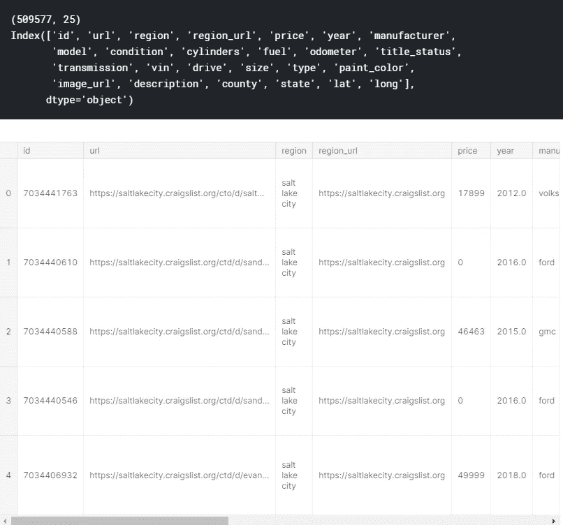

## 探索分类数据

```
df.nunique(axis=0)
```

我喜欢用 **df.nunique(axis=0)** ，看看每个变量有多少个唯一值。利用这个，我可以看到是否有什么不寻常的事情，并找出任何潜在的问题。例如，如果它显示有 60 个州，这将引发一个红旗，因为只有 50 个州。

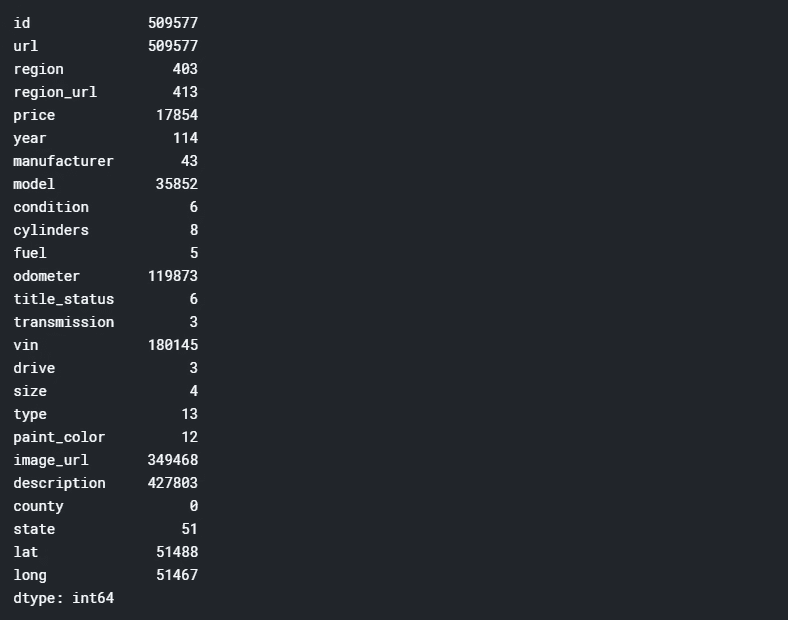

## 探索数字数据

```
df.describe().apply(lambda s: s.apply(lambda x: format(x, 'f')))
```

对于数字数据，我使用 **df.describe()** 来快速浏览我的数据。例如，我可以立即看出*价格、*的问题，因为最低价格是 0 美元，最高价格是 3，600，028，900 美元。

稍后，您将看到我是如何处理这些不切实际的异常值的。

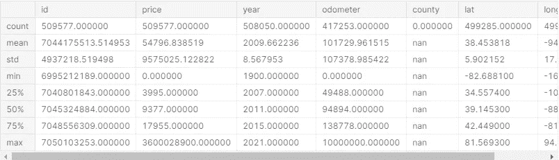

## 包含太多空值的列

```
NA_val = df.isna().sum()

def na_filter(na, threshold = .4): *#only select variables that passees the threshold*
    col_pass = []
    for i **in** na.keys():
        if na[i]/df.shape[0]<threshold:
            col_pass.append(i)
    return col_pass

df_cleaned = df[na_filter(NA_val)]
df_cleaned.columns
```

在继续我的 EDA 的其余部分之前，我使用上面的代码删除了超过 40%的值为 null 的所有列。这使我剩下下面的专栏。

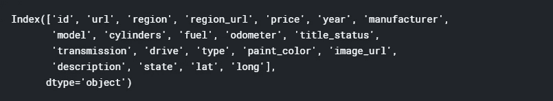

## 移除异常值

```
df_cleaned = df_cleaned[df_cleaned['price'].between(999.99, 250000)] *# Computing IQR*
Q1 = df_cleaned['price'].quantile(0.25)
Q3 = df_cleaned['price'].quantile(0.75)
IQR = Q3 - Q1

*# Filtering Values between Q1-1.5IQR and Q3+1.5IQR*
df_filtered = df_cleaned.query('(@Q1 - 1.5 * @IQR) <= price <= (@Q3 + 1.5 * @IQR)')
df_filtered.boxplot('price')
```

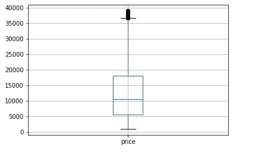

在使用四分位(IQR)方法移除价格的异常值之前，我决定将*价格*的范围设置为更现实的数字，这样标准差将被计算为比 9，575，025 更现实的数字。

IQR 也称为中间值，是一种统计离差的度量，可用于识别和移除异常值。IQR 范围规则的理论如下:

1.  计算 IQR (=第三个四分位数-第一个四分位数)
2.  找出范围的最小值(=第一个四分位数- 1.5 * IQR)
3.  找出范围的最大值(=第三个四分位数+ 1.5 * IQR)
4.  删除任何超出此范围的值。

你可以在上面的方框图中看到，我使用这种方法显著缩小了*价格*的范围。

```
df_filtered.describe().apply(lambda s: s.apply(lambda x: format(x, 'f')))
```

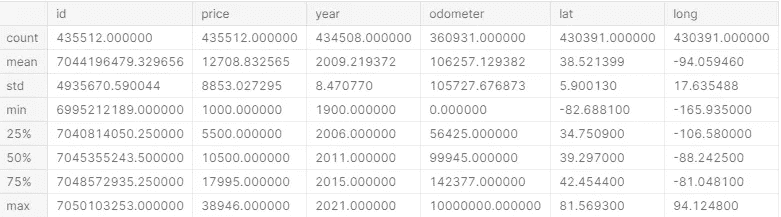

使用**。describe()** 同样，我们可以看到价格范围似乎比最初更现实，但年份和里程表似乎有点偏离(例如，2021 年的最大值)。

我使用下面的代码将年份范围设置为 1900–2020，将里程表设置为 0–271，341.5。

```
*# cant be newer than 2020*
df_filtered = df_filtered[df_filtered['year'].between(1900, 2020)]*# = 140000 + 1.5 * (140000-52379)*
df_filtered = df_filtered[df_filtered['odometer'].between(0, 271431.5)]
```

## 删除剩余的列

```
df_final = df_filtered.copy().drop(['id','url','region_url','image_url','region','description','model','state','paint_color'], axis=1) *#removing region since lat/long mean same thing*
df_final.shape
```

通过部分使用我的直觉，部分猜测和检查，我删除了以下几列:

*   *url* ， *id* ， *region_url* ， *image_url:* 它们与正在进行的分析完全无关
*   *描述*:描述可能能够使用自然语言处理，但超出了这个项目的范围，被忽略
*   *地区，州:*我去掉了这些，因为它们本质上传达的是和经纬度一样的信息。
*   *model* :我去掉了这个，因为有太多不同的值，无法将其转换为虚拟变量。此外，我不能使用标签编码，因为值是无序的。
*   *paint_color* :最后我在进行了特征重要性(稍后你会看到)后去掉了这个。由于特征重要性表明 *paint_color* 在确定*价格*中的重要性很小，所以我移除了它，模型的准确性提高了。

## 可视化变量和关系

```
import matplotlib.pylab as plt
import seaborn as sns

*# calculate correlation matrix*
corr = df_final.corr()*# plot the heatmap*
sns.heatmap(corr, xticklabels=corr.columns, yticklabels=corr.columns, annot=True, cmap=sns.diverging_palette(220, 20, as_cmap=True))
```

清理完数据后，我想可视化我的数据，并更好地理解不同变量之间的关系。利用 **sns.heatmap()** ，我们可以看到*年*与*价格*正相关，*里程表*与*价格*负相关——这个有道理！看来我们走对了路。


```
df_final['manufacturer'].value_counts().plot(kind='bar')df_cleaned['type'].value_counts().plot(kind='bar')
```

出于我自己的兴趣，我使用条形图绘制了一些分类属性(见下文)。为了更好地了解数据集，您还可以做更多的可视化工作，如散点图和箱线图，但我们将进入下一部分，数据建模！

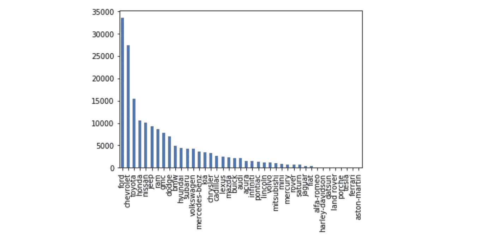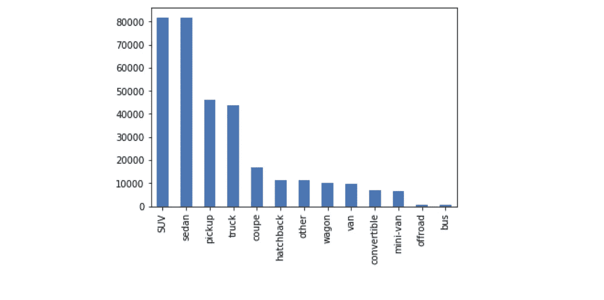

# 数据建模

## 虚拟变量

```
df_final = pd.get_dummies(df_final, drop_first=True)
print(df_final.columns)
```

为了能够在我的随机森林模型中使用分类数据，我使用了 **pd.get_dummies()。**这实质上是将变量的每个唯一值转换成它自己的二进制变量。例如，如果制造商之一是本田，那么将创建一个名为“manufacturer_honda”的新虚拟变量，如果是本田，它将等于 1，否则等于 0。

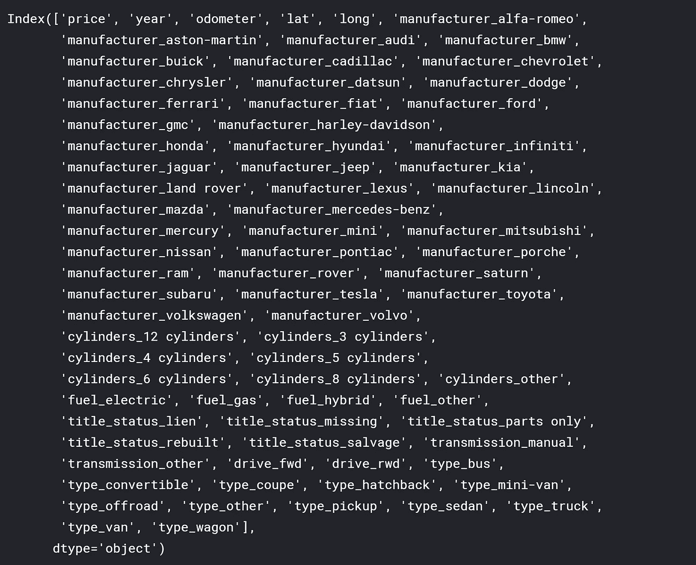

## 缩放数据

```
from sklearn.preprocessing import StandardScaler
X_head = df_final.iloc[:, df_final.columns != 'price']

X = df_final.loc[:, df_final.columns != 'price']
y = df_final['price']
X = StandardScaler().fit_transform(X)
```

接下来，我使用**标准缩放器**缩放数据。Prasoon 提供了一个很好的答案[在这里](https://www.quora.com/Why-do-we-normalize-the-data)为什么我们要缩放(或标准化)我们的数据，但本质上，这样做是为了我们的自变量的缩放不会影响我们模型的组成。例如，*年*的最大数字是 2020，*里程表*的最大数字超过 20 万。如果不把数据按比例放大，里程表*的一个小变化*会比*年*的同样变化产生更大的影响。

## 创建模型

```
from sklearn.ensemble import RandomForestRegressor
from sklearn.model_selection import train_test_split
from sklearn.metrics import mean_absolute_error as mae

X_train, X_test, y_train, y_test = train_test_split(X, y, test_size=.25, random_state=0)
model = RandomForestRegressor(random_state=1)
model.fit(X_train, y_train)
pred = model.predict(X_test)
```

我决定使用随机森林算法有几个原因:

1.  它**很好地处理了高维度**，因为它采用了数据子集。
2.  它非常通用，只需要很少的预处理
3.  在**避免过度拟合**是很棒的，因为每个决策树都有低偏差
4.  它允许您检查**特性的重要性**，您将在下一节看到！

## 检查模型的准确性

```
print(mae(y_test, pred))
print(df_final['price'].mean())model.score(X_test,y_test)
```

总的来说，我的模型在平均价格为 12600 美元左右的情况下实现了 1590 美元的 MAE，准确率为 90.5%！

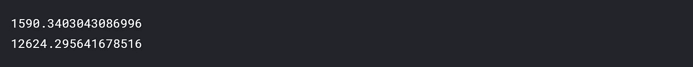

MAE 和平均价格


模型的准确性

# 特征重要性

```
feat_importances = pd.Series(model.feature_importances_, index=X_head.columns)
feat_importances.nlargest(25).plot(kind='barh',figsize=(10,10))
```

我花了很多时间寻找特性重要性的最佳定义，Christoph Molnar 提供了最佳定义(见[此处](https://christophm.github.io/interpretable-ml-book/feature-importance.html))。他说:

> 我们通过计算置换特征后模型预测误差的增加来衡量特征的重要性。如果打乱某个特征的值会增加模型误差，则该特征是“重要的”，因为在这种情况下，模型依赖于该特征进行预测。“如果改变某个特征的值而不改变模型误差，则该特征是“不重要的”，因为在这种情况下，模型在预测中忽略了该特征。”

鉴于此，我们可以看到决定*价格*的三个最重要的特征是*年份、驱动(如果是前轮驱动的话)、*和*里程表。特性重要性是向非技术人员合理化和解释你的模型的好方法。如果您需要降低维度，它对于特征选择也非常有用。*

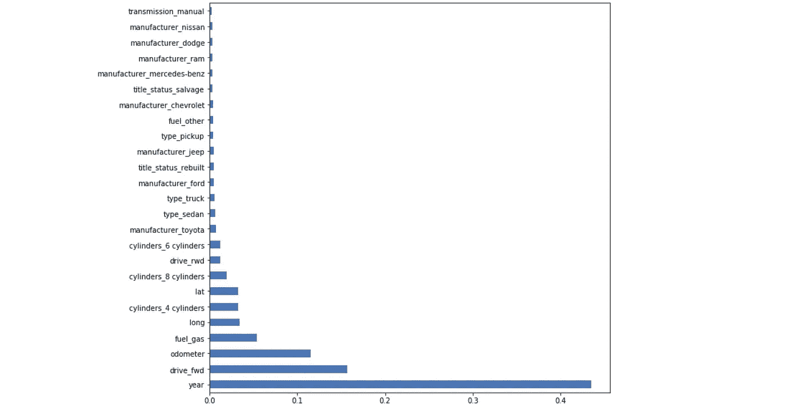

我的项目到此为止！我希望这能激励那些想进入数据科学的人真正开始。我还有很长的路要走，但我觉得到目前为止我已经取得了很大的进步。更多即将推出。

# 感谢阅读！

如果你喜欢我的工作，想支持我…

*   成为第一批订阅[我的新 **YouTube 频道**这里](https://www.youtube.com/channel/UCmy1ox7bo7zsLlDo8pOEEhA?view_as=subscriber)！虽然还没有任何视频，但我会以视频的形式分享很多像这样的精彩内容。
*   也是第一批关注我的 [**Twitter**](https://twitter.com/terence_shin) 的人之一。
*   点击在 **LinkedIn** [上关注我。](https://www.linkedin.com/in/terenceshin/)
*   在我的**邮箱列表** [这里](https://forms.gle/UGdTom9G6aFGHzPD9)报名。
*   看看我的网站，[**terenceshin.com**](https://terenceshin.com/)。