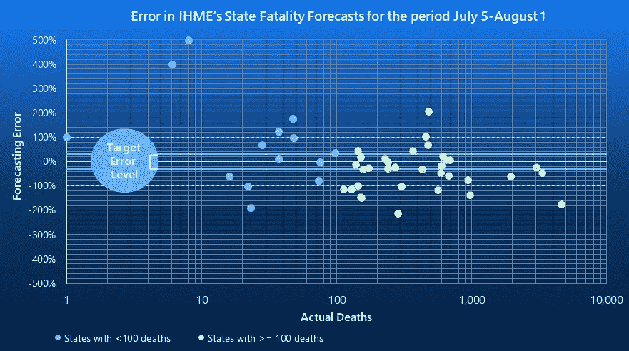
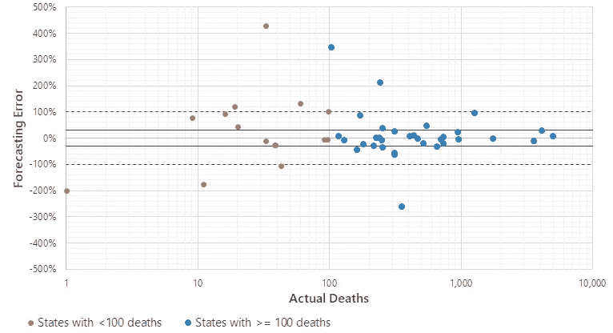
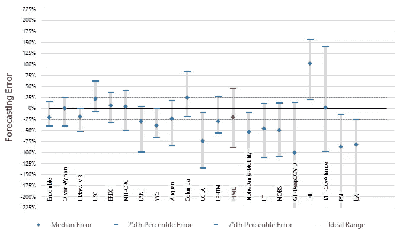
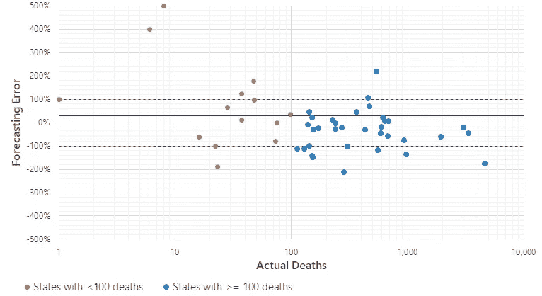
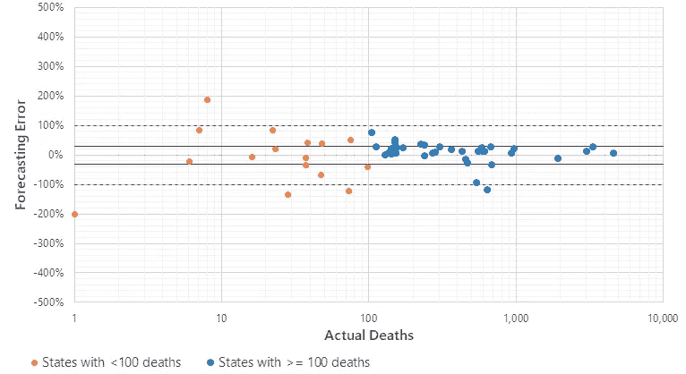
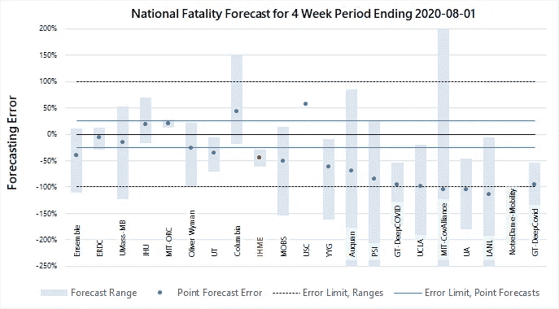
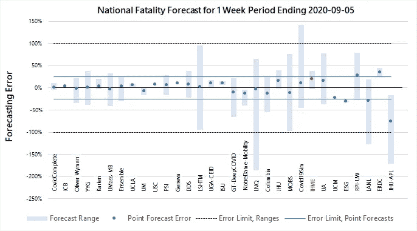
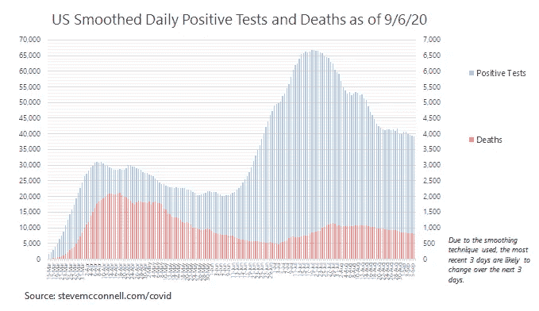

# 这就是为什么你应该忽略 IHME 的预测

> 原文：<https://towardsdatascience.com/this-is-why-you-should-ignore-ihmes-forecasts-4634a4db0e85?source=collection_archive---------33----------------------->

## IHME 在疫情走向的问题上误导了我们。看看你是否同意数据证明了这一点。

周五，IHME 健康指标和评估研究所发布了三个新的死亡预测。他们最有可能的情况是，到 1 月 1 日，美国将有 41 万人死于新冠肺炎病毒。这些预测已经被各大新闻媒体广泛报道([美国消费者新闻与商业频道](https://www.cnbc.com/2020/09/04/key-coronavirus-forecast-predicts-over-410000-total-us-deaths-by-jan-1.html)、 [NBC](https://www.nbcnews.com/news/us-news/research-firm-trump-administration-previously-touted-releases-dire-covid-19-n1239339) 、 [NPR](https://www.npr.org/sections/goatsandsoda/2020/09/04/909783162/new-global-coronavirus-death-forecast-is-chilling-and-controversial) 、[今日美国](https://www.usatoday.com/story/news/health/2020/09/04/covid-19-news-labor-day-weekend-south-dakota-donald-trump/5712554002/)、[圣荷西水星报](https://www.mercurynews.com/2020/09/04/virus-model-us-could-see-400k-dead-by-jan-1/)等。).

只有一个问题。IHME 过去的预测误差高达百分之几百。在许多情况下，他们的预测实际上比根本没有预测还要糟糕，因为他们对疫情的走向产生了误导性的想法。

IHME 对 1 月份的预测也好不到哪里去。事实上，它们是如此的不切实际，以至于我怀疑它们是否真的基于科学，或者科学是否已经从属于其他议程。

在这篇文章中，我将提供关于 IHME 早期预测的不准确性的数据，并且我会给你更多的理由去忽略他们对一月份的预测。

# 数据:IHME 的国家预报记录

我领导着大约 20 个组织中的一个，这些组织向疾病预防控制中心提交死亡预测，用于疾病预防控制中心的集合模型，这是疾病预防控制中心记录的预测。IHME 和卡耐基梅隆大学、哥伦比亚大学、约翰霍普金斯大学、麻省理工学院、马萨诸塞大学阿默斯特分校、加州大学洛杉矶分校以及其他一些大学的团队也做出了贡献。

这是一家精英公司，而在这家精英公司中，IHME 的预测充其量看起来也只是平庸。

我最近完成了一份州级死亡预测的评估报告，该报告于 8 月 3 日提交给 CDC，涵盖了 8 月 2 日至 29 日期间的死亡预测。在此期间，IHME 的平均成绩为 C-；整体预测准确性明显低于领先群体。

图 1 显示了 IHME 各州在 8 月 3 日提交给 CDC 的第 1-4 周累积州级预测中的表现，即 8 月 2 日至 29 日期间的表现。

一个准确的预测模型几乎所有的点都在中间两条 25%的深色线之间。IHME 有一半以上的时间都没有达到这个目标。IHME 有一个季度的预测失误超过 100%。

图 1—8 月 2 日至 29 日期间 IHME 州死亡人数预测。

尽管这些成绩平平，但它们实际上比 IHME 之前的表现有了*的进步*。在 7 月的可比时期(7 月 5 日至 8 月 1 日)，IHME *的四周州级死亡预测平均误差为 191%。如图 2 所示，IHME 在这一时期处于 CDC 预测组的下半部分，明显比最佳组差。*

图 2 —预测模型对 7 月 5 日至 8 月 1 日期间各州死亡人数预测的表现。

正如 the 月份散点图所示(图 3)，超过三分之一的预测至少有 2 倍的误差。无论是最高预测还是最低预测都没有显示在图表上，因为它们超出了图表上显示的 500%误差范围。

图 3—IHME 7 月 5 日至 8 月 1 日期间的州死亡率预测。

IHME 7 月份的预测非常糟糕——听着——如果你把他们 8 月份的预测应用到 7 月份的预测中，这些预测实际上比他们 7 月份的预测要好。图 4 显示了它的样子。

图 4—IHME 8 月份的预测适用于 7 月份。

当你对错误时期的预测比对正确时期的预测更准确时，是时候承认你不太擅长预测了。

# 更多数据:IHME 的国家预报记录

在国家层面，IHME 的预测与其他预测模型的比较如图 5 所示，图 5 显示了 7 月 5 日至 8 月 1 日的国家预测。目标是靠近中间的黑色 0%线。诚然，其他群体表现更差，但这并不意味着 IHME 的预测是准确的。IHME 的预测差了将近 50%，他们预测范围的上限比下限低了 25%。

图 5 —预测模型对 7 月 5 日至 8 月 1 日期间的全国预测。

对于刚刚结束的一周(截至 9 月 6 日的一周)，IHME 的最新预测比大多数团体的预测都要差(图 6)。IHME 的预测在短短一周内错过了 20%*；大多数其他预测组要准确得多。*

图 6—8 月 31 日提交的截至 9 月 5 日的一周的国家预测。

这些都不是新的。从疫情开始，IHME 的预测就很糟糕。四月份，T2 对 IHME 95%预测区间的评估发现，根据预测，49%到 73%的实际死亡人数超出了预测区间。这个数字应该是 5%。正如《评论》所评论的那样，这比它应该达到的程度还要糟糕一个数量级。

IHME 一周的预测差了 20%。他们一个月的预测差了 50%。离明年 1 月还有 4 个月，他们的预测还会差多少？很容易想象它们有百分之一百或更多的不准确。

# IHME 1 月份的预测背后是什么？

IHME 的预测如此糟糕的一个原因是他们的假设近乎荒谬。让我们来看看需要发生什么才能让 IHME 的 410，000 人死亡的预测成为现实。

首先，他们的预测要求美国在接下来的四个月里，比疫情开始以来的死亡人数还要多。在接下来的 *115 天*中的每一天，我们将不得不平均每天超过 1800 例死亡*——这比我们迄今为止的死亡人数多了 100 天。*

其次，过去六周的长期趋势需要立即逆转。每天的死亡率需要增加到上周的 225%,尽管事实上最近几周死亡率一直呈下降趋势*大约每周 10%,而且事实上自 7 月中旬以来阳性测试也呈急剧下降趋势*(图 7)。**

****

**图 7**

**第三，对于 IHME 最有可能发生的情况，在接下来的四个月里，政府官员需要避免注意到死亡人数已经增加了一倍多，他们也不需要采取任何纠正措施。公共官员需要坚持不懈地忽视科学家的报告，忽视媒体上令人担忧的故事，忽视选举年来自另一个政党的批评，忽视选民越来越强烈的关于死亡率正在翻倍的抱怨。**

**你觉得这听起来合理吗？是不是听起来*最有可能*？当然不是。**

**这是不会发生的。**

**是什么让 IHME 认为它会成功呢？**

# **科学是 IHME 唯一的考虑吗？**

**IHME 有能干的科学家。有能力的科学家真的能说服自己，在死亡率翻倍的情况下，整个国家将沉睡四个月，无所事事——在他们最有可能的场景中？**

**这种情况不太可能发生。甚至不仅仅是不太可能。几乎不可能*。***

***那么，为什么 IHME 的科学家会把这种情况描述为*最有可能是*？***

**我认为有两个问题。**

**首先，正如本文中的数据所显示的，他们真的不擅长预测。他们需要改进。**

**第二，我不认为他们真的相信他们(糟糕的)预测。他们不能真的相信到 1 月 1 日死亡人数会增加到 41 万，而政府官员却无所作为。相反，我相信他们是在用他们的预测来督促政府官员确保死亡人数不会上升到那个水平。如果这是真的，他们已经不再作为科学家发挥作用，而是开始作为一个政治行动团体发挥作用。**

**这是这个世界现在最不需要的。我们已经有相当一部分公众质疑科学或者干脆不相信它。事实上，这些人说得有道理。冠状病毒的大部分科学还没有“定论”。科学家有许多不同的理论和观点。仍然有许多“未知”或“部分已知”在这种情况下，让一群科学家打着科学的幌子提出他们的政治行动议程，从而进一步模糊这一问题是无益的。**

**IHME 需要发展与他们的预测受到的关注程度相称的预测技能。当他们这么做的时候，他们应该记住，如果我们希望人们对科学有任何信心，科学家需要保持科学，把政治留给政治家。**

# **更多详情请访问新冠肺炎信息网站**

**我领导的团队将 *CovidComplete* 预测纳入疾病预防控制中心的[集合模型](https://www.cdc.gov/coronavirus/2019-ncov/covid-data/forecasting-us.html)。更多的预测和美国和州级数据，请查看我的新冠肺炎信息网站。**

****

# **我的背景**

**在过去的 20 年里，我专注于理解软件开发的数据分析，包括质量、生产率和评估。我从处理噪音数据、坏数据、不确定性和预测中学到的技术都适用于新冠肺炎。**