# 这可能会让你在美国的某些情况下开车时三思而行。

> 原文：<https://towardsdatascience.com/this-might-make-you-think-twice-about-driving-in-certain-circumstances-in-the-u-s-9fc6d625c346?source=collection_archive---------64----------------------->

## 美国交通事故的探索性数据分析

# 让我们从事实开始

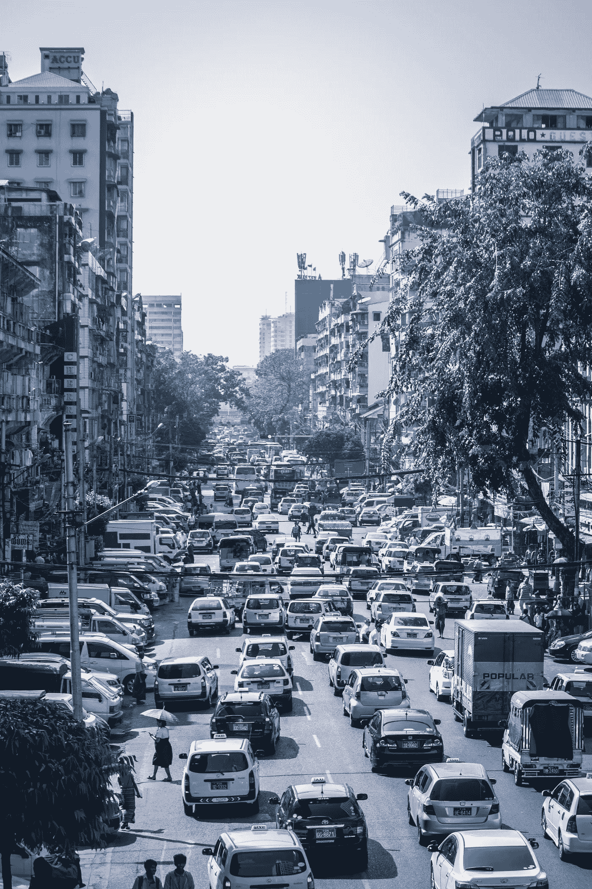

美国每年有超过 38，000 人死于交通事故。美国的交通死亡率是每 10 万居民中有 12.4 人死亡。另有 440 万人伤势严重，需要医疗救助。在美国，交通事故是 1-54 岁人群死亡的主要原因。

***事故发生*** 。它们随时都可能发生，但是如果我告诉你它们在特定的时间更容易发生呢。当然，相关性并不意味着因果关系，但观察分布并推断其原因仍然很有趣。

为了分析美国的交通事故，我使用了来自 Kaggle 的数据集，其中包含全国范围内的车祸数据，涵盖了美国的 49 个州。事故数据是从 2016 年 2 月到 2019 年 12 月收集的，使用了几个数据提供商，包括两个提供流式交通事件数据的 API。大约有 300 万条记录和 49 个特征。

```
print('These features are:',df.columns.values)These features are: ['ID' 'Source' 'TMC' 'Severity' 'Start_Time' 'End_Time' 'Start_Lat'
 'Start_Lng' 'End_Lat' 'End_Lng' 'Distance(mi)' 'Description' 'Number'
 'Street' 'Side' 'City' 'County' 'State' 'Zipcode' 'Country' 'Timezone'
 'Airport_Code' 'Weather_Timestamp' 'Temperature(F)' 'Wind_Chill(F)'
 'Humidity(%)' 'Pressure(in)' 'Visibility(mi)' 'Wind_Direction'
 'Wind_Speed(mph)' 'Precipitation(in)' 'Weather_Condition' 'Amenity'
 'Bump' 'Crossing' 'Give_Way' 'Junction' 'No_Exit' 'Railway' 'Roundabout'
 'Station' 'Stop' 'Traffic_Calming' 'Traffic_Signal' 'Turning_Loop'
 'Sunrise_Sunset' 'Civil_Twilight' 'Nautical_Twilight'
 'Astronomical_Twilight']
```

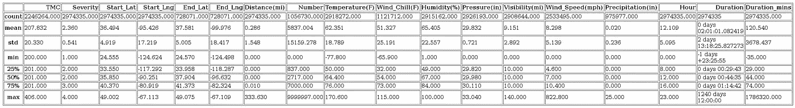

df.describe()

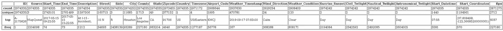

df.describe(include=['object'])

通过调用*描述*我们的数据，我们可以告诉很多关于我们的数据框架。例如，大多数事故发生在加利福尼亚。天气状况大多是晴朗无风的白天。大多数事故发生在 I-5 N 公路上。平均降雨量非常少，事故发生地的平均能见度为 9 英里。

# 哪些州事故最多？

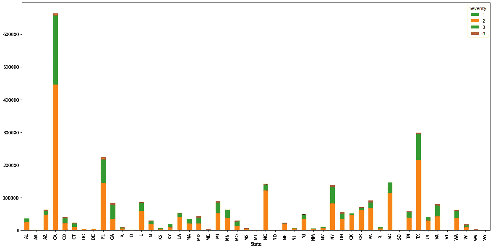

按严重程度分类的每个州的事故数量。

```
print('The top 10 States with the highest accidents are:',df['State'].value_counts()[0:10].index.values)The top 10 States with the highest accidents are: ['CA' 'TX' 'FL' 'SC' 'NC' 'NY' 'PA' 'MI' 'IL' 'GA']
```

到目前为止，加州的事故最多。

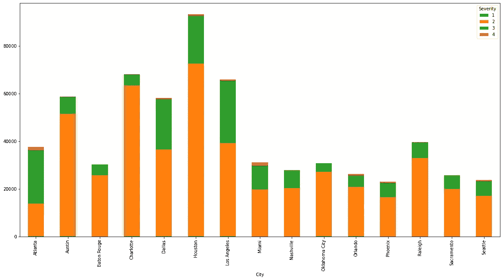

美国前 15 大城市的事故数量

虽然加州事故最多，但与美国所有其他城市相比，休斯顿是事故最多的城市。

# 大多数事故发生在什么时候？

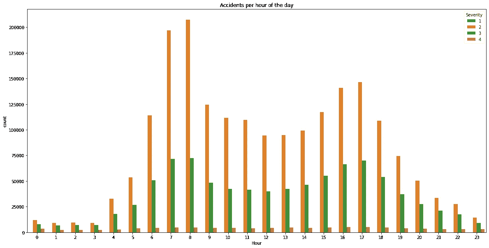

一天中每小时的事故数量。

大多数事故发生在早上 7 点至 8 点，最少发生在晚上 11 点至凌晨 3 点。似乎最严重的事故整天都在发生。

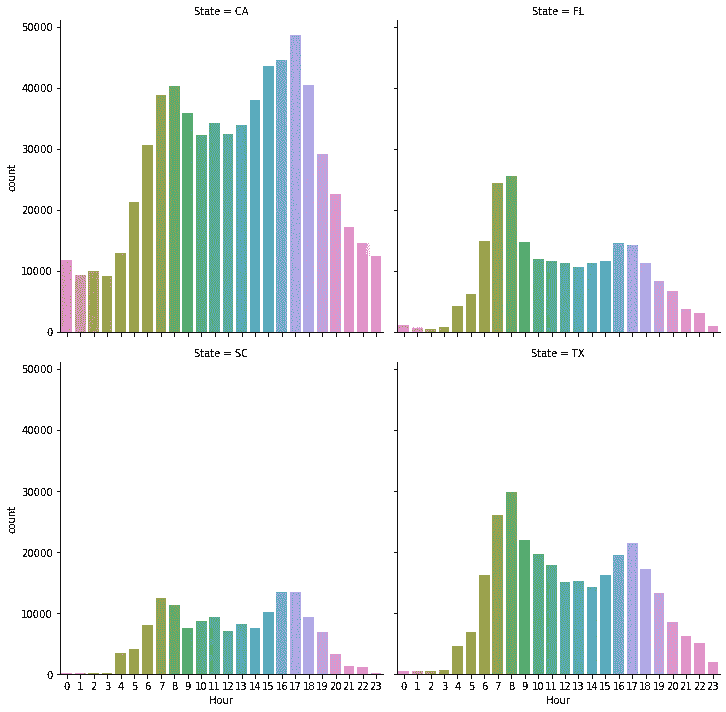

过滤到前 4 个州的事故数量。

在加利福尼亚州，我们可以看到大多数事故实际上发生在下午 3-6 点左右，而在德克萨斯州和佛罗里达州，高峰是在一天的开始(大约 7-8 点)。

# 天气会影响事故的严重程度吗？

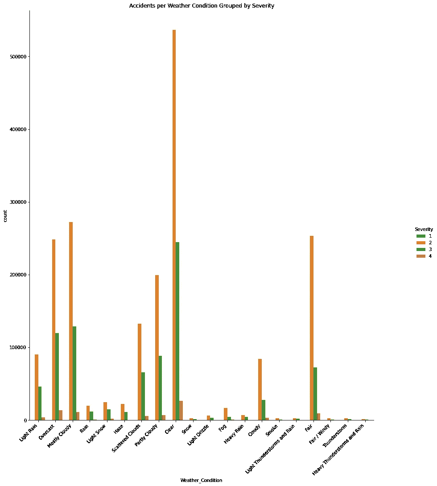

乍一看，很难判断天气是否与更严重的事故有关。更有意义的是，根据每种天气条件的严重程度来看事故的比例。

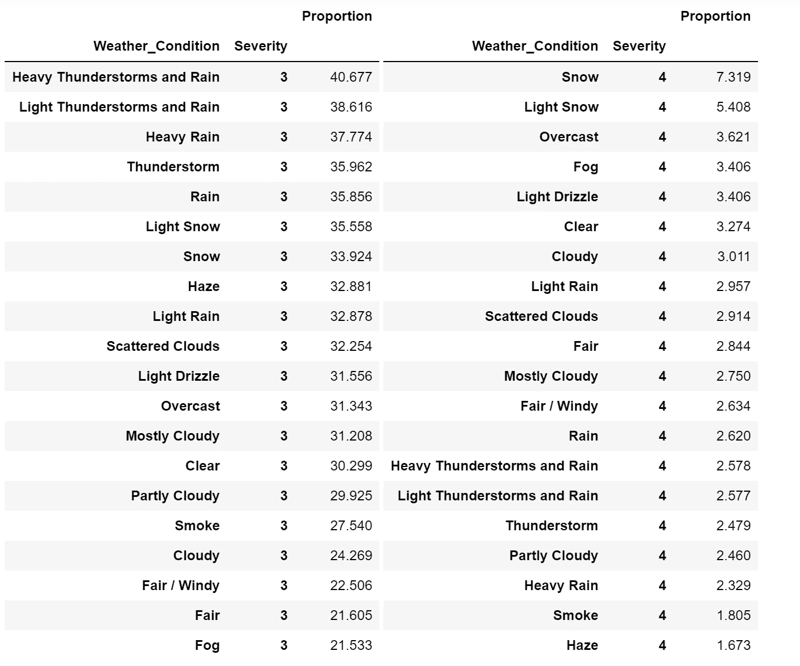

每种天气条件的严重程度比例。

可以理解的是，最严重的事故都与恶劣天气有关。

# 地理绘图

必须利用坐标！我在 python 上使用了 *plotly* 来生成这些地理地图。我能够通过标绘美国的县 **FIPS** 代码来做到这一点(关于这一点的更多信息可在下面获得)。

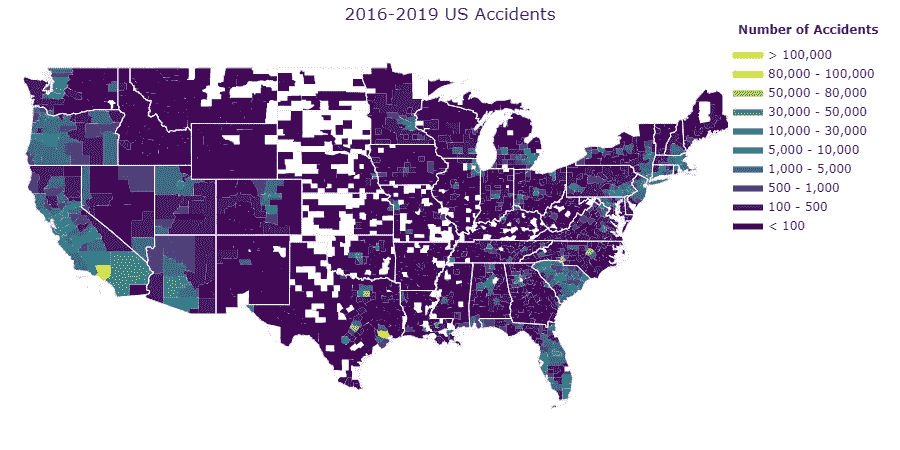

除了边缘的州，事故似乎很少发生。

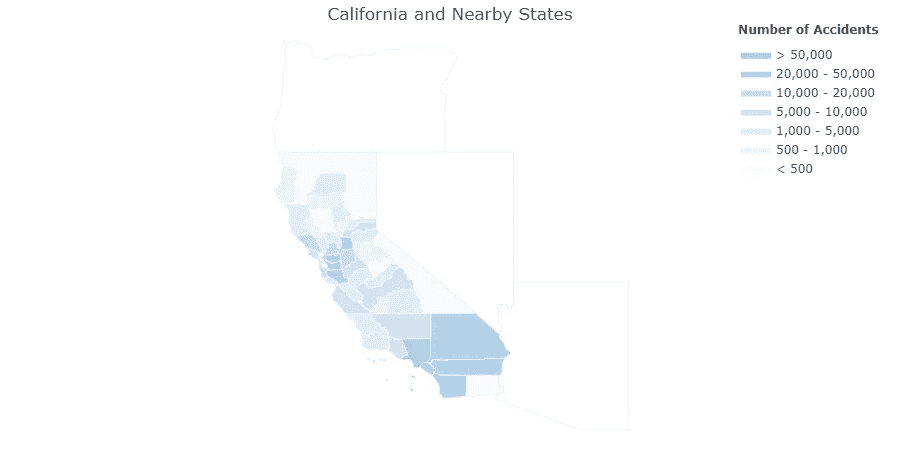

南加州的事故最多。

# 在预测事故发生的地点时，什么特征最重要？

使用 XGBoost 运行模型，在不使用任何位置数据的情况下对事故的 FIPS 代码进行分类(即预测事故将在哪里发生)。

特征重要性如下所示。XGBoost 通过计算每个特征在模型中的所有增强回合(树)中被分割的次数，然后将结果可视化为条形图，其中特征根据它们出现的次数进行排序。

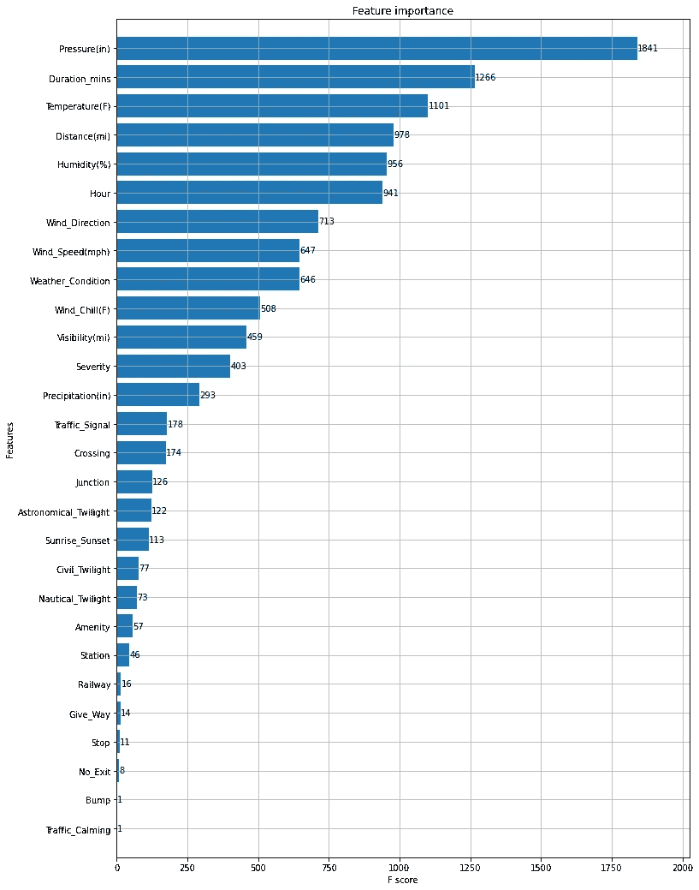

使用 XGBoost 的特性重要性

对事故区域进行分类的最重要的特征是气压、持续时间和温度

# 结论

在本帖中，我们回顾了美国的交通事故，我们发现:

*   哪个州和城市的事故最多？
*   事故发生的时间分布。大多数事故发生在工作前后(早上 6-8 点和下午 4-6 点)
*   天气是否影响事故的严重程度。
*   与事故发生地点相关的重要特征

希望你已经获得了一些洞察力！注意安全，尤其是如果你在南加州开车。

如果你想了解更多关于这个分析的内容，看看我的代码，然后看看我下面的 github repo:)

[](https://github.com/michaelarman/US-Accidents) [## 迈克尔·拉曼/美国-事故

### 所有必需的包都在 requirements.txt 文件中，我在 Kaggle 上看到了这个数据集，它有很多…

github.com](https://github.com/michaelarman/US-Accidents) 

# 参考

Moosavi、Sobhan、Mohammad Hossein Samavatian、Srinivasan Parthasarathy 和 Rajiv Ramnath。"一个全国性的交通事故数据集.", 2019.

Moosavi、Sobhan、Mohammad Hossein Samavatian、Srinivasan Parthasarathy、Radu Teodorescu 和 Rajiv Ramnath。"基于异质稀疏数据的事故风险预测:新数据集和见解."《第 27 届 ACM 地理信息系统进展 SIGSPATIAL 国际会议论文集》，ACM，2019。

[](https://plotly.com/python/county-choropleth/) [## 美国郡地图

### 正在收集 geopandas==0.3.0 正在下载…

plotly.com](https://plotly.com/python/county-choropleth/)