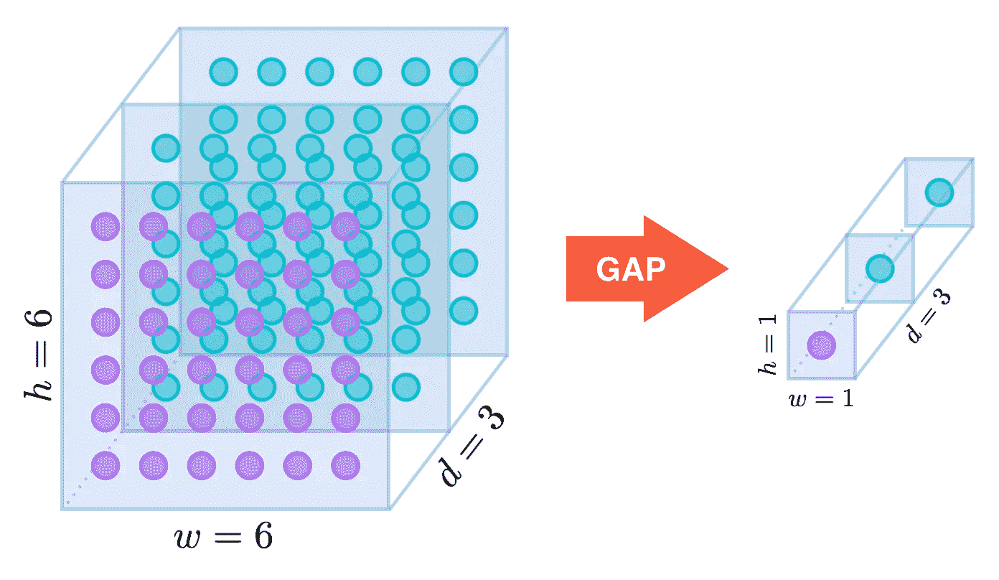

# 这个模型一点用都没有

> 原文：<https://towardsdatascience.com/this-model-is-for-the-birds-6d55060d9074?source=collection_archive---------27----------------------->

## 用康奈尔大学的鸟类数据进行深度学习实验

计算机视觉在过去十年中取得了显著的进步，这主要是通过人工神经网络(俗称深度学习)的进步实现的。技术进步和更复杂的网络设计的结合已经导致神经网络在分类、对象检测和分割的问题上具有最先进的并且通常比人更好的准确性。

深度学习架构的传统基准通常是在相同的六个左右的图像数据集上进行的。这有一个明显的优点，即允许进行比较，但缺点是所有的基准模型都是针对同一个小问题集进行训练的，这就留下了这些基准的泛化能力如何的问题。除了作为必要的有限图像样本之外，所有的训练和验证图像都必须经过策划，并且可能不反映在真实世界中发现的图像种类。

我更喜欢去野外。字面上。如果你要学习一项新技术，而这是我第一个深度学习的项目，最好是找到一个有趣的应用。我想不出比物种探测更有趣的应用了。处理一类生物的图像有一些特殊的挑战。近年来，出现了一个流行的**细粒度**图像分类数据集集合，它专注于分类问题，需要检测细微差异才能正确识别图像。识别鸟类是一个很好的例子。确切的数量还有待讨论，但鸟类的数量大约在 10，000 种左右，其中近三分之二是雀形目鸟类(即鸣禽。)对于所有这些种类来说，它们的体型有着显著的一致性，一些种类的区别仅在于翅膀或头部的颜色略有不同。那是大草原麻雀还是夜莺麻雀？这并不总是容易分辨的。

Vesper Sparrow(康奈尔实验室的莱恩·沙恩/麦考莱文库 [**ML41643251**](https://macaulaylibrary.org/asset/41643251) )和萨凡纳·斯派洛(康奈尔实验室的唐·布雷查/麦考莱文库 [**ML55502961**](https://macaulaylibrary.org/asset/55502961) )。

毛茸茸的啄木鸟怎么样？如果不仔细观察鸟嘴，即使是经验丰富的观鸟者也会感到困惑。

绒毛啄木鸟(康奈尔实验室的埃文·利普顿/麦考利库 [**ML47227441**](https://macaulaylibrary.org/asset/47227441) )和长毛啄木鸟(康奈尔实验室的内特·布朗/麦考利库 [**ML52739271**](https://macaulaylibrary.org/asset/52739271) )

为了有助于精细视觉分类的研究，[康奈尔鸟类学实验室](https://www.birds.cornell.edu/home/)发布了由 404 种鸟类的 48562 张图像组成的 [NABirds](https://dl.allaboutbirds.org/nabirds) 数据集。其中许多物种进一步细分为雄性/雌性、成年/幼年、繁殖/非繁殖等类别，总共有 555 类。我的目标是确定如何在这 555 个具有不同模型架构的类上获得最佳的预测精度。

数据在训练和验证之间大致平均分配(23，929 次训练和 24，633 次验证)。每节课的训练图像数量变化很大，大约四分之一的课有 60 张图像，一些稀有品种的图像数量为个位数(白翅黑眼灯芯草 4 张，雌丑小鸭 5 张)。)

培训示例的分发。

验证图像的分布类似于训练图像的分布。具有很少训练图像的类往往很少访问验证集。

图像大小也是相当可变的，这将是一个问题。超过一半的人的宽度为 1024，大多数人的高度在 600 到 900 之间(大多数人在 700 到 800 左右)。深度学习的小批量训练要求所有输入具有相同的维度。我将尝试不同的裁剪和大小调整策略。

每个图像还带有一个边框，覆盖图像中包含鸟的部分。每个图像有一只鸟，因此每个图像有一个盒子。作为本练习的一部分，我不会尝试预测边界框，但我会在训练和一些验证的预处理中使用它们

带边框的鸟图像。从纳伯德数据集。

**型号选择**

本文将重点介绍一些更简单的技术，用于在细粒度分类问题上获得良好的准确性。首先，也是最明显的，是图像分辨率。就其本质而言，细粒度分类问题依赖于检测细微的细节，如果图像分辨率降低太多，这些细节可能会丢失。我拍摄了三种图像分辨率大小，224x224，300x300 和 600x600。这些是 EfficientNetB0、EfficientNetB3 和 EfficientNet B7 的默认分辨率，这是我决定在实验中使用的三种模型架构。所有网络都在 ImageNet 上进行了预训练。

这是我考虑的第二个可变因素，模型大小。EfficientNet 是基于一种架构的一系列模型，但深度(层数)、宽度(每层的通道数)和输入分辨率统一缩放。原 [EfficientNet](https://arxiv.org/pdf/1905.11946.pdf) 论文提出八个网络；出于时间的考虑，我只用了三种:小号、中号和大号。(在任何人问我为什么用 B3 而不是 B4 作为媒介之前，这是一个掷硬币的问题。)所有模型都在 ImageNet 上进行了预训练。

我探索的第三个参数是学习率。我不会假装已经对可能的学习率空间进行了彻底的搜索，如果这种事情是可能的话，但我认为我有一些合理的见解。坚持一个共同主题的一些变化，我从 1e-3 的学习率开始，每 4 个或每 8 个时期减少 0.94 倍。每 4 个时期丢弃一次是微调网络的标准过程；每 8 个丢弃一个是一种适应，以考虑更大的批量大小，从而通过使用 TPU 允许每个时期更少的步骤。

**预处理训练数据**

机器学习的基本思想是，通过一组代表性的训练数据和一个具有可调参数的模型，训练数据可用于找到一组参数，这些参数允许模型在给定一组新数据时做出准确的预测。在图像分类的情况下，“代表”这个词比较棘手。所有可能的图像的空间，即使是一个特定的主题，是如此之大，以至于几乎不可能考虑所有的可能性。还有实际的考虑。神经网络的任何输入都必须具有一定的分辨率，用于小批量训练的张量框架需要固定的输入分辨率，并且存储器方面的考虑限制了分辨率的精细程度。

好消息是这些限制仍然允许很大的灵活性。数据扩充可以人为地增加训练数据的大小。在数据集的情况下，像 NABirds，输入图像大小变化，调整大小和重新缩放算法现在是标准的。计算能力，尤其是 TPU 的计算能力，现在可以使用相对精细的分辨率作为输入。

还应该补充的是，当从高分辨率到低分辨率时，可以保留许多信息。在这些啄木鸟图像中，分辨率依次降低了两倍。这种鸟的性质，如果不是它的确切种类，在前四张照片中仍然很清楚。即使在图片五中，啄木鸟仍然是一个合理的猜测。只有在最低分辨率下，观众才会陷入猜测。

当然，这样做的一个原因是啄木鸟在前景中。如果这只鸟占据了图片的一小部分，可识别性会下降得更快。下面的 Parula 仅在前四幅图像中可见。

从纳伯德数据集

有许多预处理方案已经成为深度学习的标准。在切换到 EfficientNet 之前，我一直在使用 inception 架构，并坚持使用 Inception 预处理方案的变体。加载图像后，会进行随机裁剪。这种作物必须符合以下条件:

*   它必须包含至少 50%的边界框。这是为了避免种植没有太多鸟类的作物。
*   它必须包含至少 10%的总图像。
*   它的长宽比必须在 4:3 和 3:4 之间。

然后调整裁剪的大小以适合输入尺寸，根据型号可以是 224x224、300x300 或 600x600。由于原始裁剪可能不是一个完美的正方形，这将导致一些挤压或拉伸失真，但仅足以在输入中引入一些变化。

下一个预处理阶段采用这个正方形并执行一系列随机的颜色调整，改变色调、亮度、饱和度和对比度。在很大程度上，这可以被视为针对不同的照明条件调整图像。图像也以 0.5 概率水平翻转。

前两个预处理阶段后的图像示例如下。

NABirds 数据集的原始数据

最后的预处理步骤是对 EfficientNet 的输入值进行标准化。

响应变量也经过预处理。作为对过度拟合的适度防御，我应用了标签平滑程序，如 [InceptionV3](https://arxiv.org/pdf/1512.00567.pdf) 论文中所述。

**预处理验证数据**

图像分类模型的一个肮脏的小秘密是，它们的验证准确性非常依赖于如何选择验证集。我曾经有一个模型的验证准确性从 90%下降到 70%，仅仅是因为我忘记了更改输入分辨率。顺便说一下，这是这个项目的灵感。

在这个实验中，我选择了四个独立的验证预处理步骤。我考虑的主要方法是获取验证图像并重新缩放它们以适合训练图像的大小。这是评估验证集的标准方法，除了中心裁剪(我认为简单地删除图像的一部分没有好处)，以及我决定用黑色边框填充，而不是挤压和拉伸图像以适应正方形输入。

其他三种策略及其基本原理如下:

*   重新缩放边界框中的图像部分，以适合训练图像的大小。这种策略给我的图像更接近于训练集，但这是一种欺骗，因为它需要边界框的先验知识，这在现实世界的应用程序中很少出现。
*   使用未经预处理的原始图像，只对输入进行归一化处理。在某些方面，这是理想的情况；传入任何图像，模型都会产生一个输出。由于图像大小不一，我只能使用批量大小为 1 的值，而且我只能这样做，因为验证集很小。
*   使用边界框内的原始图像，除了归一化之外不进行任何预处理。作为自然学家的狂热用户，我知道在感兴趣的生物体周围裁剪图片通常是获得良好身份的最佳方式。正如我们将看到的，从图像中去除无关的细节，即使分辨率没有任何变化，也会对精度产生很大的影响。

以下是四种验证输入的示例(不按比例)。

NABirds 数据集的原始数据

**模特培训**

训练是使用谷歌 Colab 与 TPU 后端完成的。使用的标准小批量大小是 512 (64 * 8 个内核)，尽管在图像大小或神经网络太大而无法将 512 个批量放入内存的情况下，我将它减少了两倍(即 256、128，甚至 64)。这通常发生在处理 600x600 图像和/或 EfficientNetB7 时。所有模型都被训练了 300 个纪元，尽管我认为较大的模型仍有改进的空间。优化器是带有默认参数的 Adam，损失函数是标准分类交叉熵。

**标准验证数据结果**

学习率每 4 个时期衰减的模型的验证结果。

学习率每 8 秒衰减一次的模型的验证结果。

结果的大致轨迹在意料之中。输入分辨率越高，模型越好。模型越大，模型做得越好。第一个有趣的结果是分辨率比模型大小更重要。从 224x224 增加到 300x300 通常价值约 6 个百分点的验证准确性，从 300x300 增加到 600x600 通常价值约 8 个百分点。这在所有的模型尺寸上是相当一致的。

相反，保持分辨率不变，但增加模型大小，只能增加 3-5 个百分点。这在所有输入分辨率中都是一致的。

我的理论是，学习速率衰减越慢(每 8 个周期而不是每 4 个周期)对更大的小批量工作越好，但这个理论是不正确的。较慢的衰减率总是导致精度稍低，通常约为 0.5%。

**其他验证数据的结果**

正如所料，裁剪对验证准确性有很大的影响。仅使用边界框中的输入，而不是使用完整的图像，但重新缩放以匹配训练输入，将获得高达 14%的准确性，通常至少为 9–10%。这种效果在 224x224 分辨率和较小的模型中最为明显，但即使对于较高的模型和分辨率也很明显。

全球平均池([亚历克西斯·库克](https://alexisbcook.github.io/2017/global-average-pooling-layers-for-object-localization/)

标准与边界框裁剪

为了理解为什么精度在裁剪后持续增加，考虑现代深度学习模型的最后几个阶段是有益的。最后一个阶段通常是全局平均池、可选的批量标准化和剔除层，以及最终的密集输出层。全局平均池层的输入是 HxWxD 张量(L 和 W 是高度和宽度，D 是通道数),输出是通过对所有通道进行平均计算得到的 D 长度向量。可以说，组成输入张量的每个 D 长度(HxW)向量是处理原始图像子集的卷积网络的最后一层。的确，这是物体检测的基本思想；对每个 D 长度向量运行分类模型，以确定是否存在对象。在这种情况下，每个 D 长度向量编码了每种鸟类出现在输入图像部分的可能性。如果一只鸟占据了图像的大部分，就像使用裁剪输入时一样，大部分 D 长度向量将对其进行编码，因此它们的平均值也将对其进行编码。如果鸟在图像的一小部分中，大多数 D 长度向量将是不确定的，并且在全局汇集之后的最终平均值将类似地被混淆。

标准与无预处理精度。

如果我不使用裁剪过的图像，而是使用没有调整大小或比例的原始图像，精度会下降，下降的量通常与上一个示例中上升的量相同。唯一的例外是在 600x600 分辨率上训练的模型。由于该分辨率最接近原始图像大小，因此在这种情况下，训练集和验证集最接近。与标准模型相比，精确度的提高可能是因为没有调整图像的大小以适应预定的输入。其他模型的精度下降可归因于上述相同的平均程序。

要考虑的最后一种情况是，边界框内的裁剪图像被提交给模型，但没有调整大小。在很大程度上，这比提交图像的标准方法更准确，但不如裁剪和调整大小。一个明显的例外是以最高分辨率训练的最大模型，其精度下降了两位数。我对为什么会发生这种情况的最佳猜测是，由于该模型是在高分辨率图像上训练和预训练的，因此边界框内的小图像使其混淆。即使模型是正确的，softmax 输出也很少具有高置信度。

**结论**

从这个实验中我们可以得出什么结论。显而易见的是，较大的模型比较小的模型更好，并且较高的图像分辨率比较低的分辨率更好。这两个结论都不令人惊讶，但图像分辨率比模型大小对精确度的影响更大这一事实值得注意。这意味着，如果智能地选择训练输入，在像 EfficientNetB0 这样的小模型上实现高精度是可能的。而如果能训练出小的精确模型，就可以投入生产。

更有意义的结论是，选择如何预处理验证输入很重要。理想情况下，验证输入应该与最终产品应用程序中预期的输入类型相匹配。培训和验证中需要批量输入可能是一个限制因素，但是尽可能接近生产输入应该是理想的。这可能会也可能不会告知如何选择训练数据。

**进一步工作**

上述结果仍有改进的余地。在撰写本文时，我正在用[吵闹学生](https://arxiv.org/pdf/1911.04252.pdf)来代替 ImageNet 权重。到目前为止，这似乎让我的准确度提高了 1-2 %,更大的模型提高的幅度更大。

最初的 EfficientNet 模型使用[自动增强](https://arxiv.org/pdf/1805.09501.pdf)来预处理训练输入。这表明我选择的初始风格预处理，虽然更容易实现，但可能并不理想。我目前正致力于将自动增强的[一个实现](https://github.com/tensorflow/tpu/blob/master/models/official/efficientnet/autoaugment.py)和空白中的 [RandAugment](https://arxiv.org/abs/1909.13719) 翻译成 Tensorflow 2，这样我就可以很容易地将其插入到我的培训管道中。我期望精确度有适度的提高。

NABirds 带有边界框，到目前为止我只是间接地使用了它。显式边界框检测器将具有明显的价值。随着最近发布的 [EfficientDet](https://arxiv.org/abs/1911.09070) ，一个使用 EfficientNet 作为主干的对象检测架构家族，一个类似于这个的实验，但是评估检测和定位将是有价值的。

**参考文献**

[1]格兰特·范·霍恩、史蒂夫·布兰森、瑞安·法雷尔、斯科特·哈伯、杰西·巴里、帕诺斯·伊皮罗蒂斯、彼得罗·佩罗娜和塞尔日·贝-朗吉。与公民科学家一起构建鸟类识别应用程序和大规模数据集:细粒度数据集集合中的小字。在*CVPR*2015 年。

[2]谭明星和郭可乐。反思卷积神经网络的模型缩放。在 2019 年 *ICML* 。

[3] C.Szegedy，V.Vanhoucke，S.Ioffe，J.Shlens 和 Z.Wojna .重新思考计算机视觉的初始架构。 *arXiv 预印本 arXiv:1512.00567* ，2015。