# 量子化学计算的深度学习

> 原文：<https://towardsdatascience.com/this-post-introduces-fermi-net-which-uses-deep-learning-to-perform-quantum-chemical-calculations-801a85e7ffda?source=collection_archive---------27----------------------->

# 关于这篇文章和论文的摘要

这篇博文介绍了利用深度学习进行量子化学计算的费米网[1]及其物理背景。

这篇论文于 2019 年 5 月 27 日由大卫·普法乌等人提交给 arXiv。论文概述如下。

> 费米网是一种用于量子化学计算的神经网络。量子化学计算是通过能量最小化来优化波函数，但神经网络负责波函数的近似。它结合了许多物理约束，如 Hartree-Fock 近似、无限频率边界条件和反对称性，并且能量计算也是基于物理计算的。费米网对任何系统都给出了很好的结果，而我们必须用传统的量子化学计算来改变每个系统的方法。通常涉及计算分子的量子化学计算和涉及计算材料的从头计算非常昂贵，可能需要几天或几周的计算时间。但是，由于每个系统的最佳近似方法是不同的，并且需要迭代探索。费米网为所有系统提供了良好的结果，潜在地消除了这种迭代计算的需要。

# 关键洞察力

本文的三个主要观点如下。特别地，包括第二物理约束的想法在普通物理计算中是常见的(例如，恒定能量)，并且在使用神经网络的研究中的类似概念可以在例如具有 ODE 积分器的哈密尔顿图网络中找到[2]。

1.  神经网络负责量子化学计算的波函数近似部分
2.  许多物理约束，如波函数的反对称性、电子自旋和无限远的边界条件
3.  预训练以匹配 Hartree-Fock 近似的波函数

# 物理背景(量子力学和量子化学计算)

如果要计算物质的物理性质(比如电子状态)，就需要描述电子的状态。我们熟悉的运动方程无法描述电子等小物体的状态，所以我们需要用到一种叫做量子力学的东西。

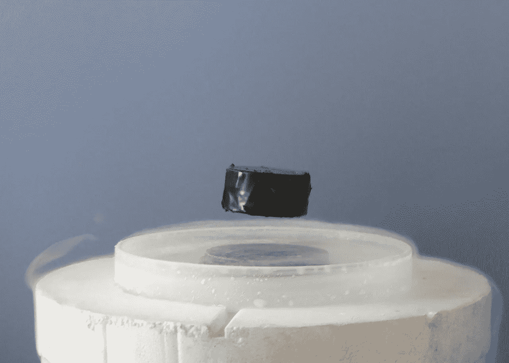

由于钉扎和迈斯纳效应而漂浮在空中的磁铁。没有量子力学就无法解释这种现象。这张图片引自 https://commons.wikimedia.org/w/index.php?curid=2911413。

在量子力学中，电子的状态由一个复函数描述，即“波函数”。“波函数”粗略地说就是电子的轨道。下面这个方程，叫做薛定谔方程，是量子力学中的一个基本方程，表示波函数与能量的关系(哈密顿量，右边的 H-hat)，其中ψ是波函数。

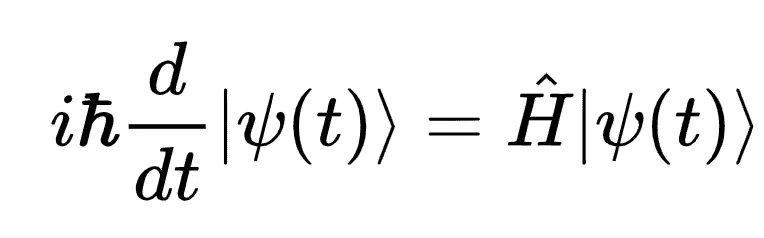

薛定谔方程。ψ是波函数。

在基于薛定谔方程(和各种近似)的凝聚态物理领域，称为“第一性原理计算”的物理模拟用于研究材料的电子状态。

从理论上讲，物质的电子状态是从“第一性原理”的立场出发，基于物质的原子序数和结构来模拟的。粗略地说，“第一原理”是“如果你有原子序数和关于结构(成键状态)的信息，你应该能够描述物质的电子状态，而不需要从实验结果中获得经验参数。”

然而，如果我们想要严格地计算一种材料的电子状态，我们需要计算材料中阿伏伽德罗(6x10)个电子的阿伏伽德罗数之间的相关性。由于这实际上是不可能的，我们在实践中使用各种近似法。其中之一是 Hartree-Fock 近似(使用 Slater 行列式的近似)，它用于本文的预训练。

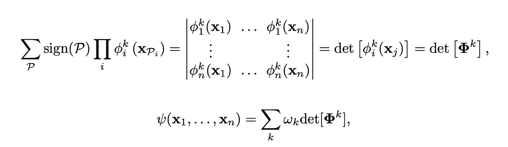

Hartree-Fock 近似考虑了电子的半对称性。因此，量子力学有时把作为波函数(粗略地说，电子的轨道)的矩阵表达来处理。改编自[1]。

模拟物质的方法是通过顺序计算找到结构中最稳定(能量最小)的电子态。为什么我们需要最小化能量的直观解释是，低能量是物质保持那种状态的最高概率。

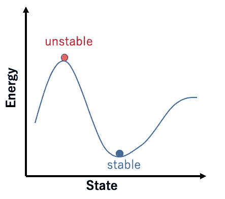

物质和内能的概念图。由于能量较高的物质更不稳定，它们最终会稳定在能量最低或最稳定的物质上。物质的性质是通过顺序计算找到物质稳定存在的状态(在从头算/量子化学计算中，是电子的状态，或者波函数)来计算的。

具体来说，依次重复“计算物质的电子态和内能→然后更新电子态使能量降低”的程序，寻找能量最低的电子态。

类似的概念是量子化学计算，计算分子的电子状态。虽然从头计算主要涉及固体和表面状态，但量子化学计算主要涉及分子。本文将量子化学计算与神经网络相结合。

从头计算非常昂贵。简单的材料几分钟就能算出来，但这类材料一般不研究。通常最有希望的目标是复杂的材料和物质的表面状态。由于它们涉及计算包含许多原子的细胞，即使使用超级计算机，它们也可能需要几天到一周的时间。

# 问题表述

基本上，他们在量子化学计算方面做了同样的事情，但在这项研究中，他们将波函数的近似留给了神经网络。他们对神经网络所做的是一样的:最小化能量。在正常的量子化学计算中，我们将括号中的哈密顿量最小化如下。类似地，我们可以使用神经网络对波函数进行同样的最小化。

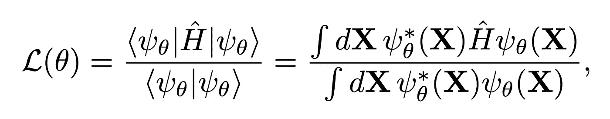

用波函数计算能量的方法。他们把波函数的近似留给参数为θ的神经网络。改编自论文[1]。

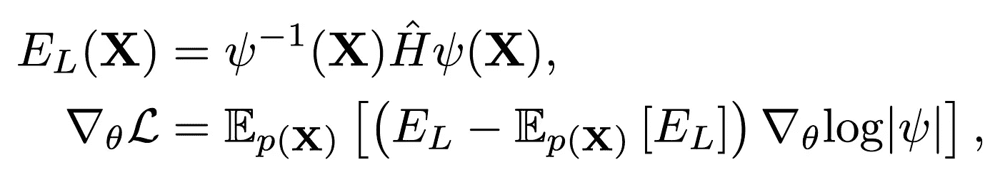

用波函数计算能量的方法。他们把波函数的近似留给参数为θ的神经网络。改编自论文[1]。

# 逼近波函数的神经网络

费米网的全貌如下。输出是几个原子核(位置 R)和电子(位置 R)的波函数ψ。典型特征是每个电子-全核相互作用和每个电子-电子相互作用以相应的(位置方式)方式传播。

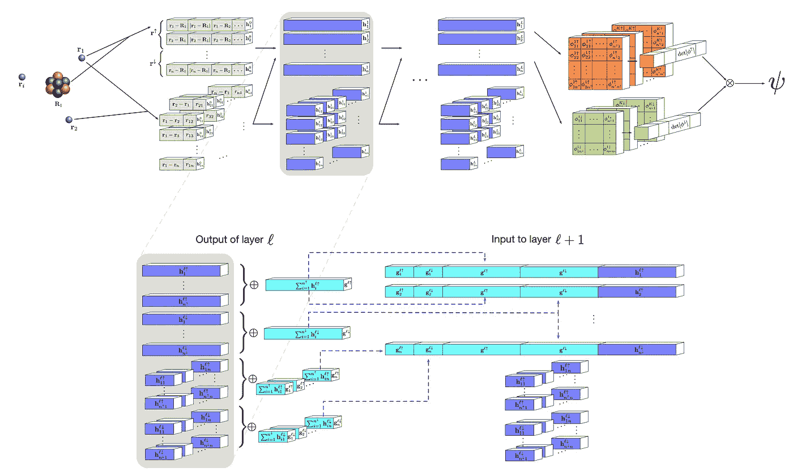

费米网的全貌。输出是几个原子核(位置 R)和电子(位置 R)的波函数ψ。改编自论文[1]。

首先，让我们放大输入层和第一个中间层(下图)。输入层分为两部分:上部处理电子-原子核相互作用，下部处理电子-电子相互作用。

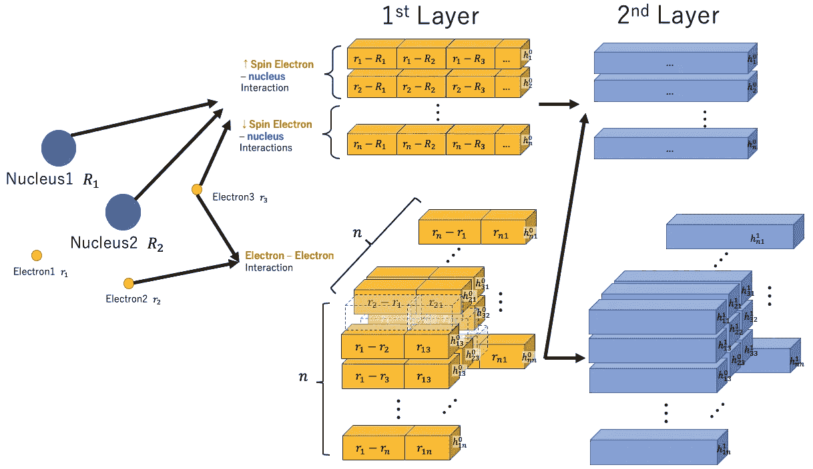

输入层和第一中间层的放大图。输入层分为两部分:上部处理电子-原子核相互作用，下部处理电子-电子相互作用。请注意，它们不是混合每个交互，而是将每个交互的元素传播到下一层，同时保持每个交互的元素完好无损。由这个博客作者绘制。

请注意，它们不是混合每个交互，而是将每个交互的元素传播到下一层，同时保持每个交互的元素完好无损。以这种方式，在构建ψ时，在神经网络中提取每个相互作用和其他相互作用之间的关系。此外，电子-原子核相互作用通过固定输入位置间接给出了关于电子自旋的网络信息。

接下来，让我们仔细看看中间层是如何处理的。下图是从中间层 l 传播到中间层 l+1 的过程。它主要分为两部分:第一部分取总和，第二部分决定中间层的组成。

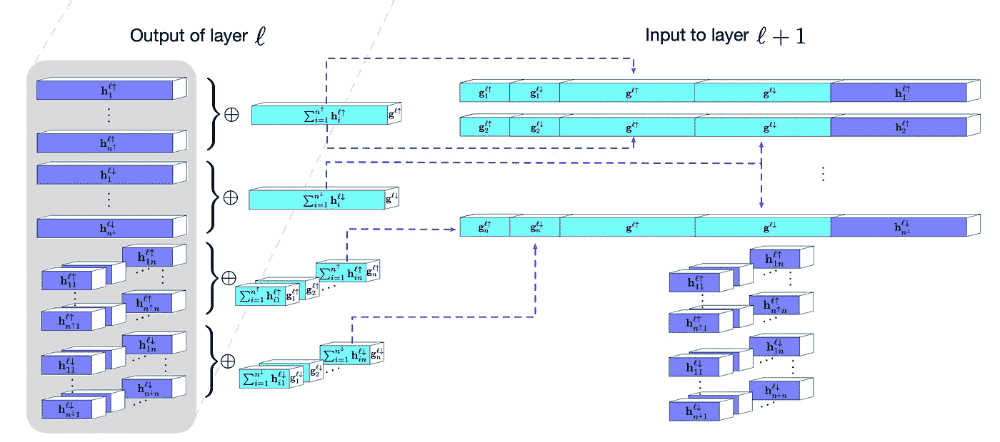

从中间层 l 传播到中间层 l+1 的过程。它主要分为两部分:第一部分取总和，第二部分决定中间层的组成。请注意，它们不是混合每个交互，而是将每个交互的元素传播到下一层，同时保持每个交互的元素完好无损。[1]中图 1 的放大下侧。

请注意，在求和部分的前半部分，他们在为每次旋转做这个过程。在电子-核相互作用部分的上部，对每个自旋↑电子-核相互作用和自旋↓电子-核相互作用进行求和。在电子-电子相互作用的下部，对自旋↑电子-电子相互作用和自旋↓电子-电子相互作用进行求和。由于电子的性质因自旋而异，我们通过改变自旋来增加一个物理约束。

中间层的组成如下。下面的等式是电子 I 的中间层 l 的表示

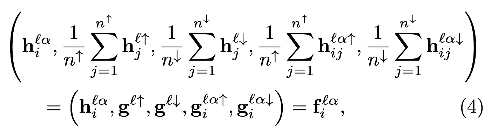

中间层的内容。从左至右:自旋↓中电子-核相互作用中间表象的所有电子之和，自旋↓中电子-核相互作用中间表象的所有电子之和，自旋↓中电子 I 和电子-电子相互作用中间表象的电子之和，自旋↓中电子 I 和电子-电子相互作用中间表象的电子之和，电子 I 的中间表象.改编自[1]。

如上式所示，它们结合了每一次旋转的中间层的潜在表象之和，得到了中间层的表象。从左到右:自旋↑中电子-核相互作用中间表象的所有电子之和、自旋↓中电子-核相互作用中间表象的所有电子之和、电子 I 的中间表象和自旋↑中电子-电子相互作用的中间表象之和、电子 I 和自旋↓中电子-电子相互作用的中间表象之和、电子 I 的中间表象。

接下来，我们来看最后一层。最后一层看起来如下。在这里，他们增加了物理约束，即电子的波函数可以用行列式来表示，并且波函数在无穷远处趋于零。

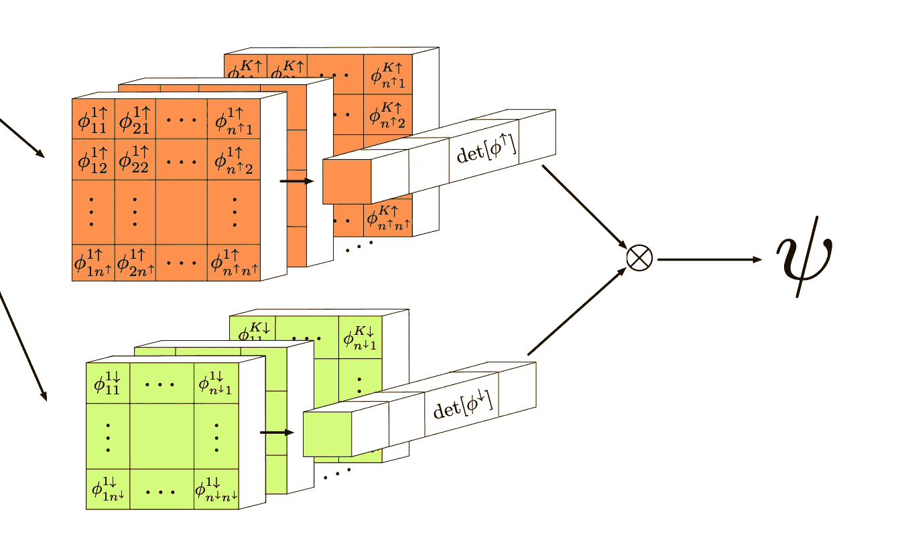

费米网的最后一层。[1]中图 1 的放大右侧。

通过对在最终中间层中计算的电子 j 所属的波函数φI 添加线性变换来计算最终层，然后考虑与原子核 m 的各向异性，取衰变项的乘积。

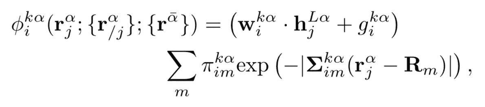

最后一层的程序。w 和 g 是权重和偏差，π是控制各向异性衰减的 3x3(可学习)参数，α是自旋(↑或↓)，k 是轨道的组合。指数的肩项施加了物理约束，当 r 趋于无穷大(无限远)时，波函数趋于零。改编自[1]。

此外，他们在波函数中增加了 Hartree-Fock 近似的约束，如下式所示。下图中名为“det φ”的部分表示取φ矩阵行列式的操作。虽然我没有深入细节，但这意味着他们添加了电子波函数的属性作为物理约束。被称为费米子的粒子，包括电子，对于电子的交换具有反对称的性质(电子交换时符号反转)，这种性质有时用行列式来表示波函数。这里就不赘述了，如果你感兴趣，可以参考尼尔·w·默明等人的《固体物理学》等书。这里 k 是轨道组合的 ID。

Hartree-Fock 近似考虑了电子的半对称性。由于矩阵方程的性质，对于电子 X_i 和 X_j 的交换，符号是相反的。

# 其他创新

他们使用 KFAC 的修改版本，这是一个二阶优化方法，而不是一阶优化方法，如亚当。它显示了压倒性的趋同。

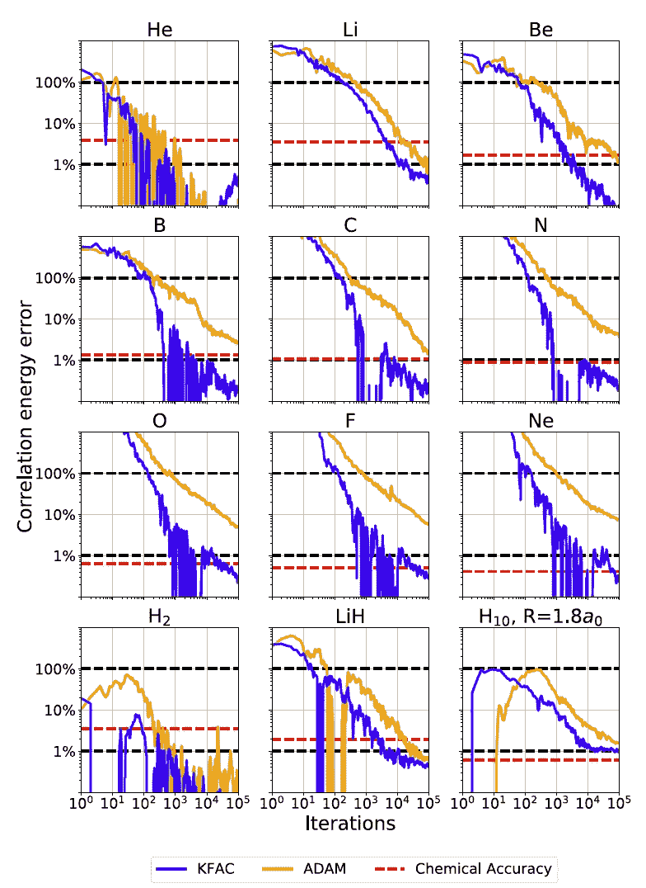

优化进展第一排原子，H2，LiH 和氢链与 KFAC(蓝色)对亚当(橙色)。KFAC 的质量优势是显而易见的。(注释和图表摘自[1])

此外，在主训练之前，进行预训练以预先学习波函数，使得它与固体物理中典型的近似方法 Hartree-Fock 近似相匹配。

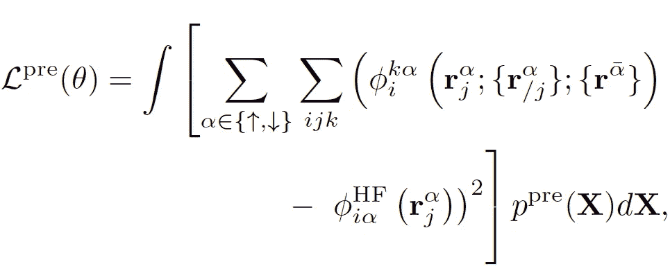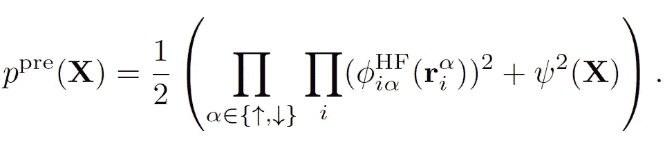

使用 Hartree-Fock 近似进行预训练，以学习费米网络波函数φ，从而匹配 Hartree-Fock 近似的波函数φ^HF，以便它们在主训练期间不会陷入坏解。2 方程改编自[1]。

# 结果

这里是用费米网研究的结果。首先，下表显示了基态能量的结果。费米网做的相当不错。

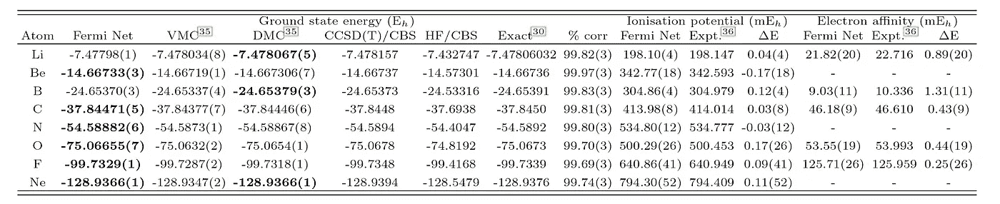

第一排原子的基态能量、电离势和电子亲和力。最接近每个原子精确基态能量的 QMC 方法(费米网，传统的 VMC 或 DMC)以粗体显示。Be、N 和 Ne 的电子亲合势没有计算，因为它们的阴离子不稳定。(注释和图表摘自[1])

其结果与计算孤立分子的传统 CCSD(T)方法的结果相当。

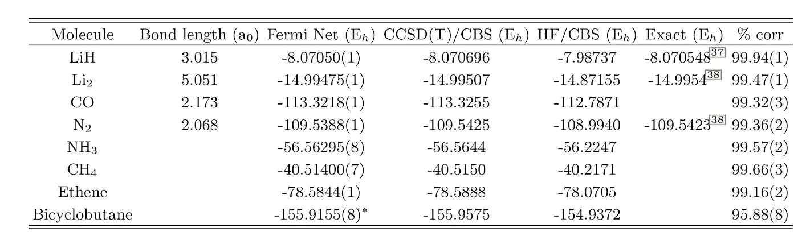

双原子和小分子平衡几何的基态能量。费米网捕获的关联能量相对于精确能量(如果有的话)或 CCSD(T)的百分比在最右栏中给出。(标题和图表摘自[1])

接下来，他们计算了一个氮分子的离解曲线，这显然与 UCCSD(T)不太匹配，但费米网给出了与 ACPF 先生相同的精确度。

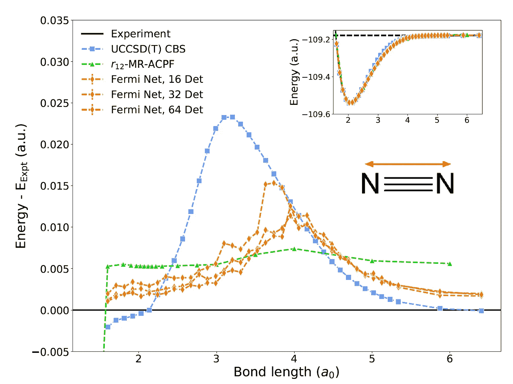

氮三键的离解曲线。与实验数据的差异在主面板中给出。在最大 UCCSD(T)误差的区域，费米网预测与高精度 r12- MR-ACPF 结果相当。(注释和图表摘自[1])

最后，这里有一个计算 H10 链的例子。底部是非常精确的 MRCI+Q+F12 CBS 的微分，不如 AFQMC CBS 精确，但费米网相当精确。

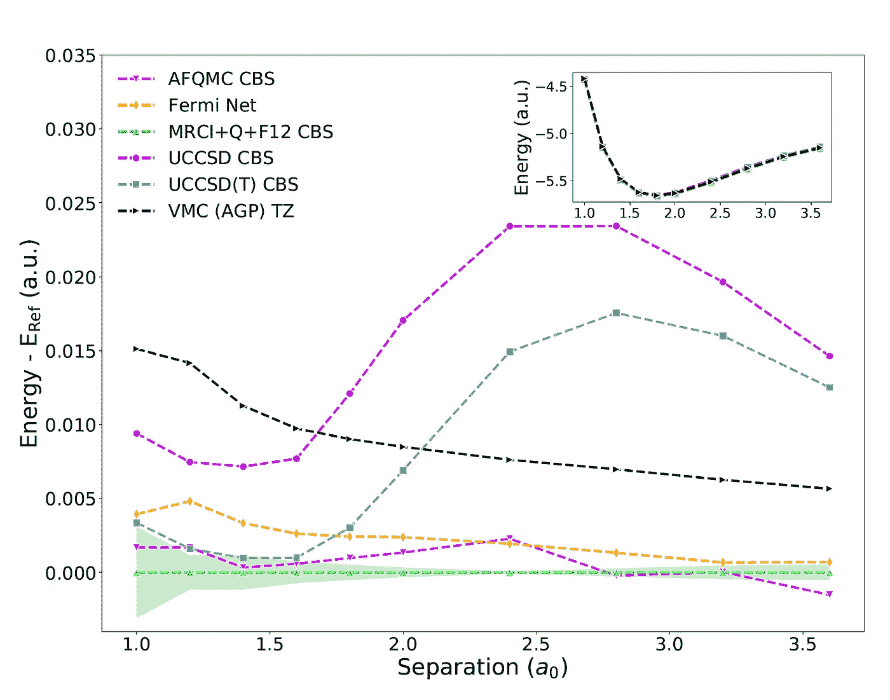

H10 链条。除了费米网之外的所有能量都来自 Motta 等人。绝对能量(插图)无法用肉眼区分。与高精度 MRCI+Q+F12 结果的差异显示在主面板中，其中阴影区域表示基础组外推误差的估计值。耦合团簇和常规 VMC 能量中的误差在中等原子间距时很大，但是费米网在所有间距下仍然与 AFQMC 相当。(标题和图表摘自[1])

# 这项研究的影响

现实情况是，第一性原理计算使用多种近似，即使他们说的是“第一性原理”，最佳近似方法取决于系统。此外，它可能包括任意参数，如 LDA+U。如果开发这种方法，我们可能能够开发一个与系统无关的通用电子结构模型。

# 结论

我介绍了费米网，用神经网络近似量子化学计算中的波函数。费米网的优点是，我们可以对任何类型的系统获得一致的好结果，而我们必须用传统的 QMC 方法改变每个目标的方法。

— — — — — — — — — — — — — — — — — — — — — — — — — — — — — —

# 关于我

## 推特，我发布一句话的论文评论

[https://twitter.com/AkiraTOSEI](https://twitter.com/AkiraTOSEI)

## 每周/每月机器学习新闻

(例如)[https://medium . com/analytics-vid hya/aki ras-ml-news-week 43-2020-C4 ad 1 CFA 5 de 7](https://medium.com/analytics-vidhya/akiras-ml-news-week43-2020-c4ad1cfa5de7)

# 每周机器学习时事通讯

 [## 阿基拉的 ML 新闻杂志

### 关于我:制造工程师/机器学习工程师/物理学硕士/ ExaWizards Inc. _ _ _ _ _…

www.getrevue.co](https://www.getrevue.co/profile/akiratosei) 

— — — — — — — — — — — — — — — — — — — — — — — — — — — — — —

# 参考

1.  大卫·普法乌等.多电子薛定谔方程的深度神经网络从头算解，arXiv:1909.02487 (2019)
2.  带有常微分方程积分器的哈密顿图网络。arXiv:1909.12790，2019