# 这应该是个人数据科学项目的第一步

> 原文：<https://towardsdatascience.com/this-should-be-the-first-step-of-a-personal-data-science-project-660eb230225e?source=collection_archive---------13----------------------->

## 使用虚拟环境

无论你已经是一名数据科学家，还是你想成为一名数据科学家，你都可能有过为了乐趣而从事数据科学项目的经历。随着项目数量的增长，您需要采取一些重要的步骤来确保这些项目不会相互冲突。

# 问题是

假设你正在做两个项目。第一个是您从 GitHub repo 克隆的东西。它使用 TensorFlow 1.0，pandas 0.17，Python 3.5。你安装了这些并开始你的项目，一切都很顺利。

你现在开始你的第二个项目。这个用的是 TensorFlow 2.0，pandas 1.0，Python 3.7。这里的问题是，如果你安装了所有这些软件，它会中断你之前依赖于旧版本的项目。

# 解决方案

你需要的是一个虚拟的环境。虚拟环境将帮助您隔离项目的软件，以便您在一个环境中的工作不会影响您在另一个环境中的工作。创建虚拟环境应该发生在大多数数据科学项目的开始。幸运的是，用 Anaconda 很容易做到这一点。如果您还没有安装 Anaconda，我建议您现在就安装，因为它是最流行的数据科学平台之一，支持 VS Code、RStudio、Jupyter Notebooks 和 Spyder。我将带您通过 Anaconda 界面和命令行创建和管理虚拟环境。

# 使用 Anaconda Navigator 管理环境

一旦你打开 Anaconda，这是你应该看到的主屏幕。

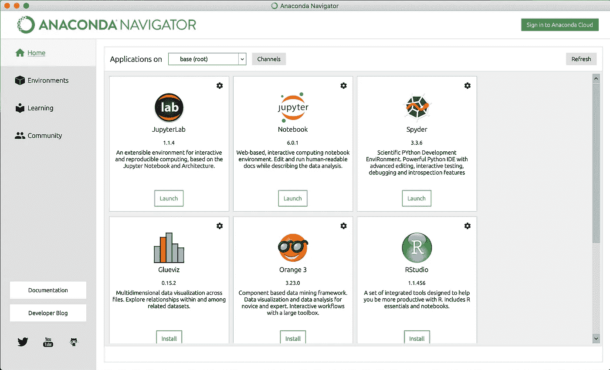

这里我们看到了 Anaconda 附带的应用程序，其中包括一些流行的数据科学 ide。对于您创建的每个虚拟环境，您需要安装这些应用程序才能使用它们。安装后，下方的按钮将从绿色的“安装”变为蓝色的“启动”。

默认情况下，您在名为 base 的环境中工作。在应用程序的上方，你会注意到“应用程序开启”后面有一个下拉菜单。从这个下拉菜单中，您可以选择您创建的任何环境。现在你应该只有基础环境。

接下来，单击导航器左窗格中的环境。

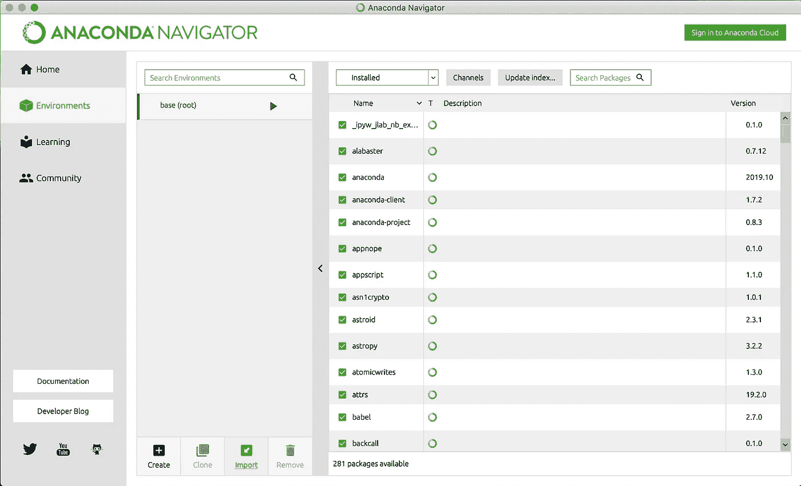

这里我们看到了一个环境列表，我的环境只是有一个基础。在列表的底部，我们有 4 个选项可供选择。

*   创建:用于创建环境。
*   克隆:用于复制环境。
*   导入:用来带入别人的环境。
*   删除:用于删除环境。

在右侧的窗格中，我们可以看到我们在当前环境中安装的所有软件包，并通过单击软件包名称旁边的框来安装新的软件包。

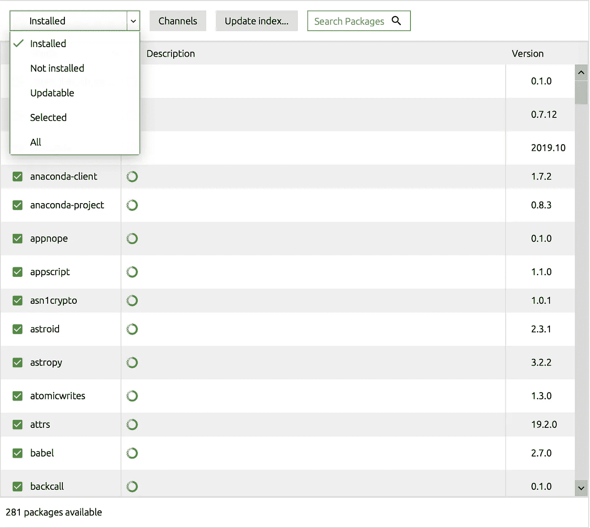

现在，让我们通过单击您的环境列表下的“创建”按钮来创建一个新环境。现在我们可以选择我们的环境的名称，以及您想要使用的 python 和 R 的版本。在我的例子中，我想使用 python 3.7，并将我的环境命名为 First_Environment。

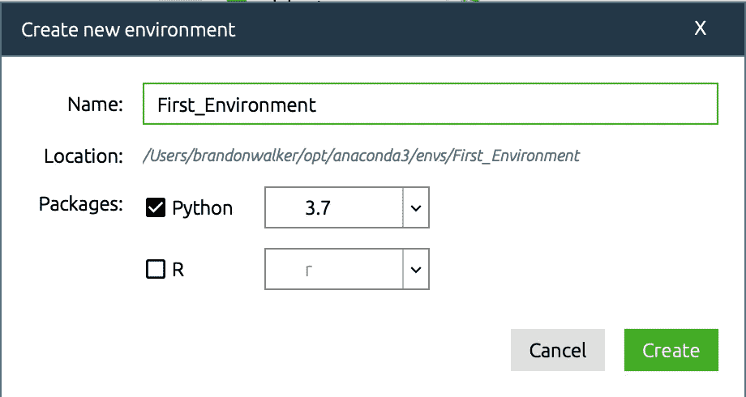

现在，我可以从右侧的窗格中搜索并安装该环境的任何软件包。请记住，您为此环境安装的任何东西都只能安装在此环境中。您需要为新环境再次安装软件包。

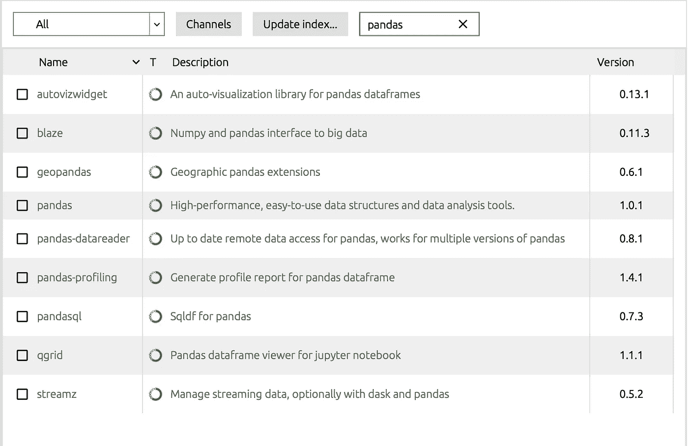

我建议为你做的几乎每个项目创建一个环境，并以那个项目命名这个环境。

# 命令行的基础知识

即使您不管理虚拟环境，能够使用命令行也是一项有价值的技能。要访问命令行，请在 Windows 上搜索“命令提示符”应用程序，在 Mac 上搜索“终端”应用程序。

我首先在终端中键入“ls”(在 Windows 上是“dir”)，然后按回车键。这给了我一个当前文件夹中的文件和目录的列表，这个文件夹叫做工作目录。目录只是文件夹的另一种说法。

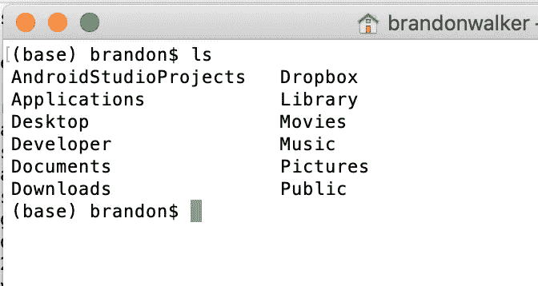

接下来，我想用“cd”命令更改目录。输入“cd 文档”会把我带到文档目录。在那里，我可以用“mkdir”命令创建一个新目录。我做了一个名为“ProjectB”的文件夹来存储我们的新项目。你应该用 cd 进入这个目录。“pwd”命令将打印工作目录(您所在的文件夹)。这对于在文件系统中导航很有用。

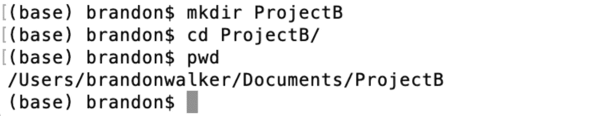

# 使用命令行管理环境

要使用 python 版创建名为“EnvironmentB”的环境，您需要在命令行中键入以下内容。

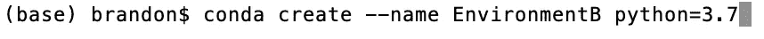

现在，要使用这个环境，您需要键入“source activate EnvironmentB ”,或者如果您使用的是 Windows，只需键入“activate EnvironmentB”。

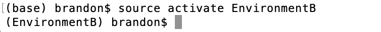

您会注意到，在激活此环境后，命令提示符旁边括号中的环境名称已经更改。这有助于了解你所处的环境。现在，如果你需要安装一个应用程序，比如 jupyter，你可以用“conda install”加上包名来完成。

现在要使用 jupyter，只需运行 jupyter-notebook。在安装软件包的下一步，运行 pip，它将只为活动环境安装软件包。使用包名后跟==来获得特定的版本。

接下来，“conda list”可以为您提供一个列表，列出您在当前环境中安装的所有软件包。

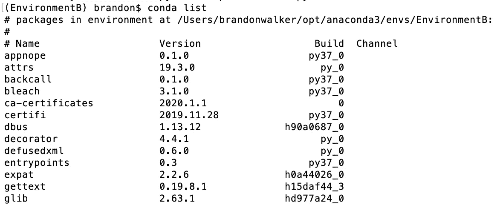

最后，“conda env list”给出了您的环境列表。

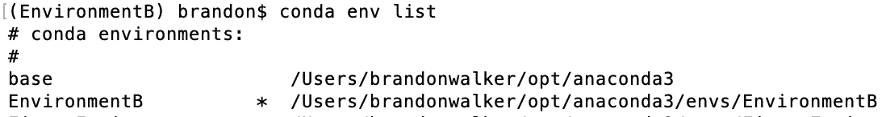

# 导入/导出环境

在此之前的所有信息对于组织*你的工作*都很重要。能够导入和导出环境对于组织*团队合作*非常重要。要保存您的环境，请使用“conda list ”,但要将输出保存到 txt 文件中。

这个 txt 文件可以共享，并用于在其他人的机器上复制您的环境。这对于创造可复制的作品大有帮助。

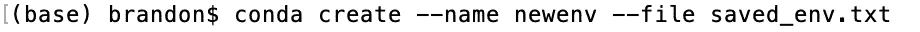

这里总结了使用虚拟环境的基础知识。希望这能防止你的项目互相冲突，也能防止“它在我的机器上工作”这句话在你的办公室里被使用。