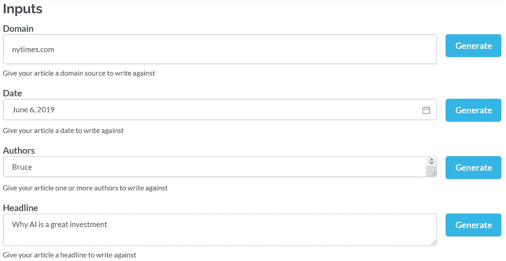

# An AI Wrote This On Its Own In Seconds!

> 原文：<https://towardsdatascience.com/this-story-was-completely-written-by-an-ai-cb31ee22feae?source=collection_archive---------48----------------------->

## Grover, the AI Model that Can Generate Fake News

Photo by [Morning Brew](https://unsplash.com/@morningbrew?utm_source=medium&utm_medium=referral) on [Unsplash](https://unsplash.com?utm_source=medium&utm_medium=referral)

# The Article

“When we started working on artificial intelligence in the ’90s,” remembers Peter Ghavami, a New York-based consultant with consulting firm McKinsey & Company, “we had no idea how big a role it would play. All the problems that were going to be solved by AI were at the cutting edge of human cognitive capacity.”

Maybe that’s because tech companies didn’t know it back then. Those efforts began after the advent of the PC in the mid-1980s, a decade before Microsoft and the rest of the world really woke up to the power of AI. Today, AI is taking on myriad new roles. It is working behind the scenes to keep factories running, doing medical diagnoses and diagnosing emotional disorders, speeding up deliveries, identifying people in images at the Olympics and photo-matching over 10 million foreign flags. AI is also being deployed for heavy-duty political campaigns and sold on to countries trying to develop a countrywide infrastructure.

Still, AI doesn’t operate on a linear schedule. Rapid advances in data, and in the computational power it requires, led to an explosive growth period. These days, computers can reliably identify a stock market drop in a matter of milliseconds. It’s easy to get lost in that pace. The problem for those outside the companies developing and deploying AI is how do they keep up? Ghavami and a group of a dozen executives from McKinsey spent the past year working with AI pioneers like Google, IBM, and Stanford.

The good news is that self-driving cars and other ways to reduce traffic accidents are far more complicated than what we’ve come to think of as “wearable,” says Michael Jackson, a senior research scientist at Google who worked on the search giant’s self-driving cars.

“There are many, many hours of driving that have yet to be mapped,” Jackson says.

The other side of the evolution of the technology is that the biggest race to develop AI comes from a company that remains far away from Silicon Valley — an Asian powerhouse that is also the nation with the deepest R&D and the most expensive software engineers.

China is a major influencer in AI. Xi Jinping, the president, has characterized the rise of AI as a national security threat — or perhaps a challenge to freedom of expression — that will be used to weaponize or censor content online.

AI has to work at the corporate level, too. It is in the interests of big companies to have it both understand their problems and be able to predict what they will be concerned about in the future.

“如果没有人工智能的人类级应用，许多问题将无法大规模解决，”斯坦福大学人工智能教授 Charley Wragg 说，他是麦肯锡合作项目的负责人。换句话说，它将留给算法来解决它们的人类主人未能解决的问题。

是的，人类不应该在没有某种程度的国家监督的情况下工作，加瓦米说。

“与此同时，如果我们希望人们变得异常和超人，”加瓦米说，“理解他们为什么如此擅长某事以及具体是如何做到的也很重要。”

在罗塞塔石碑年，这个教训占据了中心舞台。

是的，你刚刚读到的一切都是由人工智能生成的！

# 是怎么做出来的？

这段文字是由艾伦人工智能研究所的[格罗弗自动生成的。这是我给它的输入:](https://grover.allenai.org/)

仅仅使用这几个输入，Grover 就能够自己生成一整篇文章。

# 格罗弗是什么

Grover 是作为制造假新闻的工具而被创造出来的。为什么？原来研究人员创造它是为了抵御假新闻。

通过这些系统，研究人员能够检测人工智能生成的文本的习惯和特征。希望通过进一步的研究，可以开发出自动系统来检测人工智能生成的文章。

你可以在这里阅读更多关于它为什么被创造[的信息。但这里有一段摘录解释了为什么 Grover 能帮助我们发现假新闻，](https://arxiv.org/abs/1905.12616)

> “与直觉相反，对 Grover 的最佳防御竟然是 Grover 本身，准确率高达 92%，证明了公开发布强生成器的重要性。”

为了澄清，就准确性而言，研究人员指的是 Grover 检测人工智能生成的假新闻的准确性。

我们越来越多地看到政府和坏人用假新闻、假政策评论和对边缘思想的支持充斥社交媒体，作为宣传工具的工具。

Grover 等语言模型将有助于在自动化系统中检测和标记这些帖子，并随着时间的推移越来越准确。这对于脸书、推特和 Reddit 等大型社交媒体网站尤为重要，在这些网站上可以很容易地部署有针对性的宣传。

# 像 Grover 这样的工具是如何创建的(GPT-2)

Grover 使用了一种类似于 GPT-2 架构的语言模型，并接受了从《纽约时报》到 BBC 新闻的数百万条真实新闻的训练。

GPT-2 是由 [OpenAI](https://openai.com/) 专门创建的，能够从用户提供的输入(通常是一两句话)中生成连续的文本。GPT-2 本身在 800 万个网页上接受训练，拥有超过 15 亿个参数。这相当于大约 40GB 的纯文本数据。

GPT-2 可以推广到以下应用:

*   回答问题
*   完成文本
*   阅读理解
*   摘要
*   等等..

如果你想深入了解 GPT-2，这里有一个视频是关于它是如何被训练的，

GPT-2 的美妙之处在于，它在无监督的机器学习的帮助下，自己学会了这一切。

这意味着模型可以只使用提供给它的文本来学习，不需要标记任何数据。它通过使用统计文本预测来实现这一点。在阅读几个单词后，模型会根据下一个单词应该是什么的概率和过去几个单词的上下文来预测下一个单词。然后，它可以通过查看它是否与训练数据中的下一个单词匹配来检查它的答案。

虽然 GPT-2 是最先进的语言模型，但它还没有达到人类的水平，但随着研究的进展，有一天它可能会远远超过我们。

如果你喜欢这篇文章，看看我的其他一些！

 [## 可共享的 Jupyter 笔记本！

### 最后，团队可以轻松地共享和运行代码

towardsdatascience.com](/sharable-jupyter-notebooks-bf3ec9c2e0be)  [## 数据可视化:动画条形图！

### Excel 和 After Effects 中的数据可视化和动画

towardsdatascience.com](/data-visualization-animate-bar-graphs-df9ca03a09f2)