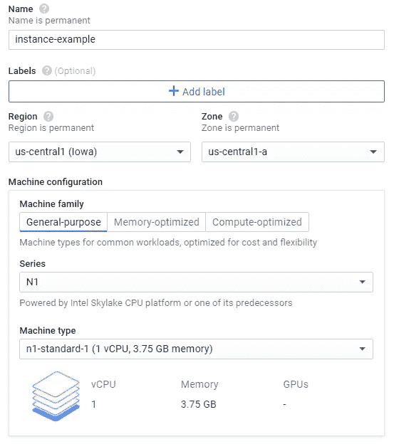

# 这个虚拟机节省了我的时间

> 原文：<https://towardsdatascience.com/this-virtual-machine-is-saving-my-time-23076f592b94?source=collection_archive---------32----------------------->

## 在 Google 云平台之上的 Linux 虚拟机中部署您的 Python 脚本，以便与您的投资保持联系


[Unsplash](https://unsplash.com?utm_source=medium&utm_medium=referral) 上 [AltumCode](https://unsplash.com/@altumcode?utm_source=medium&utm_medium=referral) 拍摄的照片

在本地运行 Python 脚本时，您有没有遇到过困难？很一般吧？下面让我列举一些苦苦挣扎的例子:

*   局部存储器
*   网络可用性
*   电脑始终开启

由于我一直在从事一个需要频繁执行的 **Python 项目**，上面的例子是鼓励我寻找如何摆脱本地处理的主要例子。

这是为什么呢？因为我并不总是登录我的计算机，即使如此，我也不想每 15 分钟(或任何其他频率)执行一次我的 Python 脚本。

这个场景让我定义了以下项目结构:


项目设计—作者

为了做到这一点，我邀请您查看以下课程，在这些课程中，我介绍了有关每个项目要素的步骤和主要信息:

*   谷歌表单(1)和 API (2)
*   谷歌云平台(3)和 Linux 虚拟机(4)

*PS:我将不同的元素分组如上，因为我认为这样更容易跟踪流程。第一组向您展示我们的目标是什么，并预测我们的 API 支持。后一组涵盖了 Google 平台上所需的操作，然后是 Linux VM 本身(包括 Python 脚本)。*

# 1.谷歌工作表

就像刚才说的，我们来看看这个 Python 项目是什么。目标是每 15 分钟更新一次所拥有股票的当前价格(来自巴西市场)。

正如会议的标题所示，最初的数据可以在 Google Sheets 上找到。下面，您可以看到该项目中考虑的数据:


Google Sheets 的原始数据

让我们检查每一列:

*   股票:公司的交易代码(截至 8 月 25 日，它被认为是 IBOV 中涉及最多的谈判股票)
*   数量:拥有的数量
*   账面价格:资产在购买时的价格(被认为是 7 月 31 日收盘时的股票价格)
*   价格:当前价格(每次执行应用程序时)
*   单位损益:“账面价格”-“价格”
*   总损益:“单位损益“*”数量”
*   总损益(%):"损益"/("账面价格" * "数量")

你可能会问自己 Python 在这里会做什么。答案是:更新“价格”一栏。通过这样做，从属列将相应地更新。

其他字段是:

*   上次更新:Python 将在每次运行时更新这个单元。这有助于我们检查 Python 是否正在“触及”Google Sheets
*   IBOV:这是巴西最重要的金融市场指数。被用作 Python 脚本的参考(将在后面进一步解释)；
*   总计:汇总总结果。

*直到这里，本地存储的挣扎点才得以解决。*

# 2.应用程序接口

正如在上一节课中简要提到的，Python 需要“触及”Google Sheets。这是通过启用一些 Google APIs 来实现的，以便授权和认证 Python 应用程序在 Google Sheets 上“访问、读取和写入数据”。

在下面的文章中，我介绍了启用上述 API 的一步一步。我邀请你检查那里的详细步骤。

[](https://medium.com/better-programming/how-to-enable-pythons-access-to-google-sheets-e4264cdb545b) [## 如何让 Python 访问 Google Sheets

### 继续使用 Python 管理在线电子表格内容

medium.com](https://medium.com/better-programming/how-to-enable-pythons-access-to-google-sheets-e4264cdb545b) 

我们已经完成了第一部分，这使您能够了解将要管理的数据。

现在，让我们看看部署应用程序本身所需的操作。

# 3.谷歌云平台

[谷歌云平台](https://cloud.google.com/)被用作这个项目的云基础设施服务。像其他云服务一样，谷歌的平台为你提供**计算资源**即服务。

为了使用这些计算资源，您需要:

3.1.在谷歌云平台上创建一个项目；

3.2.实例化虚拟机。

让我们逐一检查一下。

## 3.1.在谷歌云平台上创建一个项目

您可以通过一个步骤创建项目:


## 3.2.实例化虚拟机

单击左侧栏菜单中的“计算引擎”>“虚拟机实例”。然后，单击“创建实例”并选择一些可用的参数:



正如您从上图中看到的，有一些参数与您的虚拟机资源的物理位置以及您正在考虑的 vCPUs 数量有关。请评估这对于你的情况是否合理。对于这个项目来说，下面这些已经足够了。值得一提的是，谷歌目前正在提供一些积分来使用这项云服务，然而，这是一项收费服务。


上图很重要，因为它定义了这个项目(Debian)正在考虑的一个特定的 Linux 发行版。

定义这些参数并单击“Create”后，您应该能够在您的虚拟机实例页面上看到以下条目:


通过按启动 SSH 连接，Linux 终端将被打开。

# 4.Linux 虚拟机

由于 Infra 和 API 都已启用，现在是时候设置您刚刚实例化的 Linux VM 了。

主要步骤是:

4.1.部署 Python 脚本

4.2.设置执行周期。

它们是如何工作的？

## 4.1.部署 Python 脚本

重要的事情先来。让我们检查一下您的环境中是否已经安装了任何 Python 版本。

您可以导航到`/usr/bin` 并检查是否已经安装了 Python 版本。然而，更简单的方法是只输入`python3`并检查环境是否将它识别为一个*系统命令:*


从上面可以看出，已经安装了 python3(版本 3.5.3)。然而，pip3，这个用于新软件包安装的命令，还没有被识别。所以，让我们使用`sudo apt install python3-pip` **来安装它(确保在安装过程中按下 Y 键)。**

让我们通过键入`pip3 --version`来检查它是否已经安装:


现在一切都好了。

让我们导航到要创建的目录。py 文件:


在这个例子中，我在`/home/lucasnunesfe9`上创建了一个名为 pythonScript 的新目录(在这个例子中，“lucasnunesfe9”是云服务用户名。一定要用你的)。

访问这个新目录并创建您的。py 文件:


键入`nano myScript.py`之后，您应该编写 Python 脚本本身:

```
import gspread
from oauth2client.service_account import ServiceAccountCredentials
from datetime import datetime
```

我们从导入所需的库开始:

*   `[gspread](https://gspread.readthedocs.io/en/latest/)`用于处理 Google Sheets 中的数据；
*   `[oauth2client](https://pypi.org/project/oauth2client/)`需要通过 API 进行认证和授权；
*   `[datetime](https://docs.python.org/3/library/datetime.html)`脚本运行时需要打印。

```
scope = ['https://www.googleapis.com/auth/drive']#this variable reads the json file that holds your credentials 
credentials = ServiceAccountCredentials.from_json_keyfile_name('**/home/lucasnunesfe9/pythonScript/your_file_name.json**', scope)gc = gspread.authorize(credentials)#spreadsheet file named "example"
sps = gc.open('example')#first worksheet = 0
wks = sps.get_worksheet(0)
```

以上部分足以确保您可以连接到 Google Sheets。请确保给出指向您的的完整路径。json 文件(这个文件还需要创建)。

```
#updates current time
dt_string = datetime.now().strftime("%d/%m/%Y %H:%M:%S")
wks.update_cell(2,1,dt_string)#this function will loop through the column reference until it finds "IBOV" cell value
def getLastRow(reference):
    #i = reference cell's position
    i = wks.find(reference).row #loops i trough a static column (reference)
    while wks.cell(i, wks.find(reference).col).value != "IBOV":
        i += 1 #subtract the last iteration
    return (i - 1)#this function writes the Google Finance API's formula in each cell of the column "Price"
def currentPrice (reference): #loops i from the reference row to the referece value until getLastRow value
    for i in range(wks.find(reference).row+1,getLastRow("Stock")+1): #writes current Stock price available from Google Finance API according to colum 1 ("Stock" column)
        #preserve needed Google Finance's syntax
        wks.update_cell(i,wks.find(reference).col,"=GOOGLEFINANCE
("+"\""+wks.cell(i,1).value+"\""+")")#running both functions
currentPrice("Price")
```

上面的部分是真正执行我们需要的部分。总之，它更新脚本执行的时间，并遍历所有股票以更新它们的当前价格。为了实现后者，我们使用了 Google Finance API。

写完脚本后，按 Ctrl + Shift，再按 Y，再按 Enter。这将保存您的 myScript.py 文件。

现在让我们创建。json 文件，就像刚刚用。py 文件:


一定要遵循我在本文开头分享的教程。你可以查看更多关于这方面的详细内容。json 文件(很简单)。然后，将内容粘贴到。json 文件，Ctrl + Shift，然后 Y，然后回车。

让我们设置您将要执行 Python 脚本的重复周期。

## 4.2.设置执行周期

对于这个任务，我们将使用 [crontab 作业](https://manpages.debian.org/jessie/cron/crontab.5.en.html)。

首先，进行一次理智检查。让我们看看是否已经为您的用户使用`crontab -l`创建了任何 crontab 作业:


什么都没有…让我们用`crontab -e`创建一个新的:


类型`1`。将会打开以下窗口。直接跳到最后一行:


最后一行是什么意思？

正如屏幕上给出的解释，每个部分表示一个时间单位:

*   `*/15`:每 15 分钟一次
*   `13-20`:世界协调时 13 时至 20 时。该范围涵盖巴西金融市场开放期间(巴西的时区为 UTC - 3)
*   `*`:一个月中的每一天(dom)
*   `*`:每月(周一)
*   `MON-FRI`:周一至周五

因此，每 15 分钟的工作日，在 13 和 20 之间，我位于`/home/lucasnunesfe9/pythonScript/myscript.py`的脚本将由`python3`执行。再说一次，保存文件。

等待，直到您的脚本应该被执行，然后，键入`sudo service cron status | tail -n 1`:


您可以看到 crontab 已经执行(注意，这并不一定意味着 Python 脚本已经正确执行)。

那么，Google Sheets 发生了什么？


第一次执行 Python 后的“Google Sheets ”( 15 小时 45 分)

看起来不错…再来一次:


然后:


第二次执行 Python 后的“Google Sheets ”( 16h 00)

工作正常！

*现在，剩下的问题，网络可用性和保持电脑始终开机的需要，也都解决了。*