# 这会改变你对甘斯的看法

> 原文：<https://towardsdatascience.com/this-will-change-the-way-you-look-at-gans-9992af250454?source=collection_archive---------8----------------------->

## GAN 学习和模式崩溃的实时可视化

西安·莫洛伊插图

> 给手机用户的一个警告:这篇文章中有一些厚的 gif 图片。

# 一个伪造者和一个侦探走进一家酒吧

除非你在过去的几年里一直生活在岩石下，否则你肯定听说过围绕着生成性敌对网络(GANs)的喧嚣。特别是，他们创造新的、照片般逼真的图像的能力令人震惊。考虑以下图像:

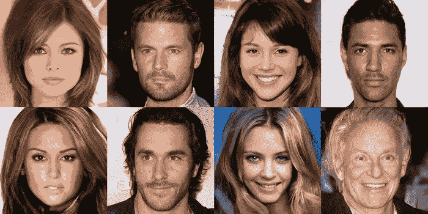

来自 [pg-GAN](https://github.com/tkarras/progressive_growing_of_gans) 的输出(来源:英伟达)

以上的人都不存在。这些“照片”是由 NVIDIA 的 GANs 技术的渐进增长创建的，只是越来越多的 GAN 开发中的一个例子。

GAN 技术背后的基本前提很简单:两个网络，一个生成器和一个鉴别器，被串联训练。鉴别器显示来自训练数据的真实样本(例如照片)和由生成器创建的假样本，并且任务是将真品与赝品分开。与此同时，生成器的任务是创建假样本，骗过鉴别器将其归类为真样本。发生器能够产生不同的输出，因为它接受随机噪声作为输入，通常以 100 个正态分布值的向量形式。在这种情况下，生成器可以被视为从某个潜在空间到样本空间的映射，而鉴别器可以被视为用于测量由生成器描述的样本空间中的分布和真实样本的真实分布之间的散度的工具。

众所周知，甘人很难训练。在模式崩溃、无法收敛、循环和许多其他问题之间，GANs 有许多失败模式，并以挑剔著称。GAN 训练背后的中心思想是生成器创建样本，鉴别器告诉生成器它出错了什么。为了指导生成器，鉴别器必须能够将样本域中的每个点映射到该点是真实样本的概率。这听起来可能很简单，但像深度学习中的大多数事情一样，它在幕后相当复杂。为了帮助演示 GAN 训练的复杂性，我为一个非常简单的问题的训练过程创建了可视化效果。

# 问题是

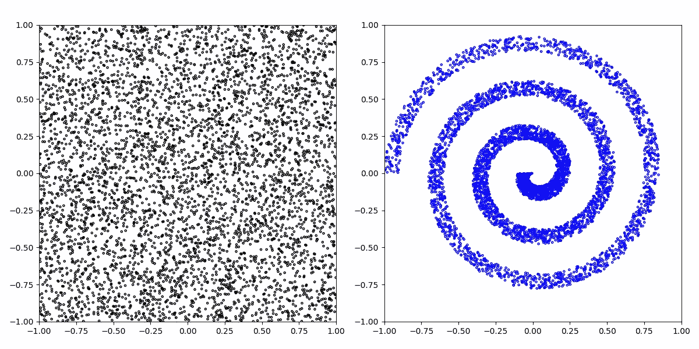

图 1:目标函数的输入空间(左)和相应的输出(右)。输入空间通常被称为潜在空间，输出空间被称为样本空间。

考虑图 1 所示的映射。2D 输入空间([-1，1]，[-1，1])被映射到一个螺旋，其中输入(潜在)空间中的 x 位置确定该点沿螺旋的距离(在样本空间中)，y 位置确定该点在螺旋中的横向位置。下面是目标函数将随机输入转换为螺旋的可视化效果:

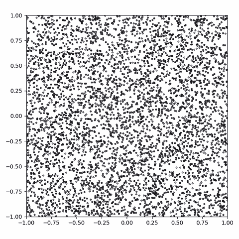

图 2:应用于随机输入的目标函数的动画

因此，眼前的任务是训练一个能够从这种螺旋分布中产生点的 GAN。由于原始函数具有两个自由度，GAN 将被给予 2D 随机噪声作为输入。

# 解决办法？

我训练了一个 GAN 600 步的训练步骤，每走一步就观想一遍。发生器和鉴别器都有三个带泄漏 ReLU 激活的全连接层。使用 Adam 优化器及其默认参数，生成器和鉴别器的学习率都设置为 0.001。训练过程如图 3 所示；事情很多，所以让我们一个小组一个小组地过一遍。

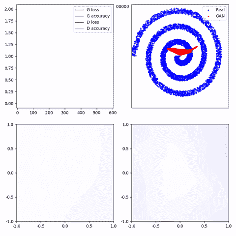

图 3:GAN 训练过程的动画。左上:发生器和鉴频器的损耗和精度。顶部中心:训练步骤。右上:真实样本和生成样本。左下角:潜在空间的鉴别器输出。右下:样本空间的鉴别器输出。

## 左上角:精确度和损耗

在左上角的面板中，您可以看到每个训练步骤的生成器和鉴别器的损耗(二进制交叉熵)和精度。两个损失都在 *ln(0.5)=0.69* 范围内徘徊，这表明鉴别器对其预测完全没有信心。生成器精度(*即*，它如何有效地欺骗鉴别器)通常是 100%，偶尔会下降到 0%，然后反弹到 100%。

## 右上:真假样品

在每个训练步骤之后，绘制真实分布(蓝色)和生成分布(红色)。正如你所看到的，在大多数步骤中，发电机输出已经减少到一个非常小的范围内波动。特别值得注意的是，红色输出斑点在很大程度上保持不变，直到发生器精度降低或损耗增加，此时它会飞到范围的另一部分。

## 左下角:潜在空间鉴别器输出

左下方图解了潜在空间中每个点的鉴别器输出，其中深蓝色表示鉴别器认为“肯定是真的”，深红色表示“肯定是假的”，白色表示鉴别器没有想法。换句话说，该空间中的每个点都由生成器转换，然后由鉴别器分类，因此该面板说明了生成器如何有效地将潜在空间的每个部分映射到现实输出。

## 右下角:样本空间鉴别器输出

该面板与左下方的面板非常相似，只是它显示的是样本空间而不是潜在空间。该面板中的每个点对应于样本空间中的一个 2D 点，颜色代表鉴别者对该点真实存在的信心。换句话说，它是由发生器产生的任何给定点相对于目标函数的相对频率的可视化。

# 这是怎么回事？

**你在上面的 gif 中看到的简单来说就是模式崩溃**；发生器输出已经崩溃到一个很小的样本区域，鉴别器认为这些样本可能是真实的(图 3，右上图)。当鉴别器得知这个区域中的大多数点是假的时，生成器简单地转移到鉴别器认为是真实的另一个区域。这一点从右下面板可以明显看出；蓝色区域是鉴别者认为更可能是真实的区域。因此，驱动发生器在该区域产生样本。尝试移动光标，使其始终位于右下角面板的最蓝区域；您会发现您的光标和右上角面板中的红色斑点沿着相同的轨迹围绕该范围移动。

你可能会认为生成器没有能力学习目标函数。我想可能是这种情况，但是这里有一个生成器通过监督回归学习目标函数的可视化，类似于图 3 中右上的面板:

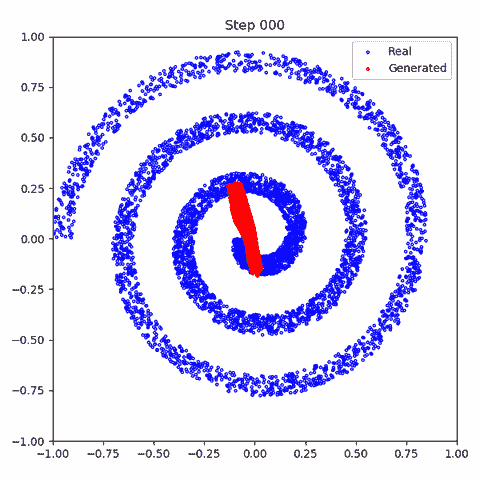

图 4:生成器通过监督回归学习目标函数的动画

你可能还会说，鉴别器没有学习目标函数的能力。我也认为可能是这种情况，但这里是鉴别器学习目标函数和均匀噪声之间的决策边界的可视化，类似于图 3 中的右下角面板:

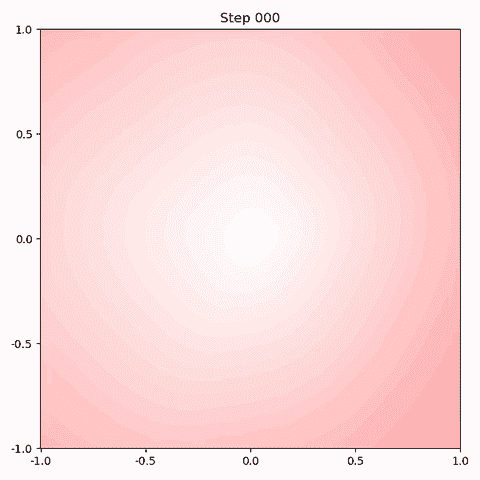

图 5:鉴别器通过监督分类学习由目标函数(蓝色)或均匀噪声(红色)产生的点的相对概率的动画。

最后，你可能会说 GAN 只是需要更多的时间来达成一个解决方案。不幸的是，即使经过几千步的训练，GAN 仍然表现出与前 600 步完全相同的行为。这个过程看起来非常像下面这样:

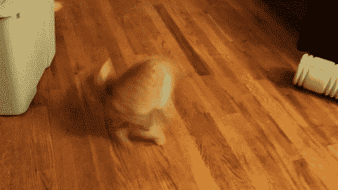

图 6:模式崩溃阵痛中的甘(艺术家印象，来源:[吉菲](https://giphy.com/))

这里的主要问题是对鉴别器性质的误解。在讨论 GANs 时，鉴别器通常被描述为**能够预测给定样本是真是假**。事实并非如此。鉴别器实际上做的是**分类一个给定的样本是来自真实的数据集还是由生成器创建的。**这种区别很微妙，但请考虑下图:

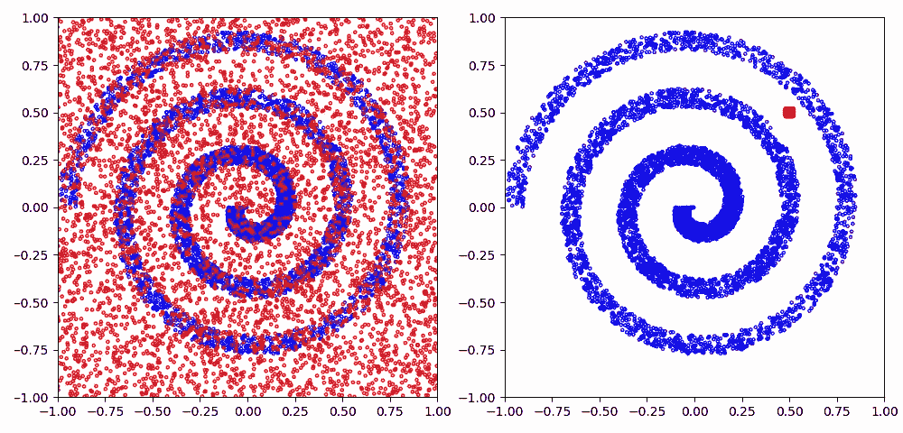

图 7:目标分布(蓝色，两者)与均匀噪声(红色，左侧)和发生器输出(红色，右侧)

在左边，我们看到两类:真实样本(蓝色)和随机噪声(红色)。识别每个点上每个类的相对概率有助于形成一个信息丰富的鉴别器(事实上，这就是图 5 中的鉴别器是如何被训练的)。在右边，我们还可以看到两个类:真实样本(同样是蓝色)，以及生成器的输出(红色)。基于该数据训练的鉴别器是没有用的；它将得出结论，在那个小的红色区域内的任何样本都可能是由发生器产生的，而该区域之外的任何样本都可能是真实的样本。由此推断，鉴别器决定即使在范围的角上的点也可能是真实的样本，尽管它从未在该区域中见过样本。这鼓励生成器在那些极端区域产生点。最终，鉴别器了解到这个新区域很可能都是伪点**，而不知道原来的区域同样大部分是伪点，因为伪点不再在那里产生**。

# 更好的解决方案

关于模式崩溃的问题已经做了大量的研究，但是没有办法把所有的都放在一篇文章里。我们将应用一些常用技巧来改进训练:降低生成器学习率和 Adam 优化器的β1 参数。在最初的训练过程中(图 3)，我对生成器使用了 0.001 的学习率。我使用 0.0002 的学习率重复了这个过程，并将β1 从 0.9 减少到 0.5:

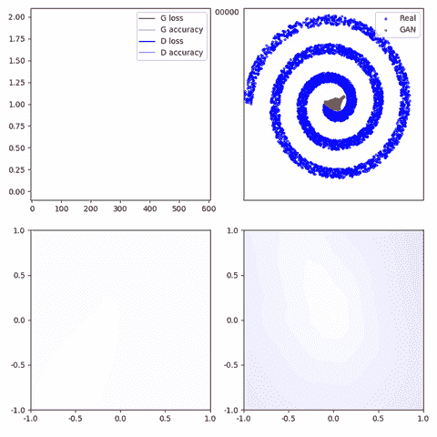

图 8:GAN 训练过程的动画。如图 3 所示，但是使用了更好的优化器参数

在这里，生成器在探索样本空间方面做得更好，这反过来又导致了一个信息更丰富的鉴别器。如果我们允许 GAN 训练 600 *千*步而不是 600 步，我们会看到以下结果:

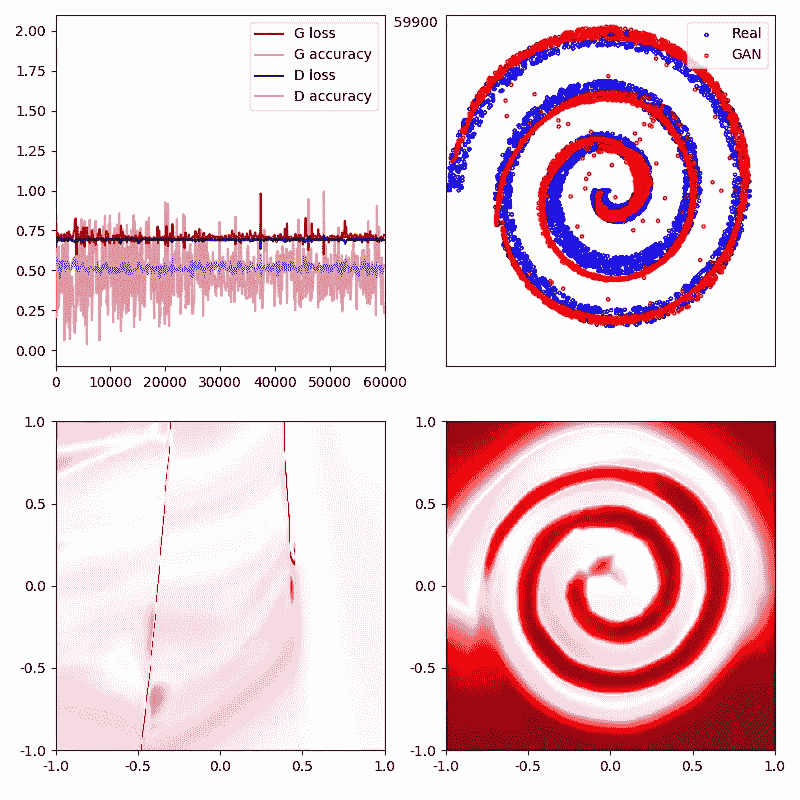

图 9:以降低的学习速率训练 GAN 600000 步的结果

正如您所看到的，在这种情况下，鉴别器(右下角面板)比图 3 中了解到了更有用的相对分布，这导致了更有效的生成器(右上角面板)。在左下角的面板中，我们看到在潜在空间中有两个区域，生成器未能映射到欺骗鉴别器的样本，暗红色的垂直线；生成器将这些区域中的点映射到螺旋的负空间。这些区域的原因如下所示:

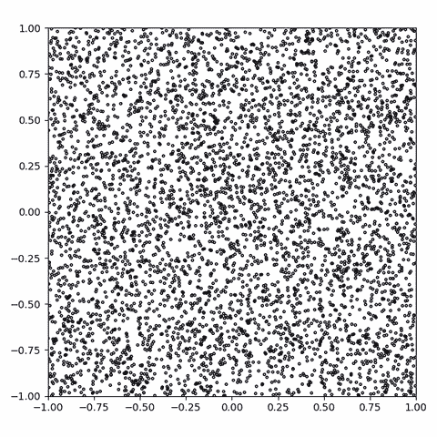

图 10:经过训练的生成器将随机输入映射到已学习的螺旋分布的动画

动画清楚地显示了平滑的潜在空间在这两个区域被切割，不像图 2 中所示的平滑函数。在潜在空间中靠近在一起但在线的相对侧的点在样本空间中彼此相距很远；线上的点介于两者之间，大多位于目标分布之外。尽管最简单的解决方案是让一个维度对应于沿着螺旋(长度)的位置*，而另一个维度对应于*螺旋(宽度)内的横向位置*，但是 GAN 反而陷入了一些涉及极端轮廓的局部最小值。这是 GANs 的一个常见问题，我们认为相似的特征在潜在空间中可能相差甚远，反之亦然。*

# 结束语

gan 通常应用于高维图像数据，因此很容易舍本逐末。即使是生成模型的`hello world`MNIST，也存在于 784 维空间。在一个简单的二维问题上训练一个 GAN，并使过程的所有方面可视化，是获得对 GAN 整体的直观理解的有效方法。和往常一样，如果你花时间去想象一切，你会对你的发现感到惊讶。

撰写本文时使用的所有代码，包括 GAN 培训和可视化，都可以从以下 github repo 获得:

 [## ConorLazarou/培养基

### GAN 学习产生螺旋时的可视化效果

github.com](https://github.com/ConorLazarou/medium/tree/master/12019/visualizing_gan_spiral)