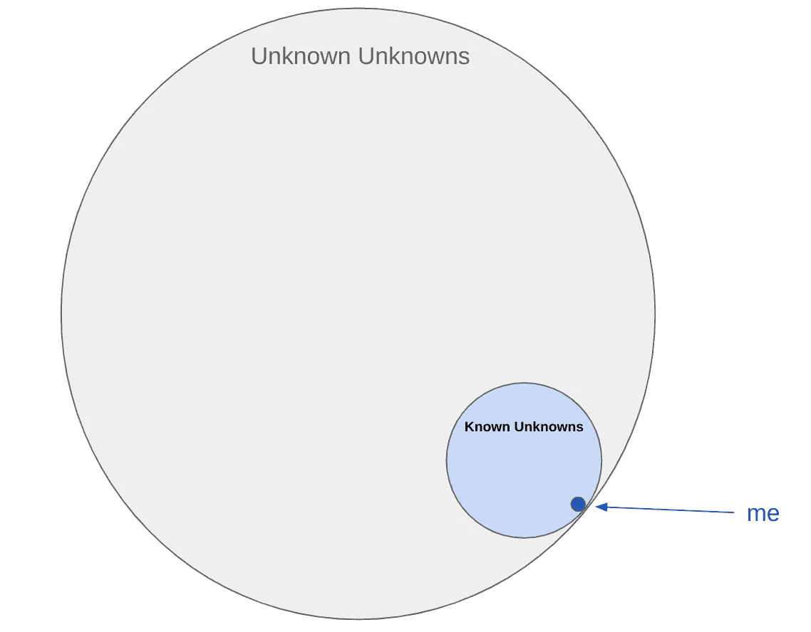

# 这会让你明白数据科学到底有多难

> 原文：<https://towardsdatascience.com/this-will-make-you-understand-how-hard-data-science-really-is-f4330bb8f672?source=collection_archive---------11----------------------->


照片由 [Unsplash](https://unsplash.com/?utm_source=medium&utm_medium=referral) 上的 [Nikko Macaspac](https://unsplash.com/@nikkotations) 拍摄

> **TL；博士:很难**

每天，人们都试图不辜负计算机科学专家，并试图进入数据科学领域。

有多难？需要什么？我从哪里开始？

在这篇博客中，我将总结我在[这个 Kaggle 笔记本](https://www.kaggle.com/thijsessens/how-hard-is-data-science-really)中做第一个数据科学项目时面临的 3 个最大挑战:

1.  你什么都不知道
2.  数据准备至关重要且耗时
3.  解释您的结果

观点是我自己的。

在进入任何细节之前，有一个相当重要的部分，人们似乎在解释过程中忽略了，或者它们只是他们的小代码片段的一部分。为了使用任何高级库，您必须将它们导入到您的工作区中。最好将它们收集在练习册的顶部。

我下面的例子:

# 你什么都不知道

对于我的第一个数据科学项目，我创建了一个关于在阿姆斯特丹开办 Airbnb 的简短博客。我只用了基本的数据分析方法和回归模型。

回归模型可能是数据科学最基本的部分。典型的线性回归函数如下所示:

这将返回几个输出，然后您将使用这些输出来评估您的模型性能。

数据科学家使用的技术超过 40 种。这意味着我只使用了 2.5%的模型。

我会很慷慨的。鉴于我 8 年前在大学里学的统计学课程，在进入这个项目时，我已经知道了那个回归模型的大约 10%。这意味着我只知道我所知道的全部知识的 0.25%。然后加上非常大量的我不知道我不知道的东西。

我在数据科学领域的知识世界看起来是这样的:



作者图片

这还不够糟糕，你会发现像[和](/from-sklearn-import-478c711dafa1)这样的文章，准确地描述了你所有的缺点。

这个当前的项目花费了我大约 4 周的时间，可以说这是学习新数据科学模型的平均速度。我将花费大约 4 / 0.25% = 800 周的时间来学习到目前为止我听说过的所有模型，并可能再增加 5 倍的时间来学习(可能甚至不接近)数据科学领域的一切。

未来 15 到 75 年的学习。

学习后的我:


唐纳德·蒂尔在 [Unsplash](https://unsplash.com/?utm_source=medium&utm_medium=referral) 上的照片

# **数据准备**

我在谷歌从事数据工作已经超过 5 年了。

可惜我以前的经验都是在 SQL 和数据科学家是熊猫的大粉丝。他们真是动物爱好者。

这里的挑战是双重的:1)知道做什么，2)知道如何去做。

即使有下面描述的帮助，数据准备部分也要花费你 80%甚至更多的时间。

## **知道该做什么**

操纵数据以准备在模型中摄取的方法是无穷无尽的。它深入到统计学的底层，如果你想成为一名伟大的数据科学家，你需要彻底理解这一点。

准备好多次运行这些步骤。我将给出几个对我每一步都有效的例子。

**清理数据质量问题**

如果您的数据样本大小允许，您可能应该去掉数据中的任何 NaN 值。它们不能被回归模型吸收。要计算每列 NaN 值的比率，请使用以下公式:

```
np.sum(df.isnull())/df.shape[0]
```

要删除所有具有 NaN 值的行，请使用以下命令:

```
df.dropna()
```

我遇到的另一个数据质量问题是将 True 和 False 数据作为字符串，而不是布尔数据类型。我用这个 [distutils.util.strtobool 函数](https://docs.python.org/3/distutils/apiref.html#distutils.util.strtobool)解决了这个问题:

在开始这个项目之前，请不要假设我真的知道如何使用 Lambda 函数。

我读了很多书才稍微理解了一点。我非常喜欢这篇关于“什么是 python 中的 lambda 函数以及为什么您应该现在就开始使用它们”的文章[。](/what-are-lambda-functions-in-python-and-why-you-should-start-using-them-right-now-75ab85655dc6)

最后，我的价格数据是一个由$符号和逗号组成的字符串。我找不到一种优雅的方式来编码解决方案，所以我笨拙地采用了这种方式:

**剔除异常值**

首先检查是否有异常值，箱线图非常有用:

```
sns.boxplot(x=df[‘price’])
```

发挥想象力，使用修改后的 z 值([来自 StackOverflow](https://stackoverflow.com/questions/58127935/how-to-calculate-modified-z-score-and-iqr-on-each-column-of-the-dataframe) 的答案)来剔除异常值:

或者根据您的喜好强制实施硬编码条件，如下所示:

```
df = df[df['price'] < 300]
```

**归一化&组合变量**

不要与正态分布混淆。

标准化是将各个列缩放到相同数量级的过程，例如从 0 到 1。

因此，你必须只考虑这一步，如果你想结合某些变量，或者你知道它会影响你的模型。

Sklearn 中有一个[预处理库](https://scikit-learn.org/stable/modules/preprocessing.html)。它有助于实现这些数据准备方面的一些内容。

我发现很难规范化某些列，然后将它们整齐地放回我的数据框架中。因此，我将在下面分享我自己的组合床/卧室/住宿变量的完整示例:

**为变量创建正态分布**

单独查看所有数据输入变量并决定如何转换它们[以更好地符合正态分布](https://machinelearningmastery.com/how-to-transform-data-to-fit-the-normal-distribution/)是很有用的。

我已经用这个 for 循环:

一旦你知道你想要转换哪个，考虑使用一个 [box cox 转换](https://www.statisticshowto.com/box-cox-transformation/#:~:text=A%20Box%20Cox%20transformation%20is,a%20broader%20number%20of%20tests.)像这样:

请注意返回 box cox 转换所使用的 lambdas 列表是多么重要。当你解释结果时，你需要这些来反演你的系数。

**标准化**

StandardScaler 假设您的数据在每个要素中已呈正态分布(参见上述 box cox 变换示例),并将对其进行缩放，以使分布现在以 0 为中心，标准差为 1。

我的完整例子如下:

**创建虚拟变量**

分类变量可能包含数据集中一些最有价值的信息。为了让机器理解它们，你需要把每一个唯一的值翻译成一列 0 或 1。

如果是该值，则为 1，否则为 0。

有几种方法可以做到这一点。我用过以下方法:

**多重共线性**

在将某些输入变量放入模型之前，您可以检查它们之间是否存在相关性。

您可以像我下面的例子一样检查多重共线性，并尝试去掉一些您认为不会增加任何额外价值的变量。

这将有望防止一些[特征值和特征向量](/eigenvectors-and-eigenvalues-all-you-need-to-know-df92780c591f)问题。

得到特征值和特征向量的底部可能会花费你另外 15 年的时间。小心行事。

你可以通过[主成分分析](/pca-using-python-scikit-learn-e653f8989e60?source=search_popover---------------------------)(更常用于图像识别)进入降维的兔子洞。

此外，这篇关于[功能选择](/feature-selection-with-pandas-e3690ad8504b)的文章非常令人大开眼界。

坦白地说，在这个项目中，我没有时间学习所有这些先进的方法，但是在将数据科学应用到我的工作项目之前，我想更好地理解以上所有内容。

## 知道如何去做

作为一个荷兰人，我为 Python 的起源[感到非常自豪。这是一种非常强大和容易理解的语言。](https://www.economist.com/science-and-technology/2018/07/19/python-has-brought-computer-programming-to-a-vast-new-audience)

根据这篇文章中的[，基础训练平均需要 6-8 周。](https://medium.com/@meenakshi052003/how-many-days-will-it-take-to-master-python-programming-503f26ac3140#:~:text=Basic%20Python%20is%20where%20you,get%20acquainted%20with%20these%20basics)

因此，以我 4 周的经验，我甚至还没有学会基础。在这个弱点之上，我试图在上面添加几个不同的专用库包，比如 [Seaborn](https://seaborn.pydata.org/) 、 [Sklearn](https://scikit-learn.org/stable/) 和 [Pandas](https://pandas.pydata.org/) 。

> "不管你做什么项目，它们都是基础性的."

感谢所有的 Stackoverflow 和自助出版工程师，你们拯救了我生命中的许多时间。

特别是，吉姆是我新的最好的朋友。

复制代码并从所有这些文章中学习，它们是您在一天结束时工作代码的最大希望。

让我总结一下关于上述三个库的三篇最有用的文章:

1.  Seaborn: [如何使用 Python Seaborn 进行探索性数据分析](/how-to-use-python-seaborn-for-exploratory-data-analysis-1a4850f48f14)
2.  熊猫:[关于“熊猫”Python 库的快速介绍](/a-quick-introduction-to-the-pandas-python-library-f1b678f34673)
3.  sk learn:[Scikit-learn(sk learn)简介](/a-brief-tour-of-scikit-learn-sklearn-6e829a9db2fd)

花些时间和你的新朋友在一起:


照片由 [chuttersnap](https://unsplash.com/@chuttersnap) 在 [Unsplash](https://unsplash.com/?utm_source=medium&utm_medium=referral) 上拍摄

# 解释您的结果

在上一步中，您很有可能对数据进行了某种程度的处理，以至于无法对其进行解释。

根据[我的项目文章](https://medium.com/@essens/you-need-to-know-this-before-you-start-an-airbnb-in-amsterdam-50e402aab986)，上市价格被 [boxcox](https://docs.scipy.org/doc/scipy/reference/generated/scipy.stats.boxcox.html) 转化，并且产出中的 1 美元不像真正的 1 美元。

对我来说，最简单的方法是衡量与标价关系的相对强度，而不是评论系数的实际值。你可以在我的视频中看到结果。

更合适的解决方案是将 box cox 和其他变换反转回正常状态，例如:

[Inv_BoxCox](https://docs.scipy.org/doc/scipy/reference/generated/scipy.special.inv_boxcox.html) 用于 BoxCox 变换

```
**from** **scipy.special** **import** boxcox, inv_boxcox
**>>>** y = boxcox([1, 4, 10], 2.5)
**>>>** inv_boxcox(y, 2.5)
```

希望您记得在我的 box cox 转换示例中保存 lambda_list。因为 2.5 是你求逆变换的 lambda 值。

[标准缩放器的逆变换](https://scikit-learn.org/stable/modules/generated/sklearn.preprocessing.StandardScaler.html#sklearn.preprocessing.StandardScaler.inverse_transform):

最后，您需要非常精通您的评估指标。

有许多评估指标，如 [RMSE](https://www.statisticshowto.com/probability-and-statistics/regression-analysis/rmse-root-mean-square-error/#:~:text=Root%20Mean%20Square%20Error%20(RMSE)%20is%20the%20standard%20deviation%20of,the%20line%20of%20best%20fit.) 和[系数/ p 值](https://statisticsbyjim.com/regression/interpret-coefficients-p-values-regression/#:~:text=The%20sign%20of%20a%20regression,variable%20also%20tends%20to%20increase.)。

大多数机器学习模型都带有评估指标。Sklearn 中的 LinearRegression 也是如此:[度量](https://scikit-learn.org/stable/modules/classes.html#module-sklearn.metrics)。

在我的例子中，我主要关注 R 平方和 RMSE:

让 RMSE 看起来很有价值的一件事是平等的模特之间的比赛场地。

我可以很快看出，在这个问题上使用自动化机器学习并没有改善我的模型。 [H2O 汽车](https://docs.h2o.ai/h2o/latest-stable/h2o-docs/automl.html#automl-log)相当容易实现:

这东西太疯狂了。它遍历许多不同的模型(在我的例子中，max=20 ),并返回一个模型排行榜。

然而，如前所述，这并没有提高我的 RMSE 多少。

> “这仍然完全取决于你输入的丰富程度”

也请非常小心，并寻求更多有知识的人的帮助。

利用你的资源，打电话给朋友:


由[路易·汉瑟](https://unsplash.com/@louishansel)在 [Unsplash](https://unsplash.com/?utm_source=medium&utm_medium=referral) 拍摄的照片

# 结论

在本文中，我试图让您了解数据科学到底有多难。

1.  我们看了看我还需要学习的内容。大约只有 15 到 75 年…
2.  然后，我们查看了数据准备，发现这是一个非常令人头疼的问题，会占用您大约 80%的时间
3.  最后，我们发现解释你的结果可能最好留给一个更博学的人。打电话给朋友！

忠于[成长心态](https://www.ted.com/talks/carol_dweck_the_power_of_believing_that_you_can_improve)，不要让这阻止你。

你还不是数据科学家。

开始你的第一个项目！