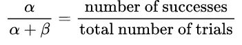
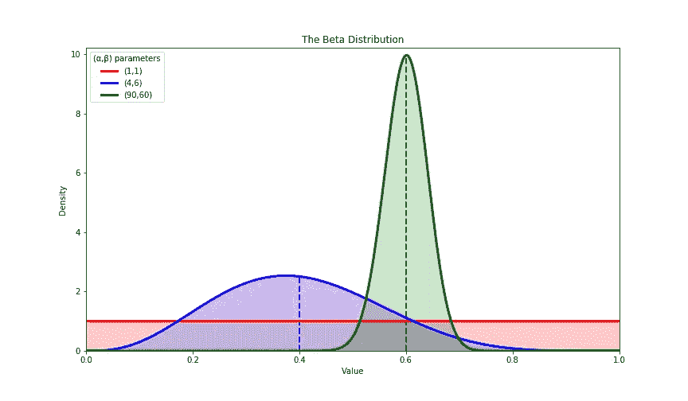
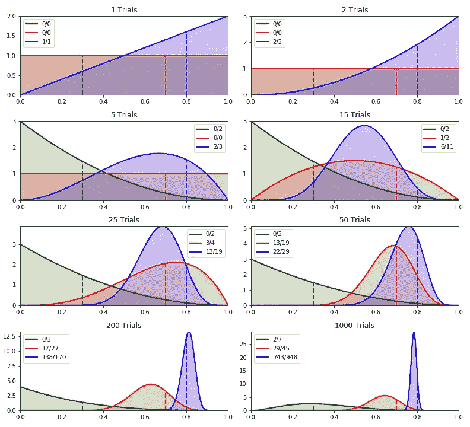
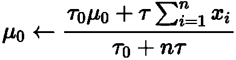
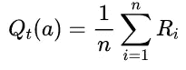
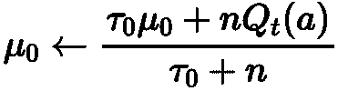
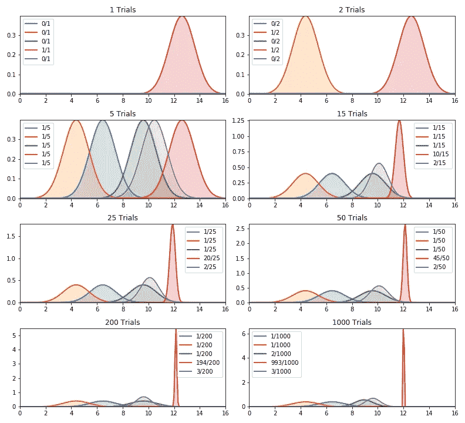
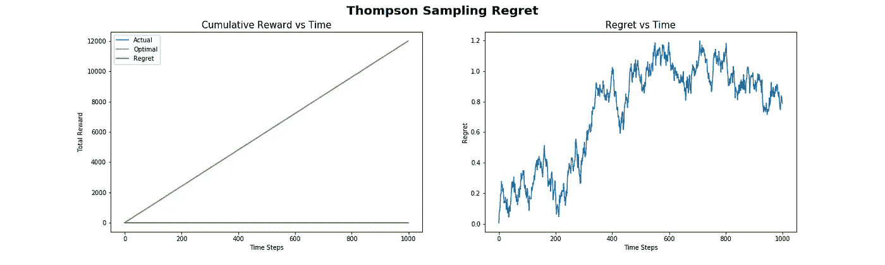

# 汤普森取样

> 原文：<https://towardsdatascience.com/thompson-sampling-fc28817eacb8?source=collection_archive---------2----------------------->

## [婴儿机器人强化学习指南](https://towardsdatascience.com/tagged/baby-robot-guide)

## 多武装匪徒:第 5 部分


[国立癌症研究所](https://unsplash.com/@nci?utm_source=medium&utm_medium=referral)在 [Unsplash](https://unsplash.com?utm_source=medium&utm_medium=referral) 上拍摄的照片


# 概观

在本系列的最后几部分中，我们一直在寻找解决*多臂强盗*问题的越来越复杂的方法。我们现在已经到了我们要看的所有方法中最后也是最复杂的一个: ***汤普森采样*** 。

如果您还不熟悉 bandit 问题及其术语，您可能想先看看本系列的前几部分，如下所示:

*   [**第一部分:数学框架和术语**](/multi-armed-bandits-part-1-b8d33ab80697)——入门所需的全部基础信息
*   [**第二部分:土匪框架**](/multi-armed-bandits-part-2-5834cb7aba4b)
    *-* 代码和测试框架的描述
*   [**第三部分:土匪算法**](/bandit-algorithms-34fd7890cb18)
    *-*[*贪婪算法*](/bandit-algorithms-34fd7890cb18) *-*[*乐观-贪婪算法*](/bandit-algorithms-34fd7890cb18) *-*[*ε-贪婪算法(ε-贪婪)*](/bandit-algorithms-34fd7890cb18) *-*[](/bandit-algorithms-34fd7890cb18)
*   *[**第四部分:置信上限(UCB) Bandit 算法**](/the-upper-confidence-bound-ucb-bandit-algorithm-c05c2bf4c13f)*

*bandit 算法和测试框架的所有代码都可以在 github 上找到: [Multi_Armed_Bandits](https://github.com/WhatIThinkAbout/BabyRobot/tree/master/Multi_Armed_Bandits)*

# *概述*

> *机器人宝宝在商场走失。利用强化学习，我们想帮助他找到回到妈妈身边的路。然而，在他开始寻找她之前，他需要从一组电源插座充电，每个插座的电量略有不同。*
> 
> *使用多臂强盗问题中的策略，我们需要在最短的时间内找到最好的插座，让机器人宝宝充电上路。*

**

> *机器人宝宝进入了一个充电室，里面有 5 个不同的电源插座。每个插座返回的电荷数量略有不同。我们希望在最短的时间内给机器人宝宝充电，所以我们需要找到最好的插座，然后使用它，直到充电完成。*
> 
> *这和多臂强盗问题是一样的，除了我们不是在找一个能给出最好回报的吃角子老虎机，而是在找一个能给出最多电量的电源插座。*

**

# *汤普森取样*

*到目前为止，我们所看到的解决强盗问题的所有方法都是基于从这些行动中得到的平均回报来选择他们的行动的。Thompson 采样(有时也被称为*贝叶斯强盗*算法)采用了一种稍微不同的方法；它并不只是改进对平均回报的估计，而是对其进行扩展，从获得的回报中建立一个概率模型，然后从中抽取样本来选择行动。*

*通过这种方式，不仅获得了对可能的奖励的越来越精确的估计，而且该模型还提供了对该奖励的一定程度的信任，并且这种信任随着收集的样本越来越多而增加。随着越来越多的证据可用，这个更新你的信念的过程被称为 ***贝叶斯推断*** 。*

# *伯努利·汤普森采样*

*作为介绍，并且为了使事情更容易处理，让我们简化电源插座问题。现在，不是每个插座返回不同数量的电荷，而是每个插座要么返回一些电荷，要么不返回电荷；奖励只有两个可能的值:当选择的插座充电时为 1，当不充电时为 0。当一个随机变量只有两种可能的结果时，其行为可以用 [***伯努利分布***](https://en.wikipedia.org/wiki/Bernoulli_distribution) 来描述。*

*所以现在，不是每个插座的电荷量不同，而是每个插座产生电荷的概率也不同。我们希望找到返回电荷概率最高的插座，而不是给出电荷最多的插座。*

*如前所述，汤普森抽样产生了一个回报概率模型。在这种情况下，当可用的奖励是二元的(赢或输，是或否，收费或不收费)时，那么 [***贝塔分布***](https://en.wikipedia.org/wiki/Beta_distribution) 是对这种类型的概率建模的理想选择。*

*(有关贝塔分布和伯努利分布之间关系的更多信息，请查看这篇精彩的文章:
[贝塔分布——直觉、例子和推导](/beta-distribution-intuition-examples-and-derivation-cf00f4db57af))。*

*贝塔分布有两个参数，' *α* '(阿尔法)和' *β* '(贝塔)。用最简单的术语来说，这些参数可以分别被认为是成功和失败的计数。*

*此外，贝塔分布的平均值由下式给出:*

****

*图 5.1:不同α和β值的β分布。*

*最初，我们不知道任何给定的插座产生输出的概率是多少，所以我们可以首先将' *α* 和' *β* '都设置为 1，这将产生一条平坦的线[](https://en.wikipedia.org/wiki/Uniform_distribution_(continuous))**(在*图 5.1* 中显示为平坦的红色线)。***

**这个对套接字产生输出的概率的初始猜测被称为 [***先验概率***](https://en.wikipedia.org/wiki/Prior_probability)；它是在我们收集到任何证据之前特定事件发生的概率，在这种情况下，用 Beta 分布 *Beta(1，1)* 表示。**

**一旦我们测试了一个套接字，并获得了回报，我们就可以修改我们对该套接字返回一些电荷的可能性的信念。这个新的概率，在收集了一些证据之后，被称为[](https://en.wikipedia.org/wiki/Posterior_probability)*。这也是由 Beta 分布给出的，但是现在' *α* '和' *β* '的值用返回的奖励值更新。***

**因此，如果一个套接字返回一些电荷，奖励将是 1，并且' *α 【T1 '(成功次数的计数)将增加 1。失败次数的计数， *β* ，不会增加*。*如果没有获得奖励，则“ *α* ”将保持不变，而“ *β* ”将增加 1。随着收集的数据越来越多，贝塔分布从一条直线变成了一个越来越精确的平均回报概率模型。通过保持' *α* 和' *β* 的值，汤普森采样算法能够描述估计的平均回报和该估计的置信水平。***

*与在每个时间步选择具有最高估计回报的动作的贪婪算法相反，即使该估计的置信度较低，Thompson sampling 也从每个动作的 Beta 分布中进行采样，并选择具有最高返回值的动作。由于不经常尝试的动作分布很广(参见图 5.1 中的蓝色曲线)，它们有更大范围的可能值。以这种方式，当前具有低估计均值回报，但是比具有较高估计均值的插座测试次数少的插座可以返回较大的样本值，因此成为在该时间步长的所选插座。*

*在上图中，蓝色曲线的估计平均回报低于绿色曲线。因此，在贪婪选择下，绿色会被选择，而蓝色插座永远不会被选择。相比之下，Thompson 采样有效地考虑了曲线的整个宽度，对于蓝色插座，可以看出其延伸超过了绿色插座的宽度。在这种情况下，可以优先选择蓝色插座，而不是绿色插座。*

*随着插座试验次数的增加，估计平均值的可信度也增加。这反映在概率分布变窄，采样值将从更接近真实平均值的一系列值中提取(见图 5.1 中的绿色曲线)。结果，探索减少了，开发增加了，因为具有较高回报概率的插座将开始以增加的频率被选择。*

*另一方面，具有低估计平均值的插座将开始被不太频繁地选择，并且将倾向于在选择过程的早期被丢弃。因此，他们真正意义可能永远不会被发现。因为我们只对找到返回奖励的概率最高的套接字感兴趣，并且尽可能快地找到它，所以我们不关心是否从未获得性能差的套接字的完整信息。*

## *伯努利套接字实现*

*正如我们在本系列的前几部分中进行的套接字实验一样，我们将使用一个基本的套接字类，在此基础上，我们为正在研究的算法添加特定的功能。然后，使用这个新类，我们通过一组实验运行它，对所有的 bandit 算法使用相同的测试工具。电源插座基类和附带的测试系统的全部细节在本系列的第二部分中给出，所有代码可以在 [github](https://github.com/WhatIThinkAbout/BabyRobot/tree/master/Multi_Armed_Bandits) 上找到。*

*如上所述，Bernoulli Thompson 采样的实现显示在*bernoulllithompsonsocket*类中:*

*在这个类中，我们将' *α* 和' *β* '初始化为 1，以给出均匀分布。然后，在更新时，如果套接字返回奖励，我们简单地递增' *α* ，否则我们更新' *β* '。*

*“ *sample* ”函数使用“ *α* ”和“ *β* ”的当前值作为其参数，从 Beta 分布中提取一个值。*

## *实验结果*

*下面的*图 5.2* 显示了每个电源插座的 Beta 分布演变，我们使用了更简单的概率电源插座。*

*为了简单起见，我们将插座的数量减少到三个，测试时，这些插座返回一些电力的真实概率分别为 0.3(绿色)、0.7(红色)和 0.8(蓝色)。*

**

*图 5.2:对 3 个概率电源插座使用 Beta 分布的 Thompson 抽样，真实概率为 0.3、0.7 和 0.8。*

*在上面的*图 5.2* 中，虚线显示了 0.3、0.7 和 0.8 的真实平均值。图例显示每个插座的试验次数以及这些试验的成功次数。*

*图 5.2 中的*要点如下:**

*   *在时间步长 0(未示出)，所有β分布的 *α* 和 *β* 值将被设置为 1，以给出平坦均匀的分布。*
*   *由于所有插座具有相同的初始分布，在时间步骤 1 中，蓝色电源插座被任意选择。当测试时，它给出一个奖励，所以它的 *α* 值增加 1，它的概率密度曲线向右移动。绿色和红色插座尚未测试，因此保留它们最初的平坦分布(绿色曲线隐藏在红色曲线后面)。*
*   *在第二个时间步，蓝色插座再次被选中，它再次返回奖励。蓝色曲线稍微向右挤压一些，因为这个插座已经测试了两次，并且两次都返回了奖励，所以这个插座每次被选中都会返回奖励的可能性仍然存在。*
*   *到第五次试验时，蓝色插座再次被选中，但这次它没有给出奖励。结果，它总是返回值的概率下降到零(概率= 1.0)。另一方面，绿色套接字现在已经测试了两次，还没有返回值，因此它的概率密度曲线向左移动，在概率=0 时具有最高值，因为这个套接字仍然有可能永远不会返回奖励。*
*   *在 15 次尝试中，红色插座已经尝试了几次。因为它返回了一次奖励，所以它的平均奖励概率估计为 0.5。在这个阶段，蓝色插座已经被尝试了 11 次，并在其中的 6 次尝试中返回了奖励，给它一个略高的估计奖励概率 0.54。因此，在贪婪系统中，蓝色套接字将是被选择的套接字，然而，因为红色套接字比蓝色套接字被尝试的次数少，所以可以看到它具有宽得多的概率密度曲线，这给了它比蓝色套接字优先被选择的好机会。*
*   *一个插座被测试的次数越多，我们对它的估计就越有信心，它的概率密度曲线就变得越窄。最佳插座将被更频繁地使用，次优插座的测试将逐渐减少。在我们测试的最后，当蓝色插座比其他两个插座中的任何一个受到更多的尝试时，可以看到这种行为。还可以看出，绿色插座最终在两次试验中获得了回报。因此，这不再可能是一个从不返回回报的套接字，所以这种情况发生的概率(返回回报的概率= 0)下降到零。*
*   *还可以看出，无论是蓝色还是红色插座都没有以它们的真实平均概率为中心的概率密度曲线。如果测试运行了更多的时间步长，那么蓝色曲线将最终停留在真实的平均值上，但是红色插座将具有大大减少的试验次数(如果有的话),因此可能永远不会找到它的真实值。如上所述，这不是一个问题，因为我们只对找到最佳插座感兴趣，而不是其他插座的真实平均值。*

# *高斯汤普森采样*

*到目前为止，我们使用的简化套接字问题是掌握贝叶斯汤普森抽样概念的好方法。然而，要将这种方法用于我们实际的套接字问题，其中套接字不是二进制的，而是返回可变数量的电荷，我们需要稍微改变一下。*

*在前一个问题中，我们使用 Beta 分布来模拟套接字的行为。选择这一点是因为简化的套接字输出只有两种可能的结果，收费或不收费，因此可以用伯努利分布来描述。当从伯努利分布中得出的值(*可能性*值)乘以从贝塔分布中得出的值(*先验*概率)，那么结果值(*后验*概率)也具有贝塔分布。当这种情况发生时，使得与先验相乘的可能性产生与先验具有相同分布类型的后验，该先验被称为 [***共轭先验***](https://en.wikipedia.org/wiki/Conjugate_prior) 。*

*对于我们的标准套接字问题，每个套接字返回一个由正态分布描述的实数值。如果我们假设我们知道我们的套接字的方差(实际上是 1，因为我们在代码中使用了未经修改的 *numpy randn* 函数)，那么从 Wikipedia 上的 [*共轭先验表中，我们可以看到共轭先验也具有正态分布。如果我们不知道分布的方差，或者我们使用不同的分布，那么我们只需要从表中选择一个共轭先验，并相应地调整我们的算法。*](https://en.wikipedia.org/wiki/Conjugate_prior#When_likelihood_function_is_a_continuous_distribution)*

*因此，我们可以使用正态分布来模拟套接字的输出，并通过更新其均值和方差参数来逐步完善该模型。如果不使用方差，而是使用精度‘τ’(*τ*)，其中精度只是方差的一倍(*精度τ= 1/方差*)，那么我们可以使用简单的更新规则来更新平均值' *μ₀* 和总精度' *τ₀* '，由下式给出:*

****

*哪里；*

*   **τ* '是实际套接字输出的精度，在我们的例子中是 1。*
*   *n 是插座测试的次数。*
*   **'是该插座每次测试“*I”*时接收到的输出(相当于我们到现在为止使用的奖励“ *Rᵢ* ”)。**
*   ***μ₀*’是估计的平均值(用于模拟输出的分布的平均值)。**
*   ***τ₀*’是用于模拟输出的分布的总精度。**

**乍一看，这看起来相当吓人，但它基本上说的是，我们有两个参数' *μ₀* 和' *τ₀* '，我们将在每次测试插座时更新它们，就像我们对伯努利插座的' *α* 和' *β* '所做的那样。除了在这种情况下，那些参数代表插座的成功和失败的次数，而' *μ₀* '和' *τ₀* '代表估计的平均值和精度，代表估计平均值的置信度。**

**此外，我们还可以做一些其他的简化:**

*   **我们知道从插座返回的电荷量的方差为 1，因此精度' *τ* '也是 1。因此，套接字精度的更新简单地是 *τ₀ = τ₀ + n，*其中 *n* 是套接字已经被测试的次数，所以每次套接字被测试，我们简单地将其精度增加 1。**
*   **对于估计的平均值，分子包含插座产生的所有输出的总和，乘以“ *τ* ”。正如我们在第 1 部分的 [*样本平均估计*](/multi-armed-bandits-part-1-b8d33ab80697#23ee) 一节中所看到的，保留奖励总额并不是一个好主意，因为这可能会增长到一个不可收拾的规模。然而，在我们的基本插座实现中，我们总是计算' *Qₜ(a)'* 、在时间步长 *'t '、【t29 的动作估计值' *a* ，其由下式给出:***

**

*   *在这个等式中，‘*rᵢ*是在采取行动’*a*时在每个时间步获得的奖励，与上面更新等式中使用的术语“ *xᵢ* 相同。因此，我们可以简单地用' *nQₜ(a)'* 代替更新方程中的求和，最终得到以下简化的更新方程:*

**

*通过这些简化，我们驯服了可怕的数学！现在很清楚，我们需要做的就是保持对每个插座的回报的平均值和精度的估计，然后使用 2 个简单的规则来更新这些值。当这些等式被翻译成代码时，事情变得更加清楚。*

## *高斯套接字实现*

*高斯汤普森采样套接字的相关代码如下所示。这保留了我们在以前的套接字类型中使用的所有基本功能，并为用于建模套接字输出的后验分布添加了参数和更新功能。*

*请注意，在这个更新函数中，我们用' *self.n * self '替换了所有观察到的奖励的总和。问*’。这给了我们完全相同的价值，而不必保留奖励总额，如前所述，奖励总额可能会增长到无法控制的规模。*

*上面等式中给出的两个更新函数转化为更新函数中显示的简单代码行。*

*其他需要注意的要点是:*

*   *' *sample* '函数不是简单地返回' *Q* '，即套接字奖励值的估计值，而是返回一个从正态分布中采样的值，我们使用该值来模拟套接字输出(后验，平均值为' *self.μ_0* ，精度为' *self.τ_0* ')。*
*   *与用于模拟二进制输出的插座输出的贝塔分布一样，我们希望我们的先验分布从接近均匀分布的分布开始，给出平坦的概率分布曲线，因此有可能返回具有广泛可能值的采样值。所以，最初我们把后验概率的精度设为一个很小的值( *self.τ_0 = 0.0001* )。以这种方式，尚未尝试的套接字将更有可能被选择，很像*乐观-贪婪*算法。*

*如果你回头看看基本电源插座的代码，当插座被采样时，它返回的电荷量由围绕其真实平均值的正态分布给出:*

*在上面的 *charge* 函数中，numpy " *randn* "函数从均值为 0、方差为 1 的正态分布中返回一个随机值。通过将真实插座奖励值' *q* '加到这个值上，我们移动平均值以使分布集中在插座的实际输出上。*

*在 Thompson 套接字的*示例*函数中，可以看到一个非常相似的函数:*

*除了在这种情况下，法线以*自身μ_0、*后验平均值*为中心。*另外可以看到 *randn* 现在除以后验精度 *self.τ_0 的平方根。记住精度只是方差的一倍，方差是标准差的平方。因此，除以精度的平方根等于乘以标准差。这改变了分布的宽度，随着更多样本的出现，分布宽度减小，我们对估计的平均值变得更有信心。**

## *实验结果*

*与之前的伯努利实验一样，我们已经观察了 1000 多次的插座选择，如下面的概率密度曲线所示。由于后验分布从几乎平坦的曲线开始，在前 5 次试验中，5 个插座中的每一个都被测试一次。在此之后，插座 4(显示为红色曲线)主导进一步的试验。在测试结束时，它有一条以值 12(真实插座奖励值)为中心的又高又细的曲线，表明对该值的高度信任。*

*在前 200 次测试中，唯一一个被测试超过一次的插座是插座 5(紫色曲线，它的真实插座奖励是 10)。然而，它只测试了 3 次，因此具有小而粗的分布曲线，表明其值的可信度较低。*

**

*图 5.3:对 5 个电源插座使用正态分布的 Thompson 采样，真实回报值分别为 6、4、8、12 和 10。*

*从*图 5.3* 可以清楚地看到 Thompson 采样是如何快速定位并利用最佳插座的，而其他插座基本上未被测试。通过这种方式，算法设法返回一个大的、接近最优的累积奖励。*

# *汤普森抽样后悔*

*下面的*图 5.4* 显示了使用 Thompson 采样算法处理我们的标准插座选择问题时获得的遗憾。*

*正如在 UCB 算法中看到的，遗憾几乎为零，这意味着几乎总是选择最好的套接字。这也可以在累积奖励与时间的关系图中看到，其中实际获得的奖励与最优奖励非常接近，以至于被图上的这条曲线所掩盖。正如高斯汤普森采样的概率密度曲线所示，该算法快速锁定最佳动作，然后无情地利用这一点，导致非常低的后悔水平。*

*与 UCB 算法一样，汤姆逊采样可以被显示为[具有对数遗憾](https://web.stanford.edu/~bvr/pubs/TS_Tutorial.pdf)，其中遗憾的值随着时间的推移下降到几乎为零。*

*(由于行动的数量非常少，而且每个插座的奖励值也不同，我们的实验中没有看到后悔的对数下降，因为我们已经接近零后悔了。)*

**

*图 5.4:标准插座选择问题的 Thompson 抽样遗憾。*

*要更深入地了解 Thompson 采样，请查看其用途和数学框架:*

*   *[汤普森采样教程](http://A Tutorial on Thompson Sampling Daniel J. Russo1)丹尼尔·j·鲁索*等**

# *摘要*

*解决 bandit 问题的算法需要找到一种方法来平衡开发和探索之间的权衡。他们需要寻找最佳行动，同时努力利用他们已经获得的信息。*

*在简单的方法中，如 Epsilon-Greedy，这种权衡是通过主要使用当前给出最多回报的动作，并通过不时随机尝试一些其他动作来添加简单的探索来实现的。在更复杂的解决方案中，如 UCB，同样，平均回报最高的行动最常被选中，但这是由置信度来平衡的。这确保了不经常被选择的动作将得到测试。*

*汤普森取样采用了一种不同于其他方法的方法。它不是简单地维持对奖励的估计，而是逐步完善每个行为的奖励概率模型，并通过从该分布中取样来选择行为。因此，有可能得到一个行动的平均回报值的估计，加上该估计的置信度。正如我们在实验中看到的，这使它能够快速定位并锁定最佳行动，从而获得接近最佳的累积回报。*

*但是汤普森采样是最好的强盗算法吗，更重要的是，它是我们应该用来给婴儿机器人充电的算法吗？要知道这些问题的答案，你需要等到这个系列的最后一部分，当我们有强盗算法去头对头在最后摊牌！*

**

```
***< Part 4:                                                   Part 6 >** [**UCB Bandit Algorithm**](/the-upper-confidence-bound-ucb-bandit-algorithm-c05c2bf4c13f)[**A Comparison of Bandit Algorithms**](/a-comparison-of-bandit-algorithms-24b4adfcabb)*
```

# *补充*

*我们已经研究了 Thompson 采样背后的理论，并研究了它如何应用于几个简单的问题。要了解如何进一步扩展，当数据来自具有未知均值和方差的正态分布时如何工作，请查看下面的文章…*

*[](/thompson-sampling-using-conjugate-priors-e0a18348ea2d) [## 使用共轭先验的 Thompson 采样

### 多武装匪徒:第 5b 部分

towardsdatascience.com](/thompson-sampling-using-conjugate-priors-e0a18348ea2d)*