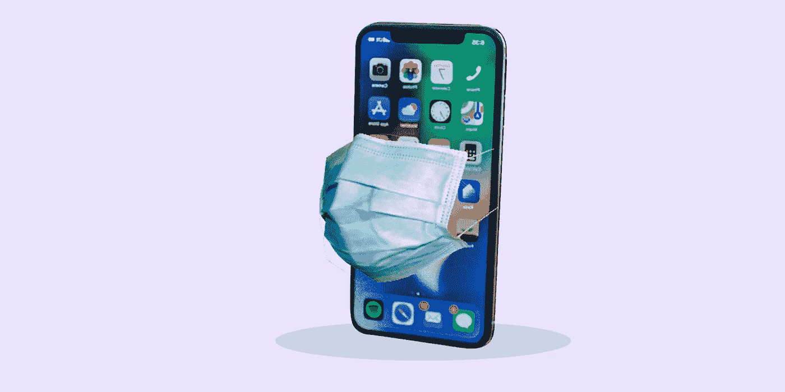
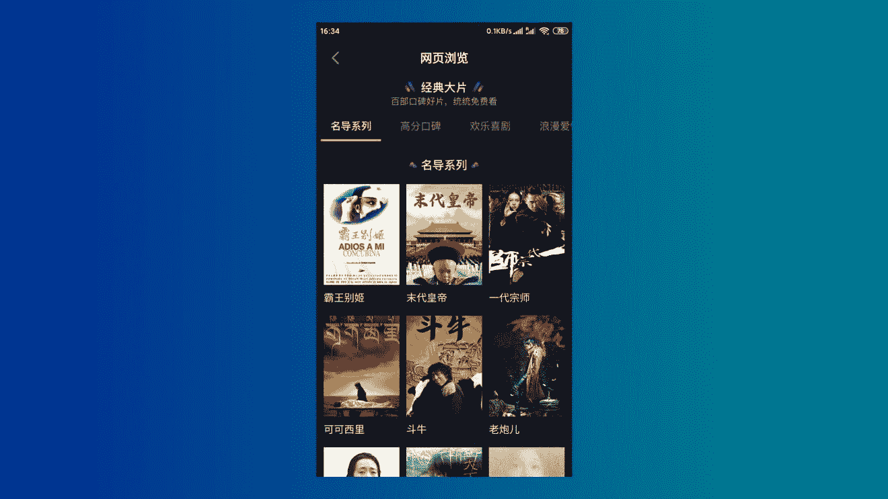
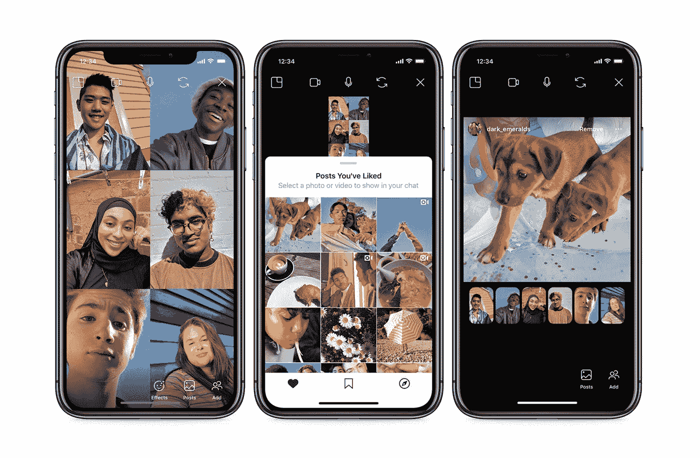
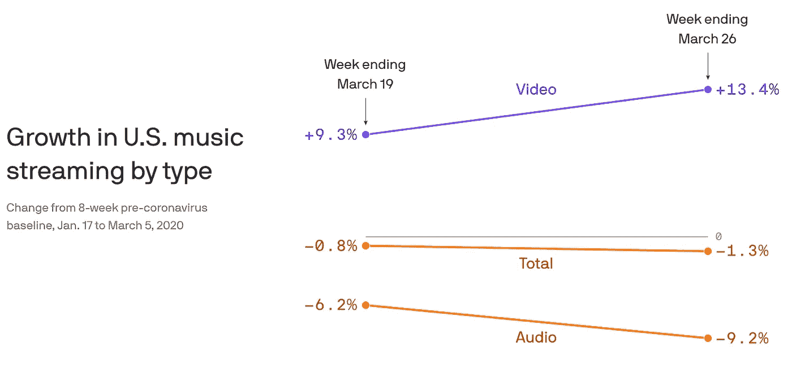
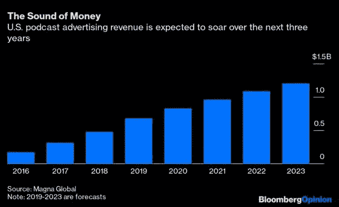
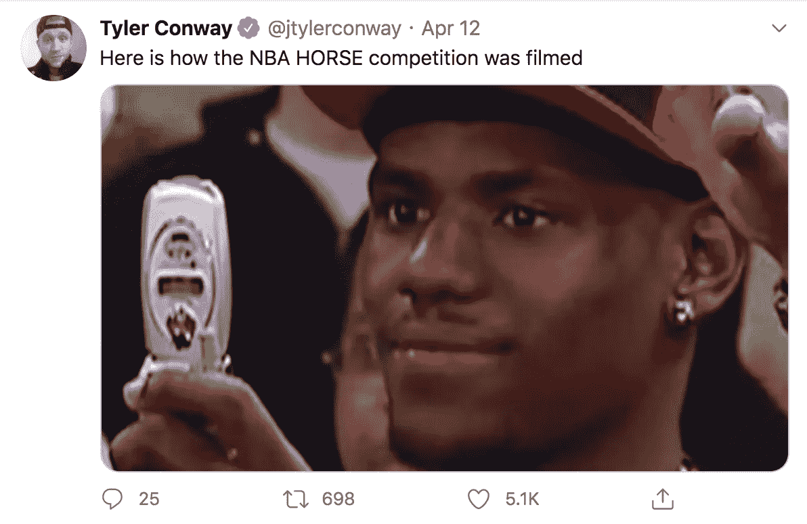
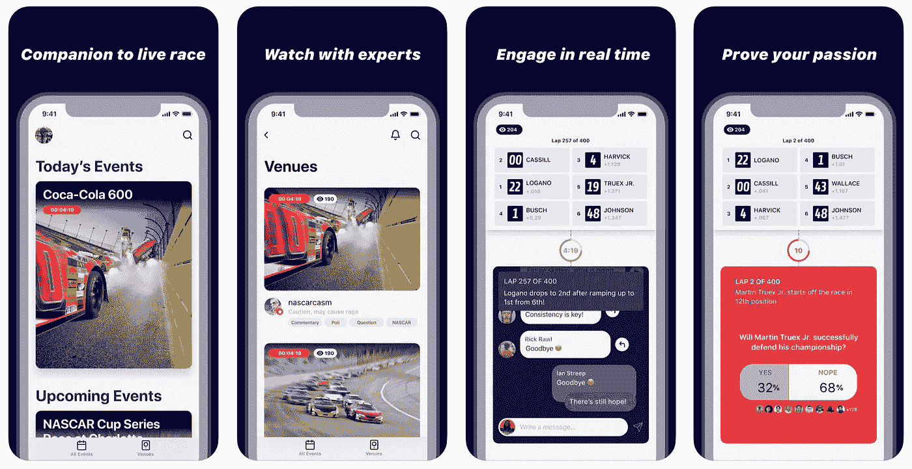

# 从数据和交易看新冠肺炎的影响力

> 原文：<https://towardsdatascience.com/thoughts-on-covid-19-through-data-and-deals-85274cf9b826?source=collection_archive---------52----------------------->

## 透过科技第一的镜头审视冠状病毒如何永远改变了全球消费者行为和产品创新。

永远不会太安全！(图片由作者提供)

不用说，疫情破坏了我们 2020 年的所有计划。在宏观层面上，美国的失业率已经达到了历史最高水平，华尔街的股票已经暴跌，引发了一种恐慌的模式，这种恐慌可以与大萧条相媲美，我们敬爱的科技巨头上周已经迫不及待地开始工作。从微观层面来看，我们可能会在碰头会上笨手笨脚，[不舒服地写在线考试](https://www.vox.com/recode/2020/5/4/21241062/schools-cheating-proctorio-artificial-intelligence)，购买[价格过高的卫生纸](https://www.theguardian.com/business/2020/mar/25/amazon-and-ebay-failing-to-stop-covid-19-profiteers-says-which)。

这是一系列研究行业的第一部分，特别是通过技术优先的视角，研究一种名为 Corona 的病毒如何永远改变了全球消费者行为和产品创新。其目的是基于历史数据和推断预测，提供一个全面的行业概述。

# **第一部分:娱乐**

我将分别考察电影和电视、音乐、播客、体育和游戏领域(预计会有重叠，因为科技让界限变得模糊)。我将总结我个人注意到的趋势，并以数据为依据。将有运行编辑。随着新冠肺炎的不断发展，我热衷于跟踪变化。根据数据和我的分析，我会对未来的前景做出预测，并提出我不知道答案的问题。

对于那些不擅长长篇阅读的人，我写了一篇并不短的 TLDR。参见最后一节。

## 电影和电视

2020 年 3 月 4 日，Quibi 完成了新一轮融资，使他们的总融资额达到了自 2018 年初创公司成立以来的 18 亿美元。在推出前一个月，独角兽公司宣传了其独特的 TurnStyle 观看技术，以及好莱坞明星主演的 175 场演出。所有 Quibi(“快速咬”)集将保持在 10 分钟以下。该公司和投资者认识到了这个新数字时代的一个转变，用户越来越喜欢消费短小、移动友好的内容。这一假设无疑是雄心勃勃的，不幸的是，它的高调遭到了新冠肺炎的反对。

在这个曾经风光无限的机构背后，是媒体巨头首席执行官杰弗瑞·卡森伯格。他在该行业拥有数十年的专业知识，并执导了迪士尼大片，如《狮子王》和《阿拉丁》。尽管签下了像勒布朗·詹姆斯和詹妮弗·洛佩兹这样的巨星，但上个月只有极少数的人下载了 Quibi)。

Quibi 是一个典型的例子，根据标准的创业剧本，它拥有成功所需的一切。一个能够执行愿景的强大团队，来自顶级风投的巨额投资，以及来自家喻户晓的品牌的签约，以产生公众对产品的关注。但是时机不对。

也就是说，Quibi 提出的论点肯定是有道理的。比以往任何时候都更重要的是，我们正在见证消费者对在手机上观看简短、随意的视频的巨大需求。根据[研究公司 App Annie 的调查，](https://www.oberlo.ca/blog/tiktok-statistics)Tik Tok 成为下载量最大的应用，全球安装量超过 20 亿。虽然不是“电影”行业的传统参与者，但抖音在改变和满足消费者对内容的持续时间、主题和类型的新口味方面发挥着重要作用。在家庭避难所订单之前，抖音正在崛起，但许多人认为，其爆炸性增长是由在家容纳无聊和精通技术的年轻人推动的。未来，我们能看到抖音制作的原创内容吗，类似于 Snapchat 的 [Snap Originals](https://snaporiginals.snapchat.com/will-from-home) ？今年早些时候，当病毒导致电影院关门和空无一人的时候，中国的同行豆音已经冒险在这个平台上首映完整版电影。

抖音的中文应用开始变得越来越像一个电影流媒体平台。([来源:斗印](https://www.scmp.com/tech/apps-social/article/3077820/chinas-tiktok-turning-movie-streaming-platform))

Quibi 卖点的第二部分是相信观众享受严格的纯移动观看体验。不用说，随着世界在国内捆绑在一起，这一趋势变得难以证实。根据尼尔森的一份报告，在美国，电视的总使用量预计将增长近 60%。在这种情况下，制作手机专用视频的制作人无法适应更大的屏幕。此外，尼尔森发现这些电视消费者一般更喜欢故事片和新闻，而不是轻松的内容。

**要跟踪的重要趋势是，当前对短格式视频内容的偏好是否会持续，以及人们在户外跋涉后是否会继续看电视。**

用户在 Instagram 上与朋友一起观看。([来源:Instagram 新闻稿](https://about.instagram.com/blog/announcements/coronavirus-keeping-people-safe-informed-and-supported-on-instagram/))

另一方面，新冠肺炎引入了一些新的消费趋势。**首先，社交和团体观看。**这样做的选项一直存在(网飞派对扩展创建于 2019 年 1 月)，但当我们都被限制在室内时，社交的需求大大促进了这一趋势。脸书用 Instagram 上的“共同观看”功能回应了[，允许用户在一起观看 IGTV 或视频时进行视频通话。在某种程度上，这取代了看电影、网飞和与朋友一起放松的社交体验。随着用户被迫尝试这些新技术解决方案来与世界各地的亲人联系，**这就提出了一个问题——这是否会对公司在制作新内容时考虑社交功能产生持久的需求？像网飞这样的流媒体服务可以很容易地嵌入一个类似家庭聚会的功能，允许朋友们在观看同一节目的同时聊天和社交。**](https://www.youtube.com/watch?v=tv5Dj73vU2c)

自新冠肺炎疫情爆发以来，我注意到的第二个趋势是互动和自制视频内容的兴起。影响者和名人不再是利用直播功能和应用的主要用户。正常的网友都在 Instagram Live 和 Twitch 上跳来跳去。例如，舞蹈工作室正在举办在线课程，老师们可以直接从家里在社交媒体[上直播。结果，毫无疑问，设置了一个更加非正式和随意的环境。Tory Lanez 是一名来自多伦多的艺术家，自隔离以来一直很忙-](https://www.instagram.com/p/CAgfZy0lisA/) [在 Youtube Live 上举办了一场 2 小时的虚拟音乐会](https://www.complex.com/music/2020/05/tory-lanez-social-distancing-tour-livestream)，并开始了“隔离电台”系列，这位说唱歌手邀请德雷克和威肯等明星谈论粉丝们希望的任何事情。托里的这些无脚本直播打破了 Instagram 直播观众 31 万的记录。Kehlani，一个突破性的 R & B 艺术家，在隔离期间也变得有创造力。她[在后院拍摄了自己的专辑封面](https://twitter.com/kehlani/status/1253870309628710913?lang=en)和[音乐视频](https://www.youtube.com/watch?v=pq1VJx72fFU)。她的“隔离风格”音乐视频[由凯拉尼在自己与世隔绝的家中亲自拍摄](https://www.billboard.com/articles/columns/pop/9343254/kehlani-releases-toxic-music-video-filmed-quarantine-style)，迄今为止已经获得了超过 1100 万的点击量。尽管该视频的质量和制作预算明显低于正常水平，但粉丝们对其内容赞不绝口——表示他们喜欢看到更私人和亲密的一面。事实上，一些粉丝非常喜欢她自制的内容，以至于他们受到启发创作了自己的版本。

《好消息》的拍摄现场([来源:约翰·卡拉辛斯基/Instagram](https://www.instagram.com/johnkrasinski/?hl=en) )

2020 年 3 月，吉姆·哈尔珀——我是说，约翰·卡拉辛斯基开始了[一个名为“一些好消息”](https://www.imdb.com/title/tt12054924/)的网络系列，在那里他分享快乐的消息，并通过变焦电话采访他的名人朋友。这几集的剪辑起伏不定，克拉辛斯基在他的家庭办公室里放松，他女儿在他身后画了一个“SGN”的标志。然而，一些人评论说，克拉辛斯基的节目可以轻松地与任何专业制作的深夜电视节目相媲美。NBA 冠军多伦多猛龙队的中锋赛尔吉·伊巴卡停止了他的病毒式烹饪节目“你有多饿？”露天看台报道。相反，塞尔日[展示了一个才艺展示的想法](https://twitter.com/sergeibaka/status/1247301991828783105/photo/1)，这让他能够与有才华的粉丝联系，只在 Instagram Live 上。节目“你有多有才华？”类似于《一些好消息》中的寒意和《检疫广播》[中低于平均水平的制作质量。](https://www.youtube.com/watch?v=qZ03iN_IBog)

到目前为止，人们还是比较喜欢随意和亲密的自制内容。与拥有惊人预算的 4KHD 视频相比，用户忽略了这些内容较差的制作质量，并通过捐赠或参与生活本身积极做出贡献。我不禁想到，业余视频制作背后的流行是否会为工作室或网络未来不那么严肃和正式的节目制作铺平道路。本周，维亚康姆抢先报道了仅仅 8 周大的“一些好消息”，这是一个强有力的信号。

“我把所有的问题都归咎于冠状病毒，”卡曾伯格先生在接受《纽约时报》采访时就 Quibi 的低消费者兴趣表示。“一切。”

## 音乐

华纳音乐集团本周宣布，他们计划上市，对三大唱片公司之一的估值为 133 亿美元。华纳并不是唯一从音乐流媒体时代获益的公司。过去几年，由于 Spotify 和 Apple Music 等服务，整个音乐行业出现了复苏。然而，新冠肺炎有它自己的优点和缺点。

8 周内美国流媒体数据的变化。([来源:Axios](https://www.axios.com/music-podcasts-coronavirus-lockdown-c8856df1-e21c-41b9-8298-8c6bada923ed.html) )

三月份，美国[的音乐流媒体连续三周下降](https://www.cbc.ca/music/how-covid-19-is-changing-the-way-we-listen-to-music-1.5546533)，最低时达到 8.8%。月底，[广告牌](https://www.billboard.com/articles/business/chart-beat/9345214/us-album-sales-hit-new-low)报道美国专辑销量下降了 29%。随着酒吧和零售店等公共场所的关闭，拉丁和嘻哈等流行和乐观音乐流派的数量急剧减少。相反，[尼尔森音乐](https://musically.com/2020/04/14/report-explores-covid-19-impact-on-music-streaming-in-the-us/)的一份报告显示，儿童音乐、民间音乐和古典音乐经历了一次回归——三月份的听众人数分别增长了 3.8%、2.9%和 1.5%。由于新冠肺炎效应，听众的行为正在发生变化。在同一份报告中，47%的受访者承认他们选择少听音乐，因为他们将时间分配给了其他形式的娱乐(如电视)。 [Axios 呼应了这项研究](https://www.axios.com/music-podcasts-coronavirus-lockdown-c8856df1-e21c-41b9-8298-8c6bada923ed.html)指出用户在疫情期间更有可能放弃音频内容。

Coachella 是最大和最著名的音乐节之一，将于 2020 年 4 月的两个周末举行。三月，出席者醒来后得知原本由特拉维斯·斯科特主演的电影节被取消，或者至少被推迟到十月。从全球来看，从音乐节到巡演的音乐活动都被彻底取消了。自然，这对艺术家、组织者和场馆来说都是巨大的收入来源。

疫情将艺术家和媒体机构之间的合作推向了一个新的高度。由全球公民和世界卫生组织[举办的虚拟音乐会“同一个世界:一起在家”吸引了 2100 万观众](https://variety.com/2020/tv/news/one-world-together-home-concert-20-7-million-viewers-1234585453/)，同时在 [ABC、CBS、ABC、CW、BBC、亚马逊 Prime Video、Hulu Plus、Instagram、Twitter、雅虎](https://www.indiewire.com/2020/04/one-world-together-at-home-streaming-1202225809/)播出。与此同时，Travis Scott 与游戏公司 Epic Games 合作，在广受欢迎的视频游戏《堡垒之夜》上为超过 1230 万观众举办了一场音乐会。

由于公共活动不可能，音乐家们不得不寻求创造性的措施，通常是数字解决方案，来帮助赚钱。**疫情无疑打开了大门，或者至少为内容创作者建立合作伙伴关系和协作提供了一个坚实的理由。经历过新技术带来的便利、规模和效率的艺术家可能会选择和他们呆在一起，即使新冠肺炎放松了。我们能想象一场使用新颖全息技术的现场音乐会吗？**

对 Travis Scott 的堡垒之夜演唱会好评如潮。([来源:推特](https://www.cbc.ca/kidsnews/post/travis-scott-sets-massive-record-with-giant-fortnite-concert))

不幸的是，吃亏的是场地，不太灵活，成本更高。本地场馆，尤其是较小的仓库式场地面临的风险最大。这些场馆的商业模式通常为新兴艺术家提供亲密人群，在这段艰难时期，这种模式将使他们难以维持下去。在美国，11 个独立场馆告诉《纽约时报》,他们在没有政府援助的情况下最长可以存活 6 个月到一年。当地场馆不仅是艺术和文化的重要贡献者，也为年轻和有抱负的艺术家提供了接触粉丝的渠道。如果我们失去了场地，这些音乐家必须在社交媒体上投入更多，并探索其他数字途径来连接和分享他们的音乐。

尽管听众人数在下降，但这些突然的变化有利于音乐流媒体公司。音乐人及其唱片公司的收入越来越依赖于流媒体音乐和随之而来的版税支出。据报道，像 Spotify 这样的公司[与三大唱片公司:环球、索尼和华纳的关系一直很冷淡。由于缺乏其他盈利方式，尤其是对那些没有 6 位数品牌代言合同的小艺人来说，音乐流媒体成为了一个非常重要的收入来源。**随着艺术家越来越依赖流媒体服务，Spotify 等公司对唱片公司的谈判实力成倍增加。**](https://www.musicbusinessworldwide.com/spotify-is-on-a-road-to-collision-with-the-record-industry-heres-why/)

2019 年，[流媒体占环球音乐集团](https://www.fool.com/investing/2019/12/11/why-spotify-better-negotiating-position-than-think.aspx)录制音乐收入的 61%。**相比之下，Spotify 积极推进播客和其他非音乐项目，缓解了其对大型唱片公司的长期依赖。随着流媒体服务获得对唱片公司的影响力，这可能是他们开始支持自己的艺术家系列的最佳时机。Spotify 为艺术家提供了丰富的资源，但长期以来，人们一直怀疑 Spotify 会扩展业务，签约自己的音乐人，这对唱片公司构成了重大威胁。**

最后，对音乐流媒体服务的严重依赖只会培养出同质化的艺术，而不是独特的人类灵魂。在这篇名为“创造力的自动化”的文章中，我分析了遵从 Spotify 的风险和不利之处

## 播客

这是一个很短的部分，针对目前仍感觉像音乐流的子集的不断增长的音频力量。

本月早些时候，Spotify 与乔·罗根签约，达成了一笔价值 1 亿美元的交易，独家出版他在国际上著名的 10 年播客《乔·罗根的经历》。此外，随着[在最近一年花费超过 6 亿美元](https://www.washingtonpost.com/business/spotify-signs-joe-rogan-becomes-more-like-netflix/2020/05/20/653014ee-9aa4-11ea-ad79-eef7cd734641_story.html)收购 Ringer、Gimlet Media、Anchor 和 Parcast，该公司已经显示出他们渴望领导播客世界。

起初，播客被视为新冠肺炎的直接受害者。根据 Podtrac 的数据，没有长途通勤，播客听众的数量在三月下降了 20%。然而，根据 Voxnest 的一份新研究报告，随着人们慢慢适应隔离，播客收听已经反弹。在许多国家，播客的收听基本上还未被开发，如意大利和西班牙，令人惊讶的是，在家提供了发现这种形式的机会。**因此，播客已经证明了其作为一种独立的娱乐和媒体形式的潜力和能力。随着广告支出正常化，广告客户可能会越来越多地将音频视为一项有前途的营销投资**。

美国播客广告收入预测。([资料来源:彭博](https://www.bloombergquint.com/gadfly/spotify-signs-joe-rogan-becomes-more-like-netflix))

一个有趣的趋势是听众对喜剧类型播客的坚定偏爱。我预计会有相当多的听众转向基于新闻的播客，例如 [NPR 的冠状病毒每日播客](https://podcasts.google.com/?feed=aHR0cHM6Ly9mZWVkcy5ucHIub3JnLzUxMDM1NS9wb2RjYXN0LnhtbA&ved=2ahUKEwjguPOE2NXpAhXyhXIEHTIWBH0Q4aUDegQIARAC&hl=en-CA)，但喜剧仍然停留在[的头号位置](https://medium.com/acast/how-covid-19-is-changing-the-podcast-landscape-now-and-what-the-data-tells-us-about-the-future-81210e504aff)，因为它是[之前的](https://rainnews.com/edison-research-finds-comedy-was-the-top-podcast-genre-for-weekly-listeners-in-q3-2019/)。这告诉我，大多数时候，人们转向播客纯粹是为了娱乐和放松。不像上面提到的电视，它对时事表现出弹性和极大的敏感性。这种见解可能会影响未来的播客节目和决策。

总的来说，这是一个令人兴奋的领域，与市场潜力相比，它仍处于起步阶段。我期待着跟踪播客的势头，以及可能出现的创造力和合作伙伴关系。

## 比赛

老实说，庞大的游戏产业本身就应该有一个独立的部分。尽管如此，我将着重强调面向消费者的游戏趋势。

视频游戏市场正在蓬勃发展。在暗淡的市场中，任天堂正在[增加其交换机生产以满足需求的激增](https://www.pcmag.com/news/nintendo-orders-parts-for-millions-of-extra-switch-consoles)，游戏平台 [Steam 创纪录地有 2000 万并发用户登录](https://www.pcgamer.com/steam-has-a-record-breaking-20-million-concurrent-users-as-coronavirus-keeps-people-home/)，全球视频游戏市场[预计价值 1590 亿美元](https://newzoo.com/products/reports/global-games-market-report/)。

从去年开始，我就一直在观察手机游戏的前景。几乎没有受到新冠肺炎的影响，移动游戏收入预计将比 2019 年的预测增长 55.6%，到 2024 年将达到惊人的 980 亿美元。根据[游戏产业](https://www.gamesindustry.biz/articles/2020-05-18-how-the-covid-19-pandemic-is-changing-the-mobile-games-market)的说法，新的数字比新冠肺炎之前对市场的预测高出 40 亿美元。随着人们被隔离在家中，我原本预计手机游戏会减少，而游戏机游戏会因此增加。**然而，值得注意的是，在游戏机不被视为标准的亚洲国家(中国** [**从 2000 年至 2015 年禁止销售视频游戏主机**](http://anned sale of video game consoles) **)，移动游戏填补了消费者的空白。**

接下来，我分析了吸引最多用户的游戏类型。自疫情以来，游戏品味有所改变吗？在某种程度上。截至 2020 年 5 月， [Sensor Tower 指出](https://sensortower.com/blog/q1-2020-data-digest)在全球封锁期间帮助人们联系的**游戏正在经历上升。尽管如此，下载量最多的游戏仍然被超休闲和休闲游戏占据，比如《拯救女孩》从全球来看，用户在玩游戏时根本没有勒紧裤腰带。总收入最高的手机游戏是腾讯的 PUBG Mobile 和 Honor of Kings，这两款游戏在 4 月份分别获得了约 2.252 亿美元和 1.56 亿美元的收入。**这与已确定的消费者对播客的偏好相一致，消费者更有可能纯粹为了娱乐而选择手机游戏，并选择投资硬核游戏的样本。****

疯狂流行和古怪的手机游戏，拯救女孩。([来源](https://apps.apple.com/ne/app/save-the-girl/id1490384223) [:苹果应用商店](https://apps.apple.com/ne/app/save-the-girl/id1490384223))

我也见证了社交和多人游戏的上升趋势。禁止面对面的聚会促使人们尝试用电子游戏来消磨时间和保持联系。像 Jackbox 这样为一群朋友玩而建的公司，其流量“堪比一年中非常繁忙的感恩节周末”，[首席执行官 Mike Bilder](https://www.npr.org/2020/03/19/818350972/as-hanging-out-gets-difficult-more-people-are-turning-to-social-video-games) 说。因此，[游戏开发商正在调整](https://twitter.com/NianticHelp/status/1238605977278013440)以适应新的现实，并加入新的或修改后的功能，让游戏玩家可以在舒适的屏幕上轻松社交。问题变成了——这是一个持久的消费者转变，还是我们暂时都感到孤独和无聊？

我与 Riot Games 的一名高级工程师进行了交谈，他提到，在公司的各个层面，一个持续的挑战是确保一款游戏拥有强大的社区和忠诚的追随者。他分享说，他相信大多数游戏玩家看重的是视频游戏社区，而不仅仅是游戏本身。对于 Riot 的《英雄联盟》( League of Legends)来说，这当然是正确的，它宣扬了一个庞大而专注的社区。**从许多方面来看，新冠肺炎博彩业的繁荣表明了我们对归属感和社区意识的需求。这对享受用户数量收费的游戏巨头来说是一个好消息，因为新用户不太可能离开或退出游戏，即使在疫情之后，因为他们已经成为社区的一部分。**

传统视频游戏价值链。(图片由作者提供)

最后，我想谈谈游戏公司构建价值链的增长趋势。在过去，传统的价值链会看到游戏工作室开发商将他们的作品发送给像艺电这样的出版商。从那里，游戏被列在像 Steam、Xbox 或 PlayStation 这样的市场上。正如哈佛商学院的教授**在《哈佛商业评论》的[播客中关于史诗游戏](https://hbr.org/podcast/2020/04/fortnite-was-a-blockbuster-for-epic-games-whats-the-encore)的讨论，随着角色的方便组合，链条中的界限正在迅速模糊。凭借虚幻引擎和 UE4 Marketplace，Epic 现在已经吸收了开发商、发行商和零售商的角色。随着许多工作室因新冠肺炎的增长而壮大，我怀疑游戏公司建立自己的生态系统并彻底消除中间商只是时间问题。**

## **运动**

**不用说，这个空间实际上完全依赖于现场活动。本赛季各种职业体育联盟的取消，如 NBA，让球迷们无所事事，无精打采。**

****

**新冠肺炎时代的 ESPN 编程？([来源:Youtube](https://www.youtube.com/watch?v=6fora0TmtnU) )**

**付费电视生态系统中的每一个人，从消费者、分销商(康卡斯特，美国电话电报公司)、网络所有者(迪士尼，美国电话电报公司的华纳媒体)到广播频道所有者(辛克莱)，都在失去没有体育直播的那一份蛋糕。4 月初，NBA、WNBA 和 ESPN 联手，试图通过明星球员配对骑马对抗来提供一种类似于现场篮球比赛的方式。霍斯吸引了 686，000 名观众。以一个月前举行的全国大学体育协会(NCAA)三月疯狂竞赛为基准，[每年平均吸引 1000 万观众](https://www.statista.com/statistics/251560/ncaa-basketball-march-madness-average-tv-viewership-per-game/)。**

**如果职业联赛不打算很快在电视上重现，我们会看到网络合作伙伴或行业整合的增加吗？**

**“有线电视捆绑的真正粘合剂是直播体育，如果没有直播体育，价值定位就开始分崩离析，”[美国消费者新闻与商业频道的莫菲特纳森研究分析师 Craig Moffett 说。](https://wuhanupdate.com/business/coronavirus-could-be-the-tipping-point-for-movie-theaters-gyms-and-other-industries-already-suffering-from-disruption-08066200)**

****

**观看《马》的粉丝对此不以为然。([来源:推特](https://twitter.com/jtylerconway/status/1249475560054628352))**

**有一次，[NBA 敦促他们的球员准备在空荡荡的体育场打比赛](https://www.nba.com/article/2020/03/07/coronavirus-lebron-wont-play-empty-arenas)，只允许“必要的工作人员”进入。“我们玩游戏没有粉丝？不，那是不可能的，”勒布朗·詹姆斯评论道。体育以不可逆转的重要方式为文化和身份做出了贡献。自 1995 年以来，多伦多猛龙队的超级球迷，也被称为巴蒂亚导航，参加了猛龙队的每一场主场比赛。当猛龙队晋级冠军时，不仅仅是他对球队的奉献和忠诚使他在加拿大成为病毒式的轰动。我们爱他，因为他代表了我们所代表的一切:一个多元化和勤劳的城市。**因此，只有在这样的时候，我们才意识到球迷、球员和真正的比赛是多么不可分割。**如果去掉观众，谁来给玩家赋能？主场比赛还有什么优势和意义？**

**我认为科技将会在拉近球迷与现场体育比赛的距离方面发挥重要而必要的作用。理解这一使命并站在解决这一使命最前沿的公司将成为体育界最新的领导者。NBA 已经与微软[签约](https://www.prnewswire.com/news-releases/nba-announces-new-multiyear-partnership-with-microsoft-to-redefine-and-personalize-the-fan-experience-301042167.html)以改善球迷观看联盟的个性化体验。**

**2020 年 5 月，苹果以估计 1 亿美元收购了 VR 事件公司 NextVR [。从表面上看，这家科技巨头收购一家专注于活动编程领域的初创公司似乎有些奇怪。对该交易的深入分析将揭示出包括体育在内的所有直播活动的未来极其令人兴奋和充满希望的预览。](https://9to5mac.com/2020/05/14/apple-nextr-ar-headset/)[next VR 与 NBA、美国职业棒球大联盟(Major League Baseball)和美国国家橄榄球联盟(NFL)建立了主要合作伙伴关系](https://www.digitaltveurope.com/2019/09/27/nba-extends-partnership-with-nextvr/)， **NextVR 是众多重新想象与新兴技术融合的直播体育的创业公司之一**。Second Spectrum 开发了一款强大的机器学习软件，旨在通过人工智能和增强现实来彻底改变体育运动。凭借作为 NBA 官方供应商的合同，这家初创公司声称其技术可以最好地计算实时数据并显示统计数据，如特定球员在比赛中抢篮板或投篮的可能性。此外，类似视频游戏的覆盖层可以在游戏过程中嵌入，例如爆炸或烟火动画。当然，没有一个直播制作人能够以那样的速度和准确度更新内容。“但人工智能是，”[联合创始人说](https://www.fastcompany.com/90490917/l-a-clippers-owner-steve-ballmer-wants-to-save-sports-by-reinventing-the-way-we-watch-them)。**

**正如体育媒体顾问公司的创始人兼首席执行官道格·帕尔曼所说，“毫无疑问，年轻人的消费模式正在发生变化。”从社交媒体算法到网飞推荐，每天围绕在我们周围的个性化数量越来越多，令人震惊。**到目前为止，体育在提供符合专业标准的个性化和互动内容方面已经落后了**。目前的 NBA 9 年合同将于 2024-25 赛季到期。到那时，很可能连流媒体网络也会跃跃欲试，提出自己的竞价。渐渐地，正如我之前提到的，我看到娱乐领域越来越多的交叉。 [NBA 总裁亚当·席尔瓦](https://www.fastcompany.com/90490917/l-a-clippers-owner-steve-ballmer-wants-to-save-sports-by-reinventing-the-way-we-watch-them)同意“[新消费者]想要塑造产品，以符合他们想要消费的东西。”正是通过像 Second Spectrum 这样的技术，可以帮助直播运动实现这一目标。**

****

**脸书新推出的游戏直播配套应用 Venue 的截图。([来源:苹果应用商店](https://apps.apple.com/us/app/venue-live-sports-companion/id1511606916))**

**当我写这篇文章时，脸书的新产品体验(NPE)团队[本周放弃了他们的第三个应用，名为 Venue](https://techcrunch.com/2020/05/29/facebook-takes-on-twitter-with-venue-a-second-screen-companion-for-live-events/) ，这是一种围绕现场活动吸引粉丝的新方式。Venue 旨在充当体育赛事伴侣的“第二屏幕”，比如本周日的纳斯卡比赛，这将是脸书测试的第一场赛事。据报道，应用程序用户可以互相聊天，参与互动投票或提问。脸书的一举一动都受到业内人士的密切关注，因此我相信 Venue 正在围绕体育和直播活动设定完美的方向。**

**最近在四月，日本首相安倍晋三发出了严厉的警告，世界上最大的体育赛事可能不得不完全取消。当东京奥运会第一次被宣布推迟到 2021 年时，[上了年纪的运动员表示失望和担心](https://www.washingtonpost.com/sports/2020/03/24/olympics-postponed-athlete-impact/)他们的身体要再保持一年的训练高峰。如果奥运会永远取消，我们可能不会看到许多获得奖牌的运动员重返 2024 年夏季奥运会。短跑运动员贾斯汀·加特林(39 岁)、艾莉森·菲利克斯(35 岁)都计划在东京奥运会后退役。2021 年，网球传奇罗杰·费德勒和小威廉姆斯将年满 40 岁。相反，如果东京 2021 成功进行，我想知道运动员的能力是否会因长达一年的延迟而降低，或因新合格新秀的加入而更具竞争力？**

**和游戏一样，我认为运动也需要建立一种强烈的社区意识。在我举的 Superfan 的例子中——他的存在和声音团结了全世界的猛龙球迷，提供了一种归属感。 [Stadium Live，](https://stadiumliveapp.com/)一款 8 个月前开发的移动应用，原本是一款直播体育赛事的辅助应用。当运动被取消时，团队必须迅速调整。相反，他们把自己打造成一个社区中心，让各种水平和热情的体育爱好者聚集在一起。职业体育游戏的缺席充斥着真正的应用程序用户在玩 FIFA 和 2k 等运动，而其他人则在观看应用程序。Stadium Live 的联合创始人兼首席技术官 Paul Xu 告诉我，他们的每日活跃用户和下载量因此大幅增加。**因此，当职业体育回归时，我们必须在新生体育社区的基础上再接再厉，并认识到对于体育组织的整体发展而言，它们不是补充性的，而是强制性的。****

**总之，体育有一些重要的东西，适用于所有形式的娱乐，我想与大家分享。体育游戏从来不仅仅是与其他联盟或网络竞争。事实上，他们不只是与不同类型的视觉流媒体内容竞争。最终，它们会与音乐会、遛宠物、家庭桌游之夜竞争。任何形式的娱乐或消遣，只要能够取代消费者心目中的首选，都是一个具有威胁性的竞争者。具体到体育赛事，随着直播赛事被无限期搁置，最忠实的球迷会发现自己被一系列竞争选项所诱惑。**强调社区和互动对于建立对竞争对手的防御能力至关重要。**关键是利用现有的技术和创意，重新吸引球迷享受升级的体育观看体验。**

****

**Zzzz ( [来源:Unsplash](https://unsplash.com/photos/VQq3JbFsL7Y) )**

## **TLDR:**

**电影和电视**

*   **目前，消费者对在手机上观看简短、随意的视频有着巨大的需求。要跟踪的重要趋势是，当前对短格式视频内容的偏好是否会持续下去，以及人们在户外跋涉后是否会继续看电视。**
*   **新冠肺炎引发的新趋势是社交和团体观看，以及自制视频内容的兴起。它服务于这样的问题——这是否会产生一种持久的需求，让公司在制作新内容时考虑社交功能？此外，业余视频制作背后的流行会为工作室或网络未来不太正式的节目铺平道路吗(维亚康姆抢先报道了自制的“一些好消息”)？**

**音乐**

*   **由于新冠肺炎，听众的行为正在发生变化。音频流整体下降，但就个别而言，非常规或小众类型的音乐流上升。**
*   **疫情将艺术家和媒体机构之间的合作推向了一个新的高度。疫情无疑巩固了内容创作者建立伙伴关系和协作的理由。经历过新技术带来的便利、规模和效率的艺术家可能会选择和他们呆在一起，即使新冠肺炎放松了。**
*   **我们正在失去当地的音乐场所，这是艺术和文化的重要贡献者。他们还提供了一个渠道，让年轻和有抱负的艺术家接近他们的粉丝。**
*   **这些突然的变化有利于音乐流媒体公司。随着艺术家越来越依赖流媒体服务，Spotify 等公司对唱片公司的谈判能力成倍增加。Spotify 大举进军播客和其他非音乐领域，缓解了其对大型唱片公司的长期依赖。随着流媒体服务获得对唱片公司的影响力，这可能是他们开始支持自己的艺术家系列的最佳时机。**
*   **最后，对音乐流媒体服务的严重依赖只会培养出同质化的艺术，而不是独特的人类灵魂。在这篇文章中，我分析了遵从 Spotify[的风险和不利之处。](https://medium.com/@diane.huang_2500/the-automation-of-creativity-c91c2fe4d1f1)**

**播客**

*   **播客收听在 5 月份已经基本正常化。播客已经证明了其作为一种独立的娱乐和媒体形式的潜力和能力。随着广告支出正常化，广告客户可能会越来越多地将音频视为一项有前途的营销投资。**
*   **数据表明，大多数时候，人们转向播客纯粹是为了娱乐和放松。不像电视对时事表现出弹性和极大的敏感性。这种见解可能会影响未来的播客节目和决策。**
*   **与我认为有能力实现的巨大增长相比，播客领域仍为时过早。**

**赌博**

*   **手机游戏一如既往地蓬勃发展。同样感谢那些游戏机不被视为标准的国家，手机游戏填补了消费者的空白。**
*   **在全球封锁期间，帮助人们联系的游戏正在兴起。游戏的消费者数据与对播客的偏好一致，消费者更有可能纯粹为了娱乐而选择手机游戏，并选择投资硬核游戏的样本。**
*   **社交和多人游戏(如 Jackbox)有一个向上的轨迹。**
*   **比起游戏本身，游戏玩家更看重游戏社区。在许多方面，新冠肺炎游戏的繁荣表明了我们对社区意识的需求。这对享受用户数量收费的游戏巨头来说是个好消息，因为如果新用户已经成为社区的一部分，即使在疫情之后，他们也不太可能离开或退出游戏。**
*   **由于新冠肺炎的增长，许多工作室正在扩张，我怀疑游戏公司建立自己的生态系统并彻底消除中间商只是时间问题。**

**运动**

*   **到目前为止，任何直播运动副本的首次亮相都以惨败告终(例如 NBA 马)。如果职业联盟不打算很快在电视上重现，我们会看到网络合作或整合的增加吗？**
*   **新冠肺炎再次证明了球迷、球员和真实的比赛是多么的不可分割。我预测，技术将在拉近球迷与现场体育比赛的距离方面发挥重要而必要的作用。理解这一使命并站在解决这一使命最前沿的公司将成为体育界最新的领导者。许多初创公司正在重新想象与新兴技术融合的直播体育。**
*   **到目前为止，体育在提供符合专业标准的个性化互动内容方面已经落后了。这需要改进(脸书 NPE 团队的场地是一个开始)。**
*   **社区很重要。当体育直播回归时，我们必须在新生的体育社区的基础上发展，并认识到它们不是补充，而是体育组织作为一个整体蓬勃发展的必要条件**

****总体****

*   **在疫情之后，如果组织、艺术家和传统公司选择进一步探索新兴技术在多大程度上有助于增强他们的产品，我不会感到惊讶。新冠肺炎变相地成为了怀疑者和风险规避者实施数字解决方案的推动者。这让许多人发现了技术可以提供的轻松、便利和规模。**
*   **娱乐机构永远无法计算他们的竞争对手。体育游戏从来不仅仅是与其他联盟或网络竞争。最终，他们与现场音乐会、桌游之夜和公园散步竞争。任何形式的娱乐或消遣，只要能够取代消费者心目中的首选，都应该被认为是一种有价值的威胁。是什么让别人转而选择你的产品？花时间在体验中建立社区和个性化对于建立粘性和抵御竞争对手的能力至关重要。**

**感谢阅读！**

**我还经营一份时事通讯《快照》，报道我们都很好奇的科技公司的简介:【https://diane.substack.com/**

**希望被困在家里能激励我今年创作出 1 篇以上的作品，获得多产作家的头衔。**

**其他由我创作的一年一次的作品:**

**[创造力的自动化](https://medium.com/@diane.huang_2500/the-automation-of-creativity-c91c2fe4d1f1) & [一看机器人学](/a-look-at-robotics-b58271013509)。**