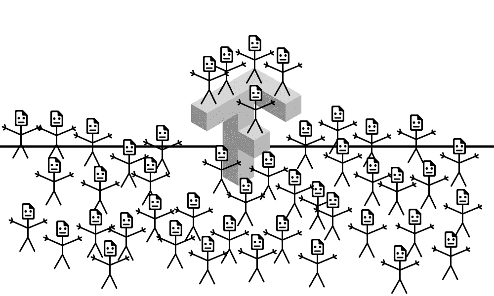
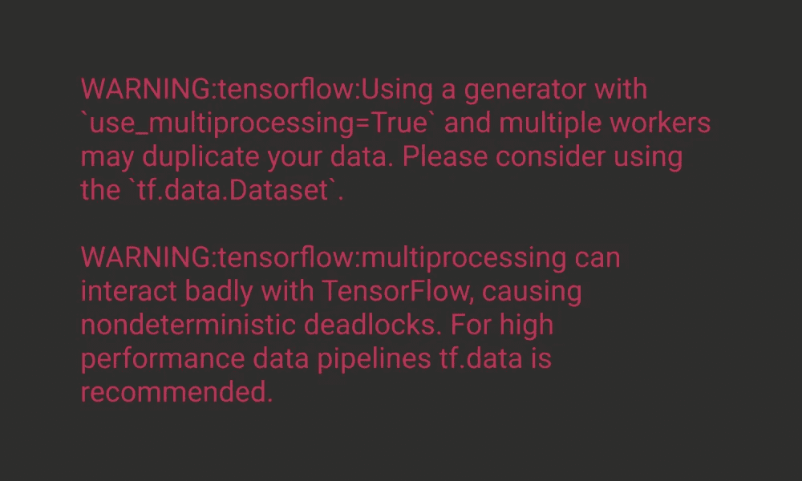

# 数千个 CSV 文件，Keras 和 TensorFlow

> 原文：<https://towardsdatascience.com/thousands-of-csv-files-keras-and-tensorflow-96182f7fabac?source=collection_archive---------20----------------------->

## 操作方法

## 如何应对这个地狱的指南

我有大约 15 000 个 CSV 文件，每个文件有 6 000 行，我需要使用所有这些数据训练一个神经网络:总共大约 90 000 000 个实例。真正的机器学习就是这个样子！

我希望我能节省你的时间，告诉你如何使用`generators`、`tf.data.Dataset`和其他有趣的东西来训练神经网络。

他们喜欢你。图片作者:丹尼斯·希洛夫(就是我)。

# 介绍

没有办法将所有这些数据连接到一个文件或一个数组中，因为它会非常庞大。

因此，处理这个庞大数据阵列的唯一方法是分批处理:

1.  我们得到一份文件清单
2.  我们把它分成训练和测试数据集
3.  然后，我们使用一些东西将数据分批放入 Keras

# 简单的部分

心寒，那真的很容易。重要通知:所有文件都应该在一个目录中，这样代码才能运行。

# 棘手的第一部分

分批处理有几种方法。

例如，方法之一是使用`generator`。它是一个返回迭代器的函数，我们可以遍历它的值:一次一个值。

默认情况下，Keras 允许我们将这个`generator`传递给`.fit`。

所以让我们写迭代器吧！

很简单:你传入了`files`数组和`batch_size`，相应的`input`和`output`现在被返回。

然后，您可以通过以下方式初始化您的生成器:

`batch_size`是一次返回多少行。通常，您可以像初始化单个 CSV 中的行数一样初始化它，但是如果这个数字太大，那么就设置一个不那么大的值(我不知道，例如 5 000)。

你符合一个模型。

`callback_list`是监测训练的某个参数开始下降是否太慢，没有理由继续训练的东西。

`steps_per_epoch`告知何时需要开始新的纪元。如果您不提供它，Keras 将不会知道您的数据长度，并将在日志中打印“未知”。

`use_multiprocessing`表示是否要在多个线程中处理数据。

`workers`是若干个这样的线程。这个数字应该小于 CPU 的核心数。

`x`是你的发电机。因为它既返回输入又返回输出，所以我们不设置`y`。

`verbose`是日志有多详细。

因为你有几个过程预处理数据进行训练，他们把这些数据添加到 Keras 的某个地方，让他们训练神经网络。而`max_queue_size`指定了已存储但尚未处理的数据数量的限制。您应该设置它，因为没有必要预处理超过 Keras 一次可以消耗的数据:您的数据集非常大，内存将会过载。

`epochs`是 Keras 对数据集进行迭代的次数

`validation_data`是你将要用来验证准确性的数据。

`validation_steps`与`steps_per_epoch`意思相同。

# 棘手的第二部分

所以你试着开始训练，你看…你看…

图片作者:丹尼斯·希洛夫(就是我)

现在让我们更深入:我们将使用`tf.data.Dataset`。处理数据集是一件特殊的事情:实际上，这也是不言自明的。

在我们的`generator`中有一个简单的方法可以做到这一点`Dataset`。

我们用`generator`传递这个 lambda，因为它应该是一个可执行的东西，我们需要在`generator`中传递一些参数。

`output_types`是你的`generator`在输入和输出中产生的东西。换成你的。

`output_shapes`是输入和输出的形状。换成你的。

*重要:* `**NOT** [[None, 129], [None, 3]], **NOT** [(None, 129), (None, 3)].
**It is** ([None, 129], [None, 3])`。

我们没有设置，因为我们不想设置第一维。

# 最后一档

将`.fit`中的`x`替换为等于`train_dataset`并将`validation_data`替换为等于`test_dataset`。

现在开始训练，它应该工作得很好。

# 结尾部分

希望我已经帮助了一些人，祝你们的项目好运，伙计们:)

实际上，如果你现在不知道如何使用这篇文章——把它保存在某个地方以备后用，因为有一天你肯定会需要它。

这个巨大的 CSV 编号及其正确处理的问题出现在我的项目 [Facel](http://facel.tech) 的开发过程中。

我们开发了一种设备，用于监控健康参数(机体疲劳、眼睛疲劳、压力、有效性和注意力水平)，并根据耳后 2 个点的信号控制小工具(例如，眨眼 3 次并停止音乐)。

我们以 98%的准确率检测 12 种面部表情(眨眼、动眉毛等)。

目前，我们正在迪拜设计周的主要节目之一 [GlobalGradShow](https://globalgradshow.com/?project=facel) 上展出。全世界毕业生的 100 个最具创新性的项目在那里展示，所以很酷。

我们还赢得了全球创业挑战赛的俄罗斯赛段，并参加了[詹姆斯·戴森奖](https://www.jamesdysonaward.org/)(世界主要工业设计竞赛之一)的世界赛段。

请随时通过 [LinkedIn](https://www.linkedin.com/in/mixeden) 、[电子邮件](mailto:mixeden@facel.tech)或[电报](http://t.me/mixedenn):)联系我