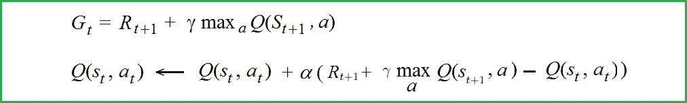
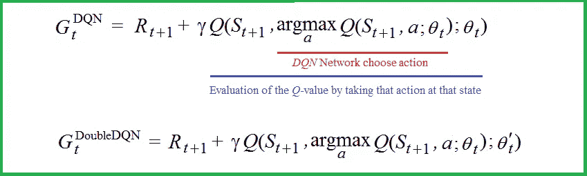
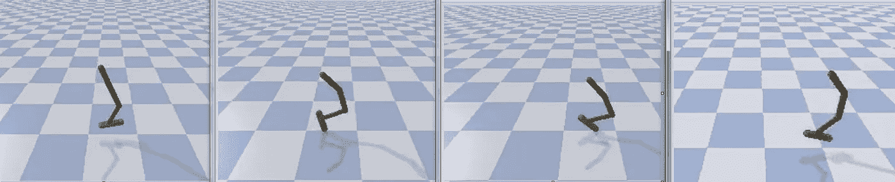
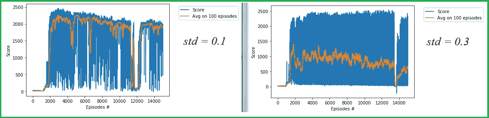
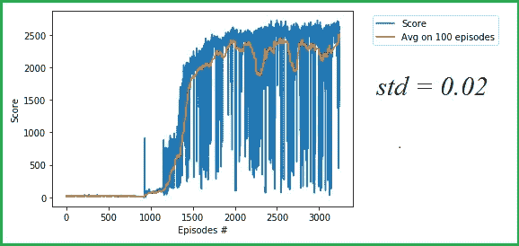
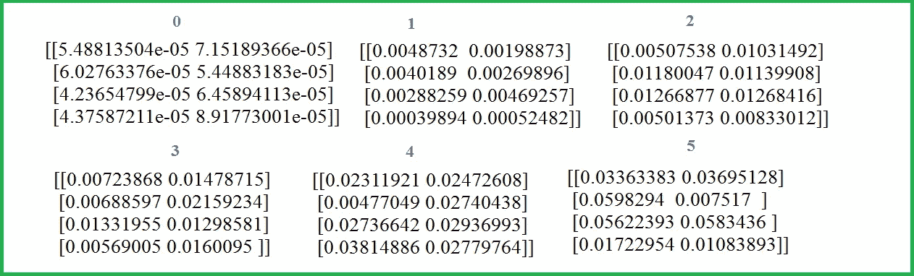
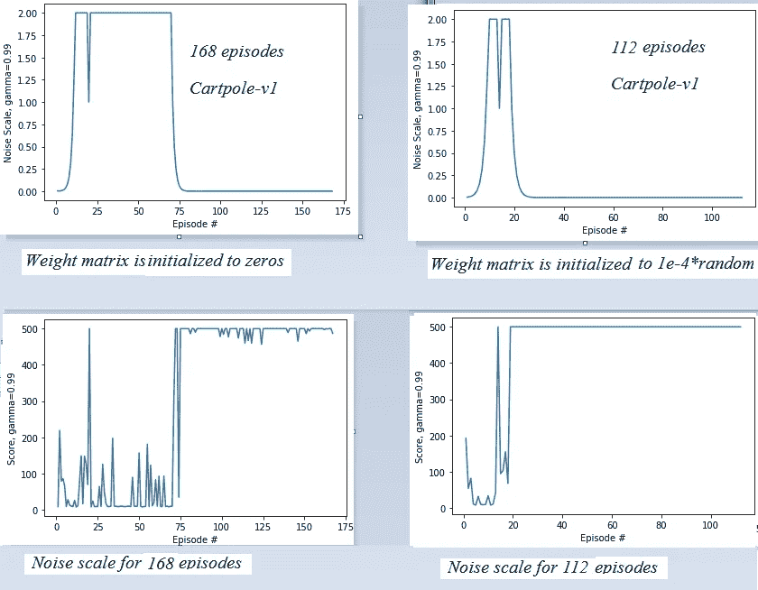

# 深层 RL 的三个方面:噪声、高估和勘探

> 原文：<https://towardsdatascience.com/three-aspects-of-deep-rl-noise-overestimation-and-exploration-122ffb4bb92b?source=collection_archive---------23----------------------->

## 噪音的两面。噪音是有害的，它会导致系统性的高估。然而，噪声可能是有用的，例如用于探索的噪声。


资料来源:123rf.com

在*深度强化学习*模型中，我们触及了噪声的各个方面。第一部分讨论*高估*，即噪声产生的有害属性。第二部分处理用于*探索*的噪声，这是有用的噪声。在附录中，我们将再看一个噪声的例子:*自适应噪声*。

*第一部分*。我们将看到研究人员如何试图克服模型中的高估。第一步是将*动作选择*与*动作评估分离。*在*双 DQN* 中实现。第二步与**行动者-批评家架构相关:**这里我们将*价值神经网络*(批评家)与*策略神经网络(行动者)解耦。* [*DDPG*](https://arxiv.org/abs/1509.02971) 和 [*TD3*](https://arxiv.org/abs/1802.09477) 都采用这种架构。

*第二部分*。探索是学习的一大挑战。**的主要问题是*的探索噪音。*** 我们涉及的车型有 *DQN* 、*双 DQN、*T42、和 *TD3* 。使用一些噪声参数的神经网络模型具有更多的探索能力，并且在*深度 RL* 算法中更加成功。

*附录*。我们考虑简单的无梯度算法*爬山*。该算法将 ***自适应噪声*** 直接添加到输入变量中，即添加到确定神经网络的*权重矩阵*中。

# 第一部分。努力克服高估

*DQN* 和*双 DQN* 算法在离散动作空间的情况下证明是非常成功的。然而，已知这些算法遭受高估。这种有害的属性比低估要糟糕得多，因为低估是不会累积的。让我们看看研究人员是如何试图克服高估的。

**高估在*DQN*。**

问题是在计算目标值`***Gt***` *时使用了最大化运算符。*假设`***Q*(*S*_{*t*+1*}*, *a*)**`的评估值已经被高估。然后从 DQN 关键方程(见下文)中，代理观察到`***Q*(*S*_*t*, *a*)**` 的误差也会累积。



**DQN 关键方程 Q(s_t，a_t)**

在这里，`[***Rt***](/how-the-bellman-equation-works-in-deep-reinforcement-learning-5301fe41b25a)` [是当时的奖励](/how-the-bellman-equation-works-in-deep-reinforcement-learning-5301fe41b25a)`[***t***](/how-the-bellman-equation-works-in-deep-reinforcement-learning-5301fe41b25a)***;***``[**Gt**](/how-the-bellman-equation-works-in-deep-reinforcement-learning-5301fe41b25a)`[*是累计奖励*](/how-the-bellman-equation-works-in-deep-reinforcement-learning-5301fe41b25a)*也称为*TD-target；* [*Q(s，a)* 是形状`**[space x action]**`的*Q*-值表](/how-the-bellman-equation-works-in-deep-reinforcement-learning-5301fe41b25a)。*

*Thrun 和 Schwartz 在“[*Issues in use Function Approximation for Reinforcement Learning*](https://www.ri.cmu.edu/publications/issues-in-using-function-approximation-for-reinforcement-learning/)”(1993)中观察到，使用函数逼近器(即神经网络)而不仅仅是查找表(这是 *Q* -learning 的基本技术)会对输出预测产生一些噪声。他们给出了一个例子，其中高估渐进地导致次优政策。*

***脱钩于*双 DQN*** *。**

*2015 年，哈塞尔特等人。艾尔。在“ [*使用双 Q 学习的深度强化学习*](https://arxiv.org/abs/1509.06461) ”中显示，估计误差会驱使估计值上升并远离真正的最优值。他们假设减少高估的解决方案:*双 DQN* 。*

*在*双 DQN* 中所做的重要事情是将动作选择从动作评估中分离出来。让我们弄清楚这一点。*

**

***DQN 和双 DQN Gt 公式***

*   **DQN*Gt 公式:用于*动作选择*的 *Q-* 值`***Q*(*S*_*t*, *a*)**`(红色)和用于*动作评估*(蓝色)的 *Q-* 值`***Q*(*S_t, a*)**`由**同一个神经网络**和`***θ_t***`确定。*
*   **Gt 双 DQN* 公式:用于*动作选择*的 *Q* 值和用于*动作评估*的 *Q-* 值由两个**不同的神经网络**确定，神经网络的权重向量分别为`***θ_t***` 和`***θ'_t.***` 这些网络称为*当前*和*目标。**

*然而，由于缓慢变化的策略，对*当前*和*目标* [神经网络的值的估计仍然过于相似](https://arxiv.org/abs/1802.09477)，并且这仍然导致一致的高估。*

***优评建筑*DDPG*。***

**DDPG* 是[第一个尝试使用*Q*-连续动作空间 *DQN* 模型学习技术的算法](https://arxiv.org/abs/1509.02971)之一。 *DDPG* 代表 [*深度确定性政策梯度*](https://spinningup.openai.com/en/latest/algorithms/ddpg.html#id1) 。在这种情况下，我们不能在所有操作中使用 *Q* 值的最大化算子，但是，我们可以使用函数逼近器，一个代表 *Q* 值的神经网络。我们假设存在某个函数`***Q*(*s, a*)**`，该函数相对于动作自变量`***a.***`是可微的，然而，对于给定的状态`***S_t***` ，在所有动作`***a***` 上找到`**argmax(*Q*(*S*_*t*, *a*))**`意味着我们必须在每个时间步求解优化任务。这是一项非常昂贵的任务。为了克服这一障碍，来自 DeepMind 的一组研究人员在作品“ [*用深度强化学习进行连续控制*](https://arxiv.org/abs/1509.02971) ”中使用了演员-评论家架构。他们使用了**两个神经网络**:一个和之前一样，在*DQN*:*Q*——网络代表*Q*——值；另一个是**演员函数** **𝜋( *s* )** ，它提供 ***a* *，**值函数`***Q*(*s, a*)**`的最大值如下`**:**`*

**

***演员功能**t57】𝜋(*s*)*

# *第二部分。探索是学习的一大挑战*

***为什么要探索？***

*除了高估之外，*深 RL* 还有一个问题，难度不亚于。这就是探索。我们不能无条件地相信 q 表的最大值或 a* = 𝜋(s).的值为什么不呢？首先，在训练初期，对应的神经网络还是“年少无知”，其最大值与现实相差甚远。其次，也许*而不是最大*值会引导我们在艰苦训练后找到最优策略。*

> *在生活中，我们经常要解决以下问题:走别人走过的路——风险小，回报少；或者冒着巨大的风险走上一条未知的新路——但是，在某种程度上，大获全胜是可能的。也许它会超级棒，你不知道。*

***勘探与开采***

**Exploitation* 是指代理使用积累的知识来选择接下来的动作。在我们的例子中，这意味着对于给定的状态，代理找到最大化*Q*-值的以下动作。*探索*表示随机选择后续动作。*

*没有规则可以决定哪种策略更好:探索还是开发。真正的目标是在这两种策略之间找到真正的平衡。正如我们所见，平衡策略在学习过程中会发生变化。*

***探险于 *DQN* 和*双 DQN* 和***

*在 *DQN* 和*双 DQN* 中保证*充分探索*的一种方法是使用[退火](/a-pair-of-interrelated-neural-networks-in-dqn-f0f58e09b3c4)`[**ε**](/a-pair-of-interrelated-neural-networks-in-dqn-f0f58e09b3c4)`[-贪婪机制](/a-pair-of-interrelated-neural-networks-in-dqn-f0f58e09b3c4)。对于第一集，以小概率选择开发，例如`**0.02**`(即，将非常随机地选择动作)，以概率`**0.98**`选择探索。从一定数量的剧集`**Mε**`开始，以最小概率`**ε_m,**`进行探索，例如`**ε_m*=* 0.01,**`，以概率`**0.99.**` 选择开发，探索的概率公式`**ε**`可以实现如下:*

**

***退火**`**ε**`**——贪婪机制，探索概率公式** `**ε**`*

*其中`***i***` 为集号。设`**Mε = 100, ε_m = 0.01.**` 那么探索的概率`**ε**` 如下:*

**

***概率从 1 逐渐降低到** `**ε_m =**` **0.01***

***探险*DDPG****

*在具有*连续动作空间的 *RL* 模型中，应用*代替`**ε**`-贪婪机制[](https://arxiv.org/abs/1802.05054)***。这种方法用于[](https://arxiv.org/abs/1509.02971)**[*PPO*](https://arxiv.org/abs/1707.06347)*等连续控制算法。*【DDPG】*(Lilli crap et al .，2015) 的作者通过将从噪声进程`***N***` 中采样的噪声添加到演员策略`**𝜋(s)**`中，构造了无向探索策略`**𝜋’**` :*******

********

******政策**`**𝜋(s) with exploration noise**`****

****其中 ***N*** 是[奥恩斯坦-乌伦贝克](https://en.wikipedia.org/wiki/Ornstein%E2%80%93Uhlenbeck_process)给出的噪声，相关噪声过程。在[中 *TD3* 论文](https://arxiv.org/abs/1802.09477)作者([藤本](https://arxiv.org/search/cs?searchtype=author&query=Fujimoto%2C+S) et。艾尔。，2018)提出使用经典的高斯噪声，这是引用:****

> ****…我们使用偏离策略的探索策略，添加高斯噪声 N(0；0:1)到每个动作。与 DDPG 的原始实现不同，我们使用不相关的噪声进行探索，因为我们发现从奥恩斯坦-乌伦贝克(乌伦贝克&奥恩斯坦，1930)过程中提取的噪声没有提供性能优势。****

*****DDPG* 的一个常见故障模式是，学习到的*Q*-函数开始高估*Q*-值，然后策略(actor 函数)导致重大错误。****

******探索中的 *TD3* 中的******

****名称 *TD3* 代表*孪生延迟深度确定性*。 *TD3* 保留了 *DDPG* 中使用的演员-评论家架构，并增加了 3 个新属性，极大地帮助克服高估:****

*   *****TD3* 维持着一对**影评人** *Q* 1 和 *Q* 2(因此得名“双胞胎”)以及一个演员。对于每个时间步长， *TD3* 使用两个 Q 值中较小的一个。****
*   *****TD3* 更新策略(和目标网络)的频率低于 Q 函数更新(每两次 Q 函数(批评者)更新一次策略更新)****
*   *****TD3* 给目标动作添加探测噪音。 *TD3* 使用高斯噪声，而不是像 *DDPG* 中的奥恩斯坦-乌伦贝克噪声。****

****【PyBullet 料斗试验中的探测噪音****

****[*PyBullet*](https://pypi.org/project/pybullet/) 是基于[*Bullet Physics SDK*](https://github.com/bulletphysics/bullet3)*的用于机器人学的 Python 模块和 *Deep RL* 。*让我们看看 HopperBulletEnv，它是 *PyBullet* 与铰接体相关的环境之一:****

******

***[**受过训练的特工**](https://github.com/Rafael1s/Deep-Reinforcement-Learning-Udacity/tree/master/HopperBulletEnv_v0-TD3)***

***如果达到的分数超过 2500，则 HopperBulletEnv 环境被视为已解决。在使用 HopperBulletEnv 环境的 *TD3* 试验中，我得到了`**std = 0.1**`和`**std = 0.3**`的以下结果:***

******

*****HopperBulletEnv 的两次试验，TD3，噪声标准值= 0.1 和 0.3*****

***这里，`**std**`是 *TD3* 中勘探噪声的标准差。在两次试验中，阈值 2500 都没有达到。然而，我注意到以下奇怪之处。***

*   ***在试验`**std = 0.3**`中，在 2500 附近有很多值(然而小于 2500 ),同时平均值一直在下降。对此的解释如下:小值的数量多于大值的数量，并且这些数量之间的差异增大。***
*   ***在`**std = 0.1**`试验中，平均值达到较大值，但总的来说，这些值会降低。同样，这是因为小值的数量比大值的数量多。***
*   ***在我看来，非常小的值的流行与太大的噪声标准偏差有关。然后我决定把`**std**`减少到`**0.02**`，这足以解决环境问题。***

******

***[**HopperBulletEnv 带 TD3，噪声标准值= 0.02**](https://github.com/Rafael1s/Deep-Reinforcement-Learning-Udacity/tree/master/HopperBulletEnv_v0-TD3)***

# ***App。具有自适应噪声的爬山算法***

*****张量的先行者*****

***我们举例说明应用于 [*翻筋斗*环境](/a-pair-of-interrelated-neural-networks-in-dqn-f0f58e09b3c4)的*爬山*算法的特性。这里的神经网络模型非常简单，不使用张量(没有 *PyTorch* ，没有 *Tensorflow* )，神经网络只使用形状最简单的矩阵`**[4 x 2]**`，那就是张量的前身。***

*****爬山算法中的类策略*****

****爬山*算法寻求最大化**目标函数** `**Go**`，在我们的特定情况下，它是*累积折扣奖励*:***

******

******累计折扣奖励******

***其中`***γ***` 为*折扣*、`**0 < *γ <* 1**` *、*、`***Rk***`为该集时间步`***k***` 获得的奖励。Python 中的目标函数`**Go**`如下所示:***

```
***discounts** **= [gamma**i for i in range(len(rewards)+1)]
Go = sum([a*b for a,b in zip(discounts, rewards)])***
```

***一如既往地在*深 RL* 中，我们试图超过某个阈值。对于*横竿-v0* 来说，这个阈值分数是`**195**`，对于*横竿-v1* 来说是`**475**`。*爬山*是一种简单的无梯度算法(即，我们不使用梯度上升/梯度下降方法)。我们试图通过使用特定的**自适应噪声**仅改变目标函数`**Go**`的参数来爬上曲线的顶端。但是，我们的目标函数的自变量是什么呢？***

***`**Go**`的参数是权重矩阵，它决定了我们模型中的神经网络。第 0-5 集的权重矩阵示例如下:***

******

*****第 0-5 集神经网络的权重向量【4x 2】*****

*****自适应噪声标度*****

***我们的模型的自适应噪声缩放实现如下。如果目标函数的当前值比为目标函数获得的最佳值更好，我们用`**2**`除以**噪声标度**，并且该噪声被添加到权重矩阵中。如果目标函数的当前值比获得的最佳值差，我们**将噪声标度**乘以`**2**`，并且该噪声被添加到权重矩阵的获得的最佳值。在这两种情况下，噪声标度被添加了对于矩阵的任何元素都不同的一些随机因子。***

******

*****噪音等级和剧集评分图*****

***对于[*cart pole-v1*](https://github.com/Rafael1s/Deep-Reinforcement-Learning-Udacity/blob/master/CartPole-Policy-Based-Hill-Climbing/CartPole-v1_Hill_Climbing.ipynb)*，*如果权重矩阵初始化为非零小值(见左上矩阵)，则集数= `**112**`。注意，如果权重矩阵被初始化为零，则情节数从`**112**`增加到`**168**`。同样适用于 [*Cartpole-v0*](https://github.com/Rafael1s/Deep-Reinforcement-Learning-Udacity/blob/master/CartPole-Policy-Based-Hill-Climbing/CartPole-v0_Hill_Climbing.ipynb) 。***

***关于*具有自适应噪声缩放的 Cartpole-v0/Cartpole-v1 的更多信息，* [参见 Github 上的项目](https://github.com/Rafael1s/Deep-Reinforcement-Learning-Udacity/tree/master/CartPole-Policy-Based-Hill-Climbing)。***

*****噪声等级的更通用公式*****

***正如我们在上面看到的，噪声比例根据目标函数是低于还是高于获得的最佳值而自适应地增大或减小。这个算法中的噪声尺度是`**2**`。在论文 [*中参数空间噪声的探索*](https://arxiv.org/abs/1706.01905) 作者考虑了更一般的公式:***

******

*****自适应噪声标度*****

***其中`***α***` 是噪声尺度，`***d***` 是扰动和非扰动策略之间的某个距离度量，`***δ***` 是阈值。在附录 C 中，作者考虑了算法 *DQN* 、 *DDPG* 和 *TPRO 的距离函数`***d***` 的可能形式。****

# *****参考文献*****

***[1] S.Thrun 和 A.Schwartz，使用函数逼近进行强化学习的问题，(1993)，卡内基梅隆大学，机器人研究所

[2] H.van Hasselt 等人。艾尔。，采用双 Q 学习的深度强化学习(2015)，arXiv:1509.06461***

***[3] T.P. Lillicrap 等，深度强化学习的连续控制(2015)，arXiv:1509.02971***

***[4]李玉玺，深度强化学习:概述(2018)，arXiv:1701.07274v6***

***[5] S.Fujimoto 等人，在 Actor-Critic 方法中解决函数近似误差(2018)，arXiv: arXiv:1802.09477v3***

***[6]带参数噪声的更好探索，openai.com，[https://open ai . com/blog/Better-Exploration-with-Parameter-Noise/](https://openai.com/blog/better-exploration-with-parameter-noise/)***

***[7] M.Plappert 等著《用于探索的参数空间噪声》，OpenAI，arXiv:1706.01905v2，ICLR 2018

【8】B . Mahyavanshi 著《爬山入门|人工智能》，Medium，2019***

***[9]深度确定性策略梯度，OpenAI，Spinning Up，[https://Spinning Up . open ai . com/en/latest/algorithms/ddpg . html](https://spinningup.openai.com/en/latest/algorithms/ddpg.html)***

***【10】机器学习中的随机是什么意思？(2019)，机器学习掌握，
[https://machinelingmastery . com/random-in-Machine-Learning/](https://machinelearningmastery.com/stochastic-in-machine-learning/)

【11】c . Colas et .艾尔。、GEP-PG:深度强化学习算法中的解耦探索与利用(2018)，arXiv:1802.05054***

***[12][https://en.wikipedia.org/wiki/](https://en.wikipedia.org/wiki/Ornstein%E2%80%93Uhlenbeck_process)奥恩斯坦-乌伦贝克[_ 过程](https://en.wikipedia.org/wiki/Ornstein%E2%80%93Uhlenbeck_process)，奥恩斯坦-乌伦贝克过程***

***[13] E.Lindwurm，直觉:探索与利用(2019 年)，走向数据科学***

***[14] M.Watts，用于新闻推荐的强化学习介绍(DDPG 和 TD3)(2019)，TowardsDataScience***

***[15] T .斯塔福德，学习的基础:探索-开发权衡(2012 年)，[https://tomstafford.staff.shef.ac.uk/?p=48](https://tomstafford.staff.shef.ac.uk/?p=48)***

***[16]子弹实时物理模拟(2020)，[https://pybullet.org/wordpress/](https://pybullet.org/wordpress/)

【17】R . Stekolshchik，一对相互关联的神经网络在 DQN (2020)，走向数据科学***

***[18] R.Stekolshchik，贝尔曼方程在 Deep RL 中是如何工作的？(2020 年)，走向数据科学***