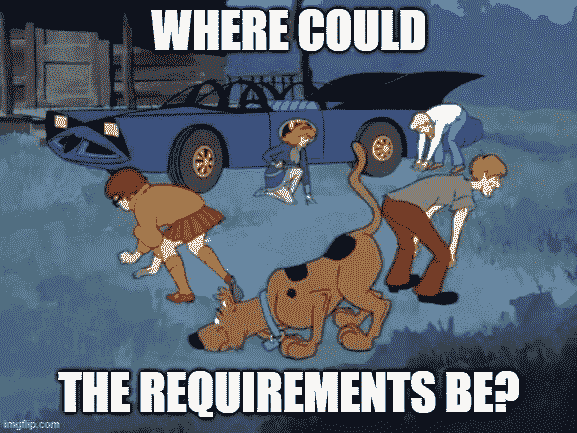
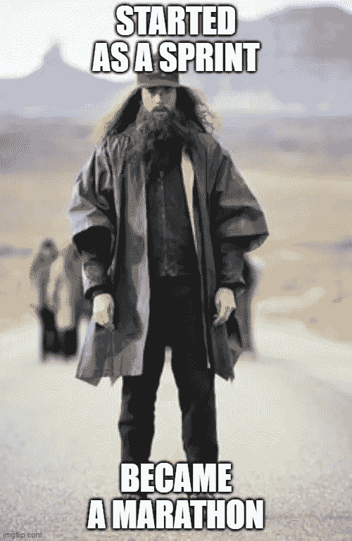

# 人工智能产品生命周期的三大挑战

> 原文：<https://towardsdatascience.com/three-challenges-of-the-ai-product-lifecycle-810fcd4d5085?source=collection_archive---------29----------------------->

从事人工智能产品的工作——无论是零售、物联网还是营销——数据科学家都面临着类似的挑战。这些挑战中有些是许多技术领域的共性，有些是人工智能特有的，因为它的独特方式模糊了最先进的研究和应用开发之间的界限。让我们看看在业务规范、分析的迭代开发和测试领域中这些挑战的三个典型例子。

# 业务需求规范

## *挑战*

我们数据科学从业者最常谈论的话题之一是如何制定业务需求的问题。这可能会带来各种各样的挑战，取决于人们的观点。在一个极端，我们通常喜欢宣称,*是企业的负责人(首席执行官、董事会、营销团队、销售团队、产品经理等)。)不知道自己想要什么*。这是一个令人沮丧的地方。另一方面，我们经常自夸(没有一丝自怜的意思)业务部门委托我们建造类似于时间机器或传送管的东西。你可以想象，这也不是一个令人羡慕的地方。

作者利用[https://imgflip.com/](https://imgflip.com/)创造的模因

## 解决方案

虽然这两个问题表面上看起来明显不同，但其根本原因实际上是相同的。简单来说，每个开发项目都有价值和成本。商务人士通常知道事物的价值。但在 AI 领域，成本要事先想清楚困难得多。这太难了，甚至对我们来说都是一个挑战，只要想想你有多经常在 scrum poker 中为一个故事而努力想出要显示的数字。在开发阶段有太多的未知，尤其是当我们瞄准前沿的时候。尽管如此，我们数据科学家是拥有最多信息的人，因此对开发成本有最广泛的看法，所以我们有义务分享我们所知道的。当然，业务领导可能会反对，所以我们可能会被迫接受一个不太复杂的解决方案。**然而，如果没有企业和研发之间的双向沟通联系，企业要么会停滞不前(见问题 1)，要么会匆忙做出决定，选择将自己的命运押在一些显然有价值的事情上(但可能无法实现，见问题 2)。因此，作为数据科学家，我们不应该只是等待规范的到来。当务之急是我们要忘记瀑布般的需求文档，开始这样的双向对话，这将产生一个既可行又有价值的产品。**

相关的一点是“及时决策”的概念。决策通常是开发过程中代价高昂的步骤；当你决定使用神经网络而不是简单的线性回归时，你就对可能的解决方案做了一个重要的限制。随着时间的推移，限制可能是积极的，也可能是消极的。因此，至关重要的是，在我们有足够的信息来很好地预测其效果之前，推迟实施限制。通常，这只是在变得“太晚”的时刻之前。当然，这导致了开发过程中固有的不确定感，但是知道潜在的原因应该有助于接受它。

# 分析的迭代开发

## 挑战

一旦企业决定进行开发，另一组问题就会出现。这样的迭代开发通常远离研究人员的头脑，导致诸如*我要么实现深度卷积网络来分类图像，要么问题将无法解决*或*我为什么要费心实现一个基线解决方案，它会像什么样执行？在学术实践中，很难反驳这些观点。主要关注的是新奇感，而不是投入的时间。虽然这种动机是每天推动科学超越其界限的力量，但新奇本身是没有价值的。在科学领域不顾一切地寻找 novum 甚至会适得其反(参见[复制危机](https://en.wikipedia.org/wiki/Replication_crisis))。*

## 解决方案

在数据科学中，主要关注的是创造价值。新奇本身并不是一种价值，更重要的是，价值不仅仅是你工作的结果。为了更好地突出这一点，我举个例子。在数据科学中，我们经常会遇到这样的情况，我们知道对于一个挑战会有一些真正好的解决方案…如果我们有更多的标签数据就好了。至少在一个特定的案例中，我的团队就是这种情况。我们告诉销售/营销人员，如果他们给我们更多的数据，我们可以给出他们想要的预测。他们告诉我们，当我们给他们更精确的预测时，他们才能得到更多的数据。恶性循环。对于一个资金不足的项目来说，这很可能是死刑判决，数据科学家因为缺乏数据而抱怨，销售人员因为缺乏结果而抱怨。抱怨仍然消耗资源(成本)，但没有创造价值，因此项目将被取消。在我们的案例中，幸运的是，我们很快就明白了，价值最好理解为我们可以*今天*提供的洞察力，而不是我们可以*假设获得*更多数据的洞察力。因此，我们用一个简单得多的模型解决了部分问题，并给出了更好(但远非最佳)的销售预测。这反过来使他们能够带给我们更多的数据。所以在下一次迭代中，我们能够去寻找更复杂的模型。

时间——无论是运行程序、进行研究还是执行开发项目所花费的时间——在商业数据科学中至关重要。也许你正在做一个资金充足的项目，所以短期内资金不足不会影响你。尽管如此，即使你正在研究一些新的课题，世界上可能有数十家甚至数百家其他公司也在研究同样的课题。你不必总是第一，但跟上速度并在每个关卡都保持领先是至关重要的。这是因为产品开发不是短跑而是马拉松，所以你的开发风格也必须像马拉松运动员一样。马拉松不是在各个方向上的突然大跳跃；它是关于在很长一段时间内保持一个可预测的、稳定的步调。

作者利用[https://imgflip.com/](https://imgflip.com/)创造的模因

# 测试和验证

## 挑战

你有一个清晰的业务需求，你有一个很好的开发流程，什么会出错呢？你试图以一种结构化的方式进行创新。努力实现成本和价值的可预测性很容易抑制采用不太可预测的方法的动机。因此，尽可能多地从客户那里获得反馈至关重要，这样我们才能了解什么对他们最有价值。这样，我们可以将开发引向更昂贵但也更有价值的方向。这种反馈以测试的形式实现。对人工智能产品的测试是必不可少的。开发一个成熟的人工智能产品需要大量的时间和金钱，所以开发一些不直接解决业务需求的东西是一种巨大的浪费。

## 解决方案

数据科学问题通常非常复杂，以至于你必须从解决这些问题的真正挑战中抽离出来。在这里，我使用*抽象*这个词，意思是我们使用过去的数据，这些数据(可能以某种方式)被过滤，(可能以某种方式)被标记；我们用它来代替未来可能出现的未经选择、未经过滤和未标记的数据。虽然这听起来微不足道，但也是你必须时刻牢记的事情。忘记这一点会导致诸如*“但是它在我的测试集上显示出非常好的适合性”的讨论。*我从未听说过一个模型是基于其在抽象(训练-验证-测试集)情况下的性能投入生产的，而没有监控其性能是否也适用于具体情况。

在许多情况下，数据科学家选择习惯性地查看测试集和交叉验证分数上的指标，而忘记了归纳比那些数字重要得多。事实上，您看到的数字(例如 F1 分数)并不是您模型的实际准确性。您看到的 F1 分数只是真实的、全人群 F1 分数的估计值。有趣的是，很难判断取样的 F1 分数与总体 F1 分数有多远。数据科学家必须依靠他们的经验，甚至是直觉。具有讽刺意味的是，在一个我们如此痴迷于数字的领域，仍有如此多的空间留给专家直觉。

然而，不试图量化这种直觉是一种不好的做法。让我解释一下我的意思。当我看到 F1 的分数为 0.98 时，我应该开始担心，因为这个数字对于大多数现实世界的场景来说都太高了。可能是我犯了一个错误，我的测试样本出现在训练集中，或者有一个功能，当它可用时，可以准确地预测输出类。假设我检查了这两个潜在的原因，并注意到是后者，所以我冷静下来并提交代码。

这里怎么了？我有一个很好的直觉，调查了它，并确保模型是正确的。没错……但是除了这件轶事，没有任何关于这次探险的文献记载。这意味着下一次别人训练一个新的迭代模型时，她必须再次经历同样的发现(参见精益文献中的重新学习是浪费的来源)。因此，调查的理想结果是，我将测试集分成两部分:一部分有确定的特性，另一部分有没有该特性的例子。我甚至可能为他们设定不同的 F1 衡量标准。通过这种方式，我可以将我的专家直觉传达给从事该产品的后续数据科学家。

感谢[雅诺斯·迪文伊](https://medium.com/@divenyijanos)和[亚当·塞波](https://scholar.google.com/citations?user=5WMeN5UAAAAJ&hl=en)对这篇文章第一版的有益评论。