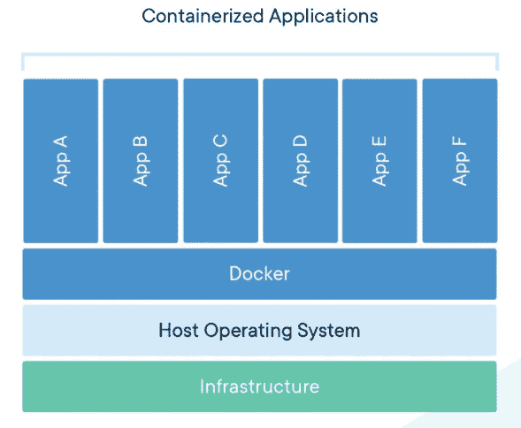
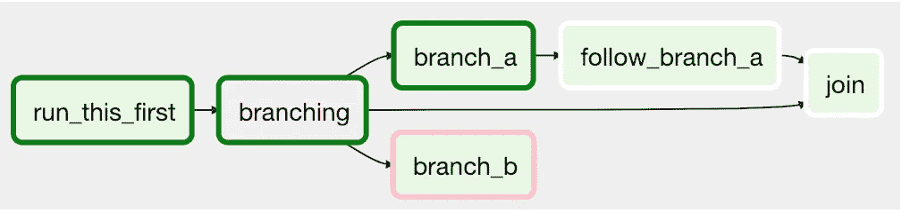
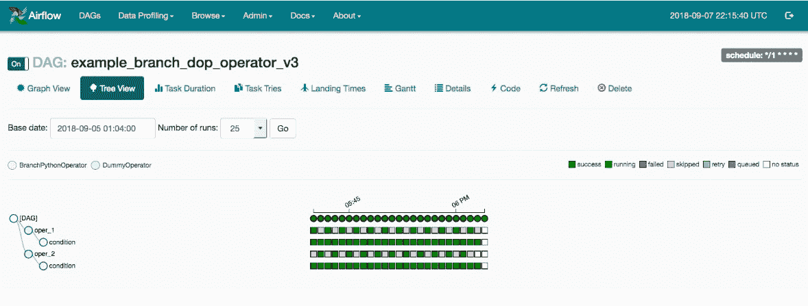
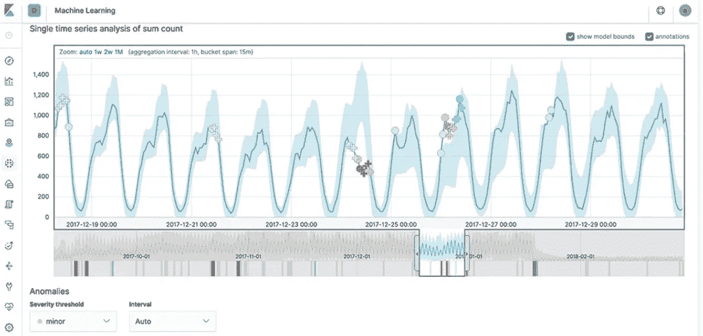

# 自我隔离时要探索的三项数据科学技术:什么是 Docker、Airflow 和 Elasticsearch？

> 原文：<https://towardsdatascience.com/three-data-science-technologies-to-explore-while-you-self-isolate-what-is-docker-airflow-and-78969ba4f5fe?source=collection_archive---------9----------------------->

## 扩展您的数据科学技术堆栈


在 [Unsplash](https://unsplash.com?utm_source=medium&utm_medium=referral) 上由[米米·蒂安](https://unsplash.com/@mimithian?utm_source=medium&utm_medium=referral)拍摄的照片

# 强制入住两周！

像许多其他州(甚至国家)一样，明尼苏达州被命令呆在家里，以帮助拉平新冠肺炎感染率曲线。除了让我的狗散散步，为了打发接下来几周待在家里的时间，我还准备了一些流媒体服务、乐高、拼图、视频游戏和一大堆要学习的新技术。在我要学习的技术列表中，排在首位的是一些我没有在项目中使用过，但我在工作中会用到的技术:

**Docker**
**气流
弹力搜索**

这些技术生态系统都有一个坚实的社区，如果你对数据科学和机器学习感兴趣，每个都值得研究。我将简要概述每项技术，以帮助您决定首先研究哪项技术！

# Docker 是什么？

多年来，我一直在文章和视频中看到 Docker 这个名字，但我没有花时间去研究它，因为它看起来很复杂。由于这项技术在办公室里广泛使用，我最终不得不使用它，陷入了一个兔子洞，然后我决定是时候尽可能多地学习 Docker 了！我发现 Docker 被吹捧为一种技术，它不仅简化，而且通过容器化的概念和实践加速了从开发到部署的一切。


[https://docs.docker.com/](https://docs.docker.com/)

Docker 于 2013 年作为开源软件发布，已经成为一个非常受欢迎的工具，因为[有人估计大约 50%](https://logdna.com/the-impact-of-containerization-on-devops/) 的全球组织都在使用容器化的应用程序。这告诉我，这是一项很受欢迎的技能，也是我心理“工具箱”的一大补充让它如此被接受和强大的是，Docker 可以将一个应用程序及其依赖项打包到一个容器中，该容器可以在 Docker Hub 上共享，并在任何 Linux 服务器上运行。它极大地简化了部署！ [Docker Hub](https://hub.docker.com/) 与 GitHub 的相似之处在于它是一个存储库，但 Docker Hub 不是代码文件的 repos，而是 Docker 文件和容器的 repo。

容器是 Docker 的关键组件之一，也是我进入该技术领域后首先了解到的事情之一:

> 容器是一个标准的软件单元，它封装了代码及其所有依赖关系，因此应用程序可以快速可靠地从一个计算环境运行到另一个计算环境。

Docker 容器不像虚拟机(VM)那样消耗虚拟化硬件所需的资源，使它们更加轻量级和灵活。容器设计为使用主机操作系统的内核，每个容器都有一个独立的用户空间，因此多个容器可以在一台主机上运行，如下图所示:



[集装箱化应用(码头文件)](https://www.docker.com/resources/what-container)

除此之外，Docker 还在继续发展，并且有一个强大的社区支持它。尽管我只使用了几天，但我喜欢它的简单。虽然在 Windows 上使用 Docker 越来越容易，但 Docker 是为 Linux 设计的，所以我一直在 Ubuntu 和 CentOS 上使用它。如果你想尝试 Docker，很容易在网上找到便宜的 Linux 虚拟机。点击安装说明和文档的链接，了解更多信息:

[](https://docs.docker.com/install/) [## Docker 引擎概述

### Docker Engine 是一种开源容器化技术，用于构建和容器化您的应用程序。码头工人…

docs.docker.com](https://docs.docker.com/install/) 

# 什么是气流？

创建于 [Airbnb 的](https://en.wikipedia.org/wiki/Apache_Airflow)， [Airflow](https://airflow.apache.org/) 作为一个开源数据工作流管理平台，让人们使用 Python 通过[有向无环图(Dag)](https://en.wikipedia.org/wiki/Directed_acyclic_graph)编程定义和调度管道和工作流。它帮助定义和创新了代码工作流行业。


[https://airflow.apache.org/](https://airflow.apache.org/)

> [DAG 是您想要运行的所有任务的集合，以反映它们的关系和依赖性的方式进行组织](https://airflow.apache.org/docs/stable/concepts.html#dags)。

请注意下面工作流中任务的方向相关性:



[DAG 示例](https://airflow.apache.org/docs/stable/concepts.html#dags)

可以通过用户界面(UI)监控工作流。很容易调出日志并查看 DAG 失败的地方，这使得 UI 非常有用。让 Airflow 如此吸引人并被数据科学社区接受的原因是，可以使用一个 Python 脚本来定义任务和依赖关系，并且 Airflow 管理 Dag 的实际调度和执行。可以使用触发器运行 Dag，也可以按定义的计划运行 Dag。因为它是 Python，所以它很适合使用其他库和 Python 特性。



[UI 树形视图示例](https://airflow.apache.org/docs/stable/ui.html)

要启动并运行 Apache Airflow，文档建议使用 Pip 来安装它。如果你在 Linux 机器上，确保有 ***python3-dev*** 包来正确安装气流。例如，Ubuntu 应该是这样的:

```
sudo apt-get install -y python3-dev
```

Airflow 有一个坚实的开发社区，是数据科学和数据工程领域的一个工具。这绝对值得研究，尤其是如果您熟悉 Python 并执行大量数据工程或 ETL 的话。在教程和文档中查找有关如何设置 Dag 的更多信息:

 [## 教程-气流文档

### 本教程将带您了解一些基本的气流概念、对象及其用法，同时编写您的…

airflow.apache.org](https://airflow.apache.org/docs/stable/tutorial.html) 

# 什么是 Elasticsearch？

其核心是一个使用 Java 和 Apache Lucene 库开发的全文搜索引擎。它以 JSON 格式存储非结构化数据，如 NoSQL，是一个高度可扩展的解决方案，允许您高效地存储、搜索和分析大数据。根据 [DB-Engines 排名](https://db-engines.com/en/ranking)，Elasticsearch 是最受欢迎的搜索引擎技术之一，这表明它是一项需要了解的宝贵技能！


[https://www.elastic.co/](https://www.elastic.co/)

如果你正在寻找一个可以消磨时间的技术平台，弹性生态系统不仅仅是搜索！弹性堆栈由一个名为 **Kibana** 的数据分析平台、一个名为 **Logstash** 的数据收集器和日志引擎以及一个名为 **Beats** 的数据发送器集合组成。[这四个通常被称为弹性堆栈](https://www.elastic.co/elastic-stack)，拥有大量的[功能和工具，包括用于无监督学习的内置机器学习算法！](https://www.elastic.co/elastic-stack/features)



[基巴纳的异常检测](https://www.elastic.co/kibana)

进入弹性堆栈的另一个原因是因为它可以很容易地与 Python 接口。由于 Elasticsearch 提供了 REST API，因此可以使用 Python [**请求**库](https://requests.readthedocs.io/en/master/)与 Elasticsearch 集群进行交互。否则，可以使用 pip 安装一个 [API 包装器:](https://github.com/elastic/elasticsearch-py)

```
pip install elasticsearch
```

由于 Elasticsearch 是开源的，所以可以很容易地下载和安装。它可以在 Windows、Mac 和 Linux 上使用。在官方文档中找到安装说明和教程。

[](https://www.elastic.co/start) [## 开始使用 Elasticsearch、Kibana 和 Elastic Stack | Elastic

### 不熟悉 Elasticsearch？只需下载几个步骤，您就可以使用 Elasticsearch 进行搜索和分析，使用……

www.elastic.co](https://www.elastic.co/start) 

# 选择一种技术并开始学习！

所讨论的每一项技术都有助于学习，并且都需要很长时间才能掌握。它们都是具有响应性社区的流行生态系统，并且是满足数据科学技术堆栈中特定需求的工具。Docker 是一个很好的学习工具，尤其是对开发运营感兴趣的人。如果专注于 ETL 工作流或数据工程管道，Airflow 是一个很好的学习工具。 **Elastic Stack** 是一个功能强大的平台，可以使用记录和分析大数据的工具来搜索非结构化数据。每种技术都很容易设置，特别是对 Python 和 Linux 有一点经验的人。

如果由于冠状病毒，这三种技术还不足以满足你在室内花费时间学习的渴望，请查看我的其他教程，学习 SQL、Dash 和 Git 等技能！

[](https://medium.com/@erickleppen01/learn-sql-techniques-selecting-data-and-more-in-sql-server-624f81dd16b2) [## 学习 SQL 技术:在 SQL Server 中选择数据和更多内容

### SQL 语句介绍和查找重复数据的查询。学习 SQL

medium.com](https://medium.com/@erickleppen01/learn-sql-techniques-selecting-data-and-more-in-sql-server-624f81dd16b2) [](https://medium.com/swlh/dashboards-in-python-for-beginners-and-everyone-else-using-dash-f0a045a86644) [## Python 中的仪表盘，适用于初学者和使用 Dash 的其他人

### 使用 Python 中的 Dash 初学者教程构建一个基本的和高级的仪表板

medium.com](https://medium.com/swlh/dashboards-in-python-for-beginners-and-everyone-else-using-dash-f0a045a86644) [](/a-simple-git-workflow-for-github-beginners-and-everyone-else-87e39b50ee08) [## 适用于 Github 初学者和其他人的简单 Git 工作流程

### 当我在我参加的数据分析编码营开始我的第一个小组项目时，我们必须挑选一个“Git 大师”

towardsdatascience.com](/a-simple-git-workflow-for-github-beginners-and-everyone-else-87e39b50ee08) 

# 谢谢大家！

*   *如果你喜欢这个，* [*在 Medium 上关注我*](https://medium.com/@erickleppen) *了解更多*
*   [*通过订阅*](https://erickleppen.medium.com/membership) 获得完全访问权限并帮助支持我的内容
*   *我们连线上* [*LinkedIn*](https://www.linkedin.com/in/erickleppen01/)
*   *用 Python 分析数据？查看我的* [*网站*](https://pythondashboards.com/)

[**—埃里克·克莱本**](http://pythondashboards.com/)