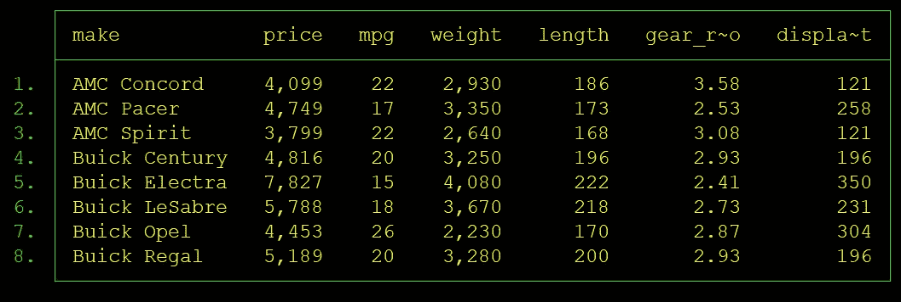
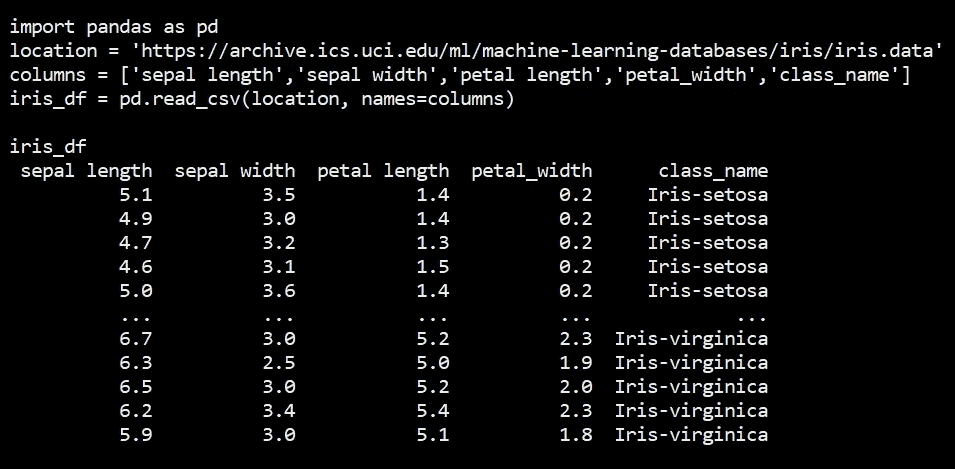
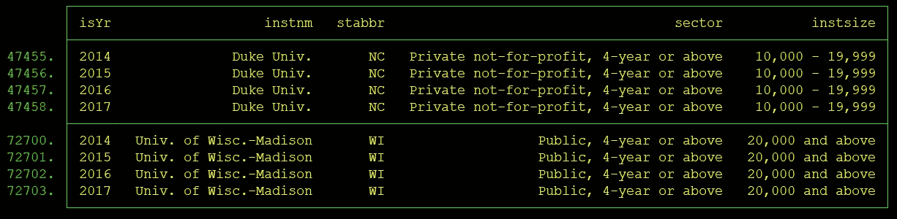

# 我经常使用的三个数据集作为例子

> 原文：<https://towardsdatascience.com/three-datasets-i-often-use-as-examples-c70ec5b2f793?source=collection_archive---------34----------------------->

## 这篇文章强调了三个数据集，我把它们作为自己或他人的例子。

TLDR:在科技领域内外，游戏空间有时被亲切地称为沙箱。本文概述了三个数据集，它们经常作为沙盒示例，供我和工作中的其他人以及在其他环境中使用。

# 介绍

在建立数据驱动的文化时，能够促进共享数据驱动词汇的使用以及数据驱动对话的发展的一个成功策略是创造游戏空间。参与数据驱动的对话的重要性在于，它们建立了对数据相关思想和主题的共同理解。除了共同的思想、语言、习俗、惯例等等，文化是什么？


一个大沙箱的图像。信用:pixabay.com。

本文首先解释什么是数据集。然后，本文提供了三个数据集的摘录和描述，这三个数据集是我经常使用或提供给他人作为共享沙盒游戏空间的。

# 数据集

维基百科将数据集定义为“数据的集合”。对于构建共享的数据驱动词汇表、参与数据驱动的对话以及建立或发展数据驱动的文化来说，这个定义过于简单。[前一篇文章](/what-is-a-data-set-9c6e38d33198)给出了一个更好的定义:数据集是以表格格式存储的观察值的集合，其中每行是一个观察值，每列包含一个与观察值的特征相关的数据点。

## 汽车

这个数据集来自 [Stata 公司](https://www.stata.com/)，它是一种流行的统计编程语言 [Stata](https://www.stata.com/why-use-stata/) 的开发者。在一篇配套文章中，[我使用这个汽车数据集来说明为什么研究人员和数据科学家有时将列称为维度或变量](/a-closer-look-at-dataset-columns-d6551b9d39e2.)。

在图 1a 中，每个车型对应一行。然后，对于每种车型，都有一个特定的可观察特征列，如每加仑英里数(mpg)、重量(weight)、长度(length)等。



图 1a:使用 Stata 命令行界面生成的 Stata Corp .输出的自动数据。

为了建立这个数据集，一名或多名科学家参考了最左边一栏中列出的每个品牌和型号的信息目录。然后对于每一列，科学家观察那辆车的特征。这些特征观察的结果随后被记录在数据集的列中。

要在 Python 中自己探索 Stata 的自动数据集，请使用此处显示的代码。从 Pandas 可以将自动数据集导出到 CSV，如图所示。

```
import pandas as pd
df = pd.read_stata('http://www.stata-press.com/data/r15/auto2.dta')df.to_csv('Stata_Auto_dataset.csv')
```

## 花

iris 数据集是规范的，[被广泛引用](https://archive.ics.uci.edu/ml/datasets/iris)。许多人在展示广泛的分析技术时，使用这种虹膜数据作为例子。图 2 显示了这个数据集的专家。图 2 中还显示了将加载并显示该数据摘录的代码。



图 2:加载并显示标准 Iris 数据集的摘录。Python 命令行界面产生的输出。

在这个数据集中，每朵花都有一个观察值。每个观察有一行(每个花一行)。为了建立这个数据集，科学家们收集了花朵，然后观察了各种特征，如萼片长度和宽度以及花瓣长度和宽度。与所有为研究或分析而正确配置的数据集一样，每个感兴趣的可观察特征有一列，每个观察值有一行。

## 高等教育机构

图 3a 显示了来自综合中学后教育数据系统(IPEDS)的数据摘录。这个数据可以从[国家教育统计中心](https://nces.ed.gov/ipeds/use-the-data)公开获得。我维护着一个讨论这些数据的 GitHub.com[知识库](https://github.com/adamrossnelson/StataIPEDSAll/blob/master/README.md)。



图 3a:摘自国家教育统计中心(NCES)综合中学后教育数据系统(IPEDS)的数据。比较了杜克大学和威斯康星大学麦迪逊分校。使用 Stata 命令行界面生成的输出。

在这个数据中，有一个针对每个机构和每年的观察值。加上年份一栏，这个数据集也可以称为面板或纵向数据集。Auto 和 Iris 数据集将被称为横截面数据集。一般来说，横截面数据代表一个单一的时刻。面板数据集代表同一受试者随时间的多次重复观察。

鉴于此数据包括每行、每个机构(每年)的一个观察值，因此它已针对分析进行了优化，其中分析单位将是一段时间内的高等教育机构。具体的可观察特征有几列。在这种情况下，机构类型(部门)、机构规模(instsize)和机构状态(stabbr)等。

我喜欢将这个数据集用于演示目的，因为它是许多人可以关联的数据。例如，我两次是威斯康星大学的校友，两次是杜克大学的员工。因此，我非常了解这两个机构，当我构建原型、完成、投入生产或者传播任何给定的分析时，可以将它们用作测试用例。我在下面的图 3b 中展示了威斯康辛大学和杜克大学的比较。


图 3b。两个机构对比的例子。这张图显示，每个校区的男生比例似乎向相反的方向漂移。y 轴的刻度显示，每个校区男生比例的总体变化是+/-3%。

我维护着一个工具，[从美国教育部的网站 IPEDS 上获取数据，然后以一种为研究和分析目的而优化的方式组合这些数据](https://github.com/adamrossnelson/StataIPEDSAll/blob/master/README.md)。

[](https://adamrossnelson.medium.com/membership) [## 加入我的介绍链接媒体-亚当罗斯纳尔逊

### 作为一个媒体会员，你的会员费的一部分会给你阅读的作家，你可以完全接触到每一个故事…

adamrossnelson.medium.com](https://adamrossnelson.medium.com/membership) 

# 结论

本文试图以简单的方式解释什么是数据集。有了这个简单的定义，可以推广到许多研究和分析任务，个人和组织可以更好地参与高质量的数据驱动的讨论。

> 在建立、构建和维护数据驱动文化的过程中，作为一个群体，努力定义关键术语和短语(如“数据集”)的含义是一项重要任务。

在讨论了什么是数据集之后，本文给出了三个数据集的例子，我和其他人经常把它们称为模型数据集。拥有一个或多个模型数据集对个人和团队都很有用，因为它们提供了一个共享的沙箱，可以在其中测试关于数据的想法和观点。这些共享的沙箱促进高质量的数据驱动的讨论，然后支持建立、构建和维护数据驱动的文化。

# 感谢阅读

如果你喜欢我要说的，可以在 adamrossnelson.medium.com 的[找到更多。](https://twitter.com/adamrossnelson)

感谢阅读。把你的想法和主意发给我。你可以写信只是为了说声嗨。如果你真的需要告诉我是怎么错的，我期待着尽快和你聊天。推特:[@ adamrossnelson](https://twitter.com/adamrossnelson)| LinkedIn:[亚当·罗斯·纳尔逊](http://www.linkedin.com/in/arnelson) |脸书:[亚当·罗斯·纳尔逊](http://www.facebook.com/adamrossnelson)。