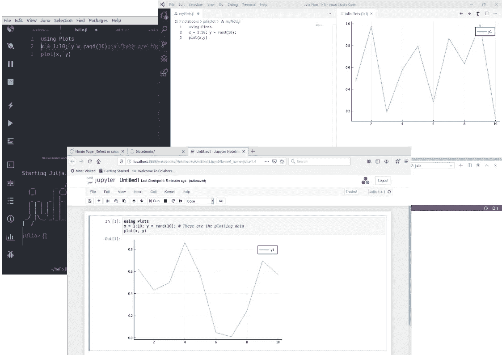
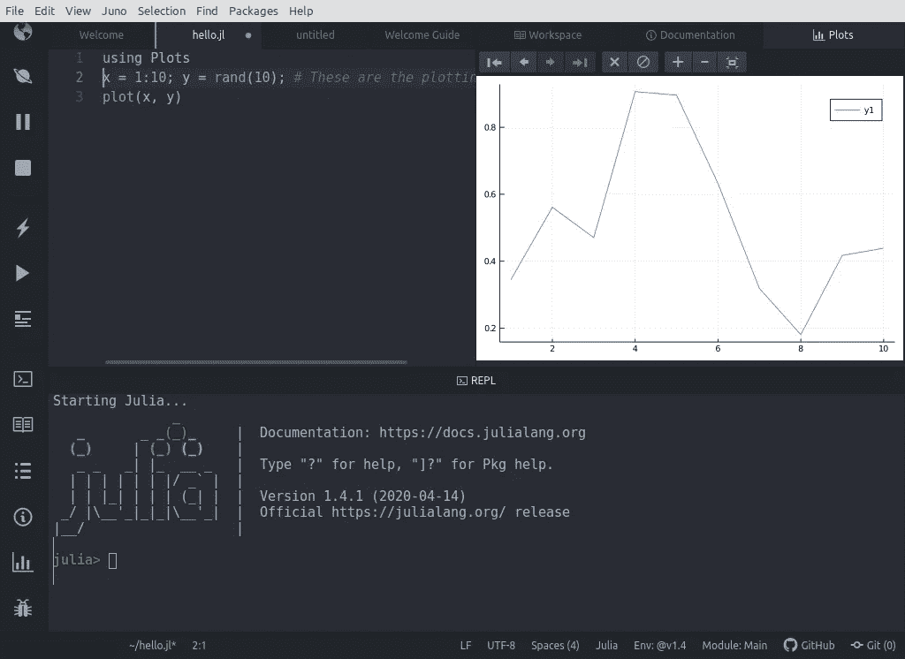
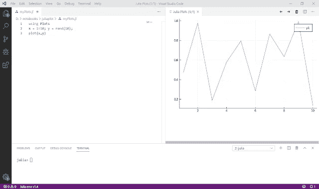
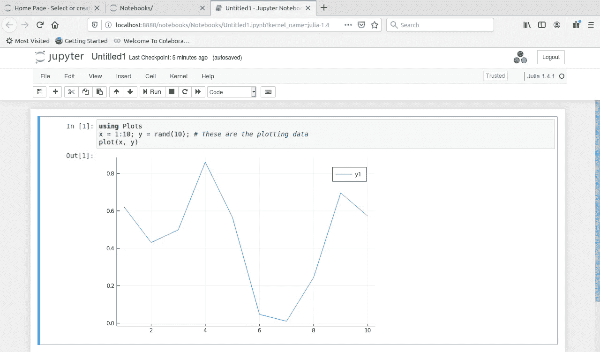

# 3 款出色的 Julia 编辑器— VSCode、Juno 和 Jupyter 笔记本

> 原文：<https://towardsdatascience.com/three-julia-editors-8cb085f9c065?source=collection_archive---------29----------------------->

## Visual Studio Code，Juno 和 Jupyter 笔记本都是开发 Julia 代码的绝佳环境。



三个 ide 的截图。除特别注明外，所有图片均由作者提供。

Julia 是一门年轻的语言，所以对它的支持不像对其他更成熟的语言如 Java 或 Python 那样全面。然而，虽然可能没有大量的开发环境可供使用，但是您可以选择一些好的环境。

我将向你们介绍我的最爱。这不会是一个全面的指南，只是一个简要的概述，但我希望是有用的。

编辑器或 IDE 的选择在某种程度上是主观的，所以我在这里选择讨论的三个环境必然反映了我自己的偏见。

它们都是开源的，因此是免费的，它们是:微软的 Visual Studio 代码，Juno，它是由 Julia 语言的人自己开发的，基于 Atom 编辑器，最后是 Jupyter 笔记本。


VSCode 徽标，鸣谢:微软

所有这些环境都支持多种语言，并且每个环境都需要自己的插件或扩展来定制它以支持 Julia。

Juno 和 VSCode 是相当传统的 ide，这种东西可以用于许多类型的软件或 web 开发。Jupyter Notebooks 不是一个传统的 IDE，它更多地与数据科学和 Python 语言联系在一起，但它也非常适合 Julia(以及其他语言)。也就是说，你可能不想用 Jupyter 开发大型的 Julia 程序；它更适合数据科学家或数据记者可能想要使用的相对较短的例程。

我将在最后介绍 Jupyter，在这两种传统的 ide 中，我将从可能与 Julia 语言联系最紧密的 ide 开始。

## 朱诺

*(更新:似乎不再开发 Juno，开发工作已经转移到 VSCode 的 Julia 扩展上)*

如果你去茱莉亚语言主页(【julialang.org】T2，你会被邀请做的一件事就是下载*茱莉亚普罗*软件包。这是捆绑了 Julia 语言的 Juno IDE。你需要注册才能下载 JuliaPro，但它是免费的。

或者，如果您已经有了 Julia，您可以非常简单地下载和配置 Juno。这是我选择的路线，它由几个简单的步骤组成。首先，下载 Atom 编辑器，然后从编辑器中下载并安装'*Uber-juno*' Juno 扩展，完成后告诉 Juno 扩展 Julia 二进制文件在哪里。


Atom 徽标，鸣谢:Atom

点击 Julialang 网站上的 Juno 链接可以获得完整的说明，这非常简单，尽管在我的 Linux 机器上，安装扩展需要一些时间。如果你有一台相当新的电脑，有相当大的内存，你可能不用等太久。

当您启动 Juno 时，您会看到看起来像普通的 Atom 编辑器，但在窗口左侧添加了 Juno 菜单和 Juno 控件。

要运行一个文件，只需从*文件*菜单中打开它，然后点击*运行*图标(就像一个*播放*按钮)，就会发生两件事。首先启动一个 Julia 控制台或 REPL(您也可以手动启动)，然后程序将运行，任何输出都发送到控制台。

一个警告:我第一次运行一个程序时，花了很长时间来启动 Julia，所以你可能需要耐心。随后的运行要快得多。

下面，您可以看到 Juno 运行简单绘图程序的屏幕截图。控制台没有输出，但是您可以看到该图是在它自己的窗口中绘制的。



正如您对相当复杂的 IDE 所期望的那样，Juno 具有代码完成功能、调试器，并且您可以在 REPL 中编写交互式命令。

# 虚拟代码



和 Juno 一样，第一次运行也花了一些时间。后续运行更快，这可能是我的想象，但感觉 VSCode 可能比 Juno 稍快。

# Jupyter 笔记本

Jupyter 不是一个传统的 IDE。它由可以是代码或文本的单元组成，可以单独执行。在下面的屏幕截图中，您可以在单个代码单元中看到相同的绘图程序，输出——图表——就在它的下方。

通常，在第一个单元格下面会打开另一个单元格，并执行下一位代码。这些代码单元之间可以散布文本单元(文本在 Markdown 中),因此允许创建由富文本和程序代码组成的完整的可执行文档。

你不会使用 Jupyter 来开发常规程序，但是对于想要操作和分析数据的数据科学家或数据记者来说，它是一个很好的工具。



要使用 Jupyter 作为 Julia 的工具，您需要下载并安装两者(您还需要 Python 来运行 Jupyter)。同时安装 Jupyter 和 Python 最简单的方法是使用 Anaconda——我已经写了一篇关于这方面的文章，所以与其重复我自己，不如看看这个:[用 Anaconda 设置 Jupyter 笔记本进行数据可视化](https://projectcodeed.blogspot.com/2019/08/setting-up-jupyter-notebooks-for-data.html)。

默认情况下，Jupyter 使用 Python 语言。为了让 Jupyter 了解 Julia，启动 Julia，您将会在这样的窗口中看到命令提示符(它与您在编辑器中看到的 REPL 相同):


然后在提示符下键入以下内容，并按下<return>:</return>

```
using Pkg
```

这告诉 Julia 您将使用包管理器。然后键入以下内容并点击<return>:</return>

```
Pkg.add("IJulia")
```

IJulia 是一个为 Jupyter 和 Julia 牵线搭桥的包裹。您可能需要等待它下载和安装。

一旦你安装了 IJulia，你可以关闭 Julia 窗口。当您启动 Jupyter 时，您将能够打开一个新的 Julia 笔记本，而不是 Python(尽管 Python 仍将是一个选项)。

# 汇编

Julia 相对于 Python 的一个优势就是速度快。如果您有大量的处理工作要做，这是非常好的。然而，速度来自于将 Julia 代码编译成低级代码，这本身就需要时间。

这种编译发生在你第一次运行一个程序的时候，所以第一次运行比随后的运行要长得多:如果你第二次运行同一个程序，你会发现它快得多。

# 哪一个？

我使用 Jupyter 来开发 Python 和 Julia 代码，特别是针对这样的文章。我喜欢使用原型法的方式，一次写一小段代码，尝试一下，然后继续下一部分。

在这两个 ide 中，你都可以运行代码块，并且以类似的方式工作，但是，当然，你不能包含文本单元格。

因此，如果我在写一篇文章或一份报告，需要我用描述性的文字构建小代码，那么我肯定会使用 Jupyter。另一方面，如果我正在编写一个独立的程序，我会使用普通的 IDE，Juno 或 VSCode。

老实说，我不能决定哪一个是最好的，这就是为什么我用所有三个！

为什么不把它们都试一试，看看哪种最适合你。

您可能还会对以下内容感兴趣:

[](/data-visualization-with-julia-and-vscode-168a69f7ddf8) [## 用 Julia 和 VSCode 实现数据可视化

### 使用 Julia 和免费的 VSCode IDE，您可以用很少的编程知识制作令人印象深刻的数据可视化。

towardsdatascience.com](/data-visualization-with-julia-and-vscode-168a69f7ddf8) [](/starting-data-visualization-with-the-julia-langauge-and-jupyter-notebooks-289bc9f0cd09) [## 使用 Julia 语言和 Jupyter 笔记本开始数据可视化

### 使用 Julia 和 Jupyter，您几乎不需要任何编程知识就可以制作出令人印象深刻的数据可视化。

towardsdatascience.com](/starting-data-visualization-with-the-julia-langauge-and-jupyter-notebooks-289bc9f0cd09) 

*原载于 2020 年 6 月 6 日 https://projectcodeed.blogspot.com**[*。*](https://projectcodeed.blogspot.com/2020/06/three-julia-editors.html)*