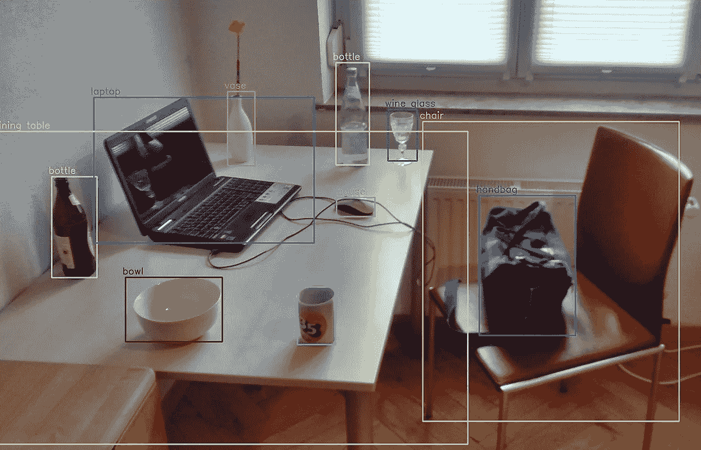
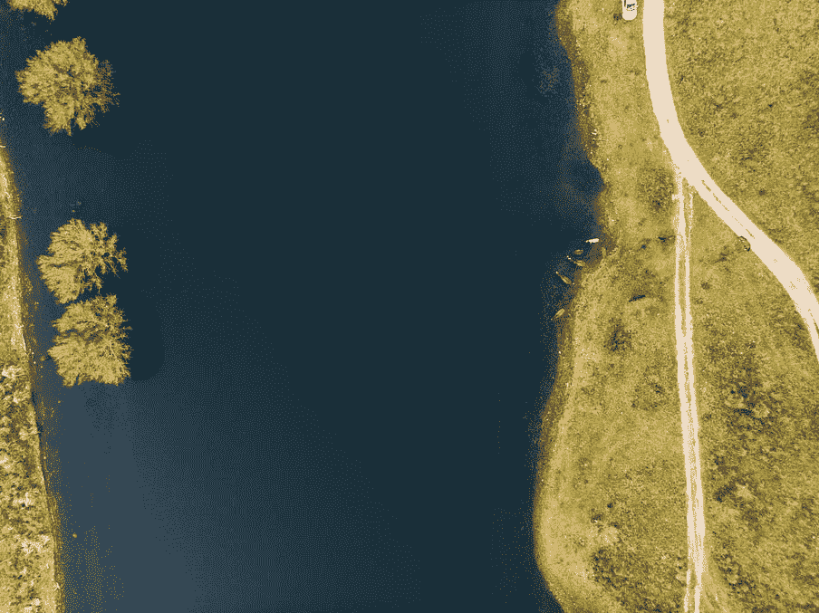
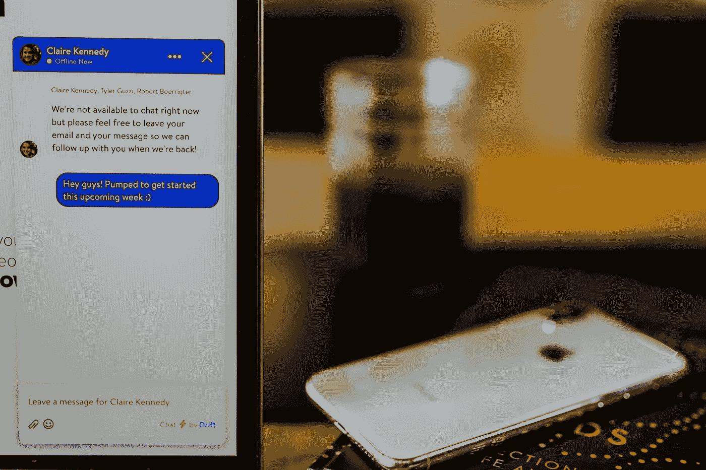

# 人工智能的三大领域及其工业应用

> 原文：<https://towardsdatascience.com/three-major-fields-of-artificial-intelligence-and-their-industrial-applications-8f67bf0c2b46?source=collection_archive---------4----------------------->

## [探索大数据和人工智能](https://towardsdatascience.com/tagged/exploring-big-data-and-ai)

人工智能是一门研究和发展模拟人类智能延伸和扩展的理论、方法、技术和应用系统的新技术学科。人工智能研究的目标是让机器执行一些需要智能人类才能完成的复杂任务。也就是说，我们希望机器可以代替我们解决一些复杂的任务，不仅仅是重复的机械活动，而是一些需要人类智慧参与的活动。在这篇文章中，我将解释人工智能技术的三个主要方向，即语音识别、计算机视觉和自然语言处理。

照片由[德鲁·格拉汉姆](https://unsplash.com/@dizzyd718?utm_source=medium&utm_medium=referral)在 [Unsplash](https://unsplash.com?utm_source=medium&utm_medium=referral) 上拍摄

# 语音识别

语音识别让电脑会听，包括我们日常生活中能接触到的 iPhone 上的 Siri 在谷歌语音输入中，你可以说一句话，这句话就会变成文本；对着谷歌地图说我要去哪里，它就能自动为你生成导航。这些是语音识别的一些应用。语音识别可以分为三个方面:

*   **语音合成**，包括在线和离线语音合成；
*   **语音识别**，包括语音听写等方面；
*   **语义理解**就是用神经网络提取语音的意思，包括语音评价和我们常用的一些机器翻译的一些特征。

# 计算机视觉

计算机视觉让计算机看得见。我们希望计算机能取代人眼的一些功能。比如有一种非常有用的文档分析技术，叫做 OCR。我们可以让计算机扫描文件并阅读它。例如，我们可以获得一张发票，以便计算机可以立即扫描它，然后从发票中提取我们关心的金额、税率和其他信息。计算机视觉在智能医疗诊断领域有一些研究。虽然现在还没有商用，但相信未来会有广阔的应用场景。与此同时，在军事领域，无人机正在取代人类的观察，为导弹测量弹道。

计算机视觉的流行方向是:

*   **物体识别和检测。**电脑可以快速检测出我们通常从照片中看到的东西。例如，如果我们拿出一张旅游区的风景照片，我们可以立即识别上面的植物、人、动物或车辆，计算机也是如此。

【Schreibtisch-mit-Objekten.jpg https://en . Wikipedia . org/wiki/Object _ detection #/media/File:Detected-with-YOLO

*   **物体运动跟踪。**我们已经在某一帧上捕捉到一个物体的图像。在随后的视频中，我们可以持续跟踪这个物体的变化和状况。这不是一项容易的任务。很难准确地识别一个物体，因为它会受到阳光和光线的不断变化。

另一个是电脑的看图说话功能。比如给定一张图片，计算机可以识别出图片中包含的内容，然后说出一些预先做好的内容。现在很多展厅已经在用这种技术了。它可以预制解释词和引导词。参观者只需用手机或其他设备扫描展品或展区内的一些指定位置，就能听到相关的导游词。

# 自然语言处理

从现在开始，我们的电脑可以听我们说什么，看我们看到什么。但是我们想要更多。我们更喜欢与计算机交互，使用自然语言进行交流，这是自然语言处理的目的。自然语言处理现在用于机器翻译、信息检索和对话系统。

**计算机翻译:**主要包括机器同声翻译。

**信息检索:**举个例子，当我告诉电脑我要找什么，那么它就可以帮我搜索相关的东西。

**智能客服:**我们通过语音与电脑互动，让它回答我们的问题。

自然语言处理没那么简单。相对来说比较难。我们必须解决以下问题。第一个是语言中的歧义，有时一个句子可以有两种或两种以上的含义或理解方式。比如“我去银行了。”银行可能是存放钱的地方，也可能是河边。

维多利亚博物馆在 [Unsplash](https://unsplash.com?utm_source=medium&utm_medium=referral) 拍摄的照片；由[福斯托·维尔卡](https://unsplash.com/@faustolv?utm_source=medium&utm_medium=referral)在 [Unsplash](https://unsplash.com?utm_source=medium&utm_medium=referral) 拍摄的照片

另外，我们需要解决语言的健壮性问题。我们在日常说话中经常会说一些错别字，或者说的话少，或者说的话比原意多，这些都会影响语言的稳健性。此外，也可能有其他昵称，可能是指同一个人。

另一种是知识依赖。我们通常用知识图来解决知识依赖问题。就说大鸭梨吧(中文意思是大梨)，它是一种水果，也是北京一家非常有名的烤鸭店的名字。和七天一样，它可以代表时间，也可以代表酒店的名字。这些都依赖于一些背景知识，我们需要用知识库或者知识图谱来解决这个问题。

另一个是语境。根据对话的上下文，我们可以准确地判断要说什么。比如“我想吃大鸭梨”，“大鸭梨”可能代表一种水果。“我们去大鸭梨吧”，那么“大鸭梨”就代表一家餐厅。在不同的对话语境中，不同的表达方式表现出一些不同的含义。

## 摘要

在我们转移到人工智能的工业应用之前，让我们总结一下我们在上面部分学到的东西。我们学习了语音识别。计算机可以听到我们并做出一些反应，例如将我们的话翻译成文本。然后我们研究了计算机视觉，它让计算机看见。计算机可以通过查看图像来识别图像中的一些对象，也可以在连续的图像中跟踪一个对象的变化。这些是计算机解决的一些热门话题。然后，最后我们学习了自然语言处理，就是计算机不仅要听到我们说的话，还要理解我说的话，然后才能给我们一些反馈。

# 人工智能的行业应用

下面从民用安防、交通运输、公共安全、自动驾驶汽车、智能机器人、电信行业等领域介绍人工智能的相关应用。

# 公民安全

首先，我们来给大家讲一下民用安防领域。随着智能家居的普及，人工智能逐渐在民用安防中发挥作用。比如一个家庭安防摄像头，可以从视频中学习，通过日常拍摄来识别哪个是我们家的。我们家进入视频监控范围，不会触发报警。但是，当外人非法进入时，它会立即提醒我们，比如给我们发短信，或者发出很大的报警声。以上是智能安防摄像头的一些简单应用。

塞巴斯蒂安·肖尔兹(努基)在 [Unsplash](https://unsplash.com?utm_source=medium&utm_medium=referral) 上拍摄的照片

# 运输

在交通领域，我们可以通过人工智能分析交通的视频，并利用这些数据进行决策。我们可以分析当前道路是否拥堵，情况如何，然后使用人工智能自动做出决定。比如让 AI 调整交通信号中的时间来指挥交通，或者实施大范围的交通联动调度，提高整个城市的运行效率。

照片由 [chuttersnap](https://unsplash.com/@chuttersnap?utm_source=medium&utm_medium=referral) 在 [Unsplash](https://unsplash.com?utm_source=medium&utm_medium=referral) 上拍摄

# 公共安全

在公共安全领域，人工智能利用图像识别和人脸识别也有特别明显的应用。比如我们在海量视频信息中发现了嫌疑人的线索；或者给定某些特征，人工智能从视频中提取与特征匹配的人或物品的信息，这是快速而准确的。

照片由 [chuttersnap](https://unsplash.com/@chuttersnap?utm_source=medium&utm_medium=referral) 在 [Unsplash](https://unsplash.com?utm_source=medium&utm_medium=referral) 上拍摄

# 自动驾驶仪

人工智能在自动驾驶领域也有很多应用。自动驾驶其实需要很多技术，包括对环境的感知。我们通过相关摄像机、激光测距仪、微传感器、车载雷达等一系列设备感知周围环境。，然后通过人工智能把这些信息整合在一起，判断周围环境如何。在收集了行为决策所需的所有信息后，基于环境感知的结果，需要使用人工智能来决定汽车接下来应该做什么，是应用刹车还是加速器。最后一个是动作控制模块。在 AI 做出决定后，它必须将该决定传递给运动控制模块来控制汽车，例如实际踩下刹车或实际踩下油门。

# 智能机器人

智能机器人在服务行业、教育行业、医疗行业有着巨大的应用潜力。例如，现在许多银行都有自动问答机器人，它可以引导来银行办理业务的人，或排队取号，或简单介绍一些业务，这提高了银行的效率，也方便了客户，大多数人去银行办理业务。

在 [Unsplash](https://unsplash.com?utm_source=medium&utm_medium=referral) 上由 [Austin Distel](https://unsplash.com/@austindistel?utm_source=medium&utm_medium=referral) 拍摄的照片

# 人工智能在电信行业的应用

人工智能在电信行业有哪些应用？电信行业也在迎来人工智能时代的到来。许多移动公司抓住了时代的机遇，开发和建设了人工智能核心能力的网络平台。这个人工智能网络平台具有大数据分析和机器学习功能。它自动检测移动网络的状况，自动排除故障，并执行流量分类、异常检测和预测。同时，您可以优化资源的利用率，并进行相关的网络优化，以提高移动网络的智能性，并通过优化提升用户体验。
中国移动还自主研发了智能手机客服问答机器人，利用机器学习、深度学习、自然语言处理等人工智能技术，实现业务流程自动化，更加智能地回答用户问题，解决业务咨询、业务办理、流量查询等方面的问题，如客户关怀、网络覆盖、计费等相关服务。
此外，在订户方面，人工智能和机器学习也将帮助电信运营商解决描述和分析用户信息、提高转化率、分析内容使用趋势、网络活动等功能。借助人工智能和数据分析，运营商还可以在合适的时间识别目标客户，为客户提供各种服务。
移动公司还专注于五大领域:网络、安全、管理、客户服务和市场营销，利用人工智能技术扩大应用规模。

照片由[7 班](https://unsplash.com/@7shifts?utm_source=medium&utm_medium=referral)在[档](https://unsplash.com?utm_source=medium&utm_medium=referral)档拍摄

在网络领域，人工智能技术已在网络自助服务机器人、智能 VoLTE 语音质量测量、智能家庭宽带安装等方面实现大规模应用。
在安全领域，反诈骗系统已经可以拦截诈骗电话，国内每月拦截量超过 1400 万。
在管理领域，合同和票据的审核点也已经实现。智能机器取代了人工审核，每年可以节省上亿的成本。
在客服领域，智能客服问答机器人目前每个月可以回答超过 2.1 亿次。
电信企业结合自身在垂直行业的业务优势，积极布局各行业的 AI 应用，包括智能教育、智能医疗、智能交通、智能工业、智能农业等方面。

# 摘要

最后，我们总结了这一部分的学习内容。这一部分我们学习和了解了民用安防领域的人工智能安防摄像头。通过视频识别，交通领域的人工智能可以用机器学习为我们的交通提供决策依据，甚至自动决策。在公共安全领域，图像的识别可以为治安案件的侦破和嫌疑人的定位提供快速的依据。自动驾驶汽车不仅使用人工智能技术让汽车感知周围环境，还让汽车决定下一步做什么，并操纵车辆达到自动驾驶的目的。智能机器人在我们的生活中也很常见。他们通常扮演客服的角色来帮助我们。最后，简要介绍了人工智能在电信行业的应用和发展，重点介绍了移动公司使用的人工智能网络平台和人工智能客服机器人。

如果你想对大数据和人工智能有一个大概的了解，也可以看看下面的文章:

 [## 人工智能的基本概念及其应用

### 机器学习，深度学习，强弱人工智能，神经网络简介:BP 和…

medium.com](https://medium.com/towards-artificial-intelligence/basic-concepts-of-artificial-intelligence-and-its-applications-294fb84bfc5e)  [## 大数据及其应用的发展与趋势

### 关于大数据的发展和趋势及其在电信行业和其他领域的应用

towardsdatascience.com](/the-development-and-trend-of-big-data-and-its-applications-5dd8c52e1df6)  [## 大数据及其应用的发展与趋势

### 关于大数据的发展和趋势及其在电信行业和其他领域的应用

towardsdatascience.com](/the-development-and-trend-of-big-data-and-its-applications-5dd8c52e1df6)