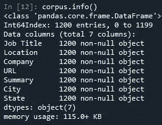
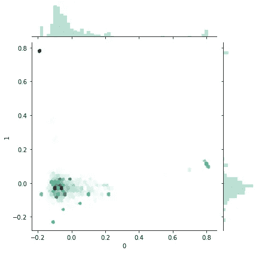
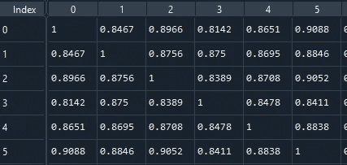
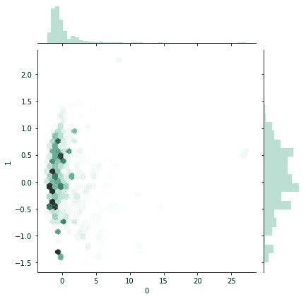
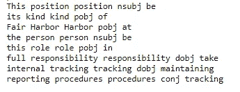
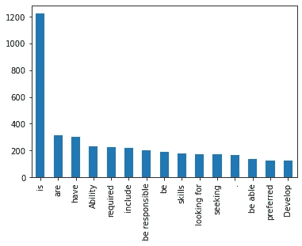
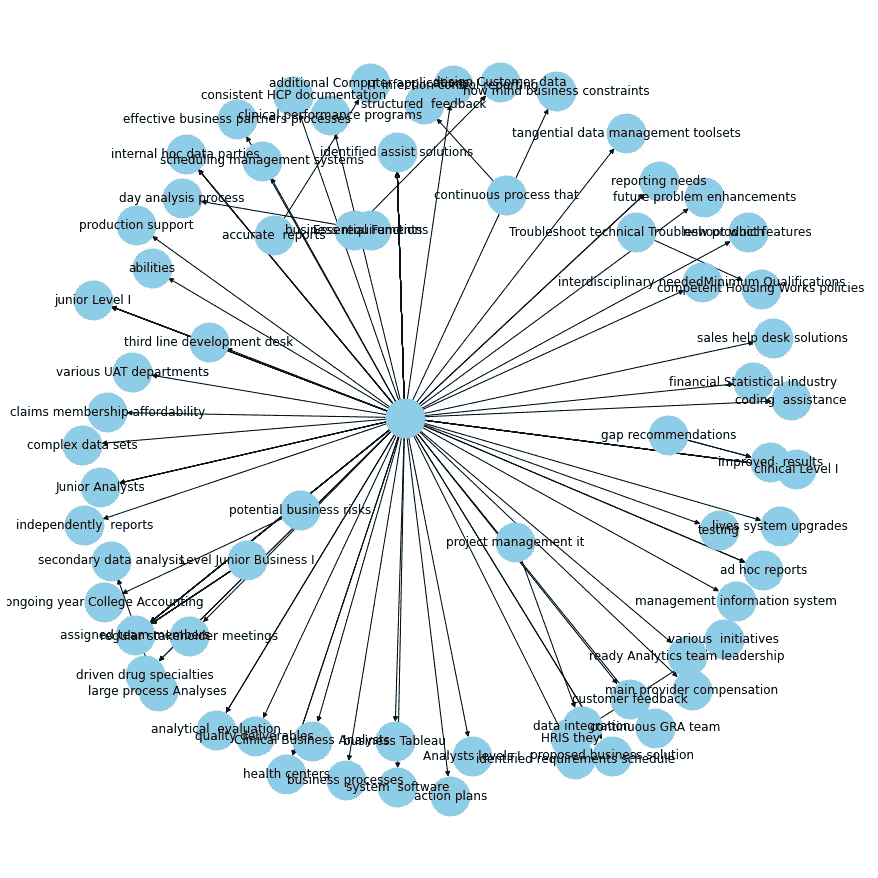

# 比较文本数据的三种方法可立即提升您的分析效果

> 原文：<https://towardsdatascience.com/three-methods-for-comparing-text-data-to-instantly-boost-the-impact-of-your-analysis-99efb99c6f40?source=collection_archive---------36----------------------->


马里乌斯·马萨拉尔在 [Unsplash](https://unsplash.com/s/photos/energy?utm_source=unsplash&utm_medium=referral&utm_content=creditCopyText) 上的照片

## 我们将使用 gensim、nltk 和 spaCy 来创建和可视化符号化向量、余弦相似性和实体-目标关系，以实际发布数据分析师职位。

*(数据和完整的 Jupyter 笔记本演练可以在这里找到*[](https://github.com/andrewhong5297/IndeedNLPTutorial)**)。)**

*如果你正在寻找一份数据分析师或科学家的工作，同时也在努力学习 NLP——准备好一石二鸟吧！对于这篇文章，我将使用 Indeed.com[“数据分析师](https://www.indeed.com/jobs?q=data+analyst&l=Brooklyn,+NY&radius=50&jt=fulltime)的 1000 个招聘信息作为我的文档集(语料库)。我选择了数据分析师，因为与数据科学家相比，会有更多种类的职位和要求。这些列非常简单明了:*

**

*在我们深入研究代码之前，让我们停下来思考一下**为什么我们要分析文本数据，从**开始。对我来说，通常有两个原因:*

1.  *我想在我的语料库中找到最大的重叠区域，即文档之间的*关系和变化*是什么*
2.  *我正在我的语料库的子集中寻找一组关键词或值，即文档中的*主题或讨论点*是什么*

*在这两种情况下，重点是**帮助我缩小研究范围，节省我自己通读所有内容的时间**。当然，这些方法也有助于构建机器学习管道，因为在开始训练模型之前，分析可能会导致文本数据中的错误或偏见。*

## *我将回顾的三种方法是:*

1.  *基于 PCA 和 t-SNE 的符号化向量的欧氏距离*
2.  *一组语料库的正态和软余弦相似度*
3.  *从非结构化文本数据中提取结构化关系*

# *欧几里得距离*

*让我们从基础开始，使用 nltk 方法标记数据:*

*然后应用 CountVectorizer(把这想象成 one-hot 编码)以及 Tfidf transformer(把这想象成对编码进行加权，这样更频繁的单词得到更低的权重)。*

*最终，我们可以将其放入 PCA 模型，并使用 Seaborn 的 KDE 图绘制前两个成分:*

**

*如果你还没有分类，密度图比散点图更好，尤其是在处理大型语料库的时候。*

*这对于仅仅根据单词的用法来初步了解情况是很有帮助的。然而，由于我们没有在此基础上分层任何类别，如行业或工资，我们不会从这一步获得太多的洞察力。*

# *正常和软余弦相似性*

*对于基于覆盖大型语料库的欧几里德距离的 PCA，您通常不会最终找到强关系或聚类。*这是因为尚未考虑单词的语义，此外，一些帖子有两行长，而另一些帖子有多个段落。*我们可以用**余弦相似度**或者单词向量之间角度的度量来解决这两个问题。*

*余弦相似度有两个主要选项。第一种选择是在应用了所有与我们之前所做的相同的标记化步骤之后，对单词向量进行余弦相似度计算，并创建一个矩阵。很简单:*

**

*把这想象成 Seaborn 的配对图*

*第二步或更进一步，在先前的单词嵌入模型相似性矩阵和我们刚刚计算的正常相似性矩阵之间，利用 L2 归一化进行[内点积，以获得**软余弦矩阵**(本质上试图更好地捕捉描述中单词的语义)。我们可以使用 gensim `word2vec` 或`FastText`预训练的单词嵌入模型轻松做到这一点。如果您对嵌入模型不熟悉，可以把它想象成根据使用上下文的相似程度给出相似度分数的单词(即，紧接在它前面和后面的两个单词)。](https://radimrehurek.com/gensim/similarities/termsim.html#gensim.similarities.termsim.SparseTermSimilarityMatrix)*

**

*如果你将这个软余弦值与上面的正常余弦值进行比较，你会看到很大的差异。*

*如果我们采用`cosine.mean().mean()`，我们得到的平均相似度是 0.80，这是有意义的，因为这些都是数据分析师的帖子。采用相同的 PCA 和密度图，我们得到:*

**

*添加了标准化和语义分层之后，我们现在可以深入到某些最密集的区域，看看那里聚集了哪些帖子。*

*在图 x(-1，1)和 y(-0.5，-0.1)的区域使用上述搜索功能，然后应用[gensim summary](https://radimrehurek.com/gensim/summarization/summariser.html)得出:*

```
*Manage and consolidate all Operational Spreadsheets.Work with management to prioritize business and information needs.Locate and define new process improvement opportunities.Collaborating with the executive team to understand the analytical needs of our multichannel operations and developing data-driven insights that are both strategic and operational.Formulating and championing insights on specific business tactics such as inventory forecasting and gaps analysis to drive those insights into action.What You Need to Succeed:-  to  years of experience working in Inventory Analyst role or Warehouse Master Data Management.- Bachelor's degree or higher education in Computer Science, Information Technology, Statistics, Business Administration or a closely related field.- Sound knowledge of inventory control practices & supply chain- Advanced Excel spreadsheet knowledge: Pivot Table, VLOOKUP, Various Formula- Familiarity with SAP and Warehouse Management System is a plus.Other Skills:-Exceptional written and oral communication skills.- Eye for detail and have a strong analytical skills.- Ability to priorities work effectively.- Able to balance/challenge conflicting objectives.- Able to see the bigger picture beyond the scope of their role.- Able to challenge the current status quo and being open minded towards new and different ways of doing things.- Tackles new problems in a timely manner. Pharmapacks, is a leading e-commerce company with a proprietary tech platform that empowers Brands with a complete and cost-effective logistics, fulfillment, marketing and sales solution.*
```

*虽然 81 个帖子的摘要可能读起来不完全一致，但您可以看到该领域侧重于物流/库存环境中的数据和 excel 电子表格管理。**因为我已经存储了网址，如果我感兴趣，我可以继续申请这 81 个帖子！***

# *来自文本的结构化关系和数据*

*许多有用的数据隐藏在报告和文章中，而不是表格中。例如，招聘信息通常会在职位的简要描述上列出要求和薪水。*

*我将把这个分析的重点放在招聘要求的技能和任务上。我们可以通过将句子解构为词类，然后标注主客体以及它们之间的关系来做到这一点。*

*举个例子，*

> *“该职位将是(公司名称)的第一个此类职位，因此，担任该职位的人必须能够并乐于承担建立和维护内部跟踪和报告程序的全部责任”*

*可以使用 spaCy 的英语模型分解为部分和依赖项:*

**

*请参阅 jupyter 笔记本，以更好地了解这种依赖性*

*通过利用创建实体对和关系的函数(基于[这篇有用的文章](https://www.analyticsvidhya.com/blog/2019/10/how-to-build-knowledge-graph-text-using-spacy/))，我们可以更好地了解数据分析师需要完成什么类型的任务。对找到的关系进行`value_counts()`分析可以得出:*

**

*找到的顶级关系*

*过滤“提供”并创建一个网络图，我们可以得到:*

**

*您可以看到，仅“提供”一项，就有各种各样的问题*

*知识图适用于“提供”,因为只有 100 次提及，但对于更多的关系可能会有所不同。**我们可以看到，分析师被期望提供从潜在业务风险到行动计划和临时报告的所有信息。***

# *结论*

*我希望这有助于您理解如何更好地处理文本数据。有了这三个工具，我们很快就确定了“数据分析师”的角色定位，以及你应该为他们准备的一些能力和任务。如果您想使用这些技术查看更深入的分析，请查看本文[！](/in-depth-analysis-of-un-sustainable-development-goals-progress-using-data-science-c39a208899e6)*

*如前所述，数据和完整的 Jupyter 笔记本演练可以在[这里](https://github.com/andrewhong5297/IndeedNLPTutorial)找到。*